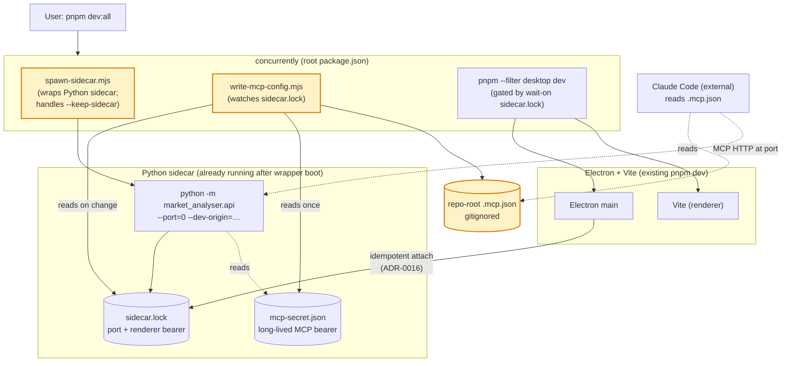

# 0015 — `pnpm dev:all`: one-command sidecar + Electron + `.mcp.json` sync

> **Status:** done
> **Created:** 2026-05-22
> **Approved:** 2026-05-22
> **Closed:** 2026-05-22
> **Owner skill(s):** `dev`
> **Related ADRs:** [ADR-0016](../adrs/0016-standalone-sidecar-mode.md) (standalone sidecar lifecycle — **dev override**; production unchanged), [ADR-0011](../adrs/0011-bearer-secret-transport.md) (renderer bearer transport), [ADR-0014](../adrs/0014-mcp-as-second-sidecar-protocol.md) (MCP secret + `.mcp.json` shape), [ADR-0020](../adrs/0020-shared-data-dir-contract.md) (canonical data dir holds `sidecar.lock` and `mcp-secret.json` the writer reads)

## TL;DR

Replace the Plan 0007 smoke workflow ("start sidecar in one terminal, start `pnpm dev` in another, copy port + bearer into Claude Code's `.mcp.json` by hand") with a single command run from the repo root: `pnpm dev:all`. The command boots the Python sidecar on an OS-picked port, waits for `sidecar.lock` to appear, writes the repo-local `.mcp.json` from the live port (`sidecar.lock`) + the long-lived MCP secret (`mcp-secret.json`), starts the existing `pnpm --filter @market-analyser/desktop dev` (which spawns Electron via idempotent attach to the already-running sidecar per ADR-0016), and on Ctrl+C tears the sidecar down by default (with `--keep-sidecar` to preserve ADR-0016's outlive-the-viewer semantics for the rare case you want it). The first user-visible behaviour: run `pnpm dev:all` once, see the chart load with no manual port juggling, switch to Claude Code in another window and the MCP server is already reachable as `market-analyser`. The Plan 0007 smoke now has one command, not three.

## Context & problem

Plan 0007 phase 5 (end-to-end smoke) shipped 2026-05-22 with the workflow documented in commit messages and the abortive `docs/onboarding/claude-code-setup.md` reference now visible as a stale `.gitignore` comment (the file was never written). In practice every smoke iteration required:

1. Terminal A: start the sidecar (`python -m market_analyser.api --port=0 --dev-origin=http://localhost:5173`), watch for the `PORT=<n>` line on stdout.
2. Open `<data-dir>/mcp-secret.json`, copy the secret.
3. Edit `.mcp.json` with the new port + the secret.
4. Terminal B: `cd desktop && pnpm dev`.
5. Switch to Claude Code, reload MCP servers so it picks up the new `.mcp.json`.

The friction the user surfaced after multiple smoke cycles: the port+bearer juggling for `.mcp.json`. Every fresh sidecar boot generates a new OS-picked port (because the sidecar is launched with `--port=0` by both the user and Electron's spawn path), and Claude Code reads `.mcp.json` once at startup — so a stale config either reaches an old port (connection refused) or carries a bearer that doesn't match the running MCP server (401). The mechanical cost per smoke iteration is small; the cognitive cost over a phase that already shipped four hardening sub-phases (4.1–4.5) was high.

The fix is not architectural — the sidecar/Electron/MCP design is correct. The fix is a single dev-tooling entry point that orchestrates the moving parts and writes the config file the user is otherwise editing by hand. The `.mcp.json` is already gitignored (`.gitignore:51`, added in this same uncommitted batch), so there is no policy obstacle to auto-writing it.

## Decision

A new top-level `package.json` at the repo root with a `dev:all` script that uses `concurrently` (already in `desktop/`'s dev-deps; will be added to the root) to orchestrate three child processes:

1. **The Python sidecar** — `uv run python -m market_analyser.api --port=0 --dev-origin=http://localhost:5173`. Launched by a thin Node wrapper (`scripts/dev/spawn-sidecar.mjs`) so we can control its signal handling and the `--keep-sidecar` opt-out (a vanilla `concurrently` command line cannot conditionally detach the child on Ctrl+C).
2. **The `.mcp.json` writer** — `node scripts/dev/write-mcp-config.mjs --watch`. Watches the canonical data-dir for `sidecar.lock` (using `fs.watch` with a debounced read; falls back to a small polling loop on platforms where `fs.watch` is unreliable for renamed files). On every change, reads `sidecar.lock` for the port, reads `mcp-secret.json` for the MCP bearer, and writes the repo-root `.mcp.json` atomically (`.mcp.json.tmp` → `os.rename`). Exits when its parent (the `concurrently` group) signals shutdown.
3. **The existing desktop dev stack** — `pnpm --filter @market-analyser/desktop dev`, gated by `wait-on file:<data-dir>/sidecar.lock` so Electron does not race the sidecar's boot. (Electron's idempotent-attach handles the case where the lockfile already exists — phase 1 of Plan 0007. With wait-on in place, Electron always finds the lockfile and attaches; it never falls into the cold-spawn branch in dev mode.)

A `--keep-sidecar` flag passed to `pnpm dev:all` (parsed by the wrapper) sets a boolean the wrapper checks at shutdown: if set, the wrapper detaches the sidecar's process group and exits cleanly, leaving the sidecar running per ADR-0016's standard lifecycle. Default behaviour (no flag) sends `SIGTERM` to the sidecar's process tree on Ctrl+C — explicit dev-only override of ADR-0016's outlive-the-viewer property, documented in the wrapper's docstring and in `docs/onboarding/claude-code-setup.md` (created in this plan's phase 2).

The rejected alternatives at interview: a Python CLI subcommand (`uv run market-analyser dev`) — rejected because Electron's `pnpm dev` is the authoritative renderer-side dev loop and inverting it (Python spawns Node) duplicates the build-watcher orchestration `desktop/package.json` already owns; a `Makefile`/`justfile` at the root — rejected because it adds a new dev-tooling dependency (`make` is unreliable on Windows; `just` is not pinned anywhere yet) without buying portability over the `concurrently` we already have; baking `.mcp.json` writing into the sidecar itself (`--write-mcp-config=./.mcp.json`) — rejected because dev-only concerns leaking into the production sidecar module is exactly the layering smell architecture-review mode flags as a finding.

## Architecture diagram



The three yellow nodes are new; everything else exists. The wrapper is the only place that knows about the `--keep-sidecar` semantics; the writer is the only place that knows the `.mcp.json` shape; `concurrently` orchestrates them.

## Implementation phases

Each phase is one commit, conventional-commit style. All three phases are owner `dev`; no cross-skill handoff. Done-when conditions name the behaviour the test defends, not the file path of the test.

### Phase 1 — Walking skeleton: root `package.json` + `dev:all` orchestration + sidecar wrapper

- **Owner skill:** `dev`
- **What:** Create a new top-level `package.json` (new file; the repo has none today — `package.json` resolves only inside `desktop/`) with a minimal devDependencies block (`concurrently`, `wait-on` — both already in `desktop/package.json` at pinned versions; the root reuses the same pins per ADR-0013), a `scripts.dev:all` entry, and a `scripts.dev:all -- --keep-sidecar` pass-through. Create `scripts/dev/spawn-sidecar.mjs` — a small Node wrapper that `child_process.spawn`s `uv run python -m market_analyser.api --port=0 --dev-origin=http://localhost:5173`, pipes stdout/stderr through prefixed with `[sidecar]`, and on receiving `SIGINT`/`SIGTERM` from `concurrently` either kills the child (default) or detaches and exits cleanly (`--keep-sidecar`). Add `pnpm-workspace.yaml` to recognise the new root package by adjusting the `packages:` list (currently `[desktop]` — add `.` so the root's devDependencies install through pnpm). The `dev:all` script chains: wrapper boots sidecar → `wait-on file:<data-dir>/sidecar.lock --timeout 15000` → `pnpm --filter @market-analyser/desktop dev`. The `<data-dir>` placeholder is resolved by a small helper in `spawn-sidecar.mjs` that calls a Python one-liner (`uv run python -c "from market_analyser.config import default_app_data_dir; print(default_app_data_dir())"`) once at boot and exports the result as an env var the rest of the chain reads.
- **Files touched:** new `package.json` (root); new `scripts/dev/spawn-sidecar.mjs`; `pnpm-workspace.yaml` (add `.` to `packages`); `.gitignore` (rewrite the stale `docs/onboarding/claude-code-setup.md` reference comment near the `.mcp.json` entry to point at this plan instead); new `tests/dev/test_app_data_dir_helper.py` (one tiny unit test that the helper one-liner prints exactly `default_app_data_dir()`'s value with no trailing whitespace — locks in the contract the Node wrapper relies on).
- **Done when:**
  - Running `pnpm install` at the repo root succeeds; `pnpm` recognises the workspace and installs `concurrently` + `wait-on` into a new root `node_modules`.
  - Running `pnpm dev:all` from the repo root with a cold cache (no existing sidecar, no existing lockfile) results in:
    - The wrapper logs `[sidecar] PORT=<n>` within ~5 s (the existing stdout line from `__main__.py:204`).
    - `<data-dir>/sidecar.lock` exists within ~5 s of the wrapper logging that line.
    - `pnpm --filter @market-analyser/desktop dev` starts immediately after the lockfile appears (verified by the timestamp order in the prefixed logs).
    - The Electron window opens, attaches to the running sidecar (no second sidecar spawned — verified by `ps`/`Get-Process` showing exactly one `python -m market_analyser.api` process).
    - The chart loads — same end-state as `cd desktop && pnpm dev` reaches today, achieved with one command from the repo root.
  - Running `pnpm dev:all` while a sidecar is already running (lockfile present, owner alive) results in the wrapper exiting with the existing `sidecar already running at PID <N>, port <M>; stop it first` message — phase 1 does not try to reuse a running sidecar; the wrapper always spawns a fresh one. (Reusing an external sidecar is a phase-3 concern — see `--keep-sidecar`'s mirror-image case.)
  - `tests/dev/test_app_data_dir_helper.py` asserts: invoking the same Python one-liner the wrapper uses prints the value of `default_app_data_dir()` followed by exactly one newline, with no leading/trailing whitespace, on stdout. The test runs under `uv run pytest` and is in the existing test suite.
  - Existing `desktop/` `pnpm dev` still works unchanged (regression check) — `cd desktop && pnpm dev` does the same thing it did before this plan.
  - The `pnpm-workspace.yaml` `minimumReleaseAge: 20160` and the root's pinned versions of `concurrently` and `wait-on` match the values in `desktop/package.json` exactly (ADR-0013 — every direct dep is pinned; the root and `desktop/` agree on shared dev tools).

### Phase 2 — `.mcp.json` writer + onboarding doc

- **Owner skill:** `dev`
- **What:** Add `scripts/dev/write-mcp-config.mjs` — a Node script that watches the canonical data-dir for `sidecar.lock` and, on every appearance/change, atomically writes `<repo>/.mcp.json` from a template containing the live port (from `sidecar.lock`) and the MCP bearer (from `<data-dir>/mcp-secret.json`). The script accepts `--once` (used in tests) and `--watch` (used in `dev:all`). Wire it into the `dev:all` `concurrently` group as the second child. Write `docs/onboarding/claude-code-setup.md` (the file the `.gitignore` comment was promising — never landed in Plan 0007 phase 5) covering: what `pnpm dev:all` does, the `.mcp.json` auto-sync, where the bearer comes from, how Claude Code picks up the file (project-local `.mcp.json` in the cwd), what to do if the bearer rotates after a sidecar restart (Claude Code's MCP refresh). Touch `.gitignore`'s stale comment to point at this doc instead of "Plan 0007 phase 5".
- **Files touched:** new `scripts/dev/write-mcp-config.mjs`; `package.json` (root, add the writer to the `dev:all` concurrently command); new `docs/onboarding/claude-code-setup.md`; `.gitignore` (refresh the comment near `.mcp.json` to reference the now-existing doc); new `scripts/dev/__tests__/write-mcp-config.test.mjs` (or `.test.js`; implementer picks per existing test-runner config — node's built-in `node:test` is fine, no Jest needed since this is in `scripts/`, not `desktop/`).
- **Done when:**
  - `node scripts/dev/write-mcp-config.mjs --once --lockfile=<fixture-path> --mcp-secret=<fixture-path> --out=<tmp-path>` (CLI flags accept overrides for testability) reads the two fixture files and writes a valid `.mcp.json` to the temp path. The written file:
    - Parses as JSON (no trailing comma, no comment lines).
    - Contains a `mcpServers["market-analyser"]` entry with `type: "http"`, `url: "http://127.0.0.1:<PORT>/mcp"` (PORT pulled from the fixture lockfile's `port` field), and `headers.Authorization: "Bearer <SECRET>"` (SECRET pulled from the fixture mcp-secret.json's `secret` field — verify the field name against `src/market_analyser/api/mcp_secret.py` at implementation time).
    - Is written atomically (the writer touches `.mcp.json.tmp`, then `os.rename`/`fs.renameSync`) — assert by inspecting the writer's source for the `.tmp` + rename pattern, or by a tighter test that injects an EEXIST on `.mcp.json` and confirms the rename still succeeds.
    - Has `0600` permissions on POSIX (mode bits checked via `fs.statSync` in the test). Windows: skip the perm assertion (NTFS ACLs are handled by the user's profile dir; the file inherits).
  - `scripts/dev/__tests__/write-mcp-config.test.mjs` asserts the above four properties using fixture lockfile + fixture mcp-secret JSON files held inline (no separate fixture directory needed for two tiny files). Test runs under `node --test scripts/dev/__tests__/` and is wired into the root `package.json`'s `test` script (new entry — `"test:dev-scripts": "node --test scripts/dev/__tests__/"` — and the existing CI workflow gets a step that runs it).
  - Running `pnpm dev:all` with the phase-1 + phase-2 wiring results in `.mcp.json` appearing at the repo root within ~5 s of `sidecar.lock` appearing, containing a parseable JSON server config pointing at the live port + bearer. Verified manually in the phase commit message; no automated end-to-end test (would require spawning Electron + a real Python sidecar in CI, out of scope).
  - Restarting the sidecar mid-session (kill the wrapper's `python` child, let it respawn via `pnpm dev:all` re-run) causes `.mcp.json` to be re-written with the new port within ~5 s of the new lockfile appearing. Verified manually in the phase commit message; the watcher reacts to `fs.watch` events on the lockfile path (or to its periodic poll).
  - `docs/onboarding/claude-code-setup.md` exists and contains: a one-paragraph TL;DR matching this plan's; the exact `pnpm dev:all` and `pnpm dev:all --keep-sidecar` commands; a section explaining where `.mcp.json` lives (repo root, gitignored), where the bearer comes from (`<data-dir>/mcp-secret.json`), and the link to ADR-0014 + ADR-0016; a "what if Claude Code says 401" troubleshooting note (the bearer rotated; bounce the MCP server in Claude Code's UI or restart `claude` to reload `.mcp.json`).
  - Existing `desktop/` `pnpm dev` unchanged. Existing `python -m market_analyser.api` invocation unchanged. Sidecar code untouched (this is purely dev tooling).

### Phase 3 — Ctrl+C teardown + `--keep-sidecar` opt-out + cross-platform signal handling

- **Owner skill:** `dev`
- **What:** Finish `scripts/dev/spawn-sidecar.mjs`'s signal-handling: on `SIGINT`/`SIGTERM` (which `concurrently` forwards), the default path uses `tree-kill` (already in `desktop/`'s transitive deps — verify and pin at the root if not) to terminate the entire sidecar process tree (the Python interpreter plus any subprocesses it spawned — currently none, but the helper guards against future drift). On Windows, `tree-kill` issues `taskkill /T /F` under the hood; on POSIX, `kill -TERM` to the process group. With `--keep-sidecar`, the wrapper instead: detaches the child via `child.unref()` (the spawn must have used `detached: true` + `stdio: "ignore"` for the child to survive parent exit on Windows; the wrapper conditionally re-spawns with these options when `--keep-sidecar` is in effect — implementer can also pre-emptively spawn detached and just refrain from killing on Ctrl+C, picking whichever is cleaner). The wrapper also handles a third case: if the user starts `pnpm dev:all` while a sidecar from a previous `pnpm dev:all --keep-sidecar` is already running, the wrapper detects it (lockfile present + owner alive — uses the existing `is_owner_alive` semantics via a small Python one-liner mirroring the phase-1 helper), skips spawning, prints `[sidecar] reusing already-running sidecar at PID <N>, port <M>`, and joins the rest of the `dev:all` chain (so the `.mcp.json` writer + Electron still start). Ctrl+C in this reuse case never kills the sidecar regardless of `--keep-sidecar` (the wrapper did not spawn it, so it must not kill it — kill-only-what-you-spawned discipline).
- **Files touched:** `scripts/dev/spawn-sidecar.mjs` (extend signal handling + add reuse path); `package.json` (root, if `tree-kill` needs to be added as a pinned root devDep — likely yes); `scripts/dev/__tests__/spawn-sidecar.test.mjs` (new — tests the reuse-path branch and the `--keep-sidecar` flag-parsing); `docs/onboarding/claude-code-setup.md` (extend with the `--keep-sidecar` and reuse-an-existing-sidecar workflows); `.gitignore` (no change).
- **Done when:**
  - `scripts/dev/__tests__/spawn-sidecar.test.mjs` asserts:
    - When the wrapper is invoked with `--keep-sidecar` and a fake `child_process.spawn` is injected, the spawn options include `detached: true` (assert via the mock's call args).
    - When the wrapper receives `SIGINT` in default mode, the mock child's `kill()` is called exactly once with `SIGTERM` (or `tree-kill` is invoked with the child's pid — implementer's choice; assert whichever path was taken).
    - When the wrapper receives `SIGINT` in `--keep-sidecar` mode, the mock child's `kill()` is NOT called; instead `child.unref()` is invoked and the wrapper exits 0.
    - When the wrapper starts and a fake lockfile + alive-owner is present, the wrapper does NOT spawn a new child (the spawn mock is never called); the wrapper logs the `reusing already-running sidecar` message and proceeds to the next chain step.
    - When the wrapper starts in reuse mode and receives `SIGINT`, the wrapper exits 0 without attempting to kill anything — even in default mode (kill-only-what-you-spawned).
    - Argv parsing: `--keep-sidecar` is recognised at any position; `--keep-sidecar=true` is rejected (boolean flag, no value); unknown flags pass through to the spawned Python process unchanged (so `pnpm dev:all -- --config=foo.json` reaches the sidecar).
  - Manual smoke (in the phase commit message): `pnpm dev:all`, see chart load, Ctrl+C — `Get-Process python` (Windows) or `pgrep -f market_analyser.api` (POSIX) returns nothing within ~3 s. Then `pnpm dev:all --keep-sidecar`, see chart load, Ctrl+C — the sidecar process is still alive. Stop it with `uv run python -m market_analyser.api stop` (the existing stop subcommand from ADR-0016). Then `pnpm dev:all --keep-sidecar` again, immediately Ctrl+C, then `pnpm dev:all` (no flag) — the wrapper detects the still-running sidecar, prints the reuse line, Electron attaches; Ctrl+C this time leaves the sidecar alive (kill-only-what-you-spawned). Stop it manually. All four paths exercised once.
  - `docs/onboarding/claude-code-setup.md` updated with the three execution modes (default, `--keep-sidecar`, reuse-an-existing) and the kill-only-what-you-spawned rule. A short "if I see two `python -m market_analyser.api` processes" troubleshooting paragraph explains the ADR-0016 single-instance enforcement and points at `uv run python -m market_analyser.api stop`.
  - No production code changed (re-confirmed by `git diff src/`: empty). All changes are in `scripts/dev/`, `docs/onboarding/`, `package.json` (root), `pnpm-workspace.yaml`, and `.gitignore`.

## Data shapes

```json
// Repo-root .mcp.json — written by scripts/dev/write-mcp-config.mjs.
// Gitignored (per the existing .gitignore entry). Mode 0600 on POSIX.
{
  "mcpServers": {
    "market-analyser": {
      "type": "http",
      "url": "http://127.0.0.1:<PORT>/mcp",
      "headers": {
        "Authorization": "Bearer <MCP_SECRET>"
      }
    }
  }
}
```

The exact `mcpServers` schema is what Claude Code expects for project-local MCP config. The implementer cross-checks the schema against Claude Code's current docs at implementation time — if the schema has drifted (e.g. `command` + `args` for stdio transports vs `type` + `url` for HTTP), this template is the only thing that changes; the rest of the writer is field-agnostic.

```typescript
// scripts/dev/spawn-sidecar.mjs CLI shape (illustrative; not pinned).
// Parsed via process.argv; no yargs/commander dependency to keep the script lean.

interface SpawnSidecarArgs {
  keepSidecar: boolean;        // --keep-sidecar
  // anything else passes through to `python -m market_analyser.api`
  passthrough: string[];
}
```

## Risks & open questions

- **Risk: `concurrently`'s SIGINT forwarding on Windows is unreliable.** On POSIX, Ctrl+C sends `SIGINT` to the process group; `concurrently` forwards it; the wrapper sees it; everyone shuts down. On Windows, console control events are delivered differently and `concurrently` historically uses `tree-kill` to clean up. Phase 3's explicit use of `tree-kill` from the wrapper itself is defence in depth — even if `concurrently` doesn't forward cleanly, the wrapper's own SIGINT handler does the right thing. Risk that remains: the wrapper might miss `SIGINT` entirely if the terminal sends a `CTRL_BREAK_EVENT` instead. Mitigation: the wrapper installs handlers for both `SIGINT` and `SIGTERM`; if the user sees zombie processes, the doc points at `uv run python -m market_analyser.api stop` as the fallback.
- **Risk: the `wait-on file:<data-dir>/sidecar.lock` race window.** Between the lockfile appearing and the lockfile containing a valid `port` (i.e. between `os.replace(sidecar.lock.tmp, sidecar.lock)` and the file being fully written), Electron might read incomplete data. Mitigation: `sidecar.lock` is written via `write_lockfile`'s atomic-replace pattern (`__main__.py:201` → `write_lockfile` uses tempfile + `os.replace`), so the file either does not exist or contains a complete record. `wait-on` triggers on the rename, which is the moment the complete record is visible. Plan 0007 phase 4.2 already depends on this property for the `/healthz` identity check; reusing it here is safe.
- **Risk: `default_app_data_dir()` requires the Python package to be importable.** The wrapper's helper (`uv run python -c "from market_analyser.config import default_app_data_dir; ..."`) only works inside the repo where `uv run` resolves to the workspace venv. If the user runs `pnpm dev:all` from outside the repo (rare — there's no reason to), the helper fails. Mitigation: the wrapper resolves the helper relative to `__dirname` and runs it with `cwd: process.env.INIT_CWD || path.resolve(__dirname, "../..")` (the repo root). If the helper still fails, the wrapper exits with a clear error message naming the likely cause.
- **Risk: `mcp-secret.json` field name.** The writer reads the MCP secret from `<data-dir>/mcp-secret.json`. The exact JSON field name (`secret`, `mcp_secret`, `token` — implementer checks `src/market_analyser/api/mcp_secret.py` at phase 2 to confirm) is a contract the writer depends on. If `mcp_secret.py` ever changes the field name, the writer breaks silently (it would write `Bearer undefined` to `.mcp.json`). Mitigation: phase 2's test asserts the writer's output contains the actual fixture secret string verbatim — any field-name drift fails the test immediately. A long-term mitigation (out of scope) is to expose a typed Python CLI subcommand that returns the secret rather than the writer parsing JSON directly; that's a phase-4 follow-up if anyone wants it.
- **Risk: adding `.` to `pnpm-workspace.yaml` `packages:` causes pnpm to scan the entire repo for nested package.jsons.** Mitigation: pnpm's workspace resolution is based on the explicit `packages:` list; `.` matches only the root, not its descendants. The `node_modules` ignored by default. Verified by running `pnpm install` at the root after the change and confirming pnpm reports exactly two workspaces (`.` and `desktop`).
- **Risk: `concurrently` and `wait-on` versions at the root drift from `desktop/`'s pinned versions.** ADR-0013 mandates exact pins; the root and `desktop/` must agree. Mitigation: phase 1 done-when explicitly requires the pinned versions to match. A follow-up could hoist these shared dev tools to the root and remove them from `desktop/package.json`, but the lockfile-stability cost is unclear; this plan keeps them duplicated.
- **Open question: should `.mcp.json` be ignored by Prettier / ESLint?** The writer's output is machine-generated; running formatters over it on commit would be harmless (it's gitignored) but might leave the file in a non-canonical state mid-iteration. Acceptable; no action.
- **Open question: should the writer also emit a small log line to its stdout when it (re-)writes `.mcp.json`?** Default: yes, one line per write (`[mcp-config] wrote .mcp.json (port=<n>)`), so the user sees the write happen. The line includes the port but NOT the secret.
- **Open question: should `pnpm dev:all` work from `desktop/` too?** Default: no. Running it from the desktop subdir is a footgun (the root `package.json`'s scripts only resolve from the root). The error message is pnpm's standard "no such script"; we don't add a confusing alias.

## What this plan does NOT do

- **Touch the production sidecar/Electron lifecycle.** ADR-0016's standalone-sidecar contract, idempotent attach, `/settings/stop`, single-instance enforcement via `sidecar.lock` — all unchanged. The `dev:all` script is dev-only override of one specific property (Ctrl+C teardown), explicitly documented as such.
- **Change `.mcp.json`'s schema or Claude Code's MCP config conventions.** The writer's template mirrors whatever Claude Code expects today; if Claude Code's schema changes, the writer's template changes — no architectural commitment.
- **Add a Python CLI subcommand (`market-analyser dev` or similar).** Rejected at interview. The Node-side orchestration owns the dev loop; the Python side stays narrow.
- **Auto-restart the sidecar on crash.** ADR-0016 explicitly defers this; this plan inherits that defer. If the sidecar dies mid-session, the user re-runs `pnpm dev:all`.
- **Hoist shared dev deps (`concurrently`, `wait-on`, `tree-kill`) from `desktop/` to the root.** The duplication is annoying but small; consolidation is a follow-up if it becomes painful.
- **Provide a packaged-app equivalent.** This is purely development tooling. In a packaged Electron build, the spawn path inside the main process owns the sidecar lifecycle (Plan 0007 phase 4.3's `SidecarSupervisor`). `pnpm dev:all` does not run in the packaged app; the packaged app does not need it.
- **Integrate with CI.** The phase-1 and phase-2 unit tests run in CI (per the existing test workflow), but `pnpm dev:all` itself is not exercised in CI — there's no headed Electron + real sidecar + Claude Code loop to verify in CI. Manual smoke in the commit messages covers it.
- **Write a `pnpm dev:all --no-electron` mode.** The Electron viewer is always part of the dev loop. If you want a headless sidecar for agent-only work, run `uv run python -m market_analyser.api --port=0 --dev-origin=http://localhost:5173` directly — the standalone-sidecar path ADR-0016 ships.

## Followups (after this lands)

Recorded at close (2026-05-22). All four items are nits / minor — none gated the close ceremony.

| # | Severity | Item | Owner | Note |
|---|----------|------|-------|------|
| 1 | minor    | Cooldown-bypass mechanism (temporary `minimumReleaseAge` lower-then-restore) used during phase 1 lockfile refresh is not named in [ADR-0012](../../adrs/0012-dependency-cooldown.md) or `CLAUDE.md`'s dependency-discipline section. Decide between (a) amending ADR-0012 to document the pattern, or (b) reaffirming CVE-only and adding a `# Cooldown-bypass log` section to `CLAUDE.md`. | `architect` (decides), `dev` (lands) | The end state was policy-conforming and the commit message honest, but the precedent should be either codified or rejected before the next dependency refresh hits the same cohort. |
| 2 | nit      | `docs/onboarding/claude-code-setup.md:30` mis-states `--keep-sidecar`'s Windows mechanism — says `unref` is POSIX-only when it's actually called on both platforms (`scripts/dev/spawn-sidecar.mjs:145`). The POSIX-only piece is the spawn-side `detached: true` flag. | `dev` | One-line rewording. |
| 3 | nit      | `scripts/dev/spawn-sidecar.mjs`'s `parseArgs` intercepts `--lockfile=<path>` for testability; the plan's argv contract says all unknown flags pass through to Python. The collision is hypothetical today (the Python sidecar exposes no `--lockfile`). Rename to `--status-lockfile=` (wrapper-private namespace) or document the reservation in the onboarding doc's "Execution modes" section. | `dev` | Trivial — fix before any sidecar-side `--lockfile` flag lands. |
| 4 | nit      | Phase 1's "Done when" row about the wrapper exiting with `sidecar already running at PID <N>, port <M>; stop it first` is superseded by phase 3's reuse path. The plan's own parenthetical anticipated this; consider appending `(superseded by phase 3's reuse path)` to that row for hygiene. | `architect` | Closed-plan documentation cleanup. |
