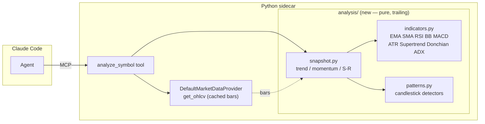

# 0018 — Technical-analysis surface (`analysis/`): indicators + candlestick patterns + condition snapshot

> **Status:** done
> **Created:** 2026-05-24
> **Approved:** 2026-05-24
> **Owner skill(s):** `dev` (all phases)
> **Related ADRs:** [ADR-0023](../adrs/0023-technical-analysis-surface.md) (this plan's paired decision — accepts at close), [ADR-0007](../adrs/0007-market-data-provider.md) (Provider Protocol — `analyze_symbol` reads bars via `get_ohlcv`), [ADR-0009](../adrs/0009-rewrite-data-layer-in-house.md) (in-house), [ADR-0018](../adrs/0018-backtest-result-schema.md) (anti-lookahead determinism, same family of guarantee)
> **Depends on:** Shipped code only (`get_ohlcv`, `Bar`). No external dependency added.

## TL;DR

Build `src/market_analyser/analysis/` — the canonical, pure, trailing, anti-lookahead home for technical-analysis math the `market-analyst` skill has been promising against an empty package. Three computation modules (`indicators.py`: EMA/SMA/RSI/Bollinger/MACD/ATR/Supertrend/Donchian/ADX; `patterns.py`: the candlestick vocabulary the skill names; `snapshot.py`: trend/momentum/support-resistance classification that composes them) plus one MCP tool `analyze_symbol(symbol, timeframe, …)` that returns a full condition snapshot over cached bars. First user-visible behavior: ask Claude Code "what's the technical condition on AAPL daily" and get RSI/MACD/Bollinger stance, trend + momentum classification, support/resistance, and any candlestick pattern on the latest bars — all computed in-house, all trailing.

## Context & problem

This is the single highest-leverage missing capability in the analysis area: we have no indicator or candlestick-pattern computation layer at all. `CLAUDE.md` reserves `src/market_analyser/analysis/` for it; the `market-analyst` skill's description advertises doji/hammer/engulfing detection, RSI/MACD/Bollinger/Supertrend stance, and trend/momentum/support-resistance classification — none of which exist in code. The only indicator math in the repo is trapped inside individual strategy modules (`rsi.py`, `macd.py`, …), reachable by no other consumer.

This is foundational: multi-timeframe alignment, volume scanners, and Bollinger-squeeze/rating scans (Plan 0021 and later) all need this surface before they can be planned. [ADR-0023](../adrs/0023-technical-analysis-surface.md) records the decision and its alternatives.

## Decision

Per [ADR-0023](../adrs/0023-technical-analysis-surface.md): create `analysis/` as the canonical home for pure, trailing, deterministic TA functions — no pandas/numpy, no third-party TA lib. Anti-lookahead is enforced at the layer (`result[i]` reads only `bars[0..=i]`; undefined leading bars are `None`, the convention `strategies/rsi.py` already uses). Build it bottom-up across four phases so the indicator primitives ship and get tested before the snapshot and the tool compose them. Do **not** refactor the existing strategy modules onto this surface in this plan — that reconciliation is a tracked followup behind the backtest determinism golden tests.

We rejected (per ADR-0023): a third-party TA library (pandas/numpy weight + Windows wheel pain + loss of determinism control); refactoring strategies now (determinism golden-test blast radius); and letting the analyst import strategy internals (entrenches the very coupling this fixes).

## Architecture diagram



## Implementation phases

### Phase 1 — `analysis/indicators.py` (the indicator primitives)

- **Owner skill:** `dev`
- **What:** Pure functions for EMA, SMA, RSI (Wilder), Bollinger Bands, MACD, ATR, Supertrend, Donchian channel, and ADX. Each takes a `Sequence[Bar]` (or `Sequence[float]` closes where that is the natural input) plus its period params and returns a series aligned to the input length, with `None` for bars where the indicator is undefined. No module-level state; no wall-clock; no RNG.
- **Files touched:**
  - New `src/market_analyser/analysis/__init__.py`.
  - New `src/market_analyser/analysis/indicators.py` (~250–320 lines; nine indicators).
  - New `tests/analysis/test_indicators.py`.
  - New `tests/analysis/fixtures/` — a small committed OHLCV fixture series (e.g. 120 daily bars) with hand-/reference-computed expected values for each indicator at chosen indices.
- **Done when:**
  - **Per-indicator correctness:** For each of the nine indicators, the value at three chosen indices on the committed fixture equals a pinned expected value within `1e-9`. RSI reuses Wilder's smoothing identical to `strategies/rsi.py`'s `_wilder_rsi` (asserted: same output on the same closes).
  - **Anti-lookahead (the load-bearing test):** For every indicator, computing it on `bars[0..=k]` yields, at every index `i <= k`, the same value (within `1e-9`) as computing it on the full series and reading index `i`. Truncating the future never changes the past. Asserted across several `k`.
  - **Undefined-prefix convention:** Each indicator returns `None` for the leading bars where it is mathematically undefined (e.g. RSI for the first `period` bars), and the returned series length equals the input length. Asserted.
  - **Determinism:** Each indicator called twice on the same input returns equal results. Asserted.
  - `uv run pytest tests/analysis/test_indicators.py` passes with no skips; mypy strict clean.

### Phase 2 — `analysis/patterns.py` (candlestick pattern detectors)

- **Owner skill:** `dev`
- **What:** Detectors for the candlestick vocabulary the `market-analyst` SKILL names: doji, hammer, hanging man, bullish/bearish engulfing, morning/evening star, three white soldiers / three black crows, dark cloud cover, piercing line, bullish/bearish harami, marubozu. Each detector reads only `bars[0..=i]` and emits a `PatternHit(bar_index, pattern, direction, strength)` per detection. Body/shadow-ratio thresholds are named module constants (owned, tunable).
- **Files touched:**
  - New `src/market_analyser/analysis/patterns.py` (~250–350 lines).
  - `src/market_analyser/analysis/__init__.py`: export `PatternHit`, `detect_patterns`.
  - New `tests/analysis/test_patterns.py`.
  - New `tests/analysis/fixtures/patterns_*.json` — small hand-built bar sequences, one per pattern, each known to contain exactly the target pattern at a known index.
- **Done when:**
  - **Per-pattern positive case:** For each pattern, the hand-built fixture yields a `PatternHit` at the expected `bar_index` with the expected `direction` (`bullish`/`bearish`/`neutral`). Asserted for every pattern in the vocabulary.
  - **Negative case:** A flat/random fixture with no qualifying formation yields no hits for the multi-bar patterns (engulfing, stars, soldiers). Asserted (guards against over-eager detectors).
  - **Anti-lookahead:** A pattern reported at bar `i` is still reported when the series is truncated to `bars[0..=i]`; no pattern ever requires `bars[i+1..]`. Asserted.
  - **Determinism:** `detect_patterns(bars)` returns an identically ordered list across two calls (sorted by `bar_index`, then pattern name). Asserted.
  - `uv run pytest tests/analysis/test_patterns.py` passes; mypy strict clean.

### Phase 3 — `analysis/snapshot.py` (composed condition snapshot)

- **Owner skill:** `dev`
- **What:** `condition_snapshot(bars, timeframe) -> ConditionSnapshot` composing phases 1–2 into one read: latest indicator values (RSI, MACD line/signal/hist, Bollinger position, ATR, ADX, Supertrend direction), a trend classification (up / down / sideways from EMA stack + ADX), a momentum stance (e.g. RSI zone + MACD sign), recent support/resistance levels (swing highs/lows over a trailing window), and the candlestick `PatternHit`s on the most recent N bars. Pure; reports **conditions only**, never buy/sell (the analyst non-negotiable).
- **Files touched:**
  - New `src/market_analyser/analysis/snapshot.py` (~180–240 lines).
  - New `src/market_analyser/analysis/types.py`: `PatternHit`, `ConditionSnapshot`, supporting enums (`Trend`, `MomentumStance`). Frozen Pydantic models, `extra="forbid"`.
  - New `tests/analysis/test_snapshot.py`.
- **Done when:**
  - **Trend classification:** On a monotonically rising fixture, `snapshot.trend == Trend.UP`; on a falling one, `DOWN`; on a flat/choppy one, `SIDEWAYS`. Asserted with explicit fixtures.
  - **Momentum stance & indicator latest values:** The snapshot's latest RSI/MACD/Bollinger values equal the corresponding `indicators.py` series' last non-`None` entry (within `1e-9`). Asserted.
  - **Support/resistance:** On a fixture with a known swing high and swing low, the reported levels include those prices (within a tolerance). Asserted.
  - **Pattern surfacing:** A fixture containing a bullish engulfing on the last bar surfaces that `PatternHit` in `snapshot.recent_patterns`. Asserted.
  - **No recommendation leak:** The `ConditionSnapshot` model has no buy/sell/action field; a test asserts the model's field set is exactly the documented condition fields (guards the analyst non-negotiable at the type level).
  - **Anti-lookahead:** `condition_snapshot(bars[0..=k])` equals the full-series snapshot's state as of bar `k` for the indicator/trend fields. Asserted.
  - `uv run pytest tests/analysis/test_snapshot.py` passes; mypy strict clean.

### Phase 4 — `analyze_symbol` MCP tool

- **Owner skill:** `dev`
- **What:** An MCP tool `analyze_symbol(symbol, timeframe, lookback="6mo", as_of=None)` that fetches cached bars via the Provider (`get_ohlcv`), runs `condition_snapshot`, and returns the snapshot as JSON plus `analyzed_at`. `as_of` is honored (truncates bars → anti-lookahead replay works for free). Validates inputs at the MCP boundary (`extra="forbid"`). Dispatches through the Provider; never reads SQLite or adapters directly (ADR-0007). The synchronous snapshot computation is offloaded with `asyncio.to_thread` (same pattern as `screener_query`).
- **Files touched:**
  - New `src/market_analyser/api/mcp_tools/analyze_symbol.py`.
  - `src/market_analyser/api/mcp_app.py`: register the tool.
  - New `tests/api/test_analyze_symbol_tool.py`.
- **Done when:**
  - **Happy path:** `analyze_symbol(symbol="AAPL", timeframe="1d")` over a seeded bar cache returns a JSON object containing `trend`, `momentum`, `indicators` (with RSI/MACD/Bollinger/ATR/ADX/Supertrend), `support_resistance`, `recent_patterns` (list), and `analyzed_at` (UTC ISO). Asserted field-by-field against the seeded fixture.
  - **`as_of` replay:** `analyze_symbol(..., as_of=<mid-series datetime>)` returns a snapshot whose latest values match `condition_snapshot(bars truncated at as_of)` — i.e. no future bars leak in. Asserted.
  - **Empty-cache behavior:** With no cached bars for the symbol, the tool returns a structured `{snapshot: null, partial_reason: "no_bars", message: ...}` (mirrors Plan 0013's honest cache-miss shape) rather than raising or fabricating. Asserted.
  - **Boundary validation:** `timeframe` not in the supported set rejected; `lookback` malformed rejected; `symbol=""` rejected.
  - **Regression:** the pre-existing MCP tools (`get_ohlcv`, `screener_query`, `run_backtest`, `show_*`, annotations) still pass their suites.
  - `uv run pytest tests/api/test_analyze_symbol_tool.py` passes; mypy strict clean.

## Data shapes

```python
# analysis/types.py (illustrative — final form locked in phase 3)

class Trend(StrEnum):
    UP = "up"; DOWN = "down"; SIDEWAYS = "sideways"

class MomentumStance(StrEnum):
    OVERBOUGHT = "overbought"; BULLISH = "bullish"; NEUTRAL = "neutral"
    BEARISH = "bearish"; OVERSOLD = "oversold"

class PatternHit(BaseModel):                       # frozen, extra="forbid"
    bar_index: int
    pattern: str                                   # "bullish_engulfing", "doji", ...
    direction: Literal["bullish", "bearish", "neutral"]
    strength: float                                # 0..1, detector-defined

class ConditionSnapshot(BaseModel):                # frozen, extra="forbid"
    symbol: str
    timeframe: str
    as_of: datetime                                # last bar's event_ts
    trend: Trend
    momentum: MomentumStance
    indicators: dict[str, float | None]            # latest values: rsi, macd, macd_signal, ...
    support_resistance: dict[str, list[float]]     # {"support": [...], "resistance": [...]}
    recent_patterns: list[PatternHit]
    # NOTE: no buy/sell/action field — conditions only (analyst non-negotiable).
```

## Risks & open questions

- **Risk: pure-Python ADX/Supertrend/ATR are error-prone** (Wilder smoothing, true-range gaps, the Supertrend flip recurrence). Mitigation: hand-worked fixtures + the anti-lookahead truncation test catch the common mistakes; ADX in particular gets an extra reference-value test.
- **Risk: candlestick thresholds are subjective.** Body/shadow ratios that flag a "hammer" vary by source. Mitigation: thresholds are named constants with a docstring rationale; the tests assert internal consistency, not agreement with any external library. Tuning is a followup if the analyst skill reports false positives.
- **Risk: temporary duplication with strategy inline math** (ADR-0023 negative consequence). The RSI test asserts `analysis.indicators.rsi` matches `strategies/rsi._wilder_rsi` so at least the duplicated copies start in agreement; the reconciliation followup removes the duplication.
- **Open question: should `analyze_symbol` auto-backfill on cache miss?** Deferred to Plan 0013's `backfill_ohlcv` machinery — for now it returns the honest `partial_reason: "no_bars"` shape so the agent can decide to backfill. Noted so the two plans compose cleanly.
- **Open question: support/resistance algorithm.** v1 uses trailing swing-high/low pivots over a fixed window. Fibonacci levels and volume-profile S/R are explicitly out of scope (Fibonacci cut as low-value niche).
- **Known gap — trailing percentile helper (flagged 2026-05-24, architect).** The `market-analyst` skill's Mode 2 snapshot reports RSI and ATR as a *value plus its 90-day percentile*. As specced, `snapshot.py` (phase 3) returns latest indicator values and an RSI *zone* only, and `analyze_symbol` returns the composed snapshot (not the full indicator series) — so the analyst cannot derive the percentile itself downstream. When this plan is implemented, fold a small trailing-window percentile-rank (pure, trailing → inherits anti-lookahead for free; no new dep) into phase 3's `ConditionSnapshot` (e.g. `indicators["rsi_pct90"]`, `indicators["atr_pct90"]`). Trivial; **not a blocker** and not a phase addition — a one-field extension of the phase-3 contract. Surfaced by a `market-analyst` BTC-USD daily read on 2026-05-24 that hit the still-empty `analysis/` package and could only produce a degraded price-structure-only snapshot.

## What this plan does NOT do

- **Refactor the strategy modules onto `analysis/indicators.py`** — tracked followup (ADR-0023), behind the determinism golden tests.
- **Multi-timeframe alignment** — Plan 0021 phase 1 (builds on this surface).
- **Volume scanners** — Plan 0021 phases 2–3.
- **Bollinger-squeeze / BB-rating scans** — future plan on this surface (the ±3 "rating" framing is decision-flavored and would be reframed as a condition descriptor first).
- **Fibonacci retracement** — cut as niche from this batch.
- **Update the `market-analyst` SKILL.md** to point at the new surface — that's a `skill-creator` task, not a plan phase (no owner-skill tag for it). This plan unblocks it; the followup wires it.
- **Persisted analysis history** — `analyze_symbol` is computed on demand from cached bars; no new SQLite table.
- **Any buy/sell/recommendation output** — conditions only, by non-negotiable.

## Followups (after this lands)

Populated at close (2026-05-30). Close-review found **no blockers, no majors, no minors** — all four phases' done-when met by non-tautological specs (assertion bodies read, not pass-lists trusted): 86 analysis+tool tests pass with no skips, full `tests/api/` regression 249 pass / 5 known-Windows skips (no new skips), `mypy --strict` clean. The architect-flagged trailing-percentile gap (2026-05-24 note) was folded into the phase-3 contract as planned (`rsi_pct90` / `atr_pct90`). Carried followups:

| Item | Owner | Note |
|------|-------|------|
| Rewire the `market-analyst` SKILL.md to point at `analyze_symbol` / `analysis/` | `skill-creator` | The whole point of this plan was to give the analyst skill a real backend (it had been advertising pattern/indicator analysis against an empty package). This plan explicitly does NOT touch the skill (no owner-skill tag for SKILL.md edits — see "What this plan does NOT do"). It is now unblocked; pick this up as the immediate next step so the analyst stops degrading to price-structure-only reads. |
| Reconcile the strategy-module inline math onto `analysis/indicators.py` | `dev` (behind ADR-0018 golden tests) | ADR-0023 negative consequence: RSI/MACD/Bollinger/Supertrend math is now duplicated between `strategies/*` and `analysis/indicators.py`. The copies start in agreement (the RSI test pins equality); reconciliation removes the duplication but must not perturb the backtest determinism golden fixture. Tracked, not gating. |
