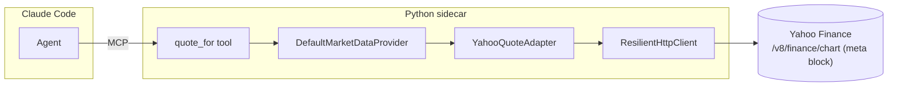

# 0019 — Live quote: implement `get_quote` + `quote_for` MCP tool

> **Status:** done
> **Created:** 2026-05-24
> **Approved:** 2026-05-24
> **Closed:** 2026-05-31 (close review — no blockers, no majors; see "Close review" below)
> **Owner skill(s):** `dev` (all phases)
> **Related ADRs:** [ADR-0007](../adrs/0007-market-data-provider.md) (implements the stubbed `get_quote`), [ADR-0019](../adrs/0019-external-http-adapter-resilience.md) (resilience client — inherited), [ADR-0009](../adrs/0009-rewrite-data-layer-in-house.md) (in-house)
> **Depends on:** [Plan 0009](0009-resilience-and-tradingview-screener.md) phase 1 (`ResilientHttpClient`). Reuses the existing Yahoo adapter plumbing (`_yahoo_fetch.py`).

## TL;DR

Implement the stubbed `get_quote` Protocol method with a Yahoo quote adapter and expose a `quote_for` MCP tool that returns a real-time snapshot for one symbol: price, change %, previous close, day range, 52-week range, currency, and market state. First user-visible behavior: ask Claude Code "what's NVDA trading at right now" and get a live quote instead of "that method is stubbed."

## Context & problem

`get_quote` is the last Protocol method still raising as a stub ([ADR-0007](../adrs/0007-market-data-provider.md), `data/provider.py`; `search_symbols` graduated in [Plan 0024](done/0024-symbol-search-and-autocomplete.md), closed 2026-05-29). A live price quote is a cheap, high-use capability we lack: we can fetch historical OHLCV bars but cannot answer "what's the price right now." The Yahoo adapter (`adapters/yahoo.py` + `_yahoo_fetch.py`) and the resilience client already exist, so this is mostly wiring plus a `Quote` type that currently holds only `price`.

## Decision

Two phases: (1) a Yahoo quote adapter on the existing `ResilientHttpClient`, an additively-extended `Quote` model, and the `get_quote` implementation in `DefaultMarketDataProvider`; (2) the `quote_for` MCP tool. `get_quote` is wall-clock-sensitive: passing `as_of` raises `ValueError`, consistent with `screener_query` and the Plan 0010 news/sentiment methods (historical price replay is `get_ohlcv`'s job, not the live quote's).

We rejected at planning time: (a) reusing `get_ohlcv`'s last bar as the "quote" — rejected because it misses the live fields (change %, market state, 52-week range) and lags by a bar; (b) a dedicated new HTTP path outside `ResilientHttpClient` — rejected by [ADR-0019](../adrs/0019-external-http-adapter-resilience.md)'s single-HTTP-path invariant.

## Architecture diagram



## Implementation phases

### Phase 1 — Yahoo quote adapter + `Quote` extension + provider wiring

- **Owner skill:** `dev`
- **What:** Implement a quote fetch against Yahoo through `ResilientHttpClient` (short TTL, e.g. 30s — quotes are live). Extend the `Quote` model additively. Implement `get_quote` in `DefaultMarketDataProvider`; raise `ValueError` when `as_of` is provided.
- **As-built (2026-05-31):** the adapter reads the live fields from the `meta` block of Yahoo's `/v8/finance/chart` endpoint (the same keyless endpoint family the OHLCV fetcher uses), **not** the dedicated `/v7/finance/quote` endpoint — that one is crumb/cookie-gated, and reusing the chart endpoint keeps the single-HTTP-path invariant [ADR-0019](../adrs/0019-external-http-adapter-resilience.md) requires. Documented in `adapters/yahoo_quote.py`'s module docstring. The diagram below is updated to match.
- **Files touched:**
  - New `src/market_analyser/data/adapters/yahoo_quote.py` (~80–120 lines; may share helpers with `_yahoo_fetch.py`).
  - `src/market_analyser/data/types.py`: extend `Quote` additively (see Data shapes).
  - `src/market_analyser/data/default_provider.py`: `get_quote` dispatches to the adapter (no longer raises NotImplemented).
  - New `tests/data/test_yahoo_quote_adapter.py`.
  - New `tests/data/fixtures/yahoo_quote_*.json` (captured offline responses: a regular-session stock, a crypto pair, an after-hours stock).
- **Done when:**
  - **Offline fixture parse:** With `ResilientHttpClient` mocked to return the captured fixture, `adapter.get_quote("AAPL")` returns a `Quote` with `price`, `change_pct`, `previous_close`, `day_high`, `day_low`, `week52_high`, `week52_low`, `currency`, `market_state` populated from the fixture. Asserted field-by-field.
  - **Crypto & after-hours shapes:** The crypto fixture (`BTC-USD`) and after-hours fixture parse without error and set `market_state` correctly (`REGULAR` / `POST` / `CLOSED`). Asserted.
  - **`as_of` rejection:** `provider.get_quote("AAPL", as_of=<datetime>)` raises `ValueError`. Asserted.
  - **Provider parity:** `DefaultMarketDataProvider().get_quote("AAPL")` returns the same `Quote` as the direct adapter call (mocked client). Asserted.
  - **Bad input:** an empty/whitespace symbol raises before any fetch; an unknown symbol (Yahoo returns empty result set) surfaces a typed `UnknownSymbolError` (reuse the Plan 0013 adapter-error vocabulary — `UnknownSymbolError` in `data/errors.py`, now landed). Asserted.
  - `uv run pytest tests/data/test_yahoo_quote_adapter.py` passes; mypy strict clean.

### Phase 2 — `quote_for` MCP tool

- **Owner skill:** `dev`
- **What:** An MCP tool `quote_for(symbol)` that dispatches through the Provider and returns the quote plus `queried_at`. Boundary-validated (`extra="forbid"`); `asyncio.to_thread` offload (the resilience client is synchronous).
- **Files touched:**
  - New `src/market_analyser/api/mcp_tools/quote_for.py`.
  - `src/market_analyser/api/mcp_app.py`: register the tool.
  - New `tests/api/test_quote_for_tool.py`.
- **Done when:**
  - **Happy path:** `quote_for(symbol="AAPL")` (mocked provider) returns `{quote: {...all Quote fields...}, queried_at: <utc iso>}`. Asserted.
  - **Boundary validation:** `symbol=""` rejected; unknown extra keys rejected; `as_of` is not a parameter (absent from the input model).
  - **Unknown symbol:** a symbol the provider reports unknown returns a structured `{quote: null, error: "unknown_symbol", message: ...}` rather than a 500. Asserted.
  - **Regression:** pre-existing MCP tools still pass their suites.
  - `uv run pytest tests/api/test_quote_for_tool.py` passes; mypy strict clean.

## Data shapes

```python
# data/types.py — additive extension to the existing Quote (illustrative)

class Quote(BaseModel):                  # frozen
    symbol: str = Field(min_length=1)
    price: float
    as_of: datetime
    source: str = Field(min_length=1)
    # --- NEW (all optional / defaulted so existing constructions still pass) ---
    change_pct: float | None = None
    previous_close: float | None = None
    day_high: float | None = None
    day_low: float | None = None
    week52_high: float | None = None
    week52_low: float | None = None
    currency: str = ""
    market_state: str = ""               # REGULAR | PRE | POST | CLOSED
    volume: float | None = None
```

## Risks & open questions

- **Risk: Yahoo's quote endpoint shape drifts / rate-limits.** Same class of risk as the OHLCV fetch; mitigated by `ResilientHttpClient` retry/backoff and the offline fixtures. If Yahoo tightens, the adapter is the single swap point.
- **Risk: `change_pct` source ambiguity.** Yahoo's `regularMarketChangePercent` vs a derived `(price/previous_close - 1)`. Decision: derive from `previous_close` (computed from actual prior-close data) for consistency with the rest of the data layer; assert the derivation in the fixture test.
- **Open question: should `quote_for` accept a list of symbols?** No — single-symbol keeps the tool simple; the multi-symbol fan-out (`market_snapshot`) is [Plan 0022](0022-macro-context.md) phase 3, which composes this method.

## What this plan does NOT do

- **Multi-symbol snapshot** (`market_snapshot`) — Plan 0022 phase 3.
- **Extended-hours session breakdown** (separate pre/regular/post prices) — cut as niche; `market_state` is surfaced but not a three-session decomposition.
- **`search_symbols`** — already implemented by [Plan 0024](done/0024-symbol-search-and-autocomplete.md) (closed 2026-05-29); not this plan's concern.
- **Quote history / persistence** — wall-clock-only, no SQLite table.

## Followups (after this lands)

- **m1 (minor, data integrity) — `dev`:** `adapters/yahoo_quote.py::_get_float` rejects `bool`/non-numerics but not non-finite floats. Python's `json.loads` parses `NaN`/`Infinity` literals by default, so a non-standard upstream numeric (`"regularMarketPrice": NaN`) would slip past the unknown-symbol guard (`NaN is not None`) into `Quote.price`, cascading to `change_pct=NaN` — contrary to the CLAUDE.md "defend against None, NaN, infinity" non-negotiable. One-line fix: `return float(value) if math.isfinite(value) else None`, so a non-finite price falls through to `UnknownSymbolError`. Low probability (Yahoo's `meta` is normally clean); not a blocker, hence carried rather than gating the close.

## Close review (2026-05-31)

Fresh-context architect review of both phases (commits `e7c5390` ph1, `8c7f390` ph2). **No blockers, no majors.**

- **Alignment:** every done-when met by a non-tautological spec (assertion bodies read, not the pass list). Standouts: the `change_pct` derivation test plants a bogus `regularMarketChangePercent: 99.0` and proves the adapter derives from `previous_close` instead; the after-hours fixture carries a distinct `postMarketPrice: 431.2` and the test asserts `price == 430.16`, proving it reads the regular price; the blank-symbol test installs a `boom` fetcher that fails if the network is touched. `UnknownSymbolError` correctly subclasses `UpstreamDataError` and `failure_reason()` maps it to `"unknown_symbol"`, so the tool's structured-error path actually fires.
- **Tripwire discharged honestly:** `test_provider_protocol.py` removed the `get_quote` `NotImplementedError` stub assertion (last stub graduated), not weakened.
- **Gates:** `tests/data/test_yahoo_quote_adapter.py` + `tests/api/test_quote_for_tool.py` 28 pass; full `tests/api` 266 pass / 5 known-Windows skips (no new); `mypy --strict` clean.
- **Layering:** the tool imports the `MarketDataProvider` Protocol, never the adapter (ADR-0007 honoured); adapter package-internal; no hidden state beyond the isolated, seam-monkeypatchable wall-clock reads.
- **One sound as-built deviation** (recorded in phase 1 above + the diagram): reads the `/v8/finance/chart` `meta` block rather than the crumb-gated `/v7/finance/quote` endpoint — keeps ADR-0019's single-HTTP-path invariant. Not a blocker.
- **Carried:** m1 (NaN guard, above), `dev`.
