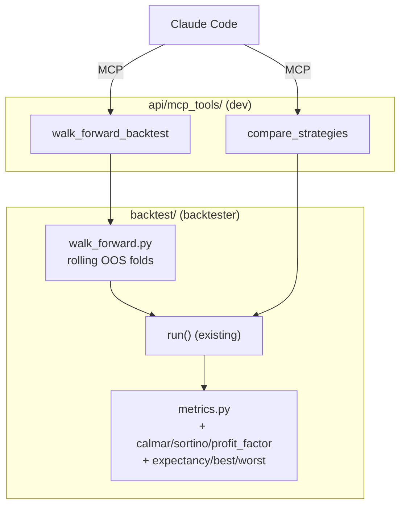

# 0020 — Extended backtest metrics + walk-forward evaluation + strategy-comparison leaderboard

> **Status:** done (close ceremony 2026-06-03) — all three phases landed on branch `plan-0020-backtest-metrics` (`37ebbcb` phase 1: six extended metrics + `ENGINE_VERSION` 0.1.0→0.2.0 + golden-fixture regen; `e751c77` phase 2: `walk_forward()` + `WalkForwardFold`/`WalkForwardResult`/`WalkForwardConfigError`; `3aa9b82` phase 3: `compare_strategies` + `walk_forward_backtest` MCP tools) and reviewed; **branch merged to `main` at close**. Mode 4: no blockers. All four implementer-flagged decisions confirmed sound: (1) metric fields carry defaults equal to their ADR-0024 degenerate value — the engine always sets them explicitly — accepted; (2) `BacktestRunSummary` left unchanged (a Calmar column is a persistence migration, `dev` territory) — accepted; (3) no hardcoded "material degradation" flag (the threshold was never pinned; `full_run_baseline` + `aggregate` are exposed for the consumer) — accepted; (4) `float|None` rendering + leaderboard/fold views deferred to a `ui-builder` follow-up (now in the index). Paired [ADR-0024](../adrs/0024-extended-backtest-metrics.md) accepted (with a close note recording the field-default convention). Verified: 88 backtest specs (incl. golden/determinism) + 13 tool specs green; mypy `--strict` clean on all six modules. Determinism + anti-lookahead pinned by tests (per-fold `metrics == direct run()` on the isolated slice).
> **Created:** 2026-05-24
> **Approved:** 2026-05-24
> **Closed:** 2026-06-03
> **Owner skill(s):** `backtester` (phases 1–2), `dev` (phase 3) — cross-skill handoff at the phase 2 → 3 boundary
> **Related ADRs:** [ADR-0024](../adrs/0024-extended-backtest-metrics.md) (this plan's paired decision — metric definitions; accepts at close), [ADR-0018](../adrs/0018-backtest-result-schema.md) (result schema + determinism contract; extended additively)
> **Depends on:** [Plan 0008](done/0008-backtest-engine-v1.md) (engine, `BacktestResult`, `run()`, golden tests — closed). [Plan 0002](done/0002-strategy-interface.md) (`discover()`, six reference strategies — closed).

## TL;DR

Close three backtesting gaps: (1) richer metrics — Calmar, Sortino, profit factor, expectancy, best/worst trade — appended to `BacktestMetrics`; (2) walk-forward evaluation — run a strategy across rolling out-of-sample folds to expose performance that doesn't hold up on unseen data; (3) two MCP tools — `compare_strategies` (run the six reference strategies on one symbol and return a ranked leaderboard) and `walk_forward_backtest` (the fold report). First user-visible behavior: ask Claude Code "compare all strategies on BTC-USD over 2 years" and get a Sharpe/Calmar/return leaderboard, then "walk-forward the winner" and see whether it holds up across folds.

## Context & problem

Our `BacktestMetrics` ships only seven fields and lacks the institutional set (Calmar, Sortino, profit factor, expectancy, best/worst trade); we also have no walk-forward validation for overfitting detection and no one-call strategy comparison. The engine (`backtest/run()`), `discover()`, and the six reference strategies are all in production from Plans 0008/0002, so the primitives exist — this plan composes and extends them. Metric definitions are pinned by [ADR-0024](../adrs/0024-extended-backtest-metrics.md) so per-fold and full-run numbers compute identically and determinism holds.

A scope honesty note: our strategies are fixed-parameter (no optimizer/fitting step). "Walk-forward" here therefore means **rolling out-of-sample evaluation** — the strategy runs on each test window and we report whether its metrics are stable across folds. True walk-forward *optimization* (re-fit params on each train window, validate on the test window) needs a parameter-search facility we don't have; it's explicitly out of scope and flagged.

## Decision

Three phases, cross-skill: phases 1–2 are `backtester` (engine-adjacent, under `backtest/` and `runs/`); phase 3 is `dev` (MCP tools under `api/mcp_tools/`). Phase 1 extends the metrics; phase 2 builds walk-forward on top of the now-extended `run()`; phase 3 surfaces both via tools. Extending the metrics bumps `ENGINE_VERSION` and regenerates the Plan 0008 golden fixture — the determinism contract is preserved (same inputs → same dump, modulo run provenance).

We rejected at planning time: (a) a separate `ExtendedMetrics` model (ADR-0024 alt B — splits metrics for no benefit); (b) collapsing undefined ratios to `0.0` (ADR-0024 alt A — misleading); (c) folding the MCP tools into the `backtester` block (the tools live in `api/`, which is `dev` territory; the handoff at the boundary is the integration check that the engine extension is genuinely tool-agnostic).

## Architecture diagram



## Implementation phases

### Phase 1 — Extended metrics

- **Owner skill:** `backtester`
- **What:** Add `calmar`, `sortino`, `profit_factor`, `expectancy`, `best_trade_return`, `worst_trade_return` to `BacktestMetrics` (appended, wire-stable order) per [ADR-0024](../adrs/0024-extended-backtest-metrics.md). Add the computing helpers to `metrics.py`. Bump `ENGINE_VERSION`. Regenerate the golden fixture.
- **Files touched:**
  - `src/market_analyser/backtest/result.py`: extend `BacktestMetrics` (six new fields, the `float | None` ones per ADR-0024). Update `BacktestRunSummary` only if a new field is needed for the list view (Calmar is a candidate; decide in-phase).
  - `src/market_analyser/backtest/metrics.py`: new helpers; wire into `_calc_metrics`.
  - `src/market_analyser/backtest/_version.py`: bump `ENGINE_VERSION`.
  - Regenerate the Plan 0008 golden fixture (committed JSON).
  - `tests/backtest/test_metrics.py` (extend), and the golden/determinism test fixtures.
- **Done when:**
  - **Per-metric correctness:** On a hand-worked multi-trade fixture (two winning, one losing trade), each new metric equals a pinned value within `1e-9`: Calmar = `annualized_return/|max_dd|`; Sortino per the ADR-0024 downside-deviation formula; profit factor = `gross_profit/gross_loss`; expectancy = mean per-trade return; best/worst = max/min per-trade return. Asserted.
  - **Degenerate-value convention (ADR-0024):** zero closed trades → `expectancy`, `profit_factor`, `best_trade_return`, `worst_trade_return` are all `None`; `sortino == 0.0`. Zero losing trades (all wins) → `profit_factor is None`. `max_drawdown == 0.0` → `calmar is None`. No field is ever `NaN`. Asserted for each case.
  - **Determinism preserved:** the regenerated golden fixture round-trips — two `run()` invocations on identical inputs produce dumps equal under `exclude={"run_id","started_at","finished_at"}`, cross-process. The existing Plan 0008 golden test (extended with the new fields) passes.
  - `uv run pytest tests/backtest/` passes with no skips; mypy strict clean.

### Phase 2 — Walk-forward (rolling out-of-sample) evaluation

- **Owner skill:** `backtester`
- **What:** `walk_forward(strategy_module, bars, params, *, timeframe, n_splits, costs…) -> WalkForwardResult` that partitions the bar series into `n_splits` contiguous, non-overlapping test windows (anchored or rolling — decide and document), runs `run()` on each, and reports per-fold `BacktestResult` metrics plus an aggregate (mean/std of key metrics across folds, and a stability flag when test metrics degrade materially vs the full-run baseline). Pure; deterministic. Strictly anti-lookahead: fold `k`'s test window contains only bars after fold `k-1`'s.
- **Files touched:**
  - New `src/market_analyser/backtest/walk_forward.py` (~150–200 lines).
  - New `src/market_analyser/backtest/walk_forward_types.py` (or extend `result.py`): `WalkForwardFold`, `WalkForwardResult` (frozen, `extra="forbid"`).
  - New `tests/backtest/test_walk_forward.py`.
- **Done when:**
  - **Fold partitioning:** `n_splits=4` over 400 bars yields four folds with the documented window math; folds are contiguous and non-overlapping; bar counts sum correctly. Asserted.
  - **Anti-lookahead across folds:** fold `k`'s first test bar index is strictly greater than fold `k-1`'s last; no fold's `run()` sees bars outside its window. Asserted.
  - **Per-fold + aggregate:** the result carries `n_splits` per-fold metric sets and an aggregate with mean/std of `total_return` and `sharpe` across folds. Values match direct per-fold `run()` calls within `1e-9`. Asserted.
  - **Determinism:** two `walk_forward(...)` calls on identical inputs produce equal results (modulo per-fold `run_id`/timestamps). Asserted.
  - **Degenerate splits:** `n_splits` larger than the bar count, or a fold too short to produce any trade, is handled with a documented behavior (raise vs empty-fold), not a crash. Asserted.
  - `uv run pytest tests/backtest/test_walk_forward.py` passes; mypy strict clean.

### Phase 3 — `compare_strategies` + `walk_forward_backtest` MCP tools

- **Owner skill:** `dev`
- **What:** `compare_strategies(symbol, timeframe, range…, rank_by="sharpe")` discovers the reference strategies via `discover()`, runs `run()` on each over the same bars, and returns a leaderboard ranked by the chosen metric (deterministic tie-break by `strategy_id`). `walk_forward_backtest(strategy_id, symbol, timeframe, n_splits, …)` runs phase 2 and returns the fold report. Both validate at the MCP boundary, fetch bars via the Provider, and offload the synchronous engine call with `asyncio.to_thread`.
- **Files touched:**
  - New `src/market_analyser/api/mcp_tools/compare_strategies.py`.
  - New `src/market_analyser/api/mcp_tools/walk_forward_backtest.py`.
  - `src/market_analyser/api/mcp_app.py`: register both.
  - New `tests/api/test_compare_strategies_tool.py`, `tests/api/test_walk_forward_backtest_tool.py`.
- **Done when:**
  - **Leaderboard:** `compare_strategies(symbol, timeframe, rank_by="sharpe")` over seeded bars returns rows for each discovered strategy with its key metrics, ordered by Sharpe desc, ties broken by `strategy_id` asc. Asserted (deterministic order across two calls).
  - **`rank_by` options:** `rank_by` accepts `sharpe|calmar|total_return|sortino`; an out-of-set value is rejected at the boundary. Asserted.
  - **Walk-forward tool:** `walk_forward_backtest(strategy_id="rsi", symbol, timeframe, n_splits=4)` returns the per-fold + aggregate report from phase 2; an unknown `strategy_id` is rejected with a typed error (not a 500). Asserted.
  - **Determinism / no lookahead surfaced:** the tool responses carry the same fold-boundary guarantees as phase 2 (a test re-asserts no future leak through the tool path).
  - **Regression:** `run_backtest` and other pre-existing tools still pass.
  - `uv run pytest tests/api/test_compare_strategies_tool.py tests/api/test_walk_forward_backtest_tool.py` passes; mypy strict clean.

## Data shapes

```python
# backtest/walk_forward_types.py (illustrative)

class WalkForwardFold(BaseModel):                  # frozen, extra="forbid"
    fold_index: int
    range_start: datetime
    range_end: datetime
    metrics: BacktestMetrics                        # reuses the extended model
    trade_count: int

class WalkForwardResult(BaseModel):                # frozen, extra="forbid"
    strategy_id: str
    symbol: str
    timeframe: str
    n_splits: int
    folds: list[WalkForwardFold]
    aggregate: dict[str, float | None]              # mean/std of total_return, sharpe across folds
    full_run_baseline: BacktestMetrics              # in-sample-equivalent for the degradation check
```

## Risks & open questions

- **Risk: "walk-forward" overclaims without an optimizer.** Mitigation: name and document it as *rolling out-of-sample evaluation*; the tool description and SKILL-facing copy say so explicitly. True walk-forward optimization is a future plan gated on a parameter-search facility.
- **Risk: `float | None` metrics ripple into the renderer.** `BacktestView`/`RecentBacktestsView` (Plan 0008) and `BacktestRunSummary` must render `None` as "—". This plan does not touch the renderer; the ripple is a follow-up if/when the UI surfaces the new fields. Flagged so the close review checks whether a `ui-builder` followup is needed.
- **Open question: anchored vs rolling folds.** Anchored (expanding train, fixed test) vs rolling (fixed-width sliding) changes the fold math. Since we don't fit params, the train window is informational only; default to **non-overlapping contiguous test windows** (simplest, fully anti-lookahead) and document. Revisit if an optimizer lands.
- **Open question: does `compare_strategies` persist its runs?** Each underlying `run()` could `persist()` to the `backtest_runs` table (Plan 0008), flooding the Recent Backtests list with six rows per comparison. Decision for v1: comparison runs are **not** persisted (in-memory only); the leaderboard is the artifact. Revisit if the user wants comparison history.

## What this plan does NOT do

- **Walk-forward optimization** (param re-fitting per fold) — needs a parameter-search facility; future plan.
- **Renderer changes** for the new metrics or the leaderboard/fold views — `ui-builder` followup if desired.
- **New strategies** — operates on the six existing reference strategies.
- **Persisting comparison or walk-forward runs** — in-memory; no new SQLite table.
- **Monte-Carlo / bootstrap robustness** — out of scope.

## Followups (after this lands)

Empty at draft time. (Expected candidate: `ui-builder` rendering of `float | None` metrics + a comparison/fold view.)
