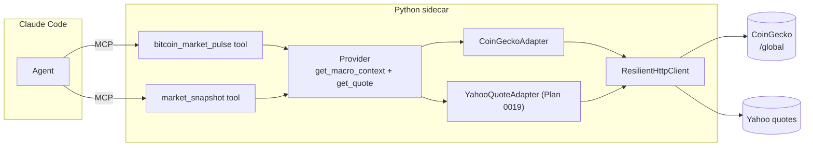

# 0022 — Macro context: Bitcoin market pulse + global market snapshot

> **Status:** done (close ceremony 2026-06-03) — all three `dev` phases landed on branch `plan-0022-macro-context` (`a26b2ec` CoinGecko adapter + `MacroContext`/`CryptoRegime` + `get_macro_context`; `ae3bed8` `bitcoin_market_pulse`; `af56648` `market_snapshot`) and reviewed. Mode 4: no blockers. The two implementer decisions both confirmed sound — (1) the two-endpoint CoinGecko approach (`/global` + `/simple/price`) is necessary because `/global` carries neither BTC's spot price nor its 24h change, which the `MacroContext` shape requires; (2) the BTC-vs-whole-market 24h relative-performance dominance-trend proxy is exact for direction. Paired [ADR-0027](../adrs/0027-crypto-macro-regime-classification.md) accepted, with a close note recording the as-built two-call sourcing + the pinned thresholds (−5% risk-off floor, 1pp deadband) and reconciling the `alt_structure` wording. Verified: 28 plan-0022 specs + the full 307-pass API suite green; mypy `--strict` clean on all three new modules. NB: the implementation branch is **not yet merged to `main`** (close docs committed independently).
> **Created:** 2026-05-24
> **Approved:** 2026-05-24
> **Closed:** 2026-06-03
> **Owner skill(s):** `dev` (all phases)
> **Related ADRs:** [ADR-0027](../adrs/0027-crypto-macro-regime-classification.md) (**paired** — the `regime` structural-classification taxonomy; `proposed`, accepts at this plan's close), [ADR-0007](../adrs/0007-market-data-provider.md) (new Provider method `get_macro_context`), [ADR-0019](../adrs/0019-external-http-adapter-resilience.md) (CoinGecko on the resilience client), [ADR-0009](../adrs/0009-rewrite-data-layer-in-house.md) (in-house)
> **Depends on:** [Plan 0019](0019-live-quote.md) (`get_quote` — the `market_snapshot` fan-out composes it). [Plan 0009](0009-resilience-and-tradingview-screener.md) phase 1 (`ResilientHttpClient`).

## TL;DR

Two macro-context capabilities: (1) `bitcoin_market_pulse` — a single-call crypto macro read (BTC price + 24h change, BTC dominance, total market cap + 24h change) from CoinGecko's free public API, plus a neutral regime descriptor; (2) `market_snapshot` — a global overview fanning `get_quote` across a fixed basket (S&P 500, NASDAQ, VIX, BTC, ETH, EUR/USD, SPY, GLD). First user-visible behavior: ask Claude Code "give me the crypto macro picture" or "global market snapshot right now" and get a one-call factual overview.

## Context & problem

Two convenience macro reads we lack: a single-call crypto macro pulse (BTC dominance / total mcap / regime) and a global market snapshot (major indices). `bitcoin_market_pulse` needs a new data source (CoinGecko's global endpoint — keyless, free); `market_snapshot` is pure composition of [Plan 0019](0019-live-quote.md)'s `get_quote` over a fixed basket, so this plan is sequenced after 0019.

A non-negotiable guardrail: a macro pulse must not emit risk *recommendations* (`HIGH_RISK`, `ALT_FAVORABLE`, "opportunity with caution"). That would contradict "conditions are facts, decisions are the user's." We keep the *measurements* (dominance, mcap, trends) and a **neutral structural descriptor** (e.g. "dominance falling while total cap rising" → a labelled *condition*, not "buy alts"). No action, no buy/sell, no risk-grade-as-advice.

## Decision

Three phases, all `dev`. Phase 1 adds a CoinGecko adapter on `ResilientHttpClient`, a `MacroContext` type, and a new Provider method `get_macro_context(market="crypto")` (mirrors Plan 0011's precedent of a distinct market-level method alongside the per-symbol ones, keeping [ADR-0007](../adrs/0007-market-data-provider.md)'s "all data through the Protocol" rule). Phase 2 exposes `bitcoin_market_pulse`. Phase 3 exposes `market_snapshot` by fanning `get_quote` over the fixed basket — no new Protocol method, pure composition.

We rejected at planning time: (a) emitting risk-grade recommendations (contradicts the analyst non-negotiable — we report the structural condition only); (b) routing the snapshot basket through a new adapter (it's just `get_quote` fan-out — composition, not a new data source).

## Architecture diagram



## Implementation phases

### Phase 1 — CoinGecko adapter + `MacroContext` + `get_macro_context`

- **Owner skill:** `dev`
- **What:** A CoinGecko adapter (global endpoint) on `ResilientHttpClient` (e.g. 60s TTL), a `MacroContext` model, and `get_macro_context(market="crypto", as_of=None)` in the Provider. Compute a neutral regime descriptor from dominance + total-cap trend per the classification rule in [ADR-0027](../adrs/0027-crypto-macro-regime-classification.md) (a labelled condition, never advice; the implementer pins the exact thresholds and the close ceremony confirms them against the ADR). `as_of` raises `ValueError` (wall-clock-sensitive).
- **Files touched:**
  - New `src/market_analyser/data/adapters/coingecko.py` (~90–120 lines).
  - `src/market_analyser/data/types.py`: new `MacroContext` model.
  - `src/market_analyser/data/provider.py`: add `get_macro_context` to the Protocol.
  - `src/market_analyser/data/default_provider.py`: implement it.
  - New `tests/data/test_coingecko_adapter.py`, `tests/data/fixtures/coingecko_global.json`.
- **Done when:**
  - **Offline fixture parse:** with the client mocked to the captured fixture, `get_macro_context()` returns a `MacroContext` with `btc_price`, `btc_change_24h`, `btc_dominance_pct`, `total_market_cap_usd`, `total_market_cap_change_24h`, and a `regime` descriptor populated. Asserted field-by-field.
  - **Regime descriptor is a condition, not advice:** `regime` takes values from a fixed neutral vocabulary describing structure (e.g. `btc_led`, `alt_structure`, `risk_off_structure`, `neutral`) — a test asserts the vocabulary contains no action/recommendation token (`buy`, `sell`, `favorable`, `opportunity`). Guards the non-negotiable at the type level.
  - **Regime is deterministic:** the same `MacroContext` measurement inputs (dominance + total-cap trend) yield the same `regime` label across repeated computation — asserted on fixed fixtures spanning each label (no wall-clock read, no ordering dependence in the classification). Pins the determinism non-negotiable for the one computed field and locks the ADR-0027 mapping.
  - **`as_of` rejection:** `get_macro_context(as_of=<datetime>)` raises `ValueError`. Asserted.
  - **Resilience inheritance:** a mocked transient failure is retried per `ResilientHttpClient`; a hard failure surfaces a typed upstream error, not a raw exception. Asserted.
  - `uv run pytest tests/data/test_coingecko_adapter.py` passes; mypy strict clean.

### Phase 2 — `bitcoin_market_pulse` MCP tool

- **Owner skill:** `dev`
- **What:** `bitcoin_market_pulse()` dispatches `get_macro_context("crypto")` and returns the `MacroContext` plus `queried_at`. No parameters beyond an optional market (default crypto). Boundary-validated; `asyncio.to_thread` offload.
- **Files touched:**
  - New `src/market_analyser/api/mcp_tools/bitcoin_market_pulse.py`.
  - `src/market_analyser/api/mcp_app.py`: register.
  - New `tests/api/test_bitcoin_market_pulse_tool.py`.
- **Done when:**
  - **Happy path:** `bitcoin_market_pulse()` (mocked provider) returns `{macro: {...MacroContext...}, queried_at: <utc iso>}`. Asserted.
  - **Tool description honesty:** the tool description states the figures are a point-in-time read from CoinGecko's free API and that `regime` is a structural condition, not a recommendation. (Reviewed at close, not unit-asserted.)
  - **Regression:** pre-existing tools still pass.
  - `uv run pytest tests/api/test_bitcoin_market_pulse_tool.py` passes; mypy strict clean.

### Phase 3 — `market_snapshot` MCP tool (quote fan-out)

- **Owner skill:** `dev`
- **What:** `market_snapshot()` fans `get_quote` (Plan 0019) across a fixed basket constant (`^GSPC`, `^IXIC`, `^VIX`, `BTC-USD`, `ETH-USD`, `EURUSD=X`, `SPY`, `GLD`) and returns the quotes keyed by symbol plus `queried_at`. Per-symbol fetch failure degrades gracefully (that entry is `null` with a reason; the rest still return). `asyncio.to_thread` / gathered offload.
- **Files touched:**
  - New `src/market_analyser/api/mcp_tools/market_snapshot.py` (basket constant lives here).
  - `src/market_analyser/api/mcp_app.py`: register.
  - New `tests/api/test_market_snapshot_tool.py`.
- **Done when:**
  - **Happy path:** `market_snapshot()` (mocked provider returning quotes for the basket) returns a map of all basket symbols → quote, plus `queried_at`. Asserted.
  - **Graceful degradation:** with one basket symbol's `get_quote` raising, that symbol's entry is `null` with a reason and the other entries are present. Asserted (one bad symbol does not fail the snapshot).
  - **Composition, not a new source:** a test asserts `market_snapshot` calls `provider.get_quote` per basket symbol and adds no other data dependency. Asserted (mock call log).
  - **Regression:** pre-existing tools still pass.
  - `uv run pytest tests/api/test_market_snapshot_tool.py` passes; mypy strict clean.

## Data shapes

```python
# data/types.py (illustrative)

class MacroContext(BaseModel):                      # frozen, extra="forbid"
    market: str                                     # "crypto"
    btc_price: float
    btc_change_24h: float
    btc_dominance_pct: float
    total_market_cap_usd: float
    total_market_cap_change_24h: float
    regime: Literal["btc_led", "alt_structure", "risk_off_structure", "neutral"]
    as_of: datetime
    source: str                                     # "coingecko"
```

## Risks & open questions

- **Risk: CoinGecko free-tier rate limits.** The global endpoint is light (one call), and `ResilientHttpClient`'s 60s TTL cache means repeated pulses within a minute are served from cache. If limits bite, the cache TTL is the tuning knob.
- **Risk: `regime` descriptor drifting toward advice.** Mitigation: the fixed neutral vocabulary + the test that asserts no action token; the close review re-checks the tool description wording.
- **Open question: equity Fear & Greed (CNN).** Deferred (it requires scraping) — `bitcoin_market_pulse` is crypto-only, and Plan 0011 already covers crypto Fear & Greed via alternative.me. Equity F&G is out of scope.
- **Open question: should the snapshot basket be user-configurable?** v1 uses a fixed constant. A configurable basket (via `config.json`) is a small follow-up if the fixed set proves too narrow.

## What this plan does NOT do

- **Risk-grade recommendations** (`HIGH_RISK`/`ALT_FAVORABLE`-style advice) — we report structural conditions only.
- **Equity (CNN) Fear & Greed** — scraping-required; out of scope.
- **Per-symbol macro** — `bitcoin_market_pulse` is a market-level read; per-symbol sentiment is Plans 0010/0012.
- **A configurable snapshot basket** — fixed constant in v1.
- **Persisted macro history** — wall-clock-only; no SQLite table.

## Followups (after this lands)

Empty at draft time.
