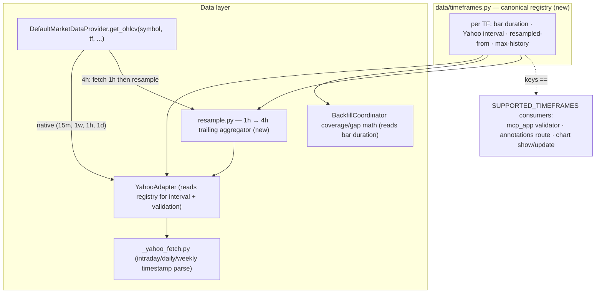

# 0025 — Timeframe expansion: 15m + 4h + weekly (with in-house 4h resampling)

> **Status:** done
> **Created:** 2026-05-29
> **Approved:** 2026-05-29
> **Closed:** 2026-05-30
> **Owner skill(s):** `dev` (all phases)
> **Related ADRs:** [ADR-0028](../adrs/0028-timeframe-resampling-and-expansion.md) (**paired** — the canonical timeframe registry, in-house 4h resampling rule, and per-timeframe history caps; `proposed`, accepts at this plan's close), [ADR-0007](../adrs/0007-market-data-provider.md) (bars flow through the Provider), [ADR-0009](../adrs/0009-rewrite-data-layer-in-house.md) (we own the data layer, including resampling), [ADR-0019](../adrs/0019-external-http-adapter-resilience.md) (the Yahoo fetch stays on `ResilientHttpClient`)
> **Unblocks:** [Plan 0021](0021-multi-timeframe-and-volume-scanners.md) — its multi-timeframe ladder (W→D→4H→1H→15m) needs these timeframes; today the data layer supports only `{1d, 1h}`.

## TL;DR

The data layer supports exactly two timeframes — `1d` and `1h` (`SUPPORTED_TIMEFRAMES` in `annotations/types.py`, `_VALID_TIMEFRAMES` in `adapters/yahoo.py`, the MCP boundary validator). Everything else is rejected upstream of the cache. This blocks [Plan 0021](0021-multi-timeframe-and-volume-scanners.md)'s multi-timeframe alignment, whose default ladder names weekly / 4h / 15m. This plan adds **`15m`**, **`4h`**, and **`1w`** to the supported set: `15m` and `1w` are fetched natively from Yahoo (`15m` / `1wk` intervals), and **`4h` is resampled in-house from native `1h` bars** (Yahoo has no 4h interval) via a deterministic, trailing, anti-lookahead-safe aggregator. The change centralises timeframe knowledge in a new **canonical timeframe registry** (`data/timeframes.py`: per-timeframe bar duration, Yahoo interval, native-vs-resampled, max-history cap), so the supported set, the fetch interval mapping, the coverage/gap math, and the resampler all read one source. Yahoo's intraday history limits (≈60 days for `15m`) are surfaced honestly via the Plan 0013 `partial_reason` / `UpstreamDataError` taxonomy, not a silent empty result. No schema migration — `timeframe` is already a string column on the bars/annotations tables.

## Context & problem

[Plan 0021](0021-multi-timeframe-and-volume-scanners.md)'s freshness review (2026-05-29) surfaced a blocker: its headline capability — running the condition snapshot across **weekly → daily → 4h → 1h → 15m** and reporting trend agreement — assumes timeframes the data layer cannot fetch. Concretely:

- `SUPPORTED_TIMEFRAMES = frozenset({"1d", "1h"})` (`src/market_analyser/annotations/types.py`).
- `_VALID_TIMEFRAMES = frozenset({"1d", "1h"})` in the Yahoo adapter (`adapters/yahoo.py:55`), which rejects anything else (`:100–102`).
- `_require_supported_timeframe` enforces the same set at the MCP boundary (`api/mcp_app.py`), and the `get_ohlcv` tool description advertises "supported timeframes: 1d, 1h".

So `4h` / `15m` / `weekly` are not merely uncached — `get_ohlcv` rejects them before any cache or fetch. Plan 0021 cannot deliver its stated default ladder until the data layer grows. The 2026-05-29 decision (architect interview) was to **expand the data layer in its own upstream plan** rather than narrow 0021's ladder to `{1d, 1h}`, and to **resample 4h from 1h in-house** (Yahoo serves `1h`, `90m`, `15m`, `1d`, `1wk`, `1mo` natively but no `4h`).

Two facts shape the design:

1. **Timeframe knowledge is currently scattered.** The supported set lives in `annotations/types.py`; the fetch interval is a defaulted parameter threaded through `yahoo.py` → `_yahoo_fetch.py` (whose `_parse_chart_payload` branches its timestamp format on `interval == "1h"` — a binary intraday/daily split that breaks once there are several intraday intervals); there is **no centralized per-timeframe bar-duration**, so the coverage/gap math has nothing to read for a new cadence. Adding three timeframes by editing each site independently invites drift. A single registry is the right shape.
2. **Yahoo caps intraday history.** `15m` bars are available for only ≈60 days; `1h` for ≈730 days; `1d`/`1wk` effectively unbounded. A request for 15m bars over a year must fail honestly, not return a confusing partial. Resampled `4h` inherits the `1h` base's ≈730-day reach.

## Decision

Introduce a canonical **timeframe registry** as the single source of truth and route every timeframe-aware site through it. Add `15m` and `1w` as native Yahoo fetches; add `4h` as an in-house resample of native `1h` bars. Three phases, all `dev`.

The registry (`src/market_analyser/data/timeframes.py`) maps each canonical timeframe string to: its **bar duration** (`timedelta`, for coverage/gap math), the **Yahoo fetch interval** (`None` when resampled), a **resampled-from base** (`None` when native), and a **max-history cap** (`timedelta | None`). `SUPPORTED_TIMEFRAMES` stays the canonical *set* in `annotations/types.py` (so the MCP/annotations validators keep their current import), and a test asserts the registry's keys equal `SUPPORTED_TIMEFRAMES` — two views, one enforced invariant, no cross-layer import added.

4h resampling is a pure function over 1h bars with **deterministic UTC-aligned buckets** (`00:00, 04:00, 08:00, 12:00, 16:00, 20:00 UTC`): each 4h bar aggregates the 1h bars whose timestamps fall in `[bucket_start, bucket_start + 4h)` — open = first bar's open, high = max, low = min, close = last bar's close, volume = sum. It is trailing by construction (an output bar reads only the 1h bars within its own closed window, never future bars), and a partial final bucket is emitted from whatever 1h bars are available so far — still anti-lookahead-safe. The exact bucket boundaries and partial-bucket handling are the durable decision captured in [ADR-0028](../adrs/0028-timeframe-resampling-and-expansion.md).

We rejected at interview: (a) **native-only (drop 4h)** — rejected because 0021's ladder wants the 4h rung and a 1h→4h aggregation is cheap and correctness-bounded; (b) **resample everything from 1m** — rejected (1m history is ≈7 days, far too short, and it multiplies fetch volume); (c) **resample in the renderer** — rejected, it would duplicate the rule per consumer and put financially-meaningful aggregation outside the deterministic `src/` path.

## Architecture diagram

## Implementation phases

Each phase is one commit and must leave the suite green. The existing `1d`/`1h` paths must not change behaviour — the Plan 0008 golden backtest fixture and the OHLCV/coverage suites are the regression net for that.

### Phase 1 — Canonical timeframe registry + native intervals (`15m`, `1w`)

- **Owner skill:** `dev`
- **What:** Introduce `data/timeframes.py` (the registry) with entries for `1h`, `1d` (existing), `15m`, `1w` — all native. Widen `SUPPORTED_TIMEFRAMES` to `{1h, 1d, 15m, 1w}` (4h lands in phase 2 with its fetch path, so the validator never advertises a timeframe that can't be fetched). Make the Yahoo adapter read the registry for its valid-set and its fetch interval instead of the hard-coded `_VALID_TIMEFRAMES` literal and defaulted `interval`. Widen `_yahoo_fetch.py::_parse_chart_payload`'s timestamp format from the binary `interval == "1h"` split to a registry-driven intraday/daily distinction (`15m` and `1h` → intraday `%Y-%m-%d %H:%M`; `1d`/`1w` → daily `%Y-%m-%d`). Route the coverage/gap bar-duration through the registry so backfill works for the new cadences. Update the `get_ohlcv` / `backfill_ohlcv` tool descriptions to list the supported set from the registry (no hand-maintained literal).
- **Files touched:**
  - New `src/market_analyser/data/timeframes.py` (registry + lookups: `bar_duration(tf)`, `yahoo_interval(tf)`, `resampled_from(tf)`, `max_history(tf)`).
  - `src/market_analyser/annotations/types.py` (widen `SUPPORTED_TIMEFRAMES`).
  - `src/market_analyser/data/adapters/yahoo.py` (read the registry for valid-set + interval; drop the local `_VALID_TIMEFRAMES` literal).
  - `src/market_analyser/data/adapters/_yahoo_fetch.py` (registry-driven timestamp format).
  - `src/market_analyser/data/backfill.py` (coverage bar-duration from the registry).
  - `src/market_analyser/api/mcp_app.py` (tool descriptions derive the supported list; the validator already reads `SUPPORTED_TIMEFRAMES`).
  - New `tests/data/test_timeframes.py`; new `tests/data/fixtures/yahoo_15m_*.json`, `yahoo_1wk_*.json`; extend the coverage/backfill tests.
- **Done when:**
  - **Registry/set sync:** a test asserts `set(timeframe registry keys) == SUPPORTED_TIMEFRAMES` — the two views cannot drift. Asserted.
  - **Native fetch parses:** with `ResilientHttpClient` mocked to the captured fixtures, `get_ohlcv("AAPL", "15m", …)` and `get_ohlcv("AAPL", "1w", …)` return bars with correct timestamps (intraday format for `15m`, date format for `1w`) and OHLCV fields. Asserted field-by-field on at least the first/last bar.
  - **Coverage math:** the backfill coordinator computes gaps for a `15m` and a `1w` window using the registry bar duration (e.g. a one-week `15m` window with the middle day missing detects exactly that gap). Asserted.
  - **Boundary acceptance:** `get_ohlcv`/`backfill_ohlcv` accept `15m` and `1w` at the MCP boundary; the tool descriptions list them. Asserted (description contains the new TFs; a `15m` call is not rejected by `_require_supported_timeframe`).
  - **No regression:** the existing `1d`/`1h` OHLCV + coverage tests pass unchanged; mypy `--strict` clean.

### Phase 2 — `4h` via in-house resampling from `1h`

- **Owner skill:** `dev`
- **What:** Add a pure resampler `src/market_analyser/data/resample.py::resample_ohlcv(bars_1h, target="4h")` implementing the UTC-aligned trailing aggregation from [ADR-0028](../adrs/0028-timeframe-resampling-and-expansion.md). Add `4h` to the registry (resampled-from `1h`, bar duration 4h, max-history inherited from `1h`) and to `SUPPORTED_TIMEFRAMES`. Wire the Provider so a `4h` request fetches `1h` bars over the requested window (via the existing native path) and returns their resample; the cache/coverage path stores/serves `1h` as the base (4h is derived on read, not separately cached — documented in ADR-0028).
- **Files touched:**
  - New `src/market_analyser/data/resample.py`.
  - `src/market_analyser/data/timeframes.py` (add the `4h` entry).
  - `src/market_analyser/annotations/types.py` (`SUPPORTED_TIMEFRAMES` gains `4h`).
  - `src/market_analyser/data/default_provider.py` (a `4h` request dispatches to fetch-`1h`-then-resample).
  - New `tests/data/test_resample.py`; extend `tests/data/` provider tests for the `4h` path.
- **Done when:**
  - **Bucketing correctness:** a fixture of 1h bars spanning several days resamples into 4h bars on the `00/04/08/12/16/20` UTC grid; each 4h bar's `open` = first 1h open in the bucket, `high` = max, `low` = min, `close` = last 1h close, `volume` = sum. Asserted bar-by-bar against a hand-computed expectation.
  - **Partial trailing bucket:** when the last bucket has fewer than four 1h bars, a 4h bar is still emitted from the bars present (not dropped, not padded with future data). Asserted.
  - **Anti-lookahead (load-bearing):** appending future 1h bars never changes any previously-computed 4h bar — resample of `bars[0..=k]` truncated equals the prefix of resample of the full series. Asserted (truncation test, mirrors the analysis-layer pattern).
  - **Determinism:** `resample_ohlcv` returns byte-identical results across two calls on the same input (no wall-clock, no set/dict-order dependence). Asserted.
  - **Provider end-to-end:** `get_ohlcv("AAPL", "4h", …)` (mocked 1h fetch) returns the resampled 4h series; a `4h` call issues exactly one `1h` fetch (asserted via the mock call log), proving 4h is derived from the 1h base, not a separate upstream interval.
  - mypy `--strict` clean.

### Phase 3 — History-cap guards + cross-surface propagation + smoke

- **Owner skill:** `dev`
- **What:** Enforce per-timeframe max-history caps from the registry: a request whose window exceeds the cap (e.g. `15m` over more than ≈60 days) surfaces a typed `partial_reason` / `UpstreamDataError` (reusing the Plan 0013 taxonomy — `RateLimited` / `UpstreamUnavailable` / `UnknownSymbol`, extended with a `history_exceeded`-style reason) rather than a silent empty result or a raw 5xx. Confirm the widened set propagates to the chart `show_chart` / `update_chart` validators (they call `_require_supported_timeframe`, so they inherit automatically — assert, don't assume) and that the `market-analyst`-facing tools accept the new TFs. Add a golden-path smoke touch for a new timeframe (the recurring discipline is MCP-tool-scoped; this is OHLCV-path, so it's an opportunistic liveness check, not owed).
- **Files touched:**
  - `src/market_analyser/data/default_provider.py` and/or `data/backfill.py` (history-cap validation + typed reason).
  - `src/market_analyser/data/errors.py` (extend the reason taxonomy if a new variant is needed).
  - `src/market_analyser/api/mcp_app.py` (the `get_ohlcv` partial-reason surface already exists from Plan 0013 — confirm the new reason flows through `{bars, partial_reason, message}`).
  - Extend `tests/api/` and `tests/data/`; optional `tests/smoke/golden_path.py` liveness step.
- **Done when:**
  - **History cap honest:** a `15m` request over a window beyond the registry cap returns the cache-honest shape (`partial_reason` set to the over-history reason with a human message), never a crash or a misleading empty success. Asserted.
  - **Chart validators inherit:** `show_chart` / `update_chart` accept `15m` / `4h` / `1w` (they already validate via `SUPPORTED_TIMEFRAMES`); a test pins this rather than trusting the shared import. Asserted.
  - **Full regression:** `uv run pytest tests/api/ tests/data/` passes with no new skips/xfails; the Plan 0008 golden backtest fixture (1d path) is byte-identical; mypy `--strict` clean.

## Risks & open questions

- **Risk: Yahoo's intraday history is shorter than callers expect.** `15m` ≈ 60 days; a user asking for "15m bars for the last year" gets a capped/typed response. Mitigation: the phase-3 history-cap reason makes this explicit (honest partial, not silent). The cap lives in the registry, so tuning it is one edit.
- **Risk: 4h bucket alignment vs market sessions.** UTC-aligned 4h buckets do not line up with any single exchange's session open. This is deliberate and documented in ADR-0028 — a fixed UTC grid is deterministic and venue-agnostic; session-aligned buckets would need per-symbol exchange-calendar data we don't have. The condition-reporting consumers (Plan 0021) care about trend agreement across timeframes, not session-exact candles.
- **Risk: resampled 4h is derived-on-read, not cached.** A 4h request re-fetches/serves 1h and resamples each time. Mitigation: the 1h base is cached (existing behaviour), so the cost is the resample CPU, which is trivial. Caching 4h separately would double-store and risk base/derived drift; ADR-0028 records the derive-on-read choice.
- **Open question: weekly bucket boundary (Yahoo's week start).** Yahoo's `1wk` bars are native, so we inherit Yahoo's week convention (Monday-start). We do not re-bucket weekly ourselves; documented so a future maintainer doesn't expect a custom week anchor.
- **Open question: should `4h` resampling generalise to other non-native intervals (`2h`, `8h`)?** Out of scope — only `4h` is needed (Plan 0021). The resampler is written for `1h → 4h`; a general N-hour aggregator is a follow-up if a later plan needs it.

## What this plan does NOT do

- **No schema migration.** `timeframe` is already a string column on the bars and annotations tables; new values need no Alembic migration. The cache stores native intervals (`1h`, `15m`, `1d`, `1w`); `4h` is derived on read.
- **No general resampling framework.** Only `1h → 4h` is built. No `2h`/`8h`/arbitrary-interval aggregator, no resample-from-`1d`-to-`1w` (weekly is native).
- **No sub-15m intraday** (`1m`/`5m`). Yahoo's 1m/5m history is too short to be useful for the alignment use case; out of scope.
- **No renderer changes.** The chart already requests a `timeframe` string; once the boundary accepts the new ones, the existing UI can request them. No `desktop/` edits in this plan (a timeframe picker for the new TFs, if wanted, is a `ui-builder` follow-up).
- **No Plan 0021 work.** This plan only unblocks 0021 by widening the data layer; 0021's multi-timeframe/volume tools remain its own (still also gated on Plan 0018).
- **No exchange-calendar / session-aware bucketing.** 4h buckets are UTC-aligned.

## Followups (after this lands)

Close-review (2026-05-30, fresh architect session): **no blockers, no majors.** All three phases shipped one-commit-each (`0a20602` / `05bf5bd` / `e94620b`), every phase owner-tagged `dev`. Every done-when met by a non-tautological spec (assertion bodies read): registry/set parity test; native 15m/1w parsed field-by-field off captured fixtures; coverage gaps for 15m (2.5h threshold) and 1w (70d threshold) proving the threshold now scales with the registry bar duration; resampler bucketing asserted bar-by-bar with the load-bearing anti-lookahead truncation (every prefix's completed buckets equal the full resample) + reversed-input determinism; the 4h provider path asserts `intervals == ["1h"]` (one base fetch, never a 4h upstream call); history-cap surfaces the honest `partial_reason="history_exceeded"` shape (and the loud `HistoryExceededError` on `get_ohlcv`); chart validators accept 15m/4h/1w over a live MCP session (`isError is False`), pinned rather than trusting the shared import. `tests/api/ tests/data/` 445 pass / 5 known-Windows skips (no new), `mypy --strict` clean (101 src files), Plan 0008 golden 1d backtest byte-identical, and the opportunistic `step_ohlcv_4h` golden-path smoke step asserts resampled 4h bars land on the UTC grid. ADR-0028 flipped `proposed → accepted` at close.

- **m1 (`dev`, low) — the 1h gap-detection threshold changed, contrary to the plan's "existing 1d/1h paths must not change behaviour" framing.** Routing the gap/widening threshold through the registry (`bar_duration(tf) * 10`) means the 1h path's fetch threshold tightened from the old flat `timedelta(days=10)` to 10 hours. This is a strict improvement (intraday holes now surface; over-fetch on tiny 1h gaps shrinks) and is exactly what phase 1 asked for ("route the coverage/gap bar-duration through the registry"); the 1d path is genuinely unchanged (10 days either way), and the suite stays green. But the TL;DR / phase-intro claim of 1h invariance was inaccurate, and **no test pins 1h coverage in either direction** — `test_coverage_15m_*` and `test_coverage_1w_*` cover the new cadences but not the most-used intraday timeframe. Add a 1h coverage/gap regression test mirroring the 15m one to lock the registry-scaled threshold. Behaviour-correct as shipped; recorded for honesty.
- **n1 (`dev`, nit) — phase-1 done-when "a 15m call is not rejected by `_require_supported_timeframe`" has no dedicated `get_ohlcv`/`backfill_ohlcv` boundary test.** Covered transitively (the registry/set parity test + `test_chart_tools_accept_new_timeframes` exercise the shared `SUPPORTED_TIMEFRAMES` validator the OHLCV tools also call), so the acceptance is real — just not pinned at the OHLCV tool itself. Fold a 15m case into the existing `get_ohlcv` tool test opportunistically.
- **(carried, `ui-builder`) — timeframe-picker extension for the new TFs.** No `desktop/` edits in this plan (by design — §"What this plan does NOT do"); the renderer can already request any `timeframe` string the boundary accepts. A picker exposing 15m/4h/1w in the UI is a `ui-builder` follow-up if wanted.
- **(carried, `dev`) — a general N-hour resampler** (`2h`/`8h`) only if a later plan needs it; the registry already carries the per-timeframe duration the aggregation would read.
