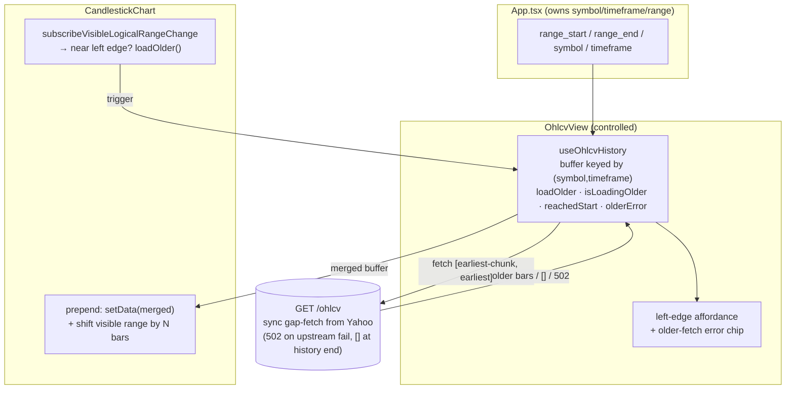

# 0030 — Lazy historical loading (scroll-left to fetch older bars)

> **Status:** done (close ceremony 2026-06-03) — both renderer phases (`4526882`/`04f0758`) + the deterministic seeded-cache e2e (`0cd7f7a`) landed and reviewed; the data-layer blocker [Plan 0031](0031-yahoo-absolute-range-fetch.md) closed in the same ceremony, so the live path now works. Mode 4: no blockers. Verified: 27 renderer Jest specs (useOhlcvHistory / useLazyHistoryTrigger / CandlestickChart.lazy / OhlcvView) green; the seeded e2e is real (asserts barCount growth + second `/ohlcv` fetch + affordance via MutationObserver); live past-window fetch confirmed via 0031 (249 bars). The best-effort live scroll smoke (`live-chart.spec.ts`) is non-gating per the Phase 2 done-when.
> **Created:** 2026-06-02
> **Approved:** 2026-06-02
> **Owner skill(s):** `ui-builder`
> **Blocked by:** [Plan 0031](0031-yahoo-absolute-range-fetch.md) — see the 2026-06-02 update below. Both renderer phases are committed and correct, but the feature cannot work end-to-end until the data layer can fetch a window that ends in the past.
> **Related ADRs:** [ADR-0008](../adrs/0008-electron-shell-conventions.md) (renderer/component conventions; no new decision), [ADR-0007](../adrs/0007-market-data-provider.md) (the `/ohlcv` sync gap-fetch this rides on), [ADR-0017](../adrs/0017-live-ui-updates-via-sse.md) (why the SSE backfill path is *not* the mechanism here)
> **Depends on:** [Plan 0029](0029-candlestick-chart-decomposition.md) — phase 2 edits `CandlestickChart.tsx`, which 0029 is mid-refactor. Sequence 0030 after 0029 lands. (Phase 1 touches no chart file and could start earlier if needed.)

## Update 2026-06-02 — blocked: the "older bars are fetchable today" premise was false

Both renderer phases shipped (`4526882` phase 1, `04f0758` phase 2) and pass typecheck/lint/test. Manual testing then showed scroll-left loads nothing: `loadOlder` fires correctly and requests the right older window, but `GET /ohlcv` returns ~11 bars (then 1) for a full-year past window, so the buffer stops growing and `reachedStart` latches.

**Root cause is in the data layer, not this plan's renderer code.** The Yahoo adapter fetches with Yahoo's now-relative `range=` parameter and filters to `[start, end]` (`data/adapters/_yahoo_fetch.py:46`, `data/adapters/yahoo.py:112-167`), so a window ending in the *past* barely overlaps the now-anchored fetch. The Context section below claims "older bars are *fetchable today*" via the synchronous gap-fetch — that holds **only for windows ending at/near now**, which is every prior caller (initial loads, backfills). Backward paging is the first feature to request past-ending windows, exposing the latent limitation.

The fix is [Plan 0031](0031-yahoo-absolute-range-fetch.md) (`dev`): switch the Yahoo fetcher to absolute `period1`/`period2` timestamps. **No change to this plan's renderer code is required** — it is correct and will work once 0031 lands. After 0031, re-run the manual scroll smoke (Phase 2 done-when) and, if clean, take this plan through its close ceremony (`implementation complete — pending 0031` → `done`).

The original Context/Decision below are preserved as written (append-only); read them with this correction in mind.

## TL;DR

Today the chart loads exactly one fixed `[range_start, range_end]` window and stops. Scroll left past the earliest loaded bar and you get blank canvas — there is no listener that notices you've reached the edge and no mechanism to fetch older bars. This is a missing feature, not a regression: nothing in the codebase subscribes to the time-scale's visible range. This plan adds incremental backward paging. A new `useOhlcvHistory` hook owns an accumulating bar buffer keyed by `(symbol, timeframe)`; the chart subscribes to the visible logical range and, when the user scrolls within a threshold of the left edge, the hook fetches one viewport-width chunk of older bars via the **existing** `GET /ohlcv` route (which already synchronously gap-fetches from Yahoo on a cache miss), prepends them, and the chart re-anchors scroll position so the view doesn't jump. A small loading affordance pins to the left edge during the fetch; an empty response means the end of available history (true data start, or the timeframe's Yahoo horizon) and paging stops. When the agent changes the range or symbol, the buffer re-anchors: it is preserved and extended where the new window overlaps, reset where it doesn't.

## Context & problem

Reported by the user 2026-06-02: "when I scroll the chart to the left, data is not loaded, the chart is simply empty." Investigation confirmed the behavior is **not implemented**, nothing is broken:

- `OhlcvView` is a controlled component; `App.tsx` owns `range_start`/`range_end`, and `useOhlcv` (`desktop/renderer/hooks/useOhlcv.ts:41-62`) fires a single `GET /ohlcv` for that window. The window only changes on symbol/timeframe/range prop changes or an explicit `refetch()` — never from scrolling.
- A grep across `desktop/` for `subscribeVisibleLogicalRangeChange` / `loadMore` / `fetchMore` / `prepend` finds nothing. The chart calls `timeScale().fitContent()` once after data loads (`CandlestickChart.tsx:296`) and never reacts to pan/zoom.

So scrolling left past the earliest bar shows empty canvas because there is no data there and no trigger to fetch it.

**What the data layer already supports (and what it doesn't):**

- `GET /ohlcv` accepts an arbitrary `[start, end]` (`api/routes/ohlcv.py:22-32`) and delegates to `provider.get_ohlcv(...)`, which **synchronously** gap-fetches from Yahoo on a cache miss and returns the merged bars (Plan 0013 confirmed this: the runtime gap-fetches when a `BarRepository` is wired). On upstream failure the route returns a clean 502; on truly-no-data it returns `[]`. So older bars are *fetchable today* — they just need a trigger and a prepend.
- The async `BackfillCoordinator` + `ohlcv.backfill_*` SSE events (Plan 0013) are **not** the right mechanism here, for two concrete reasons:
  1. Those events fire only for *agent-initiated* async backfills (`get_ohlcv(backfill_async=true)` / the `backfill_ohlcv` MCP tool). The HTTP `/ohlcv` route the renderer uses does its fetch synchronously and publishes no backfill events.
  2. The coordinator **dedups on `(symbol, timeframe)` and drops the second caller's range** (Plan 0013 phase 3, and its own "open question"). A scroll-driven older-window backfill could be silently coalesced onto an unrelated in-flight backfill for the same symbol and never fetch the older window at all.

This is the one correction to the interview: the "left-edge loading affordance" the user chose is delivered by the **pending state of the older-chunk `GET /ohlcv` fetch itself**, not by `useBackfillState`/SSE. Same UX (spinner at the edge, keep interacting, prepend on arrival); the SSE path is structurally wrong for this trigger.

**Hard constraints from the data layer (these size the chunk and define the floor):**

- A single fetch is capped at `_MAX_PERIOD_DAYS = 732` days (~2y); over that the route returns 422 (`data/adapters/yahoo.py:54,112-114`). Each older-chunk request must stay under this.
- Each timeframe has a Yahoo history horizon (`data/timeframes.py:45-52`): `15m` → 60 days, `1h`/`4h` → 730 days, `1d`/`1w` → effectively unbounded. Past the horizon Yahoo returns nothing. Both "true data start" and "hit the horizon" surface as an **empty response**, so paging can stop reactively without the renderer mirroring these constants.

No ADR is needed: this applies the existing controlled-view + hooks conventions ([ADR-0008](../adrs/0008-electron-shell-conventions.md)) and rides the existing `/ohlcv` sync-fetch seam ([ADR-0007](../adrs/0007-market-data-provider.md)). The one non-obvious decision (sync `/ohlcv` pending-state over the async SSE coordinator) is captured in the Decision section below with its rejected alternative; if the user wants it durable, it can be promoted to an ADR.

## Decision

Incremental prepend with a buffer hook, two `ui-builder` commits.

- **Phase 1** introduces `useOhlcvHistory`, which subsumes `useOhlcv`'s role for `OhlcvView` and owns an accumulating, sorted, deduped bar buffer keyed by `(symbol, timeframe)`. It exposes `loadOlder()` plus `isLoadingOlder` / `olderError` / `reachedStart`, and handles the **re-anchor** semantics on prop-window changes (extend/merge on overlap, reset on disjoint or symbol/timeframe change).
- **Phase 2** wires the chart: a visible-logical-range subscription calls `loadOlder()` when the user scrolls within a bar-count threshold of the buffer's left edge; the prepend preserves scroll position by shifting the visible logical range by the number of bars added; `OhlcvView` renders the left-edge affordance and an older-fetch error chip.

Each older chunk is sized to roughly one viewport span, clamped below the ~2y per-fetch cap (on a 422 the hook halves and retries once, then surfaces an error chip without hard-stopping). An empty response sets `reachedStart` and stops further triggers.

Rejected alternatives:
- **Widen-window + full re-fetch** (extend `range_start`, re-fetch the whole `[start,end]` through `useOhlcv`): simplest data flow but re-downloads everything already on screen each step and forces a re-anchor anyway. Rejected for the bandwidth/latency waste — the user picked incremental prepend.
- **Async backfill via the coordinator + SSE** (`useBackfillState` flow): the path one would reach for given Plan 0013, but it doesn't fire for the HTTP route and its `(symbol,timeframe)` dedup drops the older range (see Context). Rejected as structurally unable to fetch the requested older window reliably.
- **Full chart rewrite / virtualized data source:** out of proportion; lightweight-charts' `setData` + visible-range API handle prepend fine.

## Architecture diagram



## Implementation phases

Both phases are `ui-builder`, one commit each, conventional-commit style. No cross-skill handoff (single owner). Done-when conditions name the behavioral claim each test defends — open the spec and read the assertion body, do not trust a green run.

### Phase 1 — `useOhlcvHistory` buffer hook (data brain)

- **Owner skill:** `ui-builder`
- **What:** Add `desktop/renderer/hooks/useOhlcvHistory.ts`. It takes the controlled `{ symbol, timeframe, start, end }` (same inputs `useOhlcv` takes today) and owns an accumulating bar buffer as state, sorted ascending by `event_ts` and deduped on `event_ts`. It preserves `useOhlcv`'s existing surface for the initial load (`bars`, `isLoading`, `error`, `refetch`) so `OhlcvView`'s loading/error/empty branches are unchanged, and adds:
  - `loadOlder(): void` — computes the next older window `[earliest - chunkSpan, earliest]` (where `earliest` is the buffer's first bar's timestamp and `chunkSpan` defaults to the initial window's span, **clamped to ≤ 700 days** to stay under the route's 732-day cap), fetches it via `api.getOhlcv`, prepends+dedups the result. Guards re-entrancy: a `loadOlder()` while one is in flight is a no-op.
  - `isLoadingOlder: boolean`, `olderError: Error | null`, `reachedStart: boolean`.
  - **Reached-start detection:** if an older fetch returns zero *new* bars (empty, or all duplicates of what's already buffered), set `reachedStart = true` and ignore subsequent `loadOlder()` calls until the buffer key changes. This covers both true data start and the timeframe's Yahoo horizon.
  - **422 handling:** on a 422 (span too large), halve `chunkSpan` and retry once; if it still fails, set `olderError` and leave `reachedStart` false (the user can scroll-trigger again).
  - **Re-anchor on prop change:**
    - `(symbol, timeframe)` change → reset the buffer entirely and fetch the new `[start, end]` (history of a different series is meaningless).
    - `(start, end)` change with the same `(symbol, timeframe)` → if the new window overlaps or sits within the current buffer extent, **keep the buffer**, fetch only the missing edge(s) to cover the new window, and reset `reachedStart` to false only if the new `start` is earlier than the buffer's earliest. If the new window is disjoint from the buffer, reset as for a symbol change.
  - Cancels stale in-flight requests on unmount and on re-trigger, exactly as `useOhlcv` does today (`useOhlcv.ts:41-62`).
  Switch `OhlcvView` from `useOhlcv` to `useOhlcvHistory`. `useOhlcv` stays in the tree for any other consumer; `useOhlcvHistory` fetches directly via `api.getOhlcv` (it needs imperative `loadOlder` fetches, so it does not wrap `useOhlcv`). Also widen `useAnnotationsPoll`'s window to the buffer extent so markers cover prepended bars (`OhlcvView.tsx:61`); if that proves noisy, scope it to a follow-up — note which you did in the commit.
- **Files touched:** `desktop/renderer/hooks/useOhlcvHistory.ts` (new), `desktop/renderer/hooks/useOhlcvHistory.test.tsx` (new), `desktop/renderer/views/OhlcvView.tsx` (swap the hook; thread the new return values through to props the chart will consume in phase 2), `desktop/renderer/views/OhlcvView.test.tsx` (update for the swapped hook; existing loading/error/empty assertions must still hold).
- **Done when:**
  - `useOhlcvHistory.test.tsx` (Jest, `api.getOhlcv` mocked) asserts:
    - **Initial load parity:** mounting with `(AAPL, 1d, start, end)` issues one `getOhlcv` for exactly `[start, end]`; `bars` equals the mocked response sorted ascending; `isLoading` transitions `true → false`; `reachedStart` is `false`.
    - **Prepend:** with a buffer whose earliest bar is `T0`, calling `loadOlder()` issues a `getOhlcv` whose `end` is `T0` and whose `start` is `T0 - chunkSpan`; the returned older bars are prepended; the resulting `bars` is sorted ascending with no duplicate `event_ts`; `isLoadingOlder` is `true` during the fetch and `false` after.
    - **Dedup at the join:** when the older fetch overlaps the buffer (returns a bar whose `event_ts` already exists), the merged buffer contains that timestamp exactly once.
    - **Re-entrancy guard:** a second `loadOlder()` called while the first is unresolved does not issue a second `getOhlcv`.
    - **Reached-start (empty):** when an older fetch resolves `[]`, `reachedStart` flips to `true`, and a subsequent `loadOlder()` issues no further `getOhlcv`.
    - **Reached-start (all-duplicate):** when an older fetch returns only bars already buffered, `reachedStart` flips to `true` (no net growth ⇒ no more history).
    - **422 backoff:** when the first older fetch rejects with an `ApiError` status 422, the hook re-issues exactly one `getOhlcv` with half the span; if that resolves with bars they are prepended and `olderError` is null; if it also 422s, `olderError` is set and `reachedStart` stays `false`.
    - **502/error surfacing:** an older fetch rejecting with a non-422 `ApiError` (e.g. 502) sets `olderError` and does **not** set `reachedStart` (transient upstream failure is retryable).
    - **Re-anchor — symbol change resets:** changing `symbol` clears the buffer (old bars gone) and issues a fresh `[start, end]` fetch; `reachedStart` resets to `false`.
    - **Re-anchor — overlapping range keeps buffer:** with a buffer spanning `[A, B]`, changing the window to `[A-Δ, B]` (same symbol/timeframe) preserves the in-range buffered bars (no full refetch of `[A,B]`), fetches the missing older edge `[A-Δ, A]`, and merges; the bars already in `[A,B]` are not re-requested.
    - **Re-anchor — disjoint range resets:** changing to a window with no overlap clears the buffer and fetches the new window fresh.
  - `OhlcvView.test.tsx` (updated) asserts the existing loading / error / empty / populated branches still render identically against `useOhlcvHistory` (regression — the swap is behavior-preserving for the initial load).

### Phase 2 — Chart scroll trigger + scroll-anchored prepend + edge affordance

- **Owner skill:** `ui-builder`
- **What:** Wire the chart to drive `loadOlder()` and keep the viewport stable across prepends.
  - In `CandlestickChart`, subscribe to the time-scale's visible logical range (`chart.timeScale().subscribeVisibleLogicalRangeChange(...)`). When the range's `from` is within a small threshold (e.g. ≤ 10 bars) of logical index 0 — i.e. the user scrolled near the buffer's left edge — invoke an `onReachLeftEdge` callback (which `OhlcvView` maps to `loadOlder`). Unsubscribe on dispose (ADR-0008 dispose-on-unmount). Suppress the trigger while `isLoadingOlder` is true and once `reachedStart` is true.
  - **Scroll-position preservation:** when the bars prop grows on the *left* (prepend), capture the visible logical range before `setData(merged)`, then `setVisibleLogicalRange` shifted right by the number of bars prepended, so the user's viewport stays anchored on the same bars instead of jumping. Detect "grew on the left" by comparing the new first-bar timestamp to the previous render's first-bar timestamp (a ref). Appends/forward growth keep today's behavior (no fit on update; only the mount path fits — `fitContent` at `:296` stays mount-only).
  - In `OhlcvView`, render a small left-edge loading affordance (a `data-testid="ohlcv-history-loading"` spinner/chip pinned to the chart's left) while `isLoadingOlder`, and an unobtrusive error chip (`data-testid="ohlcv-history-error"` with a retry that re-calls `loadOlder`) when `olderError` is set. Neither shows when `reachedStart` is true.
  - Prefer extracting the subscription into a tiny `useLazyHistoryTrigger(chartRef, { enabled, onReachLeftEdge, thresholdBars })` hook for unit-testability, mirroring 0029's hook-extraction direction. The scroll-anchor logic lives in the component's data-reconcile effect (it needs the series ref).
  - **Coordinate with Plan 0029:** this edits `CandlestickChart.tsx`, which 0029 is decomposing. Land after 0029. If 0029's `useChartGestures` extraction has shipped, add the visible-range subscription as a sibling concern (it is not a pointer gesture — keep it separate from `useChartGestures`).
- **Files touched:** `desktop/renderer/components/CandlestickChart.tsx` (visible-range subscription + scroll-anchored prepend), `desktop/renderer/hooks/useLazyHistoryTrigger.ts` (new) + `useLazyHistoryTrigger.test.tsx` (new), `desktop/renderer/views/OhlcvView.tsx` (affordance + error chip + wire `onReachLeftEdge → loadOlder`), `desktop/renderer/views/OhlcvView.test.tsx` (affordance states). **E2e (the remaining close-blocking work):** a deterministic seeded-cache Playwright spec under `desktop/tests/` (new, e.g. `lazy-history.spec.ts`) + a cache-seed subprocess helper (new, alongside the existing e2e helpers). The renderer code in `CandlestickChart.tsx` / `useLazyHistoryTrigger.ts` / `OhlcvView.tsx` already shipped in `4526882`/`04f0758`; the previously-committed live scroll case in `desktop/tests/live-chart.spec.ts` is demoted to a non-gating smoke (see done-when).
- **Done when:**
  - `useLazyHistoryTrigger.test.tsx` (Jest, fake chart/time-scale exposing a `subscribeVisibleLogicalRangeChange` stub) asserts:
    - Delivering a visible range with `from <= thresholdBars` invokes `onReachLeftEdge` exactly once per crossing (not on every event while parked at the edge — assert it fires once on the inward crossing, not repeatedly for identical subsequent ranges).
    - A visible range with `from > thresholdBars` does not invoke `onReachLeftEdge`.
    - When `enabled` is false (maps to `isLoadingOlder || reachedStart`), no crossing invokes `onReachLeftEdge`.
    - Dispose unsubscribes (the stub's unsubscribe is called); no callback fires after dispose.
  - `CandlestickChart`'s scroll-anchor behavior is covered by a unit test (via the existing `window.__test_chart_render__` reflection or a `setVisibleLogicalRange` spy): when the bars prop is replaced with a superset prepended by N older bars, `setVisibleLogicalRange` is called with the prior range shifted right by N (viewport stays on the same bars); when bars grow only on the right, no anchor-shift occurs.
  - `OhlcvView.test.tsx` asserts: the `ohlcv-history-loading` affordance renders iff `isLoadingOlder`; the `ohlcv-history-error` chip renders iff `olderError` and its retry re-invokes `loadOlder`; neither renders when `reachedStart` is true.
  - **Deterministic seeded-cache Playwright e2e — the close-blocking gate (added 2026-06-02, `ui-builder`).** This is the required end-to-end coverage; it does **not** depend on Plan 0031 because seeding the cache makes the older-window `GET /ohlcv` serve from SQLite without any Yahoo fetch — so it isolates and proves the renderer↔sidecar wiring (scroll → visible-range trigger → `loadOlder` → `/ohlcv` → prepend → anchored viewport). Shape:
    - **Seed helper.** Before launching the app, upsert daily `Bar`s for a synthetic symbol (e.g. `SEEDCO`, which real Yahoo does NOT list, so any accidental gap-fetch fails loudly rather than masking the test) into the same SQLite DB the launched sidecar uses (`default_app_data_dir()` → `config.db_path`), via a Python subprocess using `BarRepository.upsert_bars` — mirroring `live-chart.spec.ts`'s existing `callMcpTool` subprocess pattern and `ohlcv-view.spec.ts`'s `insertAnnotation`. Seed a contiguous range wider than the initial window plus at least one older chunk (e.g. 3y back) so the scrolled older windows are fully cache-covered (no gap → no fetch).
    - **Assertions.** `show_chart` for the seeded symbol on a narrow window (e.g. the most recent ~1mo of the seeded range); wait for the candlestick series to render and capture `__test_chart_render__.barCount`; scroll/drag to the left edge; then assert (a) the `ohlcv-history-loading` affordance appears then clears, and (b) `barCount` **increased** (older seeded bars were prepended). Deterministic — no live-Yahoo gating, no best-effort caveat.
  - The previously-committed best-effort live scroll case in `live-chart.spec.ts` (from `04f0758`) is **demoted to a non-gating, real-world smoke**: keep it (it costs nothing and exercises the real `period1`/`period2` path once 0031 lands) or remove it at the implementer's discretion — it is no longer required coverage now that the deterministic seeded e2e is the gate.
  - Manual smoke (in the phase commit message): with `pnpm dev` and a daily chart on a long-lived symbol **(after Plan 0031 lands)**, scroll left repeatedly — older bars stream in, the viewport stays anchored (no jump), the left-edge affordance blinks during each fetch, and paging stops cleanly at the start of available history with no error chip.

## Data shapes

No persisted or wire shapes change — the renderer reuses `GET /ohlcv` (`Bar[]`) verbatim. New internal hook surface (illustrative):

```ts
// useOhlcvHistory.ts
export interface UseOhlcvHistoryResult {
  bars: Bar[] | null          // accumulating, sorted asc, deduped on event_ts
  isLoading: boolean          // initial-window load (parity with useOhlcv)
  error: Error | null         // initial-window error
  refetch: () => void
  loadOlder: () => void       // fetch+prepend one older chunk; no-op while in flight or reachedStart
  isLoadingOlder: boolean
  olderError: Error | null
  reachedStart: boolean       // empty/all-dup older fetch ⇒ no more history (data start or TF horizon)
}
```

```ts
// scroll-anchored prepend, inside the chart's reconcile effect (illustrative)
const prevFirstTs = prevFirstTsRef.current
const grewOnLeft = prevFirstTs != null && bars[0].event_ts < prevFirstTs
const before = grewOnLeft ? chart.timeScale().getVisibleLogicalRange() : null
candleSeries.setData(bars.map(toLightweightBar))
if (before) {
  const added = countBarsBefore(bars, prevFirstTs)   // N prepended
  chart.timeScale().setVisibleLogicalRange({ from: before.from + added, to: before.to + added })
}
prevFirstTsRef.current = bars[0].event_ts
```

## Risks & open questions

- **Risk: prepend re-anchor flicker.** `setData` replaces the whole series; if the visible-range shift lands a frame late the viewport can visibly jump. Mitigation: compute the shift and call `setVisibleLogicalRange` synchronously in the same effect as `setData`, before paint; the unit test pins the shift math. If flicker persists, fall back to `series.update` per prepended bar (no full `setData`) — noted as the escape hatch, not the default.
- **Risk: trigger storm at the edge.** A naïve "fire whenever `from <= threshold`" re-triggers on every scroll event while parked at the edge. Mitigation: `useLazyHistoryTrigger` fires once per inward crossing and the hook's re-entrancy guard + `isLoadingOlder` suppress overlap; the trigger test pins single-fire.
- **Risk: synchronous `/ohlcv` older-chunk fetch blocks 1–5 s on a cold cache.** The fetch is non-blocking to the UI (it's a promise; the affordance shows; the user keeps interacting), but the bars arrive in a burst. Acceptable for desktop scale; this is exactly the affordance's job. The route returns 502 on upstream failure → `olderError` chip with retry.
- **Risk: intraday horizon feels like a bug.** On `15m` the user can only page back ~60 days (Yahoo horizon, `timeframes.py:45`); paging stops there with `reachedStart`. That is correct but may surprise. Mitigation: `reachedStart` simply stops the affordance (no error). If desired, a future refinement could show a subtle "start of available history" marker — out of scope here.
- **Risk: `useAnnotationsPoll` window growth.** Widening the annotation poll to the buffer extent means larger poll responses as history grows. At desktop scale and annotation volumes this is negligible; if it isn't, scope annotations to the initial window and treat older-bar markers as a follow-up. Implementer records the choice in the commit.
- **Open question: chunk span default.** "One viewport span" is the spec; the concrete default (e.g. clamp to `min(visibleSpan, 700d)`) is an implementation tuning knob. The 700-day clamp is the only hard requirement (stay under the 732-day route cap). Implementer may pick a smaller fixed default per timeframe if viewport-span proves awkward to read from the time scale.
- **Open question: collision with 0029.** If 0029 is still in flight when this is picked up, phase 2's `CandlestickChart.tsx` edits must rebase onto 0029's decomposed component. Phase 1 has zero chart-file overlap and is safe to start independently. Sequenced after 0029 in the README execution order.

## What this plan does NOT do

- **Does not add forward/right lazy loading** (paging toward "now" beyond `range_end`). Live updates already arrive via the SSE highlights path; right-edge paging is a separate, lower-value feature.
- **Does not use the `BackfillCoordinator` / `ohlcv.backfill_*` SSE events.** It rides the synchronous `GET /ohlcv` route (see Decision). The agent-driven async backfill path is unchanged.
- **Does not add a new sidecar route or change `GET /ohlcv`.** No `dev` work. Chunk sizing and the history floor are handled reactively from the route's existing 422/empty/502 responses.
- **Does not mirror `_MAX_PERIOD_DAYS` or per-timeframe `max_history` constants in the renderer.** The renderer reacts to 422 (clamp) and empty (`reachedStart`) instead of duplicating the data layer's truth. (If a future plan wants proactive sizing, a `GET /timeframes` metadata endpoint is the clean way — noted, not built.)
- **Does not change the chart's mount-time `fitContent()` or dispose logic** (correct per ADR-0008). Only the update/reconcile path gains the scroll-anchor.
- **Does not virtualize or cap the in-memory buffer.** Unbounded paging on `1d`/`1w` could accumulate many years of bars in memory; at desktop scale and lightweight-charts' performance this is fine. A buffer cap (drop far-right bars when paging deep left) is a follow-up only if memory becomes a problem.
