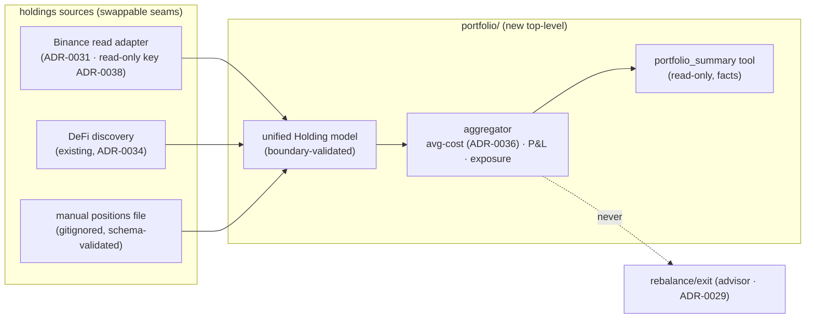

# 0041 — Cross-venue portfolio aggregation

> **Status:** done (2026-07-06) — three `dev` phases on `main` (`18816b9` Binance read adapter → `95d62d0` manual source + unified `Holding` model → `00b3ffe` aggregator + `portfolio_summary`, the 42nd tool), no branch, migration-free. Clean Mode 4 same day: no blockers, no majors; every named spec read at the assertion level (the tool test drives the **real** ADR-0036 replay through a seeded in-memory `DefiTxRepository`; determinism, no-advice, and read-only-by-AST-scan pins all verified); 49 plan specs + full suite re-run green at close. ADR-0042 accepted at close. Open question resolved as proposed (futures = positions with entry price as basis, `kind`-flagged distinct from spot). One reasoned deviation: the manual file is JSON, not YAML (no YAML parser in the repo; `config.json` house precedent). Two Mode 4 minors carried to Followups below.
> **Created:** 2026-06-05
> **Owner skill(s):** dev
> **Related ADRs:** [ADR-0042](../adrs/0042-cross-venue-portfolio-aggregation.md) (this subsystem — accepts at close), [ADR-0036](../adrs/0036-defi-pnl-reconstruction.md) (average-cost engine reused), [ADR-0031](../adrs/0031-data-source-adapter-contract.md) (Binance read adapter contract), [ADR-0038](../adrs/0038-third-party-api-key-storage.md) (Binance read-key storage), [ADR-0034](../adrs/0034-defi-portfolio-aggregator.md) (DeFi holdings leg)
> **Related plans:** [Plan 0035](0035-defi-pnl-reconstruction.md) (DeFi cost-basis this composes with), [Plan 0042](0042-defi-position-risk-forecast.md) (risk over these holdings), [Plan 0043](0043-portfolio-ui-surface.md) (UI)

## TL;DR

We add the **cross-venue portfolio subsystem** (`src/market_analyser/portfolio/`): it aggregates holdings from **Binance** (read-only API), the **existing DeFi discovery** ([ADR-0034](../adrs/0034-defi-portfolio-aggregator.md)), and a **manual positions file** into one boundary-validated holdings model with **average-cost basis** ([ADR-0036](../adrs/0036-defi-pnl-reconstruction.md)'s engine), and computes unrealized **P&L and exposure** by asset and venue. Read-only, **tools-only** (no operator skill, no recommendations). First user-visible behavior: an agent calls `portfolio_summary` and gets a unified holdings + cost-basis + P&L + exposure view across all three venues, each leg stamped with its as-of time.

## Context & problem

Per [ADR-0042](../adrs/0042-cross-venue-portfolio-aggregation.md): the app values DeFi positions and reconstructs their P&L but holds no CEX or TradFi holdings and has no unified view. The TradFi/DeFi skill split means no operator skill can own this, so it ships as agent-callable tools. The three holdings sources, average-cost basis, and the Binance read-key-in-[ADR-0038](../adrs/0038-third-party-api-key-storage.md)-store were all decided 2026-06-05. The work is the Binance read adapter, the manual-file source, the unified model, and the aggregator.

## Decision

We implement a `portfolio/` package with three holdings sources behind capability seams and an aggregator producing unified holdings + average-cost basis + P&L + exposure, surfaced via read-only tools. The Binance adapter is a read-only [ADR-0031](../adrs/0031-data-source-adapter-contract.md) source with its key in the [ADR-0038](../adrs/0038-third-party-api-key-storage.md) store. We reuse [ADR-0036](../adrs/0036-defi-pnl-reconstruction.md)'s average-cost engine rather than reimplementing it. No rebalance/exit/buy/sell (advisor territory, [ADR-0029](../adrs/0029-advisory-recommendation-boundary.md)).

## Architecture diagram



## Implementation phases

### Phase 1 — Binance read adapter
- **Owner skill:** dev
- **What:** A read-only Binance account adapter (spot balances + USDⓈ-M positions) under the [ADR-0031](../adrs/0031-data-source-adapter-contract.md) contract, its read-only API key sourced from the [ADR-0038](../adrs/0038-third-party-api-key-storage.md) store, hardened by the [ADR-0019](../adrs/0019-external-http-adapter-resilience.md) client.
- **Files touched:** `src/market_analyser/data/sources.py` (capability Protocol), `src/market_analyser/data/adapters/binance_account.py`, the secrets wiring, `tests/data/test_binance_account_adapter.py`.
- **Done when:** Against a fixture of Binance account responses, the adapter returns balances/positions with quantities and entry prices; the read-only key is sourced from the [ADR-0038](../adrs/0038-third-party-api-key-storage.md) store and **never logged/echoed** (a test asserts it); a missing key yields a typed auth error, not a crash; no order/write endpoint is reachable from this adapter (a test/grep asserts read-only).

### Phase 2 — Manual positions-file source + unified Holding model
- **Owner skill:** dev
- **What:** A gitignored manual positions file (equities/other) parsed into a schema-validated source, and the unified `Holding` model that all three sources normalize into.
- **Files touched:** `src/market_analyser/portfolio/__init__.py`, `src/market_analyser/portfolio/models.py`, `src/market_analyser/portfolio/sources.py`, `tests/portfolio/test_manual_source.py`.
- **Done when:** A positions file is parsed into validated `Holding`s (symbol, venue, quantity, cost basis, as-of); a missing file yields an empty source, not an error; a malformed entry raises a clear validation error naming the bad row; the model carries a per-holding `venue` and `as_of` so freshness is never blended away.

### Phase 3 — Aggregator + `portfolio_summary` tool
- **Owner skill:** dev
- **What:** The aggregator that folds all three sources into unified holdings, computes **average-cost basis** (reusing [ADR-0036](../adrs/0036-defi-pnl-reconstruction.md)), unrealized P&L, and exposure by asset/venue, and a `portfolio_summary` MCP tool returning it. Each leg's pricing reference and as-of time are carried as provenance.
- **Files touched:** `src/market_analyser/portfolio/aggregate.py`, `src/market_analyser/api/mcp_tools/portfolio.py`, registration, `tests/portfolio/test_aggregate.py`, `tests/api/test_portfolio_tool.py`, the full-toolset registration test.
- **Done when:** `portfolio_summary` returns unified holdings with average-cost basis, unrealized P&L, and exposure broken down by asset and by venue; aggregation is deterministic given source snapshots (a determinism test); each leg reports its pricing reference and as-of time (no single implied "now"); the output contains **no** advice (a test asserts no rebalance/exit/buy/sell language); the tool is in the full-toolset assertion.

## Data shapes

```python
# illustrative — not the final interface
class Holding(BaseModel):
    symbol: str
    venue: Literal["binance", "defi", "manual"]
    quantity: float
    avg_cost: float | None       # average-cost basis (ADR-0036); None if unknown (manual omission)
    as_of: datetime              # this leg's freshness — never blended
    pricing_source: str          # which reference priced it (binance / defillama / ohlcv-provider)

class PortfolioSummary(BaseModel):
    holdings: list[Holding]
    unrealized_pnl_usd: float | None
    exposure_by_asset: dict[str, float]
    exposure_by_venue: dict[str, float]
    legs_as_of: dict[str, datetime]   # per-source as-of (binance/defi/manual)
    queried_at: datetime
```

## Risks & open questions

- Risk: stale manual file skews the total silently. Mitigation: per-leg `as_of` is surfaced, not blended; the UI (Plan 0043) shows each leg's freshness.
- Risk: cross-venue USD valuation disagreement (three pricing references). Mitigation: each holding carries its `pricing_source`; no single-oracle pretense.
- Open question: does Binance USDⓈ-M *futures* positions belong in "holdings" or are they exposure-only (no cost basis the same way spot has)? Proposed: include as positions with entry price as basis, flagged distinctly from spot; resolved in Phase 1.

## What this plan does NOT do

- **No recommendations / rebalance / exit** — advisor territory ([ADR-0029](../adrs/0029-advisory-recommendation-boundary.md)).
- **No risk/scenario/liquidation math** — that is [Plan 0042](0042-defi-position-risk-forecast.md) ([ADR-0037](../adrs/0037-defi-position-risk-forecast.md)).
- **No UI** — [Plan 0043](0043-portfolio-ui-surface.md).
- **No broker API** for equities — manual file only ([ADR-0042](../adrs/0042-cross-venue-portfolio-aggregation.md) Alt C); a broker adapter is a deferred option.
- **No trade key / order path** — the Binance key is read-only.

## Followups (after this lands)

- DeFi risk/forecast over these holdings ([Plan 0042](0042-defi-position-risk-forecast.md)).
- Portfolio UI ([Plan 0043](0043-portfolio-ui-surface.md)).
- Optional realized-P&L history (this plan does unrealized; realized P&L for the CEX/manual legs mirrors [ADR-0036](../adrs/0036-defi-pnl-reconstruction.md)'s DeFi realized path).
- **Symbol normalization for `exposure_by_asset`** (Mode 4 minor, 2026-07-06): the keys are venue-native holding symbols, so Binance spot `BTC` and futures `BTCUSDT` (same underlying) never merge, and DeFi rows key on pool names. Honest and test-pinned as facts, but [Plan 0043](0043-portfolio-ui-surface.md)'s UI should label the breakdown "by holding", and a true net-underlying-exposure view needs an architect-gated symbol-normalization map first.
- **CWD-relative default manual-positions path** (Mode 4 minor, 2026-07-06): `mcp_app.py` defaults to `positions/portfolio.json` relative to the sidecar's CWD; a standalone sidecar (ADR-0016) launched outside the repo root reads the leg as absent (surfaced by a note, not silent). `dev`: resolve against a configured root, or document the launch-from-repo-root constraint.
