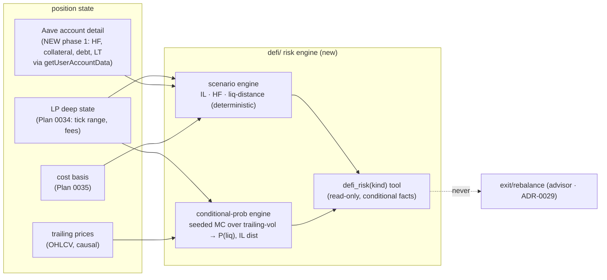

# 0042 — DeFi position risk & forecast (conditional facts)

> **Status:** done (closed 2026-07-19) — all 4 `dev` phases on `main`, no branch, no migration, no new dependency (stdlib-only MC). `4698fc8` ph1 Aave v3 `getUserAccountData` eth_call adapter (`AaveAccountSource`, decode self-checked vs keccak, no-debt→`None`) → `111aa0c` ph2 deterministic scenario engine (Aave HF/liquidation-distance + constant-product LP IL, all hand-computed) → `b2100dc` ph3 seeded conditional-probability engine (trailing-vol MC, zero-drift, assumption on every result) → `fb00eff` ph4 discriminated `defi_risk(kind)` tool + `AaveAccountSource` wiring (mirrors `RpcLpDetailAdapter`) → `f8a75c9` apiref regen. **Clean Mode 4 — no blockers/majors/minors.** All four ADR-0037 invariants (no market view / determinism / honest uncertainty / no exit-rebalance) are each pinned by a real assertion read at close; the no-advice scan covers both the description and a full dual-leg payload. 62 targeted tests green, `mypy --strict` clean on all four new modules. **Accepts [ADR-0037](../adrs/0037-defi-position-risk-forecast.md).** Documented follow-ups (not gaps): per-asset Aave shocks (whole-account read is blended), LP auto-discovery/pricing (LP numbers caller-supplied). **The portfolio chain's risk half is done; Plan 0043 (UI) renders what 0041 + 0042 produce.**
> **Created:** 2026-06-05
> **Owner skill(s):** dev
> **Related ADRs:** [ADR-0037](../adrs/0037-defi-position-risk-forecast.md) (this engine — accepts at close), [ADR-0034](../adrs/0034-defi-portfolio-aggregator.md) (the deep on-chain state scenarios depend on — the new phase 1 completes its lending half), [ADR-0031](../adrs/0031-data-source-adapter-contract.md) (the adapter contract the new Aave source implements), [ADR-0038](../adrs/0038-third-party-api-key-storage.md) (the RPC-URL secret the Aave adapter reads), [ADR-0019](../adrs/0019-external-http-adapter-resilience.md) (the resilient-HTTP layer the eth_call rides), [ADR-0036](../adrs/0036-defi-pnl-reconstruction.md) (cost basis scenarios value against), [ADR-0018](../adrs/0018-backtest-result-schema.md) (the determinism contract the simulation mirrors), [ADR-0030](../adrs/0030-forecasting-subsystem.md) (the market-forecasting subsystem this is deliberately *distinct* from), [ADR-0029](../adrs/0029-advisory-recommendation-boundary.md) (the recommend line this stays on the report side of)
> **Related plans:** [Plan 0034](done/0034-defi-deep-lp-detail.md) (deep state — prereq: closed 2026-06-05, but shipped **LP concentrated-liquidity deep state only** — `defi/enrichment.py` folds tick range + uncollected fees onto LP positions; it did **not** ship Aave lending deep state (HF/collateral/debt/liquidation-threshold), which this plan's **new phase 1** adds — see [Amendments](#amendments)), [Plan 0035](done/0035-defi-pnl-reconstruction.md) (cost basis — prereq, **satisfied**: closed), [Plan 0041](done/0041-cross-venue-portfolio-aggregation.md) (holdings this runs over — closed)

## TL;DR

We add the **DeFi risk/forecast engine** in `src/market_analyser/defi/` ([ADR-0037](../adrs/0037-defi-position-risk-forecast.md)), producing two kinds of **conditional facts** about a position — never a market view, never an action: **(1) deterministic scenario sensitivity** (given a supplied price move, recompute IL, value, Aave health factor, liquidation distance via position math) and **(2) conditional probabilistic risk** (seeded Monte Carlo over a trailing-vol model → probability of liquidation within N days, IL distribution — every number stating its vol assumption). Surfaced via one read-only discriminated `defi_risk(kind=…)` tool ([ADR-0104](../adrs/0104-mcp-tool-surface-granularity.md)). First user-visible behavior: an agent asks "if ETH −30%, what happens to this position" and gets HF/IL/liquidation-distance from unit-testable math, plus "≈X% liquidation in 30d *under realized-vol-from-the-last-90-days*" with the assumption attached.

## Amendments

- **2026-07-19 (architect) — added an Aave v3 deep-state adapter as the new phase 1.** Dev found, at phase-1 start, that the Aave health-factor / liquidation-distance math this plan promised has **no input source**: [Plan 0034](done/0034-defi-deep-lp-detail.md) shipped only LP concentrated-liquidity deep state (`enrichment.py` folds tick range + uncollected fees), never Aave lending deep state, and `DefiPosition` carries no HF / collateral / debt / liquidation-threshold for `lending_supply`/`lending_borrow`. The prior header wrongly called Plan 0034 "tick/HF/debt fields shipped" — corrected above. **Resolution (user-chosen over supplied-param inputs or an LP-only phase 1):** add a new **phase 1** that reads Aave v3 `Pool.getUserAccountData(user)` over the RPC (the depth half [ADR-0037](../adrs/0037-defi-position-risk-forecast.md)/[ADR-0034](../adrs/0034-defi-portfolio-aggregator.md) always assumed), producing an `AaveAccountDetail`; the scenario engine (now phase 2) consumes it. The original three phases shift to 2/3/4. **No new ADR** — this completes ADR-0034's deep-read intent under the [ADR-0031](../adrs/0031-data-source-adapter-contract.md) adapter contract, mirroring the existing eth_call adapters (`lp_detail.py`, `gauge_resolution`, `aerodrome_native`); no new durable tradeoff. **Scope:** whole-account `getUserAccountData` (it returns `healthFactor`, `currentLiquidationThreshold`, `totalCollateralBase`, `totalDebtBase` directly, enough for a blended-collateral shock). **Per-asset** liquidation thresholds / asset-specific shocks (via `getReserveConfigurationData` + per-reserve balances) are a **documented follow-up**, not in this plan — so the "if ETH −30%" example is a shock to the position's collateral value, exact for a single-collateral position and a blended move for a multi-collateral one.

## Context & problem

"Forecast the future of positions and risks" was the most charter-sensitive part of the ask. [ADR-0037](../adrs/0037-defi-position-risk-forecast.md) resolved the shape: this is **not** [ADR-0030](../adrs/0030-forecasting-subsystem.md)'s market forecasting (which predicts *direction* and is gated by walk-forward-beats-baseline). It forecasts *the position given assumed moves* — the scenario engine asserts **no market view** (deterministic math on a supplied shock), and the probabilistic layer is explicitly conditional on a stated vol model. There is no directional claim to validate; correctness is unit-testable position math, and the probabilities are honest about their assumptions. The engine **never** emits exit/rebalance (that is [ADR-0029](../adrs/0029-advisory-recommendation-boundary.md)'s advisor). Prereqs: the deep on-chain state ([Plan 0034](done/0034-defi-deep-lp-detail.md) — **shipped**, closed 2026-06-05) for accurate current HF/debt/collateral, and the cost basis ([Plan 0035](done/0035-defi-pnl-reconstruction.md) — **shipped**, closed) scenarios value against. **Both prereqs are satisfied — this plan is runnable.**

## Decision

We implement a `defi/` risk engine with two outputs framed as conditional facts: a **deterministic scenario engine** (IL formula, Aave HF formula, liquidation distance, as pure functions of an assumed price move) and a **seeded conditional-probability engine** (trailing-vol-fit → Monte Carlo / analytic liquidation probability + IL distribution, each carrying its vol assumption). Both surfaced via one read-only discriminated `defi_risk(kind=…)` tool ([ADR-0104](../adrs/0104-mcp-tool-surface-granularity.md)), both on the [ADR-0015](../adrs/0015-claude-code-primary-control-surface.md) facts side. We reject treating this as an [ADR-0030](../adrs/0030-forecasting-subsystem.md) instance (walk-forward gate is category-mismatched — [ADR-0037](../adrs/0037-defi-position-risk-forecast.md) Alt A), reject scenario-only (the user wanted likelihoods too — Alt B), and reject any exit/rebalance output (Alt C — advisor's job).

## Architecture diagram

## Implementation phases

### Phase 1 — Aave v3 deep-state adapter (added 2026-07-19)
- **Owner skill:** dev
- **What:** A read-only on-chain adapter reading Aave v3 `Pool.getUserAccountData(user)` via `eth_call` over JSON-RPC → a new `AaveAccountDetail` model: the lending depth ([ADR-0034](../adrs/0034-defi-portfolio-aggregator.md)) Plan 0034 shipped for LP but not lending. Mirror the existing eth_call adapters (`data/adapters/lp_detail.py`, `gauge_resolution.py`, `aerodrome_native.py`): a new `AaveAccountSource` Protocol (`data/sources.py`, [ADR-0031](../adrs/0031-data-source-adapter-contract.md)); calls through the shared `ResilientHttpClient` ([ADR-0019](../adrs/0019-external-http-adapter-resilience.md)); the per-chain RPC URL read **lazily** from `SecretsStore` ([ADR-0038](../adrs/0038-third-party-api-key-storage.md)) so the adapter constructs before a URL exists and a keyless read fails typed, never at construction; no cache (deep state is live, like `lp_detail`). Decode the 6 return words with correct scaling: `totalCollateralBase`/`totalDebtBase`/`availableBorrowsBase` are base-currency (Aave v3 USD base, 8 decimals → `/1e8`), `currentLiquidationThreshold`/`ltv` are bps (→ `/10000`), `healthFactor` is WAD (→ `/1e18`); a **no-debt** account returns `healthFactor = type(uint256).max` → carry as `None` (undefined, never a fabricated number). Pin the canonical Aave v3 `Pool` address per supported `Chain` as constants with a source reference (dev verifies each). **Note:** `getUserAccountData` is a per-(wallet, chain) **aggregate** read, so `AaveAccountDetail` is a wallet+chain fact, **not** a per-position fold (contrast LP enrichment); the per-chain orchestration over a position set lives in phase 4.
- **Files touched:** `src/market_analyser/data/adapters/aave_account.py`, `src/market_analyser/data/sources.py` (new `AaveAccountSource` Protocol), `src/market_analyser/defi/models.py` (new `AaveAccountDetail`), `tests/data/test_aave_account_adapter.py`.
- **Done when:** Given a monkeypatched transport returning a known `getUserAccountData` hex result, the adapter decodes it into an `AaveAccountDetail` with correct base/bps/WAD scaling and no-debt → `health_factor=None`; the model boundary-validates (finite, non-negative) in the `DefiPosition` house style; a missing RPC URL / unsupported chain fails typed (a config error), a revert / shape-broken result raises a typed decode error, a 429/5xx maps to the shared `RateLimitedError`/`UpstreamUnavailableError`; deterministic; issues no request when unkeyed; offline (no live RPC in CI).

### Phase 2 — Deterministic scenario sensitivity
- **Owner skill:** dev
- **What:** Pure functions recomputing a position's impermanent loss, value, Aave health factor, and liquidation distance for a **supplied** price move on the underlying(s). LP IL + value come from the LP position (token amounts + tick range, [Plan 0034](0034-defi-deep-lp-detail.md)); Aave HF + liquidation distance come from the **`AaveAccountDetail`** (phase 1) under a supplied shock `s` to collateral value: `HF' = totalCollateral·(1+s)·LT / totalDebt`, with liquidation distance the collateral drop bringing HF to 1 (the identity `1 − 1/HF` at `s=0`).
- **Files touched:** `src/market_analyser/defi/scenario.py`, `tests/defi/test_scenario.py`.
- **Done when:** Given an `AaveAccountDetail` (or LP position) and a supplied shock (e.g. ETH −30% / collateral −30%), the engine returns IL, new value, new HF, and liquidation distance by the documented formulas; results are **unit-tested against hand-computed known inputs** (correctness is provable, not statistical); a no-debt account yields an undefined (`None`) HF and unbounded liquidation distance (documented); the engine asserts **no** market view (a supplied shock is an input, never a prediction — a test/comment makes this explicit); deterministic.

### Phase 3 — Conditional probabilistic risk
- **Owner skill:** dev
- **What:** A **seeded** Monte Carlo / analytic engine over a **trailing** realized-vol fit producing probability of liquidation within N days and an IL distribution, each output carrying its explicit vol assumption. Implemented with the **standard library only** — `random.Random(seed)` + `math`/`statistics` (decision 2026-07-19) — no new dependency, so determinism stays trivial and there is no cooldown/pin/`uv lock` churn.
- **Files touched:** `src/market_analyser/defi/risk.py`, `tests/defi/test_risk.py`, `tests/defi/test_risk_determinism.py`.
- **Done when:** A liquidation-probability estimate is reproducible across two runs with the same seed (determinism test, mirroring [ADR-0018](../adrs/0018-backtest-result-schema.md)); the vol model is fit on **trailing** data only (causal — a test asserts no future price informs the fit); every probability output **states its assumption** ("under realized-vol-from-last-90-days") and a bare probability without the assumption fails a presentation test.

### Phase 4 — Risk tool (conditional-facts surface)
- **Owner skill:** dev
> **Amended 2026-07-15 ([ADR-0104](../adrs/0104-mcp-tool-surface-granularity.md)):** the two conceptual reads (scenario sensitivity + conditional probability) are two *modes* of one verb → ship **one** `defi_risk(kind="scenario"|"conditional", …)` tool with a discriminated result, **not** two top-level tools. `EXPECTED_FULL_TOOLSET` +1 (not +2).
- **What:** One read-only MCP tool surfacing scenario sensitivity and conditional risk for a position/portfolio, framed strictly as conditional facts, discriminated by `kind`. It **orchestrates the phase-1 Aave read**: for the wallet's `lending_*` positions it fetches `AaveAccountDetail` per chain via the `AaveAccountSource` (grouped by chain — the aggregate read is per (wallet, chain)), then runs the phase-2/3 engines. Wire the `AaveAccountSource` into the composition root behind the secrets store, exactly as `RpcLpDetailAdapter` is wired (`{"rpc": ...(secrets_store=...)}` in `app.py`/`mcp_app.py`); absent an RPC URL the source is simply unavailable and the tool reports the Aave leg as unpriceable, never fabricated.
- **Files touched:** `src/market_analyser/api/mcp_tools/defi_risk.py`, `src/market_analyser/api/mcp_app.py` + `src/market_analyser/api/app.py` (registration + `AaveAccountSource` wiring), `tests/api/test_defi_risk_tools.py`, the full-toolset registration test (`tests/api/test_mcp_tools.py`, `EXPECTED_FULL_TOOLSET` +1).
- **Done when:** `defi_risk(kind="scenario")` returns IL/HF/liquidation-distance for a supplied shock, and `defi_risk(kind="conditional")` returns liquidation probability + IL distribution with assumptions attached; a test asserts the outputs contain **no** exit/rebalance/de-risk language (the [ADR-0037](../adrs/0037-defi-position-risk-forecast.md) invariant-4 boundary); the tool is in the full-toolset assertion (`EXPECTED_FULL_TOOLSET` +1). This phase's close **accepts [ADR-0037](../adrs/0037-defi-position-risk-forecast.md)**.

## Risks & open questions

- Risk: "12% chance of liquidation" reads as a prediction. Mitigation: the assumption-attached framing is a *presentation test*, enforced in every output and (Plan 0043) every UI surface.
- Risk: garbage-in vol model — a trailing fit is stale exactly when a regime breaks. Mitigation: the engine states the assumption; it cannot see a future shock — a documented limitation, not a bug.
- Risk: scenario accuracy depends on accurate current HF/debt/collateral. Mitigation: consume the deep on-chain state ([Plan 0034](0034-defi-deep-lp-detail.md)), not the aggregator's approximations.
- ~~Open question: simulation library.~~ **Resolved 2026-07-19: standard library only** (`random.Random(seed)` + `math`/`statistics`) — the simulation is simple enough that stdlib suffices, keeping the strict dependency discipline and adding no pinned dep (Phase 3).

## What this plan does NOT do

- **No exit/rebalance/de-risk recommendation** — advisor only ([ADR-0029](../adrs/0029-advisory-recommendation-boundary.md)).
- **No market-direction forecast** — that is [ADR-0030](../adrs/0030-forecasting-subsystem.md)/Plan 0036; this makes no directional claim.
- **No UI** — [Plan 0043](0043-portfolio-ui-surface.md).
- **No TradFi/CEX scenario math** — DeFi positions (IL/HF/liquidation) only; CEX futures liquidation risk is a possible later extension.

## Followups (after this lands)

- Portfolio UI risk panel ([Plan 0043](0043-portfolio-ui-surface.md)).
- **Per-asset Aave scenario shocks** (added 2026-07-19): phase 1 reads the whole-account `getUserAccountData` (blended-collateral shock). Asset-specific shocks (e.g. ETH −30% while stables hold) need per-reserve reads — `getReserveConfigurationData(asset)` for each reserve's liquidation threshold + the user's per-reserve aTokens/debtToken balances — to recompute the blended HF from the shifted per-asset collateral. A clean follow-up once the whole-account path lands.
- Optional CEX-futures liquidation-distance scenarios (the same conditional-facts framing applied to Binance positions).
