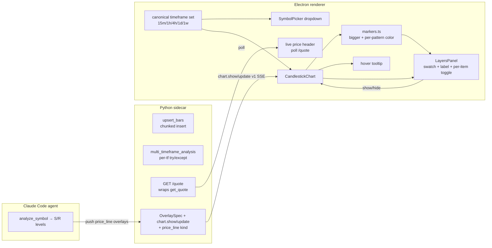

# 0047 — Smoke-run data-layer fixes + chart legend, timeframe & live-price UX

> **Status:** done — closed 2026-06-06. All 9 phases on `main`: `f283db8` chunk upsert (atomic, constant-derived chunk size) → `46f66ca` per-tf MTF degrade (typed error → null, non-typed propagates) → `0c53144` renderer `GET /quote` → `f9389ec` generic `price_line` overlay (single model + `model_validator`, `exclude_none` byte-compat) → `2bb95be` timeframe single-source (`lib/timeframes.ts`) → `d6098e8` live timeframe-independent price header → `15c35a5` strength-aware markers → `d083279` hover tooltips → `069b746` layers legend; plus e2e fix `6d07c7e`. Clean Mode 4 (no blockers): 53 Python + the named renderer unit suites + **21/21 Playwright e2e** green; every named spec value-asserting (atomic-rollback upsert via injected mid-batch failure, typed-vs-non-typed MTF split, `/quote` 401 cross-tenant + full error map, `price_line` round-trip with indicator overlay byte-unchanged, timeframe single-source guard, price header unchanged across 1h→1d, `markerVisual` strength→size/intensity scaling, crosshair tooltip, layer toggle add/remove + ephemeral reset; parity guard re-run live). One Major (architectural, non-blocking) + two minors logged as followups. No branch (on `main`); no paired ADR.
> **Created:** 2026-06-05
> **Owner skill(s):** dev, ui-builder
> **Related ADRs:** [0006](../adrs/0006-persistence-layout.md) (persistence), [0007](../adrs/0007-market-data-provider.md) (provider seam), [0008](../adrs/0008-desktop-shell-electron.md) (shell conventions), [0015](../adrs/0015-claude-code-primary-control-surface.md) (agent-driven renders), [0017](../adrs/0017-live-ui-updates-via-sse.md) (SSE), [0019](../adrs/0019-external-http-adapter-resilience.md) (live quote / `get_quote`), [0023](../adrs/0023-technical-analysis-surface.md) (analysis surface), [0028](../adrs/0028-timeframe-resampling-and-expansion.md) (timeframe registry), [0039](../adrs/0039-renderer-theming-localstorage.md) (theming)

## TL;DR

A full BTC smoke run on 2026-06-05 (see the `project-smoke-btc-two-data-layer-bugs` memory) plus a viewer walkthrough surfaced five defects and a chart-UX request, batched here. **Data layer:** (1) `upsert_bars` builds one giant `INSERT … VALUES` and crashes with `too many SQL variables` on large intraday backfills — chunk it; (2) `multi_timeframe_analysis` fails the *whole* call when one timeframe's upstream fetch errors — degrade that timeframe to `null`. **Viewer:** (3) the timeframe dropdown offers `5m`/`1m` (unsupported) and omits the real `15m`/`4h`/`1w` — source it from the canonical registry; (4) the displayed "current price" is the last bar's close, so it *changes* when you switch 1h→1d and is never live — add a renderer-facing live quote and a timeframe-independent price header; (5) markers are too subtle, on-chart annotations carry no label, and there's no way to see/toggle what each line is — bigger colored markers, hover tooltips, and a side **layers legend** (color swatch + label + per-item show/hide for overlays, markers, and S/R lines, which arrive via a new agent-pushed `price_line` overlay). First visible behavior: deep intraday backfills stop crashing, `multi_timeframe_analysis` returns partial results, the dropdown matches what the backend can actually fetch, the price reads live and stays put across timeframe switches, and the chart gets a readable, toggleable legend.

## Context & problem

The 2026-06-05 smoke run exercised all ~25 MCP tools against `BTC-USD`; a viewer walkthrough followed. Findings:

- **`upsert_bars` is not chunked.** `src/market_analyser/persistence/repository.py:58-104` builds a single `sqlite_insert(BarRow).values(payload)` over the entire payload — 10 bind variables per row. SQLite caps host parameters per statement (`SQLITE_MAX_VARIABLE_NUMBER`: 999 on older builds, 32 766 on ≥ 3.32). A multi-month intraday window exceeds the cap → `sqlite3.OperationalError: too many SQL variables`, the write dies mid-batch, and `get_ohlcv` returns an error with the cache half-warmed.
- **`multi_timeframe_analysis` fails the whole call on one timeframe's upstream error.** The pure core (`analysis/multi_timeframe.py`) already maps empty bars to a `None` snapshot, and the tool's description promises "null when nothing is cached." But the tool body (`api/mcp_tools/multi_timeframe_analysis.py:104-107`) calls `provider.get_ohlcv` per timeframe in a bare loop; a typed `UpstreamDataError` from one timeframe (the 15m intraday window hitting Yahoo's range limit — `HTTP 422`; see `project_yahoo_adapter_relative_range_only`) propagates and fails every timeframe.
- **The timeframe dropdown is stale.** `desktop/renderer/components/SymbolPicker.tsx:18` hardcodes `TIMEFRAMES = ['1d', '1h', '5m', '1m']`. The data layer supports `15m, 1h, 4h, 1d, 1w` (`data/timeframes.py`, ADR-0028 / Plan 0025) — so `5m` and `1m` are selectable but unfetchable, while the genuinely-supported `15m`, `4h`, `1w` are absent. The SSE chart handler has the same rot: `handlers/chartHandlers.ts:58` coerces anything outside `{'1d','1h'}` to `'1d'`. Both predate the timeframe expansion.
- **"Current price" is timeframe-dependent and not live.** The renderer has **no quote source** — there is no `GET /quote` route and no `getQuote` in `desktop/renderer/api/client.ts`; `quote_for` is an MCP (agent-only) tool. So the price the user reads is derived from the *last bar's close* of the selected OHLCV series. Switching 1h→1d swaps the last bar, so the price visibly changes; and it's as stale as the last cached bar, never live. The user wants one **current price** that is symbol-level (timeframe-independent) and updates live.
- **Chart annotations are hard to read/manage.** Pattern markers are too subtle, on-chart annotations show no label, and there's no legend to tell what each colored line is or to toggle layers. The viewer is agent-driven (ADR-0015): the renderer draws what the agent pushes via `show_chart`/`update_chart` overlays (ADR-0017 SSE). Today `OverlaySpec.kind` is a closed literal `ema | sma | rsi | macd | bbands`, so support/resistance levels have no channel to reach the chart at all.

## Decision

Ship one mixed-owner plan: four `dev` phases (two bug fixes, a live-quote route, a generic `price_line` overlay) then five `ui-builder` phases (timeframe dropdown, live-price header, marker visibility, hover tooltips, layers legend). Cross-skill handoff at the phase-4/5 boundary; single working tree, no migration touched.

- **Upsert:** chunk `payload` by a conservative bind-variable budget (≤ ~900 vars ⇒ ~90 rows/statement, safe on the 999-cap build), all chunks in one transaction (atomicity preserved).
- **Degradation:** wrap each per-timeframe `provider.get_ohlcv` in a `try/except` over the typed data-layer error family; on a typed error record `[]` (rendered as a `None` snapshot) and continue. Non-typed exceptions still propagate.
- **Live quote for the renderer:** add a renderer-bearer-gated `GET /quote?symbol=` route wrapping the existing `provider.get_quote` (the `YahooQuoteAdapter` behind `quote_for`/`market_snapshot`, ADR-0019), plus a typed `api.getQuote` client method. The price header polls it (the existing `useAnnotationsPoll`/`useBackfillState` pattern; quotes are wall-clock-live with no SSE producer, so a light poll fits). We rejected putting a quote producer on the SSE bus as heavier than the symptom warrants.
- **Timeframe vocabulary:** drive the dropdown (and the chart-handler allowlist) from a single canonical renderer constant mirroring `data/timeframes.py`'s supported set, ideally a generated type so it can't drift again.
- **S/R delivery:** add a generic `price_line` overlay kind (`price`, `label`, optional `role`) to `OverlaySpec` + `chart.show/update` payloads, so the **agent** pushes S/R levels it got from `analyze_symbol`. We rejected a renderer-side `analyze_symbol` fetch (puts analysis + a new data dependency in the renderer, against ADR-0015) and a narrower `support_resistance` kind (a generic price-line is reusable).
- **Legend + markers + tooltips** live entirely in renderer state (ephemeral, per the user's choice): no schema, no IPC, no persisted prefs. Marker and swatch colors read the ADR-0039 theme tokens so the legend's swatch truly matches the drawn line.

## Architecture diagram



## Implementation phases

`dev` runs phases 1–4 in one session, then hands off to `ui-builder` for phases 5–9 (cross-skill handoff at the phase-4/5 boundary). Single working tree, no migration touched.

### Phase 1 — Chunk the bar upsert
- **Owner skill:** `dev`
- **What:** Batch `upsert_bars`' insert so no single statement exceeds SQLite's host-parameter cap, inside one transaction.
- **Files touched:** `src/market_analyser/persistence/repository.py`; test alongside the existing repo test.
- **Done when:** A test that upserts a payload larger than the bind-variable budget (e.g. 5 000 synthetic bars) completes and `get_bars` reads them all back; chunk size derives from a named constant (≈ 900 variables ÷ column count), not a magic number; all chunks commit atomically (an injected mid-batch failure rolls back the whole upsert — assert no partial write). Re-running the BTC 4h/1h multi-month backfill returns bars instead of `too many SQL variables`.

### Phase 2 — Per-timeframe graceful degradation in `multi_timeframe_analysis`
- **Owner skill:** `dev`
- **What:** Make one timeframe's typed upstream/data error a gap (`None` snapshot), not a whole-call failure, matching the tool's documented contract.
- **Files touched:** `src/market_analyser/api/mcp_tools/multi_timeframe_analysis.py`; test alongside.
- **Done when:** A unit test with a provider stub that raises a typed `UpstreamDataError` for one timeframe (e.g. `15m`) and returns bars for the others yields a response whose alignment has a `null` snapshot for the failing timeframe, real snapshots for the rest, and `agreement` computed only over available timeframes; a non-typed `Exception` still propagates (asserted). The behavioral claim defended is "one timeframe's upstream 422 degrades to null, it does not fail the call."

### Phase 3 — Renderer-facing live quote route
- **Owner skill:** `dev`
- **What:** A renderer-bearer-gated `GET /quote?symbol=` returning the live quote, wrapping the existing `provider.get_quote` (ADR-0019).
- **Files touched:** new `src/market_analyser/api/routes/quote.py` (+ register it), a frozen `QuoteResponse` envelope, route test; renderer types via `pnpm --filter desktop gen-types`.
- **Done when:** `GET /quote?symbol=BTC-USD` with the renderer bearer returns `{ price, change_pct, currency, as_of, … }` for a stubbed provider and `401` without the bearer; an `unknown_symbol`/upstream failure maps to a typed error response (not a 500); `gen-types:check` shows the new `QuoteResponse` type with no drift. (No SSE producer — the renderer polls this route in phase 6.)

### Phase 4 — Generic `price_line` overlay kind (S/R delivery channel)
- **Owner skill:** `dev`
- **What:** Extend `OverlaySpec` and the `chart.show`/`chart.update` payloads with a `price_line` overlay (`price`, `label`, optional `role` ∈ {support, resistance}), so the agent can push horizontal lines (S/R from `analyze_symbol`).
- **Files touched:** `src/market_analyser/api/mcp_tools/show_chart.py` (+ `update_chart.py` if `OverlaySpec` is shared), the `chart.show/update v1` payload schema; renderer types via `gen-types`.
- **Done when:** `show_chart` accepts `{"kind":"price_line","price":61335.75,"label":"R1","role":"resistance"}` and publishes it on `chart.show v1` without a validation error; a schema test asserts the new kind round-trips; `gen-types:check` shows the new kind with no drift; existing `ema/sma/rsi/macd/bbands` overlays unchanged.

### Phase 5 — Fix the timeframe dropdown (canonical vocabulary)
- **Owner skill:** `ui-builder`
- **What:** Source the dropdown (and the chart-handler allowlist) from a single canonical timeframe set matching the backend (`15m, 1h, 4h, 1d, 1w`); drop `5m`/`1m`.
- **Files touched:** `desktop/renderer/components/SymbolPicker.tsx` (the `TIMEFRAMES`/`Timeframe` source), `desktop/renderer/handlers/chartHandlers.ts` (`KNOWN_TIMEFRAMES`), a shared constant/type (prefer a generated one from `data/timeframes.py`), and the affected tests (`SymbolPicker.test.tsx`, `chartHandlers.test.ts`, `App.tsx` default if it referenced a dropped value).
- **Done when:** The dropdown renders exactly the supported set and `5m`/`1m` are gone (asserted); `chartHandlers` no longer coerces `15m`/`4h`/`1w` to `1d` (asserted for each); selecting `4h`/`15m`/`1w` loads bars end-to-end; the canonical set lives in one place (a second stale copy would fail a "single source" assertion / `gen-types:check`).

### Phase 6 — Live, timeframe-independent current-price header
- **Owner skill:** `ui-builder`
- **What:** A price header that shows one **current price** for the active symbol, fed by polling `GET /quote`, independent of the selected timeframe and refreshing live.
- **Files touched:** new `desktop/renderer/hooks/useQuotePoll.ts` (+ test) and a `PriceHeader` element in `OhlcvView.tsx` (+ test); `api/client.ts` `getQuote`.
- **Done when:** With a stubbed `/quote`, the header shows the quote's `price` (and change %), and **does not change when the timeframe switches 1h→1d** (asserted — the value tracks the quote, not the last bar); the value refreshes on a poll tick (asserted via a second stubbed response); a failed quote degrades to a dash/last-known, never a crash; "current price" no longer derives from `bars[bars.length-1].close`.

### Phase 7 — Make pattern markers more visible
- **Owner skill:** `ui-builder`
- **What:** Larger pattern-marker glyphs, color/intensity driven by direction and pattern `strength`, reading ADR-0039 theme tokens.
- **Files touched:** `desktop/renderer/lib/markers.ts` (+ `markers.test.ts`); `CandlestickChart.tsx` if sizing is set at series level.
- **Done when:** `markers.test.ts` asserts a strong bearish marker (strength 0.99) maps to a larger size and a more-intense bearish token than a weak/neutral one, and bullish vs bearish resolve to the bullish/bearish theme tokens (not hardcoded hex); the `__test_chart_render__` gate stays green; marker colors recolor in place on a theme flip (no remount, per Plan 0033).

### Phase 8 — Hover tooltips for annotations and overlay lines
- **Owner skill:** `ui-builder`
- **What:** A crosshair-move tooltip showing a pattern marker's label when hovering its bar, and an overlay line's name/value when hovering it.
- **Files touched:** `CandlestickChart.tsx`, a small `ChartTooltip` component + a `lib/` helper mapping crosshair time → nearest marker/overlay; tests alongside.
- **Done when:** A renderer test simulates `subscribeCrosshairMove` at a bar carrying a persisted annotation and asserts the tooltip content contains that annotation's `label`; hovering away clears it; the tooltip reads from data already in renderer state (no new sidecar call); tooltip state is ephemeral.

### Phase 9 — Layers legend side panel (per-item toggles)
- **Owner skill:** `ui-builder`
- **What:** A side panel listing every active layer — indicator overlays, pattern-marker annotations (grouped), and `price_line`/S&R lines — each row with a color swatch matching the drawn color, the layer label, and a per-item checkbox that shows/hides that layer. Ephemeral renderer state.
- **Files touched:** new `desktop/renderer/components/LayersPanel.tsx` (+ test), `CandlestickChart.tsx` (apply per-layer visibility), `lib/overlays.ts` / `lib/markers.ts` (expose a layer descriptor: id, label, color, kind), `App.tsx` layout slot.
- **Done when:** With ≥ 2 overlays, ≥ 1 marker annotation, and ≥ 1 `price_line`, the panel renders one row per layer; each row's swatch color equals the color used to draw that layer (assert swatch token === series/marker token); unchecking a row hides exactly that layer and leaves the others (assert the series/marker/price-line is removed and re-added on re-check); toggle state resets on reload (ephemeral — asserted by remount); no sidecar/IPC/schema changes in this phase.

## Data shapes

```python
# illustrative — Phase 4 OverlaySpec extension (sidecar)
class PriceLineOverlay(BaseModel):
    kind: Literal["price_line"]
    price: float
    label: str
    role: Literal["support", "resistance"] | None = None
# OverlaySpec becomes a discriminated union over `kind`:
#   ema | sma | rsi | macd | bbands  (existing)  |  price_line  (new)
```

```ts
// illustrative — Phase 6 quote shape (renderer, from GET /quote)
type Quote = { symbol: string; price: number; change_pct: number | null; currency: string; as_of: string }

// illustrative — Phase 9 renderer layer descriptor (ephemeral, renderer-only)
type ChartLayer = {
  id: string;            // "overlay:ema:50" | "marker:<annId>" | "pline:R1"
  label: string;
  color: string;         // resolved theme-token color === the drawn color
  kind: "overlay" | "marker" | "price_line";
  visible: boolean;      // per-item toggle; defaults true; not persisted
}
```

## Risks & open questions

- **SQLite cap is build-dependent.** Sizing to ~900 variables is safe on both the 999 and 32 766 builds; document the constant as "conservative for the 999-cap build," deriving it as `budget // column_count`.
- **The 422 has two layers.** Phase 2 only makes `multi_timeframe_analysis` *tolerate* the 15m upstream rejection; it does not fix why Yahoo returns 422 on that intraday window (the relative-range limitation in `project_yahoo_adapter_relative_range_only`). That remains a separate, architect-gated data-layer question — out of scope here.
- **Quote poll cadence.** A live quote with no SSE producer means a poll; too-frequent polling hammers Yahoo and the cooldown-free quote path. Pick a modest interval (≈ 10 s) and pause when the tab/window is hidden. If a future plan adds a quote SSE producer, the header can switch to it.
- **Timeframe single-source.** The cleanest fix generates the renderer's timeframe set from `data/timeframes.py` so it can't re-drift; if that generation path doesn't exist yet, a single hand-maintained constant is acceptable but should carry a comment pointing at the registry as the source of truth.
- **S/R freshness.** Agent-pushed `price_line` overlays are point-in-time; they don't auto-update as bars arrive (the agent re-pushes on the next `update_chart`). Note it in the legend label if it confuses.

## What this plan does NOT do

- **No Yahoo intraday-range fix.** Tolerating the 422 is in scope; preventing it is a separate data-layer plan.
- **No quote SSE producer.** The live price polls `GET /quote`; a push-based quote stream is deferred.
- **No persisted UI preferences.** Toggle/tooltip/price-header state is ephemeral renderer state; remembering hidden layers across reloads is deferred.
- **No new annotation *kinds* or a user line-drawing tool.** Markers stay `bullish_marker`/`bearish_marker`; `price_line` is an agent-pushed overlay, not a persisted user-drawn annotation.
- **No new timeframes.** Phase 5 only aligns the dropdown to the *existing* supported set; adding `5m`/`1m`/`30m` to the data layer would be a separate plan.

## Followups (after this lands)

- (empty at draft time)
