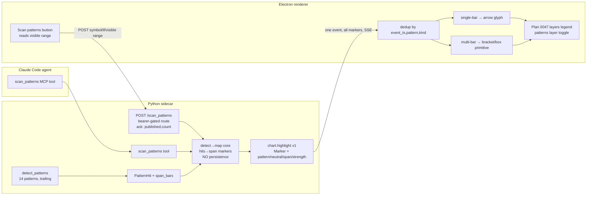

# 0049 — Chart workstream: pattern sweep + spans, view-stability fixes, live price & Supertrend overlay

> **Status:** done — closed 2026-06-06. All 13 phases on `main` (`d85121f`→`30e1ddf`): `dev` 1–5 (`PatternHit` span + resolver → additive `Marker` schema with `pattern`/`span`/`strength`/`neutral_marker` → pure `analysis/markers.py` core + `scan_patterns` MCP tool → renderer-gated `POST /scan_patterns` → `supertrend` `OverlaySpec` kind), `ui-builder` 6–13 (TS mirror + dedup-by-`(event_ts,pattern,kind)` → multi-bar span band via lightweight-charts `ISeriesPrimitive` (v4.2.3) → "Scan patterns" visible-range button → client-side Supertrend pinned 1e-6 to the Python indicator → live forming-bar from the `/quote` poll → 3 fixes: overlay-toggle keeps the view, candle/label legibility, tooltip edge-flip). Clean Mode 4 — no blockers. ADR-0045 accepted at this close. Verified: 120 named Python + 344 renderer tests, `mypy --strict`, `ruff`, `gen-types --check` (no drift) all green; assertion bodies read (trailing span resolve, the same-bar doji/hammer collision fix at mapper *and* reducer, the route↔tool identical-markers guarantee, the Supertrend fixture pin + flip, the forming-bar no-lookahead guards, the `fitContent`-only-on-data-change guard, the visible-range scan, the tooltip corner-clamp). One **Major (non-blocking)**: the phase-6/7 god-component decomposition the plan asked for was not done — `CandlestickChart.tsx` grew ~743→933 (helper math went to `lib/` but new orchestration landed inline); re-logged as an open follow-up. Two nits (stale `events.test.ts` docstring; dual timeframe-validation source). No branch (committed on `main`).
> **Created:** 2026-06-06
> **Scope expanded 2026-06-06** (still pre-implementation): folded in four chart bug/UX fixes, a live forming-bar update, and a Supertrend chart overlay from the post-0047 viewer walkthrough. Originally a pattern-sweep-only plan; bundled here because every item touches the same chart files (`CandlestickChart.tsx`, `markers.ts`, `chartHandlers.ts`, `OverlaySpec`) and this plan is chart-file-serial regardless — landing them together avoids repeated serial churn.
> **Owner skill(s):** dev, ui-builder
> **Related ADRs:** [0045](../adrs/0045-candlestick-pattern-span-delivery.md) (this plan's paired ADR — accepts at close), [0023](../adrs/0023-technical-analysis-surface.md) (the `analysis/` pattern + indicator surface, incl. `supertrend`), [0017](../adrs/0017-live-ui-updates-via-sse.md) (SSE), [0015](../adrs/0015-claude-code-primary-control-surface.md) (agent-driven renders), [0039](../adrs/0039-renderer-theming-localstorage.md) (theme tokens), [0006](../adrs/0006-persistence-layout.md) (persistence — the derived-not-persisted call). No new ADR: the Supertrend overlay kind is additive to `OverlaySpec` (like `price_line` in Plan 0047, which needed none) and the live forming-bar is renderer-local (like the `/quote` poll).

## TL;DR

Two workstreams against the chart, bundled because they share files and this plan is chart-serial anyway.

**Workstream A — pattern sweep + spans.** A smoke run showed candlestick patterns appear **only once** on the chart even when many exist in view. Root cause: the only path from `detect_patterns` to the chart is the agent tool `highlight_pattern`, which emits **one** marker per call — there is no "sweep the range and emit every pattern" path — and the marker model is lossy (binary `kind`, so doji/neutral can't be represented and two same-bar/same-direction patterns dedup into one; no span, so a 3-bar morning star is a single arrow). This adds a `scan_patterns` MCP tool **and a renderer-facing `POST /scan_patterns` route behind a "Scan patterns" UI button**, either of which detects every pattern in a range and publishes them all in one `chart.highlight` event; extends the marker model to carry first-class pattern identity + neutral direction + an optional bar span ([ADR-0045](../adrs/0045-candlestick-pattern-span-delivery.md)), fixes the renderer dedup collision, and renders multi-bar patterns as a **span bracket/box**.

**Workstream B — chart correctness & capability** (from the 2026-06-06 walkthrough): (1) toggling an indicator overlay **resets the chart view** (zoom/pan) — the bars effect refits on a visibility change; (2) candlesticks read as **almost invisible** and marker **labels have no backing**; (3) the hover tooltip **clips off-screen** past the right/bottom edge on small windows; (4) the price is live in the header but the **chart's last bar only updates on Refresh** — feed the already-polled `/quote` into the forming bar; and (5) **Supertrend can't be drawn** — it exists in `analysis`/strategy/backtest but isn't an `OverlaySpec` kind, so add it as a chart overlay (computed client-side like `ema`/`sma`, pinned against the Python reference).

First visible behavior: one agent call **or one button click** surfaces every pattern in view (multi-bar ones as boxes, dojis/same-bar no longer swallowed); toggling indicators keeps the view put; candles and labels are legible; tooltips stay on-screen; the chart price ticks live; and the agent can push a Supertrend overlay that draws.

## Context & problem

### Workstream A — pattern sweep (the 2026-06-05 smoke)

Tracing both sides (`src/market_analyser/analysis/patterns.py`, `src/market_analyser/events/__init__.py`, `desktop/renderer/`):

- **No bulk emission path.** `detect_patterns(bars)` finds all 14 patterns over a series and they ride inside `ConditionSnapshot.recent_patterns`, but **nothing turns that list into chart markers**. The sole detection→chart path is the agent tool `highlight_pattern` (`api/mcp_tools/highlight_pattern.py`), which publishes a single marker (`markers=[marker]`). Seeing "all patterns in range" would require the agent to call it once per pattern by hand. The renderer accumulation logic (`dedupHighlights`, `mergePolledAndLive`, `annotationsToMarkers`) is itself correct — it appends — so the deficit is purely upstream.
- **The marker model is lossy.** `Marker.kind` is `Literal["bullish_marker","bearish_marker"]` (`events/__init__.py`). Consequences: **neutral** patterns (doji, neutral marubozu) cannot be emitted at all; pattern identity exists only as free-text `label`; and the renderer dedup key is `(event_ts, kind)` everywhere, so a doji and a hammer on the same bar (same/neutral direction) collapse to one marker.
- **Multi-bar patterns lose their span.** `PatternHit` (`analysis/types.py`) carries only the completing `bar_index`. Six patterns span 2 bars and four span 3 bars, but every one renders as a single arrow on its last bar — the visual span is gone.
- **Spans are net-new rendering.** The renderer uses only standard lightweight-charts series — no `createPriceLine` line-primitive for ranges, no `ISeriesPrimitive`/primitives. `setMarkers` is point-in-time. A bracket/box over a bar range needs a custom rectangle primitive (or a canvas overlay mapping bar timestamps to pixels via the time scale). This is the plan's main implementation risk.

Workstream A is the natural follow-on to **Plan 0047**, which deliberately scoped this out (its "does NOT do" keeps markers `bullish_marker`/`bearish_marker` and colors per-pattern by parsing `label`). 0047 ships bigger per-pattern-colored markers (phase 7), hover tooltips (phase 8), and a layers legend (phase 9). **Workstream A builds on those** rather than redoing them.

### Workstream B — chart correctness (the 2026-06-06 walkthrough)

A viewer walkthrough after Plan 0047 closed surfaced four issues + one capability gap, all in the same chart files:

- **Indicator toggle resets the view.** `CandlestickChart.tsx:496` — the bars/overlay effect lists `hidden` in its dependency array and ends with `chart.timeScale().fitContent()` (`:492`). Toggling an indicator's legend checkbox mutates `hidden` → the whole effect re-runs → it refits, throwing away the user's zoom/pan. Markers (`:522`) and price-lines (`:553`) toggle in **separate** effects that do not refit, which is why only indicator overlays reset the view.
- **Candles almost invisible + marker labels have no backing.** Candle body/wick/border all draw from `colors.candleUp`/`candleDown` (`:337–343`); the result reads as near-invisible — either low token contrast (ADR-0039) or hairline candles from an over-wide default window. Separately, marker labels are lightweight-charts inline text with no background, illegible over candles.
- **Tooltip clips off-screen.** `ChartTooltip` positions at `left:x, top:y` with a fixed `translate(12px,12px)` and no edge awareness (`ChartTooltip.module.css`), so near the right/bottom border the (≤16rem) tooltip overflows the container.
- **Price live in header, not on the chart.** Plan 0047 added a live `/quote` poll feeding the header (`useQuotePoll`), but deliberately deferred a quote→chart producer ("the live price polls `/quote`; a push-based stream is deferred"). So the chart's last/forming bar only updates on Refresh. We now feed the already-polled quote into the forming bar — no new fetch, no server push.
- **Supertrend isn't renderable.** `analysis/indicators.py:310` implements `supertrend` (with a `SupertrendValue` type), it's in the condition snapshot + `analyze_symbol`, and there's a `strategies/supertrend.py`. But `OverlaySpec.kind` is `ema | sma | rsi | macd | bbands | price_line` and the renderer draws only `ema`/`sma` (rsi/macd/bbands are logged-and-skipped). So the agent cannot put Supertrend on the chart — net-new overlay work.

## Decision

**Workstream A** — per [ADR-0045](../adrs/0045-candlestick-pattern-span-delivery.md): deliver pattern sweeps as **span-bearing markers on the existing `chart.highlight` channel**, **derived, non-persisted**, triggerable from **both** the agent and the UI. A pure detect→map core feeds both a `scan_patterns` MCP tool and a renderer-facing `POST /scan_patterns` route, so the agent path and the UI path emit identical markers and can't drift. The marker extension is additive (`pattern`, `span_start_ts`, `span_end_ts`, `strength`, a `neutral_marker` kind); dedup keys on `(event_ts, pattern, kind)`; multi-bar patterns draw a bracket/box, single-bar keep the arrow. We rejected a dedicated `chart.patterns` event and persisting sweeps (ADR-0045 alternatives A/B), and rejected returning markers in the HTTP body (a second draw path) — both triggers publish on the bus and the renderer accumulates via its existing SSE path.

**Workstream B**:
- **Supertrend overlay — additive kind, client-side compute.** Add `supertrend` to `OverlaySpec.kind` (dev), and render it in the renderer by mirroring `indicators.supertrend` in TS — the same posture as `ema`/`sma`, which are already computed client-side. A chart overlay is **display only**, outside the determinism-critical backtest/metric/equity path, so a TS recompute is acceptable; the divergence risk is bounded by a **renderer fixture test pinning the TS output against known Python `supertrend` values**. This keeps the overlay model uniform (`kind` + params, renderer draws) and needs no new sidecar overlay-data channel and no ADR. We rejected a sidecar-precomputed-points delivery (new plumbing + a non-uniform overlay shape, for one indicator).
- **Live price — forming-bar update from the existing poll.** Feed the `/quote` the renderer already polls (Plan 0047 `useQuotePoll`) into the chart's current bar via `series.update()`: set the forming bar's close to the quote price and extend its high/low, **only** when the quote's `as_of` falls within the latest bar's period; **never** rewrite a closed/historical bar. Renderer-only, no new fetch, no lookahead (live current bar, not replay). We rejected a periodic `/ohlcv` auto-refetch (flickers the whole series, still cache-stale) and a quote→chart SSE producer (heaviest; same rejection as Plan 0047) — the user picked the forming-bar update.
- **The three bug fixes are corrections, not features:** the overlay-toggle view reset is fixed by reconciling overlay show/hide **without** `fitContent()` (fit only on a genuine data change); candle legibility by fixing the candle tokens/rendering and giving marker labels a backing; the tooltip clip by flipping the tooltip inside the container near the right/bottom edge.

Execution: **five `dev` phases** (the four pattern-sweep backend phases + the Supertrend `OverlaySpec` kind) then **eight `ui-builder` phases** (the three pattern-sweep UI phases + Supertrend rendering + live forming-bar + the three fixes). One cross-skill handoff at the phase-5/6 boundary. **No migration** (sweeps recomputed, never persisted; everything else is renderer-local or additive schema), single working tree.

## Architecture diagram

Workstream A (pattern sweep) — the cross-process path:



Workstream B is renderer-local (plus one additive `OverlaySpec.kind`); not separately diagrammed — the Supertrend overlay rides the existing `chart.show`/`chart.update` overlay path, and the live forming-bar update reuses Plan 0047's `/quote` poll.

## Implementation phases

`dev` runs phases 1–5 in one session, then hands off to `ui-builder` for phases 6–13 (cross-skill handoff at the phase-5/6 boundary). Single working tree, no migration touched. Phases 1–4 + 6–8 are workstream A (pattern sweep); phase 5 + 9–13 are workstream B.

### Phase 1 — Pattern span in the analysis layer
- **Owner skill:** `dev`
- **What:** Give every `PatternHit` an explicit bar span and a helper to resolve it to start/end
  timestamps against a bar series.
- **Files touched:** `src/market_analyser/analysis/types.py` (add a span notion to `PatternHit` —
  a `span_bars: int` count, or `start_bar_index`), `src/market_analyser/analysis/patterns.py`
  (each detector reports its statically-known span: 1/2/3), a small resolver helper; tests in
  `tests/analysis/test_patterns.py`.
- **Done when:** Each detected pattern reports the correct span — single-bar patterns
  (doji/hammer/hanging_man/marubozu) span 1, the six two-bar patterns span 2, the four three-bar
  patterns span 3 (asserted per pattern); the resolver maps a `PatternHit` + bars to
  `(start_ts, end_ts)` where `start_ts` is the timestamp of `bar_index - (span_bars - 1)` and
  `end_ts` is `bar_index`'s timestamp; the existing no-lookahead test still holds (a pattern at
  bar `i` reads only `bars[0..=i]`). The behavioral claim defended: "a 3-bar morning_star reports a
  3-bar span ending on its completing bar, derived only from trailing data."

### Phase 2 — Extend the `chart.highlight` marker schema
- **Owner skill:** `dev`
- **What:** Add first-class pattern identity, a neutral kind, an optional span, and strength to the
  `chart.highlight` marker — additively, keeping existing markers valid.
- **Files touched:** `src/market_analyser/events/__init__.py` (`Marker`: add `pattern: str | None`,
  `span_start_ts: datetime | None`, `span_end_ts: datetime | None`, `strength: float | None`; widen
  `kind` to include `neutral_marker`); schema round-trip tests alongside; renderer types regenerate
  is **not** automatic for hand-mirrored event types (done in phase 6).
- **Done when:** A `Marker` with `kind="neutral_marker"`, `pattern="doji"`, no span round-trips on
  `chart.highlight v1` without a validation error; a `Marker` with `span_start_ts`/`span_end_ts`
  round-trips; an existing `bullish_marker`-only marker (no new fields) still validates and serializes
  identically modulo the new optional fields (`exclude_none` keeps the wire clean); a span with
  `span_end_ts < span_start_ts` is rejected by a validator. The claim defended: "the highlight marker
  can carry a named, neutral, spanning pattern without breaking the existing binary point marker."
  *(This phase realizes [ADR-0045](../adrs/0045-candlestick-pattern-span-delivery.md); the ADR
  accepts at this plan's close.)*

### Phase 3 — Shared detect→map core + `scan_patterns` MCP tool (derived, not persisted)
- **Owner skill:** `dev`
- **What:** A pure mapper from a range's `PatternHit`s (over bars) to span-bearing markers, plus the
  `scan_patterns` MCP tool that fetches bars, maps, and publishes them all in one `chart.highlight`
  event — without writing any `Annotation` rows. The mapper is the shared core phase 4's route reuses.
- **Files touched:** the pure mapper (e.g. `src/market_analyser/analysis/patterns.py` or a small
  `analysis/` helper — `patterns_to_markers(hits, bars)`, no event/IO dependency, so layering stays
  clean); new `src/market_analyser/api/mcp_tools/scan_patterns.py`; register it in
  `src/market_analyser/api/mcp_app.py`; extend the full-toolset registration test
  (`tests/api/test_mcp_tools.py`) so a forgotten registration fails; tests alongside.
- **Done when:** the pure mapper turns a `PatternHit` list + bars into markers carrying `pattern`,
  the right `kind` (incl. `neutral_marker`), and resolved `span_start_ts`/`span_end_ts` for multi-bar
  ones (unit-tested in isolation, no event bus); `scan_patterns(symbol, timeframe, range_start,
  range_end)` with a stubbed provider whose bars contain N patterns (including a doji and two distinct
  same-bar patterns) publishes **exactly one** `chart.highlight` event whose `markers` has one entry
  per detected pattern; the optional `patterns: list[str] | None` and `min_strength: float | None`
  parameters filter the emitted set (asserted for each); **no `Annotation` row is written** (assert
  the repository is not a dependency); the tool is registered (full-toolset test green). The claim
  defended: "one `scan_patterns` call emits every in-range pattern as span-bearing markers in a single
  event via a reusable pure mapper, and persists nothing."

### Phase 4 — Renderer-facing `POST /scan_patterns` route (UI trigger backend)
- **Owner skill:** `dev`
- **What:** A renderer-bearer-gated `POST /scan_patterns` route that reuses phase 3's mapper to scan a
  supplied range and publish the same `chart.highlight` event the MCP tool does, returning a small ack.
- **Files touched:** new `src/market_analyser/api/routes/scan_patterns.py` (+ register it), a frozen
  request/response model (`ScanPatternsRequest{symbol, timeframe, range_start, range_end, patterns?,
  min_strength?}` → `ScanPatternsResponse{published: bool, count: int}`), route test; renderer types
  via `pnpm --filter desktop gen-types`.
- **Done when:** `POST /scan_patterns` with the renderer bearer and a body for a stubbed provider whose
  bars contain N patterns publishes **the same** single `chart.highlight` event the MCP tool produces
  (assert identical markers for identical inputs — the shared-mapper guarantee) and returns
  `{published: true, count: N}`; the route returns `401` without the bearer; an `unknown_symbol` /
  upstream failure maps to a typed error response (not a 500), and an empty/uncached range returns
  `{published: false, count: 0}` rather than erroring; `gen-types:check` shows the new request/response
  types with no drift. The claim defended: "the UI's HTTP trigger emits byte-identical markers to the
  agent's MCP trigger, via the same core, and is bearer-gated."

### Phase 5 — Add the `supertrend` overlay kind to `OverlaySpec`
- **Owner skill:** `dev`
- **What:** Extend `OverlaySpec.kind` with `supertrend` (carrying its `period` + a new optional
  `multiplier`), additively — so the agent can push a Supertrend overlay on `chart.show`/`chart.update`.
  Rendering is phase 9; this phase is the schema channel only.
- **Files touched:** `src/market_analyser/events/__init__.py` (`OverlaySpec`: add `supertrend` to the
  `kind` literal; add `multiplier: float | None = None`; the existing `model_validator` keeps the
  families disjoint — `supertrend` is an indicator kind, so it still rejects `price`/`label`/`role`
  and accepts `period`/`multiplier`); schema round-trip test in `tests/api/test_show_tools.py`.
- **Done when:** `show_chart` accepts `{"kind":"supertrend","period":10,"multiplier":3.0}` and
  publishes it on `chart.show`/`chart.update` without a validation error; an `ema` overlay alongside is
  byte-unchanged on the wire (`exclude_none` drops the unset `multiplier`); the validator still rejects
  `price`/`label`/`role` on a `supertrend` overlay; a schema test round-trips it. The claim defended:
  "the agent can push a `supertrend` overlay through the existing overlay channel; existing overlays
  are unchanged." The renderer mirror + parity guard for the new kind lands in phase 6.

--- cross-skill handoff: `dev` → `ui-builder` ---

### Phase 6 — TS mirror + dedup-by-identity fix
- **Owner skill:** `ui-builder`
- **What:** Mirror the extended marker fields **and the new `supertrend` overlay kind** in the
  renderer's hand-written event types, fix the dedup key so distinct same-bar patterns survive, and
  render `neutral_marker` point markers.
- **Files touched:** `desktop/renderer/types/events.ts` (+ `events.test.ts` parity test — covers the
  widened `Marker` fields/`kind` **and** the widened `OverlaySpec.kind` + `multiplier`);
  `desktop/renderer/handlers/chartHandlers.ts` (`dedupHighlights` key → `event_ts|pattern|kind`);
  `desktop/renderer/views/OhlcvView.tsx` (`mergePolledAndLive` same key);
  `desktop/renderer/lib/markers.ts` (a glyph/token for `neutral_marker`); tests alongside.
- **Done when:** The parity test asserts the TS `Marker` field set + the widened `kind` union and the
  widened `OverlaySpec.kind` (incl. `supertrend`) + `multiplier` match the pydantic models (the
  existing `events.test.ts` mechanism); a `chartHandlers.test.ts` case feeds two markers with the
  **same** `event_ts` and `kind` but **different** `pattern` and asserts **both** survive dedup (the
  collision is gone), while a true duplicate (same `event_ts`+`pattern`+`kind`) still dedups to one; a
  `neutral_marker` renders a neutral-token glyph (not bullish/bearish), reading ADR-0039 theme tokens.
  Builds on Plan 0047 phase 7's marker styling (don't re-hardcode hex). The claim defended: "a doji
  and a hammer on the same bar both render; identical patterns still dedup; the TS mirror covers the
  new marker + overlay fields."

### Phase 7 — Multi-bar span rendering (bracket/box)
- **Owner skill:** `ui-builder`
- **What:** Draw a bracket/box spanning the bars a multi-bar pattern occupies; keep the arrow glyph
  for single-bar patterns; wire the spans into Plan 0047's layers legend as a toggleable layer.
- **Files touched:** `desktop/renderer/components/CandlestickChart.tsx` (the span primitive + its
  reconcile), a `lib/` helper mapping `span_start_ts`/`span_end_ts` → chart coordinates via the time
  scale, `desktop/renderer/lib/markers.ts` (expose a span-layer descriptor for the legend), tests
  alongside; **first task: confirm the lightweight-charts version's primitive support**
  (`ISeriesPrimitive`/`attachPrimitive`, v4.1+) and pick the rectangle-primitive path, else fall back
  to a canvas overlay using `timeScale().timeToCoordinate()` — record which in the commit.
- **Done when:** A marker with `span_start_ts`/`span_end_ts` three bars apart (a `morning_star`) draws
  a box/bracket spanning exactly those three bars, behind the candles, colored by direction from theme
  tokens; a single-bar marker (a `doji`, no span) draws **no** box, only its glyph (asserted —
  branch on `span_*` presence); the span layer appears as one row in the Plan 0047 layers panel and
  unchecking it removes the boxes and leaves arrows/overlays (assert add/remove on toggle); the
  `__test_chart_render__` gate stays green and spans recolor in place on a theme flip (no remount, per
  Plan 0033). The claim defended: "a 3-bar pattern renders as a 3-bar span; a 1-bar pattern does not;
  the span layer is independently toggleable."

### Phase 8 — "Scan patterns" UI button (manual trigger on the current view)
- **Owner skill:** `ui-builder`
- **What:** A chart control that scans the **current visible range** of the active symbol/timeframe by
  calling `POST /scan_patterns`; the resulting markers/spans arrive via the existing SSE path.
- **Files touched:** `desktop/renderer/api/client.ts` (`scanPatterns(req)` typed method);
  `desktop/renderer/components/CandlestickChart.tsx` or `OhlcvView.tsx` (a button + the visible-range
  read via `timeScale().getVisibleRange()` → `range_start`/`range_end`); a small busy/empty/error
  affordance; tests alongside.
- **Done when:** clicking the button reads the chart's current visible time range and the active
  symbol/timeframe and issues one `POST /scan_patterns` with that range (asserted — the request body's
  range equals the stubbed visible range, not the full buffer); on the stubbed ack `{published:true,
  count:N}` the button shows a transient "N patterns" / done state, and the markers render once the
  stubbed `chart.highlight` SSE event is dispatched (reusing the phase 6/7 path — no second draw path);
  `count:0` shows a "no patterns in view" affordance, an error shows a non-crashing message; the button
  goes through the typed bearer client (never a raw fetch). The claim defended: "clicking Scan patterns
  sweeps exactly the visible range and the patterns appear via the normal marker path."

### Phase 9 — Render the Supertrend overlay (client-side, fixture-pinned)
- **Owner skill:** `ui-builder`
- **What:** Draw a pushed `supertrend` overlay as its trailing-stop line (flipping support/resistance
  side with the trend), computed client-side by mirroring `indicators.supertrend`; remove `supertrend`
  from the logged-and-skipped set; slot it into the layers legend.
- **Files touched:** `desktop/renderer/lib/overlays.ts` (a `computeSupertrend(bars, period,
  multiplier)` mirroring `src/market_analyser/analysis/indicators.py` `supertrend` + its `ATR`
  dependency, and a registry entry so `isSupportedOverlay('supertrend')` is true and
  `computeOverlayData`/`overlayLabel`/`overlayColorFor` handle it); `desktop/renderer/components/
  CandlestickChart.tsx` (draw the line — a Supertrend line changes color at flips, so use either a
  segmented line or two masked line series; record which); `lib/markers.ts`/overlay descriptor for the
  legend; `overlays.test.ts` pinning the TS output against the Python reference.
- **Done when:** a `supertrend` overlay renders a trailing line that sits below price in an uptrend and
  above in a downtrend, flipping at trend changes, colored from theme tokens (recolors in place on a
  theme flip); `overlays.test.ts` asserts the TS `computeSupertrend` matches known
  `analysis.indicators.supertrend` values for a fixture series within 1e-6 (the anti-drift guard); the
  overlay appears as a toggleable legend row and toggling it does not reset the view (depends on phase
  11); **no** "unsupported overlay kind" warning fires for `supertrend`. The claim defended: "the agent
  can push a Supertrend overlay and it draws a flip-colored trailing line matching the Python
  indicator." Display-only — outside the determinism-critical backtest path (`ema`/`sma` are likewise
  client-computed); the fixture test bounds divergence.

### Phase 10 — Live forming-bar update from the quote
- **Owner skill:** `ui-builder`
- **What:** Feed the already-polled `/quote` (Plan 0047 `useQuotePoll`) into the chart's current
  (forming) bar so the chart price ticks live without a Refresh — no new fetch, no server push.
- **Files touched:** `desktop/renderer/views/OhlcvView.tsx` (pass the polled `quote` to the chart);
  `desktop/renderer/components/CandlestickChart.tsx` (on a new quote, `series.update()` the latest bar:
  set its close to the quote price, extend high/low; guard on the quote's `as_of` vs the latest bar's
  period); tests alongside.
- **Done when:** with a stubbed quote whose `as_of` falls within the latest bar's period and whose
  price differs, the chart's last candle updates via `series.update()` — close tracks the quote, high
  extends up / low extends down — **without** a full `setData` or an `/ohlcv` refetch (asserted); a
  quote whose `as_of` predates the latest bar's period modifies **no** bar; a closed/historical bar is
  **never** rewritten (asserted); volume is untouched; no new network call (reuses the existing poll).
  The claim defended: "the chart's forming bar tracks the live quote with no Refresh and never rewrites
  a closed bar." No lookahead — this is the live current bar, not historical replay.

### Phase 11 — Fix: toggling an overlay must not reset the chart view
- **Owner skill:** `ui-builder`
- **What:** A legend visibility toggle must preserve zoom/pan; only a genuine data change refits.
- **Files touched:** `desktop/renderer/components/CandlestickChart.tsx` (separate the overlay
  show/hide reconciliation from the bars effect, or guard `fitContent()` so it runs only when the
  `bars` reference actually changed — not when `hidden`/overlay-visibility changed); test alongside.
- **Done when:** a test toggles an overlay's legend checkbox and asserts the visible logical range is
  unchanged across the toggle (no `fitContent`), while the series is still removed/re-added correctly
  (the Plan 0047 phase-9 behavior is preserved); `fitContent` still fires on initial load, symbol
  change, timeframe change, range change, and lazy-prepend (existing behavior intact). Root cause:
  `CandlestickChart.tsx:496` (`hidden` in the bars-effect deps) + `:492` (`fitContent`). The claim
  defended: "switching an indicator on/off leaves the zoom/pan exactly where it was."

### Phase 12 — Fix: candle legibility + marker-label backing
- **Owner skill:** `ui-builder`
- **What:** Make candlesticks clearly visible in the default view, and give marker labels a readable
  backing so they don't disappear over the candles.
- **Files touched:** `desktop/renderer/components/CandlestickChart.tsx` (candle series options; if the
  cause is hairline candles from an over-wide default window, narrow the default visible range rather
  than the whole buffer); `desktop/renderer/styles.css` (candle up/down/wick/border tokens if the
  cause is contrast — both themes, ADR-0039); marker-label rendering (a backed chip/label, e.g. the
  tooltip-style backing, rather than bare inline text); tests/visual check.
- **Done when:** candle up/down bodies, wicks, and borders read clearly against **both** the light and
  dark backgrounds (token contrast or default-range width addressed — note which in the commit); marker
  labels render with a legible backing instead of bare overlapping text. The visual-contrast portion is
  accepted on the implementer's verification (per ADR-0008's visual-polish convention); the rendering
  changes keep the `__test_chart_render__` gate green. The claim defended: "candles and marker labels
  are legible in the default view in both themes."

### Phase 13 — Fix: keep the hover tooltip on-screen on small windows
- **Owner skill:** `ui-builder`
- **What:** Position the crosshair tooltip so it never clips past the chart container's right/bottom
  edge.
- **Files touched:** `desktop/renderer/components/CandlestickChart.tsx` (the tooltip position calc — it
  has the container size) and/or `desktop/renderer/components/ChartTooltip.tsx`/`.module.css` (flip
  logic); test alongside.
- **Done when:** when the crosshair is within the tooltip's width of the right edge, the tooltip flips
  to the **left** of the crosshair (and likewise flips up near the bottom), so it stays fully inside
  the container; a test simulates a crosshair near the right edge and asserts the tooltip's
  `left + width <= containerWidth` (it no longer overflows); near the left/top it still offsets the
  normal way. Root cause: `ChartTooltip.module.css` fixed down-right offset with no edge awareness. The
  claim defended: "the hover tooltip stays on-screen at every edge, including on a small window."

## Data shapes

```python
# illustrative — Phase 1 PatternHit gains a static span (analysis layer)
class PatternHit(BaseModel):
    bar_index: int          # the completing (latest) bar — unchanged
    pattern: str
    direction: Direction    # "bullish" | "bearish" | "neutral" — unchanged
    strength: float
    span_bars: int          # NEW: 1 | 2 | 3 — statically known per pattern
    # resolver: (hit, bars) -> (start_ts, end_ts), start = bars[bar_index-(span_bars-1)].ts
```

```python
# illustrative — Phase 2 extended chart.highlight marker (sidecar)
class Marker(BaseModel):
    event_ts: datetime
    kind: Literal["bullish_marker", "bearish_marker", "neutral_marker"]  # neutral NEW
    label: str | None = None
    pattern: str | None = None            # NEW — first-class identity, not just label
    span_start_ts: datetime | None = None # NEW — present for multi-bar patterns
    span_end_ts: datetime | None = None   # NEW
    strength: float | None = None         # NEW — styling without re-deriving
```

```python
# illustrative — Phase 5 OverlaySpec gains the supertrend kind (sidecar)
class OverlaySpec(BaseModel):
    kind: Literal["ema", "sma", "rsi", "macd", "bbands", "price_line", "supertrend"]  # supertrend NEW
    period: int | None = None
    multiplier: float | None = None       # NEW — supertrend's ATR multiplier (None on others)
    # price/label/role remain price_line-only; the model_validator keeps the families disjoint.
```

```python
# illustrative — Phase 4 renderer-facing route models (sidecar)
class ScanPatternsRequest(BaseModel):
    symbol: str
    timeframe: str
    range_start: datetime          # the chart's current visible range
    range_end: datetime
    patterns: list[str] | None = None      # optional filter (same as the MCP tool)
    min_strength: float | None = None
class ScanPatternsResponse(BaseModel):   # synchronous ack; markers arrive via SSE
    published: bool
    count: int
```

```ts
// illustrative — Phase 7 renderer span-layer descriptor (ephemeral, renderer-only)
type PatternSpanLayer = {
  id: string            // "span:morning_star:<endTs>"
  label: string         // "morning_star"
  color: string         // resolved direction theme-token === the drawn color
  startTs: string
  endTs: string
  visible: boolean      // toggled via the Plan 0047 legend; not persisted
}
```

## Risks & open questions

- **lightweight-charts primitive support is unverified.** Spans are net-new rendering — no
  primitive/`createPriceLine` line-range usage exists today. Phase 7's first task confirms whether the
  pinned version exposes `ISeriesPrimitive`/`attachPrimitive` (v4.1+); if not, fall back to a canvas
  overlay driven by `timeScale().timeToCoordinate()`. Either way the box must track pan/zoom — the same
  coordinate machinery Plan 0047 phase 8 uses for crosshair tooltips; reuse it.
- **Supertrend TS↔Python divergence.** Re-implementing `indicators.supertrend` (ATR + stateful flip)
  in TS risks drifting from the Python reference. Mitigation: phase 9's fixture test pins the TS output
  against known Python values (1e-6). It is display-only — not a backtest/metric path — so a recompute
  is acceptable (as `ema`/`sma` already are); if the flip logic proves fiddly, the fallback is a
  sidecar-precomputed overlay (deferred, would be its own small plan). The flip-coloring also needs a
  segmented or two-series render (a lightweight-charts line series is single-color) — phase 9 records
  the approach.
- **Forming-bar update vs the bar boundary.** Phase 10 must update only when the quote's `as_of` is
  within the latest bar's period; a quote that has crossed into a new (not-yet-fetched) period should
  not fabricate a new bar (that's a refetch/SSE concern, out of scope) — it leaves the last bar alone.
  Guard the period check explicitly; a missing guard would rewrite a stale bar or invent data.
- **Renderer-initiated render is within ADR-0015.** The "Scan patterns" button (and the `/quote`-fed
  forming bar) have the renderer pull/derive *read-only* data over HTTP — the same posture as the
  `/quote` poll (Plan 0047), the lazy `/ohlcv` fetch (Plan 0030), and `/news` (Plan 0023). They author
  no persistent state and cross no agent-only boundary (no trades, no secrets), so they do not
  contradict "the agent is the primary control surface." Stated here so Mode 4 reads it as deliberate.
  No new ADR (renderer read/derive routes); the marker model + derived-not-persisted call is ADR-0045,
  and the Supertrend overlay kind is additive like `price_line`.
- **Serializes behind the chart files.** Every phase touches `CandlestickChart.tsx`, `markers.ts`,
  `chartHandlers.ts`, or `OverlaySpec`, and builds on Plan 0047's marker styling (phase 7), tooltips
  (phase 8), and legend (phase 9). Plan 0047 is **closed** (2026-06-06), so this is unblocked — but do
  **not** run it in a parallel worktree against any other in-flight `ui-builder` chart work (the
  plans/README chart-serialization rule). The chart god-component is already ~743 lines (a Plan 0047
  close follow-up); **phase 6 or 7 should extract the tooltip wiring + price-line/overlay reconcile
  into `lib/`/hooks before piling spans + Supertrend + the forming-bar on** — fold that follow-up in
  here rather than letting the file grow further.
- **Sweep noise.** A wide range can surface many patterns, especially dojis. The `patterns` filter
  and `min_strength` parameters (phase 3) plus the legend toggle (phase 6) are the mitigations; the
  default sweep emits everything and lets the user filter.
- **Marker doing two jobs.** The same `Marker` now renders either a point arrow or a span box,
  distinguished by `span_*` presence. Phases 6–7 must branch cleanly; a missing branch silently drops
  spans or double-draws.
- **Adding `neutral_marker` / `supertrend` widens `Literal`s.** Every exhaustive switch over `kind`
  (sidecar and renderer, both `Marker.kind` and `OverlaySpec.kind`) must add the new arm — the parity
  test (phase 6) and the Python schema tests (phases 2 + 5) guard the two ends.

## What this plan does NOT do

- **No persistence of sweep results.** Pattern spans are derived and recomputed on demand; reopening
  Electron re-runs the sweep rather than reading stored spans (ADR-0045). Agent-authored
  `highlight_pattern` markers still persist as before — unchanged.
- **No auto-scan on chart load.** The sweep is an explicit trigger — the `scan_patterns` MCP tool or
  the "Scan patterns" button — never an automatic on-show behavior.
- **No new patterns or detector changes.** Uses the existing 14 detectors; only adds a span field.
- **No re-doing Plan 0047's marker work.** Marker sizing/coloring, hover tooltips, and the layers
  legend are 0047's; this plan consumes them (and fixes their bugs) and adds the new pieces.
- **No Supertrend changes in the strategy/backtest path.** `indicators.supertrend` and
  `strategies/supertrend.py` are untouched; phase 9 only adds a *chart overlay* that mirrors the
  indicator for display.
- **No quote→chart SSE producer and no `/ohlcv` auto-refetch.** The live forming bar reuses the
  existing `/quote` poll (phase 10); a push-based quote stream or periodic series refetch stays
  deferred (both rejected in the Decision).
- **No user-drawn spans, no pattern-annotation editor, no new timeframes.** Spans are detector output.

## Followups (after this lands)

- (empty at amendment time)
