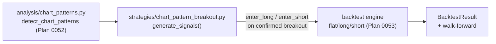

# 0054 — Chart-pattern breakout strategy + backtest

> **Status:** done — closed 2026-06-14. Both phases on `main` (no branch): phase 1 strategy `f87f62d`, phase 2 backtest+walk-forward `48eaa64`. Clean Mode 4 — no blockers, no majors. Every named done-when read at the assertion level: phase-1 entries pinned at the *confirming* bar (`> _forming_bar`, direction + confirming-bar both read off `detect_chart_patterns` as source of truth), forming-only fixture → no signal, genuine truncation-invariance no-lookahead test, `discover()` lookup; phase-2 mixed fixture yields **both** a long and a short trade (long-before-short), determinism via `model_dump(exclude={run_id,started_at,finished_at})` equality, walk-forward per-fold + aggregate with contiguous strictly-increasing folds. Strategy reads direction off the hit's resolved `direction` field (lockstep with the detector incl. symmetrical triangles/wedges); imports only `analysis.chart_patterns` + `contracts` (no layering violation); pure/deterministic/trailing, 190 lines. 13 plan tests green; full suite 1505 pass / 7 Win-skips, `mypy --strict` + ruff clean. (The one full-suite red — `test_settings_stop_removes_lockfile_on_windows` — passes in isolation: a pre-existing order-dependent flake in the Windows sidecar-lockfile suite, unrelated to this plan.) The phase-1 CLI roster bump (`seven → eight` in `test_cli.py`) is an in-scope, commit-documented consequence of registering the 8th strategy. No new ADR (consumes 0048/0050; applies 0004/0018/0024).
> **Created:** 2026-06-08
> **Owner skill(s):** strategy-author, backtester
> **Related ADRs:** consumes [0048](../adrs/0048-classical-chart-pattern-detection.md) (detection) and [0050](../adrs/0050-short-selling-strategy-backtest.md) (shorts); applies [0004](../adrs/0004-strategy-interface.md) (strategy contract), [0018](../adrs/0018-backtest-result-schema.md)/[0024](../adrs/0024-extended-backtest-metrics.md) (engine/metrics)
> **Depends on:** [Plan 0052](0052-classical-chart-patterns.md) (detection) **and** [Plan 0053](0053-short-selling-support.md) (short support)

## TL;DR

Turn the confirmed classical-pattern breakouts into a tradeable, backtestable strategy. A contract-conformant `chart_pattern_breakout` strategy calls [Plan 0052](0052-classical-chart-patterns.md)'s `detect_chart_patterns` and emits a position on each **confirmed** breakout — **long** on bullish patterns (inverse-H&S, double-bottom, falling wedge, ascending-triangle / symmetrical up-break) and **short** on bearish ones (H&S, double-top, rising wedge, descending-triangle / symmetrical down-break) using the `enter_short` / `exit_short` kinds from [Plan 0053](0053-short-selling-support.md). It acts only on `confirmed` hits (never `forming`), so the no-lookahead guarantee carries through to signals. A backtest + walk-forward pass validates the signal isn't fixture-overfit. First user-visible behavior: backtest `chart_pattern_breakout` on a fixture and get a deterministic `BacktestResult` with both long and short trades.

## Context & problem

[Plan 0052](0052-classical-chart-patterns.md) detects and draws classical patterns but stops at analytics — it has no signal (the analyst/strategy split: `ChartPatternHit` has no action field). [Plan 0053](0053-short-selling-support.md) makes shorts expressible. This plan is the join: a strategy that trades the confirmed breakouts in the natural direction of each pattern, long or short. It is deliberately separate from 0052 so detection/rendering can land and be reviewed without waiting on short support, and separate from 0053 so the engine change is reviewed on its own.

## Decision

Author a `chart_pattern_breakout` strategy under `strategies/` (pure `generate_signals` + `Params` + `META`) that maps each **confirmed** `ChartPatternHit` to a directional entry at its confirming bar and an exit on the opposing confirmed signal (or a parameterized stop/target derived from the pattern's measured move). Validate with a backtest + walk-forward (`backtester`). We rejected trading `forming` patterns (lookahead-adjacent and noisy) and rejected a separate strategy per pattern (one parameterized module covers the family; the detector already distinguishes patterns).

## Architecture diagram

## Implementation phases

### Phase 1 — `chart_pattern_breakout` strategy
- **Owner skill:** strategy-author
- **What:** A contract-conformant strategy module. `generate_signals(bars, params)` runs `detect_chart_patterns(bars)`, and for each **confirmed** hit emits `enter_long` (bullish patterns) or `enter_short` (bearish patterns) at the confirming `bar_index`, with exits on the opposing confirmed breakout and/or a `Params`-controlled stop/target off the measured-move `target`. Long-only-vs-both is a `Params` toggle, defaulting to both directions. `META` declares the pattern family. Smoke test per the strategy convention.
- **Files touched:** new `src/market_analyser/strategies/chart_pattern_breakout.py`; `tests/strategies/test_chart_pattern_breakout.py`.
- **Done when:**
  - On a fixture with a confirmed inverse-H&S, `generate_signals` emits exactly one `enter_long` at the **confirming** bar (not the formation bar); on a confirmed H&S fixture it emits an `enter_short` at the confirming bar.
  - A fixture where the pattern only ever reaches `forming` emits **no** signal.
  - The strategy is pure and trailing: a signal at `bar_index == i` depends only on `bars[0..=i]` (no-lookahead, the strategy non-negotiable), pinned by a truncation test.
  - `discover()` finds the module by its `META.id`.

### Phase 2 — Backtest + walk-forward validation
- **Owner skill:** backtester
- **What:** Run `chart_pattern_breakout` through the engine on a historical fixture containing both bullish and bearish confirmed patterns; report metrics; run a walk-forward pass to check the signal isn't fixture-overfit. Exercises the Plan 0053 flat/long/short engine — no engine change expected here.
- **Files touched:** `tests/backtest/test_chart_pattern_breakout_backtest.py` (and/or a `runs/` artifact + determinism check); no engine source change expected.
- **Done when:** a backtest produces a deterministic `BacktestResult` (re-run byte-identical modulo run provenance, ADR-0018) containing **both** a long and a short trade on the mixed fixture; a walk-forward run reports per-fold + aggregate metrics without error; any engine gap surfaced (not silently absorbed) as a finding for Plan 0053 / the backtester.

## Risks & open questions

- Risk: **detector false positives become losing trades.** That's the honest test of the detection thresholds; the backtest is where over-loose tolerances show up. Mitigation: walk-forward + the metrics tell the story; tuning loops back to ADR-0048's constants, not this strategy.
- Risk: **exit policy ambiguity** — exit on opposing breakout vs measured-move target vs stop. Mitigation: make it a `Params` choice with a documented default; the smoke test pins the default's behavior.
- Open question: should symmetrical-triangle / wedge signals be gated behind a `Params` flag (off by default) until their detection is validated on real bars? Default: include them but expose a per-family enable flag so a user can restrict to H&S/double if the triangle/wedge signal proves noisy.

## What this plan does NOT do

- **No detection or rendering** — that's [Plan 0052](0052-classical-chart-patterns.md).
- **No engine/contract changes** — shorts come from [Plan 0053](0053-short-selling-support.md); this plan only consumes them.
- **No live/paper execution** — backtest only (ADR-0025 posture unchanged).
- **No parameter optimization sweep** — a single sensible default param set; sweeping is a separate backtester exercise.

## Followups (after this lands)

- (empty at draft)
