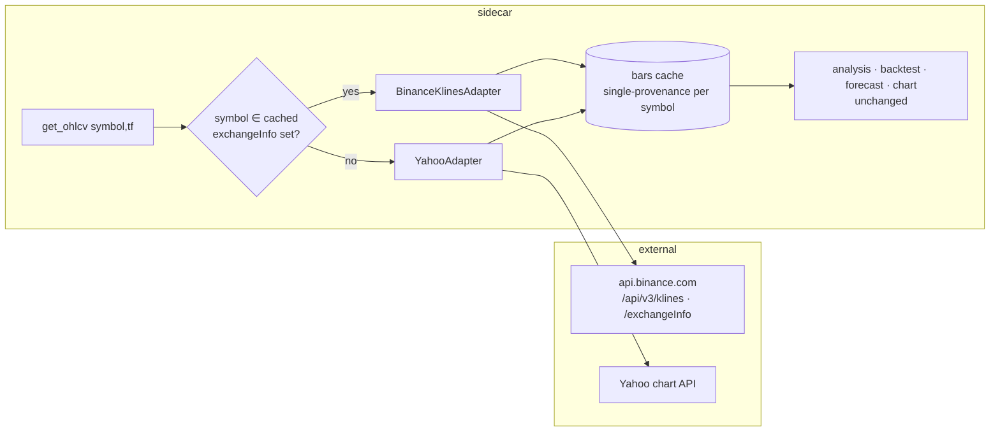

# 0058 — Binance klines as a second OHLCV source

> **Status:** done (2026-06-13) — phases 1–3 on branch `plan-0058-binance-klines-ohlcv` (`4b0526b` adapter+pagination, `6c5779b` membership routing, `ac4d3d3` search), merged `--no-ff` as `0260c5d`; Mode 4 clean (no blockers); phase-4 live smoke GREEN (recorded below). Post-merge `main` green (1476 passed / 7 skipped, `mypy --strict` clean). ADR-0052 accepted at this close. One follow-up surfaced (live-quote path not Binance-aware) — see Followups.
> **Created:** 2026-06-09
> **Owner skill(s):** dev, human
> **Related ADRs:** [ADR-0052](../adrs/0052-binance-exchange-data-source.md) (implements the klines half; accepts at close), [ADR-0007](../adrs/0007-market-data-provider.md) (the Protocol this slots into), [ADR-0031](../adrs/0031-data-source-adapter-contract.md) (OhlcvSource), [ADR-0028](../adrs/0028-timeframe-resampling-and-expansion.md) (timeframe registry), [ADR-0033](../adrs/0033-empty-ohlcv-response-by-recency.md) (empty-window semantics carry over)

## TL;DR

Crypto-native OHLCV: a keyless `BinanceKlinesAdapter` implementing `OhlcvSource` over spot `GET /api/v3/klines` (verified: max 1000 bars/page, native `1m…1M` intervals incl. `4h`, 6,000 weight/min), routed by **membership** — a symbol goes to Binance iff it's in the cached `exchangeInfo` symbol set, else Yahoo as today (ADR-0052: exchange pairs are distinct symbols, never aliases). Unlocks deep intraday history (BTCUSDT 1h back to 2017 vs Yahoo's 730-day cap) and altcoin breadth. First user-visible behavior: `get_ohlcv("BTCUSDT", "1h", …)` returns real Binance bars through the same cache, chart, and analysis surfaces as any other symbol.

## Context & problem

Yahoo's intraday caps (1h ≤ 730d, 15m ≤ 60d) bound how much training history the forecast pipeline can ever see for crypto, and its synthetic `BTC-USD` composite covers few alts. Everything downstream (analysis, backtests, forecasts, charts) consumes bars through the ADR-0007 Protocol + SQLite cache, so a second OHLCV source is a data-layer-only change by construction. The routing question (how the provider knows `BTCUSDT` is Binance's) is decided in ADR-0052: exchangeInfo membership, no prefixes, no heuristics.

## Decision

Implement ADR-0052's klines half: one `OhlcvSource` adapter (pagination, absolute `startTime`/`endTime`, interval mapping from the canonical timeframe registry — `4h` is **native** for Binance symbols, bypassing the ADR-0028 resample that Yahoo needs), plus a cached-and-refreshable `exchangeInfo` symbol set driving provider dispatch. Timeframe caps for Binance symbols are effectively unbounded (history to listing); the per-source cap structure stays per-symbol-source, not global. We rejected prefix namespaces and symbol aliasing per ADR-0052.

## Architecture diagram



## Implementation phases

### Phase 1 — Adapter: klines fetch + pagination
- **Owner skill:** `dev`
- **What:** `BinanceKlinesAdapter` implementing `OhlcvSource` (ResilientHttpClient subclass; typed errors incl. `GeoRestrictedError` on 451 per ADR-0052): absolute-window fetch, 1000-bar pagination, kline-array → `Bar` mapping (open time as bar ts, validated OHLC > 0), interval mapping for the canonical registry's timeframes (`15m/1h/4h/1d/1w/1mo` → `15m/1h/4h/1d/1w/1M`), empty page = end-of-history.
- **Files touched:** `data/adapters/binance_klines.py`, `data/errors.py` (shared with 0056 if it landed first), tests (captured fixtures).
- **Done when:** (a) a 3-page fixture window returns contiguous, gap-free, deduplicated bars in ts order; (b) a past-ending historical window returns exactly the fixture's bars (absolute-window semantics, the Plan 0031 lesson applied from day one); (c) bad rows (zero/negative price) raise the typed validation error, never silently pass; (d) 451 → `GeoRestrictedError`.

### Phase 2 — Routing: exchangeInfo membership + provider dispatch
- **Owner skill:** `dev`
- **What:** Cached `exchangeInfo` symbol set (SQLite-or-file cache with explicit refresh; stale-but-present beats absent), provider dispatch routing OHLCV (and backfill-coordinator calls) by membership; per-source timeframe caps so Binance symbols skip Yahoo's 730d/60d limits; `4h` for Binance symbols fetched native, not resampled.
- **Files touched:** `data/default_provider.py` (or the selector registry seam from ADR-0031), `data/adapters/binance_klines.py`, `data/timeframes.py` (per-source cap seam), tests.
- **Done when:** (a) `BTCUSDT` routes to the Binance adapter and `AAPL`/`BTC-USD` still route to Yahoo — asserted via spy adapters; (b) a symbol in neither universe fails with the existing unknown-symbol taxonomy (404 path unchanged); (c) a 1h request older than 730 days **succeeds** for `BTCUSDT` and still clamps for `BTC-USD` (the cap is per-source, asserted both ways); (d) `4h` for `BTCUSDT` is served native (spy asserts no resample call) while Yahoo's 4h path is untouched.

### Phase 3 — Symbol search + cache coexistence
- **Owner skill:** `dev`
- **What:** Binance pairs surface in `search_symbols` (a `SymbolSearchSource` over the cached exchangeInfo set, merged after Yahoo results with a source label so the picker can find `BTCUSDT`); confirm the bars cache, backfill coordinator, and ADR-0033 empty-window semantics behave identically for Binance-routed symbols.
- **Files touched:** `data/adapters/binance_klines.py` (search), `data/default_provider.py`, tests.
- **Done when:** (a) searching "BTCUSDT" returns the Binance pair with its source labeled; (b) the cache round-trip test (fetch → cache → re-read without network, spy-asserted) passes for a Binance symbol; (c) the strictly-historical-empty vs leading-edge-empty split (ADR-0033) is asserted for the Binance path.

### Phase 4 — Live smoke
- **Owner skill:** `human`
- **What:** From the user's network: backfill `BTCUSDT 1h` over a multi-year window, confirm depth (expected to reach ~2017), open it in the viewer chart, run `analyze_symbol` on it. Shares the geo verdict with Plan 0056 phase 2 — whichever runs first answers for both.
- **Files touched:** none.
- **Done when:** Bar count + earliest ts reported and recorded in this plan file; chart and snapshot render/compute without special-casing.
- **Result (smoke ran 2026-06-13, on merged `main`):** GREEN. Backfilled `BTCUSDT 1h` 2017→now: **77,197 bars**, earliest **2017-08-17T04:00:00Z** (Binance spot listing, C=$4308.83), latest 2026-06-13 — ~9 years deep, far past Yahoo's 730-day 1h cap (per-source uncapped behavior confirmed live; the full ~77-page paginated walk to end-of-history in ~50s, no 451). Binance spot reachable from the user's network, **no geo block** (shared GREEN verdict with Plan 0056). Asserted live: routing (`BTCUSDT`→Binance `src=binance`, `AAPL`→Yahoo); cache round-trip (sub-window re-read in 0.05s, no refetch); native `4h` served `tf=4h src=binance` (not resampled); `search_symbols("BTCUSDT")` → `BTCUSDT`/`WBTCUSDT` labeled `exchange="Binance"`; `analyze_symbol` snapshot computes on Binance bars (full indicator set + classical chart patterns); the chart renders BTCUSDT candles in the viewer. **Finding (logged as a follow-up):** `get_quote` is not membership-routed (always `YahooQuoteAdapter`), so the live price header shows "disconnected" for Binance-only symbols — out of this plan's stated scope (no UI work; Yahoo stays the quote source).

## Data shapes

No new models — the adapter produces the existing `Bar`; routing state is the cached symbol set:

```python
# illustrative — exchangeInfo cache entry
class ExchangeSymbolSet(BaseModel):
    source: Literal["binance"]
    symbols: frozenset[str]      # {"BTCUSDT", "ETHUSDT", ...}
    fetched_at: datetime         # staleness is visible, refresh is explicit
```

## Risks & open questions

- **Geo (shared with 0056):** 451 kills the plan; the smoke is the gate and ADR-0052 names the fallback path. If 0056's smoke already ran, the answer is known before this plan starts.
- **Two symbol universes confuse by coexistence** (`BTC-USD` vs `BTCUSDT` — different venues, different prices). Mitigation: the search labels sources; tools/docs never present them as interchangeable. Accepted permanent cost per ADR-0052.
- **exchangeInfo set size/staleness:** thousands of symbols, refreshed explicitly; a newly-listed pair misroutes to Yahoo (loud 404) until refresh. Acceptable; the refresh path is one call.
- **History-by-pagination is practice-confirmed, not doc-guaranteed** — backfill treats empty pages as end-of-history (phase 1), so a retention change degrades to shorter history, not errors.
- Sequencing: migration-free; parallel-able with 0056/0057 in worktrees, but shares `data/errors.py`/adapter-adjacent files with 0056 — prefer serializing those two or coordinating the shared file.

## What this plan does NOT do

- No funding/OI (Plan 0056), no trading (Pillar 5), no key handling of any kind.
- No removal or demotion of Yahoo — it remains the default and the only TradFi source.
- No UI work: the picker, chart, and views consume the same surfaces unchanged.
- No backfill of Binance symbols into forecast/backtest defaults — consumers opt in per symbol as always.

## Followups (after this lands)

- **Live-quote path is not Binance-aware** (`dev`; → `architect` if it warrants an ADR). `DefaultMarketDataProvider.get_quote` (`default_provider.py:362`) unconditionally calls `YahooQuoteAdapter.get_quote`, bypassing the `_ohlcv_route` membership dispatch — so a Binance-only symbol (`BTCUSDT`) has no live quote and the renderer's `PriceHeader` shows the "disconnected" badge. `BinanceKlinesAdapter` is an `OhlcvSource`/`SymbolSearchSource` only (no quote capability). Fix: route `get_quote` by membership and give the Binance adapter a quote source (derive from the latest 1h/1m kline, or a dedicated `/api/v3/ticker/price` call). Surfaced by the phase-4 smoke (2026-06-13); mirrored to the plans-README Open follow-ups.
