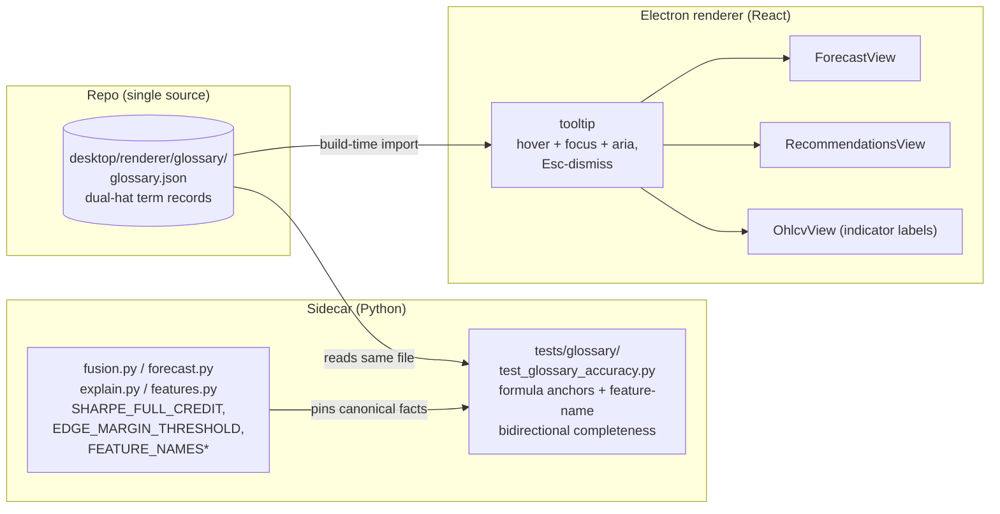

# 0065 — Glossary hover-explanations for the forecast, recommendation & condition surfaces

> **Status:** done — closed 2026-07-09. Three phases on `main`, no branch, migration-free: `c1f1884` (ui-builder, glossary schema + dual-hat content + TS shape/completeness tests) → `f2a747d` (ui-builder, accessible `<GlossaryTerm>` tooltip wired into Forecast/Recommendation + the chart-legend surface) → `b2ce3d4` (dev, Python cross-language accuracy pin). Clean Mode 4 — no blockers, no majors; three minor deltas, all deliberate and disclosed in the phase-2 commit body: (1) `<GlossaryTerm>` lives at `desktop/renderer/components/` not the plan's `glossary/` path (conventional component placement); (2) the third surface is `LayersPanel`+`CandlestickChart` (where the indicator-legend labels live) not the plan-named `OhlcvView`; (3) a fifth glossary category `overlay` (ema/sma/supertrend legend copy) was added, kept test-guarded **disjoint** from `indicator` so the FEATURE_NAMES pin is unaffected. Every phase-1/2/3 done-when read at the assertion level, including the ADR-0060 posture change done right — the 0063 no-interactive specs **re-scoped not deleted** (still assert zero `button/input/select/textarea/a/[role=button]` action controls, and additionally that every `[tabindex]` addition carries `data-glossary-term`), unknown-key degrade-to-plain-text, and the cross-language `formulaAnchor`→constant / bidirectional `indicator`↔`FEATURE_NAMES*` / `overlay`↔`indicator`-disjoint pins. Close-time gates green: **5** Python accuracy specs (`tests/glossary/test_glossary_accuracy.py`) + **45** renderer jest specs across the six touched suites. **ADR-0060 accepted at close.** Phase 4 (human live smoke) was verified in the 2026-07-12 consolidated live smoke (see [`consolidated-smoke.md`](../../consolidated-smoke.md)).
> **Created:** 2026-07-08
> **Owner skill(s):** ui-builder, dev, human
> **Related ADRs:** [ADR-0060](../adrs/0060-glossary-tooltip-interaction-posture.md) (paired — proposed, accepts at this plan's close; the informational-tooltip relaxation of the no-interactive-element posture), [ADR-0029](../adrs/0029-advisory-recommendation-boundary.md) (the advisory panels whose posture this scopes an exception to), [ADR-0025](../adrs/0025-trade-execution-feasibility.md) (the no-action posture the exception must preserve), [ADR-0058](../adrs/0058-forecast-recommendation-explainability.md) (the explanation surfaces this annotates), [ADR-0046](../adrs/0046-mcp-large-result-delivery.md) (the small-wire posture the delivery choice respects — no per-payload glossary on the wire)

## TL;DR

Every term, score, and verdict on the Forecast and Recommendation tabs — and the condition/indicator terms that surface alongside them — gets an on-hover, on-focus explanation written for both readers the app already serves: **what it is / how it's computed** (developer) and **what it means for your decision** (trader). The content lives in one shared, language-neutral `glossary.json`; the renderer imports it at build time and renders it through an accessible `<GlossaryTerm>` tooltip; a **Python cross-language accuracy test** structurally pins each computed term's formula to the code that computes it (conviction to the fusion mapping, `edge_strength` to its threshold constant, and the indicator glossary bidirectionally to the frozen feature-name tuples). First user-visible behavior: hovering or keyboard-focusing "Conviction" on the Recommendation tab surfaces a two-line card — "forecast P(direction) × clamped walk-forward edge" and "how strongly the app backs this call; low when either the forecast edge is marginal or the backtest is thin" — and the same for `edge_strength`, `skill` vs baseline, the permutation-importance drivers, `sharpe_mean`, the entry/stop/target levels, and every fusion check.

## Context & problem

Plan 0063 made the forecast and recommendation say *why* — drivers, freshness, the gate-by-gate fusion trace. But the panels assume the reader already knows what "conviction 0.0666", "edge_strength: marginal", "skill 0.485 vs baseline 0.484", or a driver named `mayer_multiple` *mean*. The owner asked (2026-07-08, after the 0063 forecast panel shipped) for on-hover explanations of everything on the two tabs — naming conviction as the archetype: "what is a conviction score? what does it mean for the user?". The dual-hat need is the same one 0063 served: as **developer** the reader wants the exact computation; as **trader** the reader wants the decision meaning. The forcing constraints: the explanation text about a computed number must not drift from the code that computes it (a tooltip that says "P × edge" after the mapping changed is worse than none); the advisory panels deliberately carry **no interactive controls** (ADR-0025/0029, asserted by 0063's no-interactive specs), so adding focusable tooltip triggers is a posture change that must be made deliberately and kept informational-only; and MCP replies / SSE envelopes stay small (ADR-0046), so the glossary must not ride the wire per payload.

## Decision

Author the glossary once in a shared `desktop/renderer/glossary/glossary.json` — each term a dual-hat record (`term`, `category`, `howComputed`, `whatItMeans`, optional `formulaAnchor`) — import it into the renderer at build time, and render it through an accessible, keyboard-focusable `<GlossaryTerm>` tooltip wired into `ForecastView`, `RecommendationsView`, and the OHLCV indicator-overlay labels. Accuracy is enforced two ways: a **TS completeness test** (every `termKey` a view references exists in the JSON; no orphaned keys) and a **Python cross-language accuracy test** that reads the same JSON and asserts each computed term's formula anchor matches a canonical constant/string exported from the computing module, and that the `indicator`-category keys equal the union of the frozen `FEATURE_NAMES` / `FEATURE_NAMES_V2` / `FEATURE_NAMES_V2_DEEP` tuples exactly — so adding a feature or changing the conviction mapping fails the build until the glossary catches up. The informational tooltip is a **scoped, deliberate relaxation** of the panels' no-interactive-element posture ([ADR-0060](../adrs/0060-glossary-tooltip-interaction-posture.md)): the trigger is focusable and screen-reader-addressable, but it performs no action, opens no order path, and the no-action posture (ADR-0025) holds. We rejected a **sidecar-served glossary endpoint** (a new wire surface plus fetch/validation plumbing, and trader-facing presentation text leaking into the sidecar) and a **renderer-static-only glossary** (no cross-language structural check, so the how-computed line could drift silently); the shared-JSON + cross-language-test middle keeps the content in one file and ties its accuracy to the code.

## Architecture diagram



## Implementation phases

### Phase 1 — Glossary schema + full dual-hat content + TS shape/completeness tests
- **Owner skill:** ui-builder
- **What:** Create `desktop/renderer/glossary/glossary.json` and its TS types + loader; author the complete dual-hat content for every in-scope term (the derived metrics/verdicts, the fusion-check vocabulary, the condition terms, and every feature-driver indicator); add TS tests pinning the record shape and internal consistency. No view wiring yet — this phase is the content and its contract.
- **Files touched:** `desktop/renderer/glossary/glossary.json` (new), `desktop/renderer/glossary/types.ts` (new — the `GlossaryTerm` record type + a typed loader), `desktop/renderer/glossary/glossary.test.ts` (new), `desktop/tsconfig*.json` (enable `resolveJsonModule` where the renderer build needs it).
- **Done when:** `glossary.json` parses and every record carries a non-empty `term`, `category` (one of `forecast` / `recommendation` / `condition` / `indicator`), `howComputed`, and `whatItMeans`; the TS shape test rejects a record missing either hat; the loader exposes a typed `term(key)` accessor; the full term set is present (spot-checked: `conviction`, `edge_strength`, `skill`, `baseline_skill`, `prob_up`, `sharpe_mean`, `entry_zone`, `stop`, `targets`, the five fusion `leg` values, `trend`, `momentum`, and the feature-driver indicators used on the Forecast tab all resolve).

### Phase 2 — Accessible `<GlossaryTerm>` tooltip + wire it into the three surfaces
- **Owner skill:** ui-builder
- **What:** Build the keyboard-focusable, screen-reader-addressable tooltip component (WAI-ARIA tooltip pattern: a focusable trigger marking the term, the dual-hat card as its `aria-describedby`, shown on hover **and** focus, dismissed on blur/Escape, theme-aware) and wrap the in-scope labels in `ForecastView`, `RecommendationsView`, and the OHLCV indicator-overlay labels. The existing no-interactive-element specs from Plan 0063 move **deliberately** (ADR-0060): they are re-scoped to permit exactly the glossary triggers while still asserting zero *action* controls (no order/trade affordance) — a versioned posture change, not drift.
- **Files touched:** `desktop/renderer/glossary/GlossaryTerm.tsx` (new) + `.test.tsx` (new) + module CSS, `desktop/renderer/views/ForecastView.tsx` + `.test.tsx`, `desktop/renderer/views/RecommendationsView.tsx` + `.test.tsx` (re-scope the `adds NO interactive element` assertion), `desktop/renderer/views/OhlcvView.tsx` + `.test.tsx`.
- **Done when:** A term renders its child label with a visible affordance and, on hover and on keyboard focus, shows a card containing both the `howComputed` and `whatItMeans` lines; the card is `aria-describedby`-linked and dismissible with Escape; a label whose `termKey` is absent from the glossary renders as plain text (no crash, no empty tooltip — the no-orphan/no-regression path); the re-scoped no-interactive specs pass, asserting the only focusable additions are glossary triggers and that no action/order control exists; the existing Forecast "Why" and Recommendation checks-table specs stay green.

### Phase 3 — Python cross-language accuracy test
- **Owner skill:** dev
- **What:** Add the cross-language test that reads `desktop/renderer/glossary/glossary.json` and structurally ties it to the computing code: each term carrying a `formulaAnchor` is checked against a canonical constant/string exported from the owning module (conviction to the documented `SHARPE_FULL_CREDIT` mapping in `advisor/fusion.py`, `edge_strength` to `EDGE_MARGIN_THRESHOLD` in `api/mcp_tools/forecast.py`), and every `indicator`-category key equals — bidirectionally — the union of `FEATURE_NAMES`, `FEATURE_NAMES_V2`, `FEATURE_NAMES_V2_DEEP` from `forecast/features.py`.
- **Files touched:** `tests/glossary/test_glossary_accuracy.py` (new); if a canonical formula string needs a single home, a small exported constant in the owning module (no behavior change).
- **Done when:** The test passes against the phase-1 content; **deleting a feature's glossary entry, adding a phantom `indicator` key, or editing a pinned formula anchor to disagree with its constant each make it fail** (verified by a temporary local mutation, reverted); the test reads the JSON by repo-relative path with no renderer/TS dependency.

### Phase 4 — Live smoke
- **Owner skill:** human
- **What:** Run the viewer and read the tooltips as both audiences, by mouse and by keyboard.
- **Done when:** On the Forecast tab, hovering and tab-focusing `skill`, `edge_strength`, and a driver name (e.g. `mayer_multiple`) each surface the dual-hat card; on the Recommendation tab the same for `conviction`, a fusion `leg`, `sharpe_mean`, and the entry/stop/target labels; Escape dismisses the card and focus returns to the trigger; a screen reader announces the description; nothing on either panel places or prepares an action.

## Data shapes

```json
// desktop/renderer/glossary/glossary.json — illustrative records, not final copy
{
  "conviction": {
    "term": "Conviction",
    "category": "recommendation",
    "howComputed": "forecast P(direction) × clamp(sharpe_mean / SHARPE_FULL_CREDIT, 0, 1)",
    "whatItMeans": "How strongly the app backs this call. Low by construction when the forecast edge is marginal OR the backtest is thin — it is never invented.",
    "formulaAnchor": "conviction_mapping"
  },
  "edge_strength": {
    "term": "Edge strength",
    "category": "forecast",
    "howComputed": "no_edge when the baseline gate fails; else clear when skill − baseline ≥ EDGE_MARGIN_THRESHOLD, marginal otherwise",
    "whatItMeans": "How comfortably the model beat a naive baseline. Treat a high probability under 'marginal' as thin, not near-certain.",
    "formulaAnchor": "edge_margin_threshold"
  },
  "mayer_multiple": {
    "term": "Mayer Multiple",
    "category": "indicator",
    "howComputed": "price divided by its 200-day moving average (a BTC cycle-valuation feature).",
    "whatItMeans": "Where price sits versus its long trend — high is historically stretched, low is historically cheap."
  }
}
```

```typescript
// desktop/renderer/glossary/types.ts — illustrative
type GlossaryCategory = 'forecast' | 'recommendation' | 'condition' | 'indicator'
interface GlossaryRecord {
  term: string
  category: GlossaryCategory
  howComputed: string
  whatItMeans: string
  formulaAnchor?: string   // present only when the Python accuracy test pins it to a constant
}
```

## Risks & open questions

- **Content-vs-code drift on the how-computed line.** The whole point of Option C: the Python accuracy test pins the *formula-bearing* terms and the indicator set structurally, so drift on those fails the build. Terms without a `formulaAnchor` (pure trader-tone descriptions) are still convention-guarded — keep anchors on anything that states a computation.
- **Tooltip is a real interaction-posture change.** Focusable triggers on panels that asserted zero interactive elements. ADR-0060 records why this is safe (informational, no action path); phase 2 re-scopes the specs deliberately rather than deleting them, so the no-*action* guarantee stays asserted.
- **Indicator glossary breadth.** ~27 feature names, several raw TA indicators with genuine nuance (ADX, Supertrend, Bollinger %B). Risk of shallow or subtly-wrong definitions; the dual-hat "what it means" line must not overclaim predictive power (the same association-not-causation humility ADR-0058 built in).
- **Build-time JSON import.** Needs `resolveJsonModule` in the renderer tsconfig(s) and the file inside the renderer root so vite resolves it without an fs-allow exception; the Python test reads the same path directly (no build coupling).
- Open question (deferred): whether condition/indicator terms eventually deserve their own analysis tab rather than surfacing only in the recommendation basis + OHLCV overlays. Out of scope here; this plan annotates them where they render today.

## What this plan does NOT do

- No sidecar glossary endpoint, no glossary on the SSE/MCP wire — the content is a build-time renderer asset (ADR-0046 posture preserved).
- No new *action* controls of any kind — the tooltip is informational; execution remains ADR-0025's untaken decision.
- No content for tabs outside forecast / recommendation / condition-and-indicator surfaces (Alerts, News, Settings, raw OHLCV chart mechanics) — a later plan can reuse the same `<GlossaryTerm>` + JSON for those.
- No rich media in tooltips (no charts, no links, no images) — two text lines per term, theme-aware, nothing to click inside the card.
- No change to any computed value — this *explains* the numbers, it does not alter them.

## Followups (after this lands)

- Extend the glossary to the remaining tabs (Alerts, News, OHLCV chart controls) reusing the phase-2 component and phase-1 JSON.
- Revisit whether a first-class condition/analysis tab is warranted (the deferred open question), at which point its terms are already defined.
