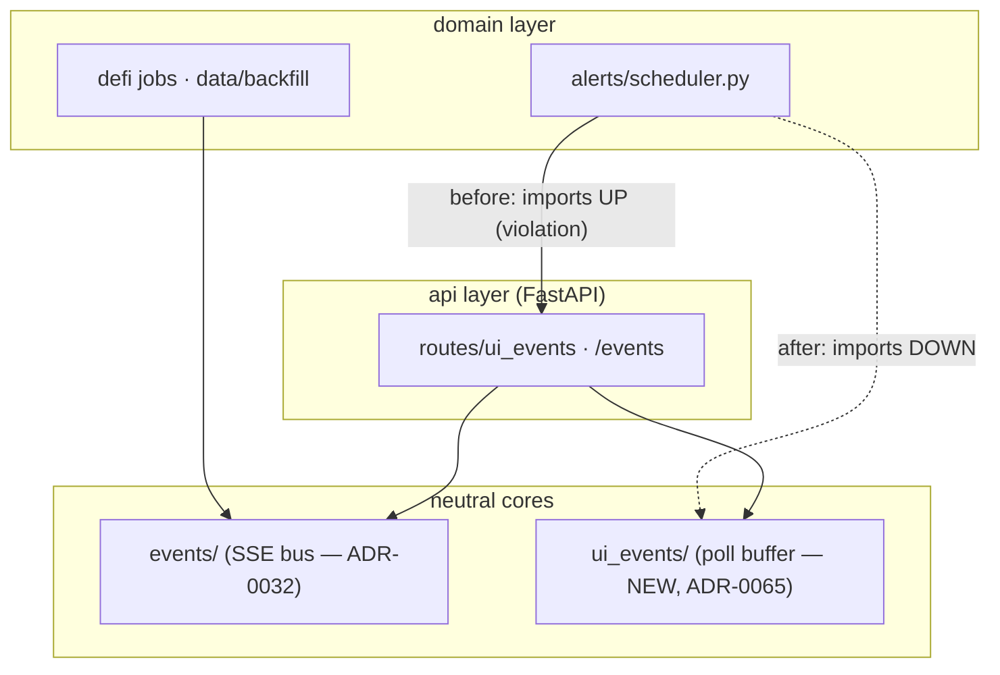

# Plan 0072 — Codebase remediation (2026-07-09 audit sweep)

> **Status:** done — all 9 phases complete. Phases 1–7 committed (`49f1305` ui_events core → `d33ceb3` events split → `b44f53b` import sort → `ce6b7cc` dedup → `54a1ec2` SSE ticket → `3be00d9` Python test-honesty → `f7a4b5c` SSE ticket client + CSP → `61bafc6` renderer test-honesty), all read clean at the assertion level in the 2026-07-09 Mode 4. Phase 8 (`bba6c4b`, ui-builder) decomposed the 1455-line `CandlestickChart.tsx` → 706 lines (-51%) into 10 per-concern hooks + 4 pure `lib/` modules + a `ChartToolbar` child; all 15 existing `CandlestickChart` specs unmodified + green, +45 new hook/lib tests, full renderer suite 670/670 (75 suites), tsc + eslint clean. Phase 9 (human cooldown bump) landed `exclude-newer 2026-06-20 → 2026-07-03` + `uv lock` (zero version drift, only the recorded cutoff moved). Closed 2026-07-10 after a clean Mode 4 on phase 8: no blockers/majors, one nit (`useLayersLegend` type-only import from a component). Paired ADRs [0065](../../adrs/0065-neutral-ui-event-buffer-core.md) + [0066](../../adrs/0066-sse-short-lived-ticket.md) accepted at close. Implemented directly on `main` — no branch to merge. **Index-README refreshes (plans + adrs) deferred:** both were dirty from a parallel session (ADR-0069/0070/0071 + plan 0077) at close time, so the roster/status-row updates for 0072/0065/0066 must be applied by the next architect touch once that session commits.
> **Owner skills:** `dev` (phases 1–5), `ui-builder` (phases 6–8), `human` (phase 9)
> **Related ADRs:** [0065](../adrs/0065-neutral-ui-event-buffer-core.md) (neutral UI-event buffer core — paired, accepts at close), [0066](../adrs/0066-sse-short-lived-ticket.md) (short-lived SSE ticket — paired, accepts at close). Touches the boundaries of [0017](../adrs/0017-live-ui-updates-via-sse.md), [0021](../adrs/0021-renderer-to-agent-feedback.md), [0032](../adrs/0032-data-layer-no-api-dependency.md).

## TL;DR

A whole-codebase audit on 2026-07-09 (security · tests · structure · docs) found **no blockers** — the app is well-hardened and well-tested. This plan clears the deltas it did surface: one domain→api **layering inversion** (ADR-0065), a **god component** (`CandlestickChart.tsx`, 1157 lines), a latent **secret-in-URL** exposure on the SSE stream (ADR-0066), a cluster of **weak/tautological test assertions** (one on a security boundary), determinism-critical **copy-paste**, and small hygiene items. The four **documentation** findings from the same audit — the ADR-0035-mandated `src/defi_analyser/` → `src/market_analyser/defi/` reconciliation, the stale architect `project-context.md`, and the plans-index count — were fixed in the audit session and are **not** in this plan.

Nine phases, grouped by owner for contiguous handoffs. Phases 1–7 and 9 are independent of the in-flight chart plans and can proceed now; **phase 8 (CandlestickChart decomposition) must sequence after Plans 0067 / 0068 / 0071 close** — they actively edit that file.

## Context & problem

The audit ran four parallel investigators over the repo. Verdict: healthy. Bearer auth is enforced on every route, Electron security defaults and double-CSP are correct, boundary validation (Pydantic/Zod) is in place, indicators are trailing, backtests are deterministic, and CI gates the right things (ruff, mypy strict, secret/lockfile guards, apiref drift, 85% coverage floor, pip-audit). What remains are the following concrete findings, by the dimension that caught them:

**Structure.** (a) `alerts/scheduler.py:45-46` imports `market_analyser.api.ui_events.{UIEventEnvelope, UIEventBuffer}` — a domain background loop depending up into the `api` layer, the exact inversion [ADR-0032](../adrs/0032-data-layer-no-api-dependency.md) removed for the SSE bus. (b) `CandlestickChart.tsx` is an 1157-line, ~11-`useEffect` god component; the intended extract-to-hooks refactor was applied only halfway. (c) `default_provider.py` maintains the cached-read → gap-fetch → **anti-lookahead merge-and-sort** loop in triplicate across `get_ohlcv` / `get_ohlcv_with_status` / the `as_of` branch. (d) `events/__init__.py` (620 lines) mixes ~20 payload schemas with the `EventBus` runtime and transitively pulls three domains into every importer. (e) `advisor/fusion.py` computes its `fuse()` blocker list and its `_build_checks` rows independently (parallel maintenance). (f) Several `api/mcp_tools/` modules reach across siblings into `_`-prefixed internals (`BACKTEST_TIMEFRAME`, the chart-pattern response builder).

**Security.** (g) The renderer bearer travels in the `/events?token=<bearer>` **URL query string** (client.ts:346) because `EventSource` can't set headers — a latent full-credential exposure. (h) Prod CSP `img-src 'self' data: https:` (electron/window.ts) leaves an image-beacon channel to any host, with no legitimate consumer. (i) `GET /settings/mcp-secret` returns the secret with no `Cache-Control: no-store`.

**Tests.** (j) `security.spec.ts:46` proves "injected bearer succeeds" with `not.toBe(401)` — passes on a 5xx, on the one security-boundary test. (k) `settings.spec.ts:98` and `test_settings_route.py:282` use the same weak `!=401` where a deterministic 200 is knowable. (l) `ohlcv-view.spec.ts` accepts any of chart/error/empty as success and runs zero assertions on the error branch. (m) `backtest-view.spec.ts:194` has a redundant, mildly flake-prone `elapsed < 3000` wall-clock assertion. (n) `test_yahoo_smoke.py` uses a 7-calendar-day window that can yield <5 trading days over a holiday (network-marked, CI-excluded — a standing follow-up).

**Hygiene.** (o) The dependency cooldown cutoff `exclude-newer = "2026-06-20"` is ~19 days stale against the CLAUDE.md ~7-day bump cadence.

**Explicitly not here:** the `forecast.py` single-vs-multi-horizon duplication (structure finding) is already being retired by **active Plan 0066** (`_compute_forecast` is deleted there) — folding it in would collide. This plan leaves it to 0066.

## Decision

Fix the findings in place, grouped by owner. Two findings are structural/security decisions with rejected alternatives and get ADRs: the UI-event buffer move ([ADR-0065](../adrs/0065-neutral-ui-event-buffer-core.md)) and the SSE ticket ([ADR-0066](../adrs/0066-sse-short-lived-ticket.md)). The rest are mechanical or test-honesty edits that need no ADR. Behavior is preserved everywhere except the two security hardenings (SSE auth, CSP) and the intentionally strengthened test assertions.

## Implementation phases

### Phase 1 — Neutral UI-event buffer core [ADR-0065]

**Owner skill:** `dev`

Move `UIEventBuffer` + `UIEventEnvelope` from `api/ui_events/` to a neutral `src/market_analyser/ui_events/` core (sibling to `events/`). Keep the transport-only pieces (`/ui_events` route, `agent_mode.py`) under `api/`. Repoint `alerts/scheduler.py`, `apiref/wiring.py`, and `api` at the neutral module. An optional thin re-export in `api.ui_events` may bridge the transition.

**Done when:** a static check (grep or import-linter) shows **no module under `alerts/` / `defi/` / `data/` / `analysis/` imports `market_analyser.api.*`**; the moved symbols import from `market_analyser.ui_events`; `mypy --strict` + full offline suite green.

### Phase 2 — Split the events core into payloads + bus

**Owner skill:** `dev`

Split `events/__init__.py` into `events/payloads.py` (the ~20 Pydantic envelope schemas) and `events/bus.py` (`EventBus` / `Subscription` runtime). `events/__init__.py` re-exports both so the public import surface (`from market_analyser.events import EventBus, <payload>`) is unchanged.

**Done when:** every existing `from market_analyser.events import …` site still resolves unchanged; neither new file exceeds ~400 lines; suite + mypy green.

### Phase 3 — De-duplicate determinism-critical and cross-tool logic

**Owner skill:** `dev`

(a) Extract a private `_merge_gaps(...)` in `default_provider.py` that `get_ohlcv`, `get_ohlcv_with_status`, and the `as_of` branch all call, so the anti-lookahead merge lives once. (b) Promote genuinely-shared `mcp_tools` internals into an `mcp_tools/_shared` module (`BACKTEST_TIMEFRAME`, the `_detect_chart_patterns_response` builder) instead of cross-tool `_`-private imports. (c) In `advisor/fusion.py`, derive the `fuse()` blocker list **from the failed `_build_checks` rows** (single source of truth) rather than computing both independently.

**Done when:** the BacktestResult / forecast determinism golden tests still pass byte-identically (modulo the documented run-provenance fields); the existing `fuse()` blocker ⟺ failed-check pinning test still holds; no behavioral change to any tool output.

### Phase 4 — Sidecar SSE ticket + secret-response hardening [ADR-0066]

**Owner skill:** `dev`

Add a bearer-gated mint endpoint that exchanges the renderer bearer for a short-TTL, single-use SSE ticket held in an in-memory TTL-swept store. `GET /events` accepts `?ticket=<ticket>` (validate + consume; reject absent/unknown/expired/used with `401`). Set `Cache-Control: no-store` on the `GET /settings/mcp-secret` and rotate responses.

**Done when:** `/events` rejects an absent/expired/already-used ticket (401) and authorizes exactly one stream per fresh ticket (both asserted); the mcp-secret response carries `no-store`; suite + mypy green. Emits the structured cross-skill handoff prompt to `ui-builder` at close (phase 6 consumes this).

### Phase 5 — Python test-honesty fixes

**Owner skill:** `dev`

Strengthen `test_settings_route.py:282` from `!= 401` to `== 200` (the stub provider makes the ohlcv route's 200 deterministic). Widen `tests/network/test_yahoo_smoke.py` to a holiday-robust window (e.g. `timedelta(days=10)` or assert `>= 3`) to kill the calendar-blind flake.

**Done when:** the settings-route test asserts the exact 200; the Yahoo smoke asserts a bar count that survives a long holiday weekend; both remain correctly marked (`network` stays `network`).

### Phase 6 — SSE ticket client + CSP img-src tighten

**Owner skill:** `ui-builder`

Consuming the phase-4 handoff: in `client.ts`, exchange the bearer for a ticket via the new endpoint and open `EventSource('/events?ticket=…')`; wrap reconnection so it re-mints a fresh ticket before each reopen. Remove `https:` from `img-src` in the prod CSP (`electron/window.ts`), leaving `'self' data:`.

**Done when:** the renderer opens the event stream via a ticket (never the bearer in a URL) and reconnects by re-minting; the app's live surfaces still render (no image regressions); `img-src` no longer admits arbitrary `https:`; renderer suite green.

### Phase 7 — Renderer test-honesty fixes

**Owner skill:** `ui-builder`

`security.spec.ts:46` → `expect(response.status()).toBe(200)`. `settings.spec.ts:98` → assert membership in the expected non-error set (e.g. `expect([200,400,406]).toContain(status)`). `ohlcv-view.spec.ts` → seed a known-good fixture and assert `chartVisible` specifically for the happy path; keep the tri-state "no-hang" case as a separate test. `backtest-view.spec.ts:194` → drop the redundant `elapsed < 3000` assertion (the bounded `toBeVisible({timeout})` is the real check).

**Done when:** each spec asserts the intended value rather than a tautology or an over-broad set; the security boundary test fails on a 5xx; renderer suite green.

### Phase 8 — Decompose `CandlestickChart.tsx` — SEQUENCE AFTER 0067 / 0068 / 0071

**Owner skill:** `ui-builder`

Extract each reconcile concern into its own hook (`useOverlaySeries`, `useSupertrendSeries`, `usePriceLines`, `useVolumeSeries`, `useChartMarkers`, `useLayersLegend`) and lift the scan toolbar into a `ChartToolbar` child, leaving `CandlestickChart.tsx` as chart-lifecycle + composition. Behavior-preserving refactor.

**Done when:** all existing `CandlestickChart` specs (`.gestures`, `.overlays`, base) pass **unchanged** (behavior preserved); `CandlestickChart.tsx` drops materially (target < ~500 lines); each extracted hook is independently unit-tested. **Hard ordering constraint:** this phase must land only after Plans 0067, 0068, and 0071 have closed — all three actively edit `CandlestickChart.tsx`, so running phase 8 earlier guarantees large merge conflicts. See Risks.

### Phase 9 — Dependency cooldown cutoff bump (chore)

**Owner skill:** `human`

Advance `exclude-newer` in `pyproject.toml` and the effective `minimumReleaseAge` floor in `pnpm-workspace.yaml` by the overdue delta per the CLAUDE.md weekly-bump handle; run `uv lock` / `pnpm install`; land manifest + lockfiles in a single chore commit.

**Done when:** the cutoff is within ~7 days of the commit date; lockfiles regenerated; CI green (14-day cooldown still respected). This is an operational handle the user drives (window judgment, CVE-in-window check), hence `human`.

## Architecture diagram — the layering fix (phase 1)

## Risks & open questions

- **Phase 8 ordering is a hard dependency, not a preference.** `CandlestickChart.tsx` is under active edit by Plans 0067 (trendline colour/legend), 0068 (chart-style settings), and 0071 (candlestick legend declutter), which are themselves serialized on that file. Phase 8 must be last and gated on all three closing; if any of them slips, phase 8 slips with it. The plan can close phases 1–7 + 9 and leave phase 8 as the sole open item if needed.
- **Phase 1 is a wide mechanical diff.** The transition re-export in `api.ui_events` de-risks landing it; the static "no domain→api import" check is the real acceptance gate.
- **Phase 4/6 are a cross-skill pair.** The dev half ships the endpoint + server validation; the ui-builder half rewires the client. They must land in order (4 before 6) and the handoff prompt carries the ticket contract (endpoint path, TTL, single-use semantics, reconnection expectation).
- **Phase 4 cutover vs. compatibility.** Open choice for the implementer: cut `?token=` over to `?ticket=` in one step (phases 4+6 land together) or keep `?token=` working through a transition. Recommended: cut over — the renderer is the only client and phases 4→6 are one handoff.
- **Determinism (phase 3) is the sensitive one.** The `_merge_gaps` extraction touches the exact anti-lookahead path; the golden byte-identity tests are the guardrail and must stay green.

## What this plan does NOT do

- **Does not touch the four documentation findings** — they were fixed in the audit session (defi_analyser path reconciliation per ADR-0035, architect `project-context.md` refresh, plans-index count).
- **Does not retire `forecast.py`'s `_compute_forecast`** — Plan 0066 owns that.
- **Does not merge `events/` and `ui_events/`** — ADR-0065 keeps them separate on purpose.
- **Does not add new features, new tools, new routes** beyond the ticket-mint endpoint, and adds **no migration** (all phases are migration-free).
- **Does not rewrite the large-but-cohesive files** the audit cleared (`chart_patterns.py`, `fusion.py` as a whole, `binance_klines.py`) — only the specific duplications named in phase 3.
- **Does not change the trust root** — the bearer remains the root credential; phase 4 only narrows its URL exposure.

## Followups (out of scope, noted)

- The optional `binance_klines.py` exchangeInfo-symbol-set extraction (audit nit) — deferred; the file is broad but cohesive.
- Windows-explicit ACL tightening on the on-disk bearer files (audit nit) — low risk given per-user AppData; documented reliance is acceptable for now.
