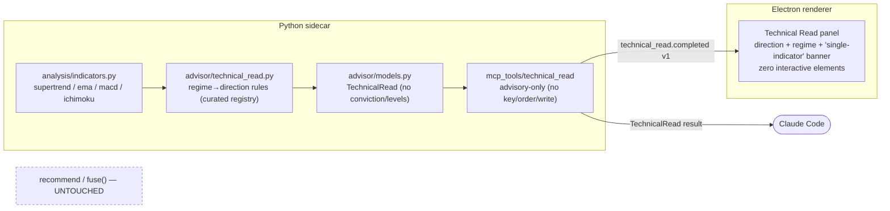

# 0074 — Technical-read advisory tier: a single-indicator directional call

> **Status:** done — CLOSED 2026-07-12 (`42ec117` model+core → `c17ef1d` tool+SSE → `cf8d4fc` viewer panel; ADR-0068 accepted at close). Clean Mode 4, no blockers/majors/minors: all three code phases match the plan; every done-when read at the assertion level (truncation-invariance anti-lookahead, `extra="forbid"` conviction/stop rejection, exactly-one/zero-on-failure envelope classes, AST-level read-only source scan, TS↔pydantic parity guard pinning the ticket fields absent). Gates re-verified at close: 35 Python + 51 renderer jest green across the touched suites, `apiref --check` clean. Toolset bump landed 48→49 (baseline moved past the plan's 44→45 note, as the coordination note anticipated). Implemented directly on `main`, no branch, migration-free. Phase 4 (`human` live smoke) is the user's outstanding step, not a code gate.
> **Created:** 2026-07-09
> **Owner skill(s):** dev, ui-builder, human
> **Related ADRs:** [0068](../adrs/0068-technical-read-advisory-tier.md) (technical-read tier — accepts at close), extends [0029](../adrs/0029-advisory-recommendation-boundary.md); consumes [0023](../adrs/0023-technical-analysis-surface.md) (indicators), [0017](../adrs/0017-live-ui-updates-via-sse.md) (SSE); Ichimoku eligibility needs [Plan 0073](0073-ichimoku-cloud-indicator.md) phase 1

## TL;DR

Add a **technical read** — a directional call (long/short/flat) derived from **one curated regime indicator** by its textbook mechanical rule, with **no conviction and no entry/stop/target levels**. It is a distinct `TechnicalRead` artifact ([ADR-0068](../adrs/0068-technical-read-advisory-tier.md)), delivered by a new `technical_read` MCP tool and its own SSE event, so it can never be mistaken for the fully-corroborated fused `Recommendation` (ADR-0029 stays intact — this *extends* it with a lesser, structurally-honest tier). The first user-visible behavior is `technical_read symbol=BTC-USD indicator=supertrend` returning `direction=long, regime_state="uptrend (direction=+1)"` without any fabricated confidence. Eligible indicators: **Supertrend, EMA-stack, MACD** immediately; **Ichimoku** joins once Plan 0073 phase 1 lands.

## Context & problem

The fused `recommend` tool (ADR-0029) requires the forecast, a strategy's live signal, and a positive walk-forward edge to **all agree** before it emits a directional call. That corroboration is the honesty guarantee — but it means a mechanical "Supertrend is long" or "price is above the Ichimoku cloud" read returns **flat** whenever the ML forecast shows no edge (which, per the Plan 0059 finding, is often). The user wants the mechanical single-indicator read as a first-class capability.

The problem is doing this without eroding ADR-0029: a bare direction from one indicator is exactly the confident-looking-but-thin call the boundary exists to prevent from masquerading as advice. [ADR-0068](../adrs/0068-technical-read-advisory-tier.md) resolves the tension by sanctioning a **second, explicitly-lesser tier** whose honesty comes from structural omission (no conviction, no levels, distinct type) rather than corroboration.

## Decision

Per the interview, we build a distinct **technical-read tier** with maximal separation from the fused recommendation:

- **Separate `TechnicalRead` model + artifact** — a different type from `Recommendation`, with no `conviction`/`entry_zone`/`stop`/`targets` fields, so a thin basis cannot be dressed as a ticket.
- **Curated regime set** — Ichimoku, Supertrend, EMA-stack, MACD, each with a documented regime→direction rule. ADX/ATR/bare-RSI excluded (no clean direction).
- **Direction + regime state only** — the call reports `direction` and the indicator's `regime_state` read; the user sizes it themselves. No conviction number, no levels.
- **Separate MCP tool** — `technical_read`, so the fused `recommend` code path and description stay pristine.

The core reuses the pure indicator functions in `analysis/indicators.py` (and, for Ichimoku, the `ichimoku()` from Plan 0073 phase 1). It is advisory-only, structurally — no keys, no orders, no network-write — enforced by the same source scan `recommend` and the advisor package carry.

We rejected refusing the capability (the mechanical read is legitimately wanted), relaxing `fuse()`'s gates (guts ADR-0029), and reusing `Recommendation` with a `label`/`tier` value (structural omission is a stronger honesty guarantee than an enum) — see [ADR-0068](../adrs/0068-technical-read-advisory-tier.md).

## Architecture diagram



## Implementation phases

### Phase 1 — `TechnicalRead` model + curated regime→direction core
- **Owner skill:** dev
- **What:** A frozen `TechnicalRead` model (no conviction/levels fields) and a pure `technical_read(bars, indicator_id, timeframe)` core in `advisor/technical_read.py` that computes the named indicator's regime and maps it to a direction by a documented rule, over a curated registry.
- **Files touched:** `src/market_analyser/advisor/models.py` (add `TechnicalRead` — additive; note [Plan 0077](done/0077-forecast-pivot-volatility-and-regime.md) ph5 already added the `Sizing`/`RegimeContext`/`direction_leg` fields to `Recommendation` in this same file, so add the new class beside them, don't expect the pre-0077 shape), `src/market_analyser/advisor/technical_read.py` (new), `tests/advisor/test_technical_read.py` (new).
- **Design notes:**
  - `TechnicalRead(symbol, timeframe, as_of_bar_ts, indicator_id, direction: Literal["long","short","flat"], regime_state: str, rationale: list[str])` — `extra="forbid"`, **no** `conviction`/`entry_zone`/`stop`/`targets` (structurally not a ticket, ADR-0068).
  - Curated registry with regime→direction rules (all trailing, computed from the last closed bar; `flat` when the indicator is undefined for too little history):
    - **`supertrend`** → `long` if `direction == +1`, `short` if `-1` (never flat once defined).
    - **`ema_stack`** → `long` if `ema_short > ema_long` and `close >= ema_short`; `short` if `ema_short < ema_long` and `close <= ema_short`; else `flat`.
    - **`macd`** → `long` if `histogram > 0`; `short` if `< 0`; `flat` if `== 0` or undefined.
    - **`ichimoku`** → `long` if `close > max(cloud)` and `tenkan > kijun`; `short` if `close < min(cloud)` and `tenkan < kijun`; else `flat` — using the displaced cloud (`senkou_*[i-displacement]`) per ADR-0067. **Registered only if the `ichimoku()` function exists (Plan 0073 phase 1); until then the registry omits it.**
  - An unknown `indicator_id` raises with the known set listed (boundary validation).
- **Done when:** `technical_read(bars, "supertrend", tf)` on an uptrend fixture returns `direction="long"` with a regime_state naming the Supertrend direction; a mixed EMA fixture (fast<slow but close above fast) returns `flat`; `macd` returns the histogram-sign direction; a too-short fixture returns `flat` (indicator undefined); an unknown indicator id raises; the model **rejects** a `conviction`/`stop` field at construction (`extra="forbid"` pin); a truncation-invariance test confirms the read on a prefix equals the full-series read as of the truncation bar (no lookahead). When Plan 0073 phase 1 is present, `ichimoku` is in the registry and reads the displaced cloud.

### Phase 2 — `technical_read` MCP tool + SSE event
- **Owner skill:** dev
- **What:** Register a `technical_read` MCP tool that fetches closed bars, runs the core, publishes a `technical_read.completed v1` event, and returns the `TechnicalRead`; advisory-only by construction.
- **Files touched:** `src/market_analyser/api/mcp_tools/technical_read.py` (new), `src/market_analyser/events/payloads.py` (+ `TechnicalReadCompletedPayloadV1`, `TYPE_REGISTRY` entry), `mcp_app.py` registration, `tests/api/test_technical_read_tool.py`, `tests/api/test_mcp_tools.py` (`EXPECTED_FULL_TOOLSET` bump), generated `docs/reference/` via `pnpm gen:api-docs`.
- **Coordination note — [Plan 0077](done/0077-forecast-pivot-volatility-and-regime.md) has LANDED (closed 2026-07-11).** 0077 added the `forecast_volatility` + `forecast_regime` tools and the `volatility_forecast.completed v1` + `regime_forecast.completed v1` payloads, so the toolset/registry baseline this phase rebases onto has already moved: `EXPECTED_FULL_TOOLSET` now holds **44** tools (adding `technical_read` makes **45**), and `TYPE_REGISTRY` already carries the two 0077 events (this phase adds `technical_read.completed` beside them). Do **not** assume the pre-0077 count of 42 — glob/read the current `EXPECTED_FULL_TOOLSET` and `TYPE_REGISTRY` before bumping. The merge remains additive and trivial (no redesign); the read-only source-scan pin this phase adds is the same one 0077's forecast tools already assert, so mirror `tests/api/test_forecast_nondirectional_tools.py::test_nondirectional_forecast_tools_are_read_only` as the template.
- **Design notes:**
  - Same closed-bar rule and single-as-of-bar discipline as `recommend` (fetch `[range_start, now]`, keep bars closed relative to `now`, compute from that series).
  - Publish `technical_read.completed v1` **exactly once on success, after** the read is built — every raise above the publish leaves the bus untouched (the `signal.evaluated`/`recommendation.completed` discipline).
  - **Advisory-only structural pin:** a source scan over the tool + core asserts no key/secret store import, no order/network-write path — the same grep `recommend` and the advisor package pass (ADR-0068).
  - Tool description states plainly: single-indicator mechanical read, no corroboration, no conviction, no levels — the user decides and sizes.
- **Done when:** `technical_read` appears in `EXPECTED_FULL_TOOLSET`; a call returns the `TechnicalRead` for the requested indicator and publishes **exactly one** `technical_read.completed` (zero on any failure — pinned in both the input-validation and empty-bars classes); the advisory-only source scan passes; the generated API reference lists the tool and `--check` passes.

### Phase 3 — Technical Read viewer panel
- **Owner skill:** ui-builder
- **What:** A read-only surface that renders the live technical read: direction, the indicator + regime_state, and an unmistakable "single-indicator — not corroborated" banner.
- **Files touched:** `desktop/renderer/…` (a new view/panel + nav entry or a section on an existing advisory surface), the SSE dispatcher + a `.strict()` Zod schema for the new event, `.test.tsx`.
- **Design notes:**
  - Mirror the Recommendation view's posture (ADR-0025/0029): **zero interactive elements** (`button/input/select/textarea/a/[role=button]` count == 0), reactive-only, **no auto-switch** (a thin read must not grab the screen).
  - The banner distinguishes it from the fused recommendation: names the single indicator, states no conviction/levels by design. Payload Zod-validated in the dispatcher (`safeParse`, loud drop), the TS mirror parity-guarded against the pydantic model.
- **Done when:** a `technical_read.completed` event renders direction + indicator + regime_state with the single-indicator banner as a prominent first child; the panel has zero interactive elements (asserted) and no conviction/level fields to render; a malformed payload is dropped at the dispatcher; renderer jest + typecheck + lint green.

### Phase 4 — Live smoke
- **Owner skill:** human
- **What:** Drive the running sidecar end-to-end.
- **Done when:** `technical_read BTC-USD 1d indicator=supertrend` returns a direction matching the visible Supertrend regime; `indicator=ema_stack` and `macd` return their mechanical reads; (once Plan 0073 is in) `indicator=ichimoku` returns a read consistent with price-vs-cloud; the viewer panel renders each with the not-corroborated banner; observations recorded for close.

## Data shapes

```python
# illustrative — advisor/models.py
class TechnicalRead(BaseModel):
    model_config = ConfigDict(frozen=True, extra="forbid")
    symbol: str
    timeframe: str
    as_of_bar_ts: datetime
    indicator_id: Literal["supertrend", "ema_stack", "macd", "ichimoku"]
    direction: Literal["long", "short", "flat"]
    regime_state: str          # e.g. "price above cloud, TK bullish"
    rationale: list[str]
    # NO conviction, entry_zone, stop, targets — structurally not a ticket (ADR-0068)
```

## Risks & open questions

- **Boundary erosion.** A second directional surface is a second place to defend ADR-0029. Mitigation: the distinct type (no conviction/level fields), the advisory-only source scan, and the UI banner — all test-enforced.
- **Consumer confusion / apparent self-contradiction.** A technical read may say `long` while `recommend` says flat. Intended (thin vs. corroborated), but must be *presented* so it doesn't read as the app contradicting itself. Mitigation: the not-corroborated banner + naming the single basis in the rationale.
- **Ichimoku dependency.** Ichimoku eligibility needs Plan 0073 phase 1. Mitigation: the registry ships with Supertrend/EMA/MACD and gains Ichimoku when the function exists — the plan does not block on 0073 for the other three.
- **Regime rules are mechanical, not tuned.** The four rules are textbook readings with no edge claim — the absence of conviction is the honest signal. If a rule proves misleading in practice, it is a documented rule change, not a silent tune.

## What this plan does NOT do

- **No conviction, no levels, ever** — by design (ADR-0068). If you want entry/stop/target and a derived conviction, that is the fused `recommend`.
- **No change to `fuse()` / `recommend`** — the corroborated tier is untouched.
- **No new indicators** beyond the curated four; ADX/ATR/RSI-level stay excluded (no clean direction).
- **No multi-indicator voting** — that would approach the fused tier; a technical read is one indicator, named.
- **No strategy or backtest** — a technical read is not a tradeable signal (that is `strategy-author`/`backtester`; see Plan 0075 for the Ichimoku strategy).

## Followups (after this lands)

- Consider a compact "technical reads" strip showing all eligible indicators' current regime at a glance (still condition-shaped, still no conviction).
- If a fifth regime indicator is wanted, add it to the registry with a documented regime→direction rule.
