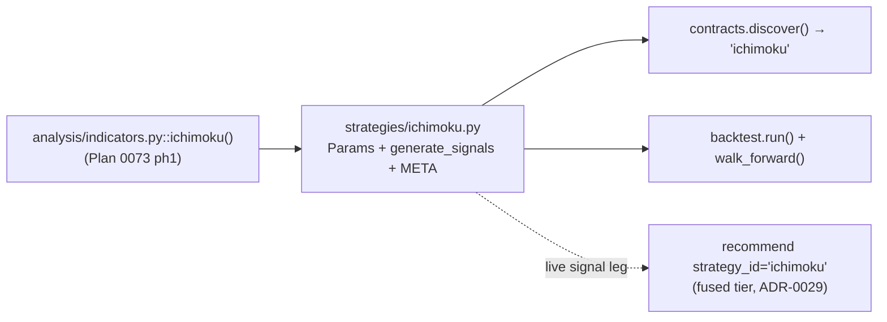

# 0075 — Ichimoku strategy + backtest

> **Status:** done — closed 2026-07-12. Two phases on `main`, no branch, migration-free, no new dep, no new ADR (follows ADR-0004/0050). `strategy-author` ph1 `ddb9879` (`strategies/ichimoku.py`: `Params`+pure `generate_signals`+`META`, TK-cross gated by the cloud, long/short per ADR-0050, Chikou/`long_only`/`exit_on_cloud_cross` toggles, classic 9/26/52/26 defaults; imports `analysis.indicators.ichimoku`, no re-impl; registers the 9th strategy) → `backtester` ph2 `185a260` (`tests/backtest/test_ichimoku_backtest.py`: backtest + walk-forward through the flat/long/short engine, no engine change). Clean Mode 4 — no blockers/majors/minors. Every done-when read at the assertion level: entry lands *at* the bull-cross bar (`bar_index==11 ∧ ENTER_LONG`) with nothing before; the bear mirror emits the exact `[EXIT_LONG, ENTER_SHORT]` stop-and-reverse and `long_only` collapses it to `[ENTER_LONG]`; Chikou withhold derived from real indicator output; `extra="forbid"` + period bounds reject at construction; the **no-lookahead truncation-invariance** test re-runs on every prefix and pins the at-or-before signal set byte-equal (verified structurally too — the imported series is trailing, displacement applied only at consumption `values[i-displacement]`, no double-shift); ph2 pins both a long and a short trade off `result.trades`, `model_dump(exclude={run_id,started_at,finished_at})` re-run equality (ADR-0018), and contiguous strictly-increasing walk-forward folds (ADR-0024). Roster consequence handled (`test_cli` 8→9, no other count assertion affected). Gates re-verified at close: **18 Python** (`test_ichimoku` + `test_ichimoku_backtest` + `test_cli`) green, `mypy --strict` + `ruff` clean. One nit folded in, no change: ph2's fixture is synthetic (not "historical") and writes no `runs/` artifact — the honest choice (determinism-pinnable, no edge claimed, `runs/` gitignored). Once live, `recommend strategy_id="ichimoku"` gets a corroborated Ichimoku leg. Followups: parameter sweep over `conversion`/`base` + toggles; compare its walk-forward edge against Supertrend and chart-pattern breakout.
> **Created:** 2026-07-09
> **Owner skill(s):** strategy-author, backtester
> **Related ADRs:** [0004](../adrs/0004-strategy-interface.md) (strategy interface), [0050](../adrs/0050-short-selling-strategy-backtest.md) (short-selling), [0018](../adrs/0018-backtest-result-schema.md)/[0024](../adrs/0024-extended-backtest-metrics.md) (backtest); **prereq: [Plan 0073](0073-ichimoku-cloud-indicator.md) phase 1** (the `ichimoku()` function)

## TL;DR

Add a contract-conformant `ichimoku` trading strategy (`Params` + pure `generate_signals` + `META`) that enters on a **Tenkan/Kijun cross confirmed by the cloud** — long when Tenkan crosses above Kijun with price above the cloud, short on the mirror (ADR-0050 shorts) — with Chikou confirmation and cloud/Chikou requirements as `Params` toggles, then backtest and walk-forward it. This is the sanctioned "recommendation from Ichimoku within the honesty rules" path (Option C): once the strategy exists, `recommend strategy_id="ichimoku"` uses its live signal as the corroborated leg, and the backtester can measure whether it actually has an edge. The first user-visible behavior is `discover()` listing `ichimoku` and a backtest producing a `BacktestResult`.

## Context & problem

Plan 0073 adds the Ichimoku *indicator* and feeds it into the trend classifier, and Plan 0074 adds an un-corroborated single-indicator *technical read*. Neither makes Ichimoku a **tradeable, backtestable signal**. To get an Ichimoku-driven call that clears the ADR-0029 fused-recommendation bar — corroborated by its own walk-forward edge — Ichimoku must be a first-class strategy, exactly as Supertrend already is (`strategies/supertrend.py`). That is this plan.

The strategy must obey the cross-cutting rules: pure function, trailing-only (no lookahead — Ichimoku's displacement makes this the point to prove), deterministic, `Params` validated at the boundary (ADR-0004).

## Decision

We write `strategies/ichimoku.py` importing `analysis.indicators.ichimoku` (from Plan 0073 phase 1 — no re-implementation, the ADR-0023 single-source discipline `chart_pattern_breakout` already follows by importing `analysis.chart_patterns`). The canonical entry is the **TK cross gated by the cloud**; the variations are `Params`, defaulting to the classic reading:

- **Long entry:** Tenkan crosses above Kijun **and** (`require_cloud_confirmation`, default true) close is above the cloud.
- **Short entry:** Tenkan crosses below Kijun **and** close is below the cloud (`long_only`, default false, suppresses shorts per ADR-0050).
- **Chikou confirmation** (`require_chikou_confirmation`, default false): the current close is above/below the price `displacement` bars ago, in the trade's direction — a trailing comparison, no lookahead.
- **Exit:** stop-and-reverse on the opposing confirmed entry (default), or an optional `exit_on_cloud_cross` that flattens when price re-enters the cloud.

All Ichimoku reads use the correctly-displaced cloud (`senkou_*[i-displacement]`) and trailing TK values, so a decision at bar `i` sees only `bars[0..=i]`. Periods are `Params` (`conversion`/`base`/`span_b`/`displacement`, classic 9/26/52/26).

We keep it a *single* strategy with parametrized variations rather than several strategy modules (the `Params`-toggle convention the existing strategies use).

## Architecture diagram

## Implementation phases

### Phase 1 — `ichimoku` strategy module
- **Owner skill:** strategy-author
- **What:** A contract-conformant `strategies/ichimoku.py` (`Params` pydantic model, pure `generate_signals(bars, params)`, `META`) implementing the TK-cross-gated-by-cloud rules with the toggles above, long/short per ADR-0050.
- **Files touched:** `src/market_analyser/strategies/ichimoku.py` (new), `tests/strategies/test_ichimoku.py` (new), `tests/…/test_cli.py` strategy-roster count bump (the registration consequence).
- **Design notes:**
  - Import `analysis.indicators.ichimoku` — no inline re-implementation. `Params`: `conversion=9`, `base=26`, `span_b=52`, `displacement=26`, `require_cloud_confirmation=True`, `require_chikou_confirmation=False`, `long_only=False`, `exit_on_cloud_cross=False`; `extra="forbid"`.
  - Signals read only trailing/displaced values (cloud under bar `i` = `senkou_*[i-displacement]`); the TK cross is `tenkan[i-1]≤kijun[i-1]` → `tenkan[i]>kijun[i]` (and mirror). No signal until Ichimoku is defined.
- **Done when:** `discover()` includes `ichimoku`; a fixture with a bullish TK cross above the cloud emits a long entry at the cross bar (not before); a bearish mirror emits a short (suppressed when `long_only=True`); `require_chikou_confirmation=True` withholds an entry whose Chikou disagrees; a **truncation-invariance** test re-runs on every prefix and the signal at each bar is unchanged by future bars (no lookahead — the displacement is exercised); `Params` rejects an unknown key.

### Phase 2 — Backtest + walk-forward
- **Owner skill:** backtester
- **What:** Backtest the `ichimoku` strategy on a historical fixture and run a walk-forward, reporting the standard metrics.
- **Files touched:** `tests/backtest/…` (an `ichimoku` case), any fixture under `runs/` per the backtester convention.
- **Design notes:** standard `run(strategy, bars, params)` → `BacktestResult`; walk-forward per ADR-0024 with contiguous strictly-increasing folds (anti-lookahead).
- **Done when:** a backtest over a fixture with both a bullish and a bearish Ichimoku setup produces **both** a long and a short trade; the `BacktestResult` is determinism-pinned (`model_dump(exclude={run_id, started_at, finished_at})` equality across a re-run); walk-forward yields per-fold + aggregate metrics with contiguous folds; results recorded for the user to read (no edge claim implied — the number is whatever it is).

## Risks & open questions

- **Displacement lookahead.** The one real risk; the cloud-under-price read must be `senkou_*[i-displacement]`. Mitigation: the phase-1 truncation-invariance test is the gate, same discipline as Plan 0054.
- **Whipsaw in chop.** TK crosses whipsaw in range-bound markets — expected Ichimoku behavior; the cloud-confirmation default reduces it. The backtest will show it; this plan does not tune it away.
- **Prereq on 0073.** Needs the `ichimoku()` function (Plan 0073 phase 1). If 0073 is not yet implemented, this plan waits on that one phase.

## What this plan does NOT do

- **No new indicator math** — reuses `analysis.indicators.ichimoku` from Plan 0073.
- **No advisory/UI change** — the strategy flows through the *existing* `recommend`/backtest surfaces; no new tool.
- **No parameter optimization / sweep** as part of this plan — a followup can sweep periods.

## Followups (after this lands)

- Optional parameter sweep over `conversion`/`base` and the confirmation toggles.
- Compare the Ichimoku strategy's walk-forward edge against Supertrend and the chart-pattern breakout on the same symbols.
