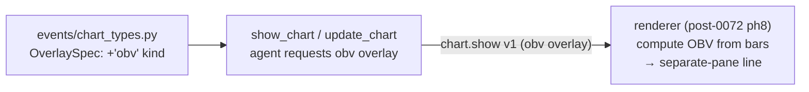

# 0076 — OBV chart overlay

> **Status:** done — CLOSED 2026-07-11. Two code phases on `main`, no branch, migration-free, no new dep. `dev` ph1 `e0f0602` (add `obv` to the `OverlaySpec` `kind` literal — fieldless additive kind, no payload version bump, rejects `price`/`label`/`role`; documented on the show_chart/update_chart surface; `docs/reference/` regenerated). `ui-builder` ph2 `bde7d04` (**reconciled deviation, no defect:** the planned separate-pane OBV render already existed — `lib/volume.ts::computeObv` has drawn always-on in its own auto-scaled bottom strip since Plan 0027, fixture- and no-lookahead-tested — so ph2 delivered the actually-missing piece: a layers-legend toggle for that strip via a new `series:` layer kind, plus the `obv` renderer `OverlayKind` parity mirror). Clean Mode 4 — no blockers/majors/minors. Every done-when read at the assertion level: ph1's three pydantic specs pin the bare-`{kind: "obv"}` round-trip, an `ema` overlay byte-unchanged, and rejection of `price`/`label`/`role`; the TS↔pydantic literal-parity guard (`events.test.ts`) now carries `obv`; ph2's `buildChartLayers` emits the single `series:obv` row only when `hasObv` (hidden-set honoured), and the `CandlestickChart.layers` spec drives a real toggle (`applyOptions({visible:false})` then `{visible:true}`); the pre-existing `computeObv` fixture (`[0,200,50,350,350,600]`) + lookahead-free test satisfy the ph2 OBV-series done-when. Gates verified at close: **5 Python** (obv pydantic) + **78 renderer jest** across the 4 touched suites green (commit claims full 746 renderer green + typecheck 4 configs + lint); `docs/reference/` lists the `obv` kind. **Phase 3 (`human` live smoke — `show_chart` with an `obv` overlay renders the strip tracking accumulation/distribution) is the user's outstanding step, not a code gate.** No paired ADR (realizes ADR-0023's already-computed OBV, follows the Plan 0073-ph3 additive-overlay pattern). **Unblocks Plan 0082 ph5** (OBV in the user-overlay picker — consumes this strip, doesn't duplicate). Excludes `obv_slope` overlay + any OBV strategy/alert (followups).
> **Created:** 2026-07-09
> **Owner skill(s):** dev, ui-builder, human
> **Related ADRs:** [0023](../adrs/0023-technical-analysis-surface.md) (OBV already computed), [0017](../adrs/0017-live-ui-updates-via-sse.md) (overlay events); render phase **sequences after [Plan 0072](0072-codebase-remediation-audit-2026-07.md) phase 8** (same overlay-drawing code as Plan 0073 phase 4)

## TL;DR

Expose On-Balance Volume as a chart overlay. OBV is already computed and trailing (`analysis/volume.py::obv`/`obv_slope`, surfaced in `analyze_symbol`), but there is no way for the agent to ask the viewer to *draw* it. Add an `obv` kind to `OverlaySpec` (additive, no payload version bump — the ADR-0073-phase-3 pattern) and render it as a separate-pane line, the same way `rsi`/`macd` overlays already draw. The first user-visible behavior is `show_chart` with an `obv` overlay putting an OBV line in its own pane under the price chart.

## Context & problem

The analysis surface already has OBV: `obv()` and `obv_slope()` in `analysis/volume.py`, folded into `volume_summary` and returned in the condition snapshot's `indicators` dict — so the agent can *read* OBV via `analyze_symbol`. What is missing is the **overlay descriptor**: `OverlaySpec`'s `kind` literal is `ema/sma/rsi/macd/bbands/price_line/supertrend` — no `obv` — so the agent cannot request an OBV line on the chart. This is a small, self-contained gap.

## Decision

We follow the existing thin-descriptor overlay convention exactly (the same one Plan 0073 phase 3 uses for `ichimoku`): add `obv` to the `OverlaySpec` `kind` literal (additive, disjoint from `price_line`'s fields, no version bump), and have the **renderer compute OBV from the bars it holds** and draw it in a **separate pane** — mirroring how the `rsi`/`macd` oscillator overlays already render below the price series. No sidecar OBV re-implementation on the wire; the renderer's client-side compute is the accepted ADR-0023 display-side duplication.

Because the render lands in the same overlay-drawing code as Plan 0073 phase 4, the render phase is **sequenced after Plan 0072 phase 8** (the `CandlestickChart.tsx` decomposition), for the same contention reason; the dev descriptor phase touches no contended file and ships immediately.

## Architecture diagram

## Implementation phases

### Phase 1 — `obv` overlay descriptor
- **Owner skill:** dev
- **What:** Add `obv` to the `OverlaySpec` `kind` literal and its validation, document it on the `show_chart`/`analyze_symbol` tool surface.
- **Files touched:** `src/market_analyser/events/chart_types.py` (`OverlaySpec`), `tests/events/…`, tool descriptions as needed, generated `docs/reference/` via `pnpm gen:api-docs`.
- **Design notes:** `obv` carries no extra fields (no `period` — OBV is cumulative, unparameterized); it rejects `price`/`label`/`role` like the other indicator kinds. `exclude_none` keeps existing overlays byte-unchanged.
- **Done when:** `OverlaySpec.model_validate({"kind": "obv"})` succeeds and dumps to `{"kind": "obv"}`; `{"kind": "obv", "price": 1}` raises; existing overlays are byte-identical on the wire; the generated API reference lists the kind and `--check` passes.

### Phase 2 — Render OBV in a separate pane  *(SEQUENCE AFTER Plan 0072 phase 8)*
- **Owner skill:** ui-builder
- **What:** In the decomposed chart, compute OBV client-side from the loaded bars and draw it as a separate-pane line, mirroring the `rsi`/`macd` oscillator-pane rendering.
- **Files touched:** the post-0072-ph8 overlay/pane modules under `desktop/renderer/…`, the overlay Zod schema (+ `obv` variant), `lib/` helper + `.test.ts`.
- **Design notes:** reuse the existing separate-pane overlay path (`rsi`/`macd`); OBV is an unbounded cumulative line, so the pane auto-scales (no 0–100 band). Client-side OBV mirrors `analysis/volume.py::obv` (cumulative sign-of-close-change × volume).
- **Done when:** requesting an `obv` overlay draws an OBV line in its own pane under the price chart; toggling it off removes the pane; a `lib` unit test pins the OBV series (cumulative up/down volume) against a small fixture; renderer jest + typecheck + lint green.

### Phase 3 — Live smoke
- **Owner skill:** human
- **What:** Confirm end-to-end.
- **Done when:** `show_chart` with an `obv` overlay on a symbol renders the OBV pane and the line tracks accumulation/distribution visibly against price; recorded for close.

## Risks & open questions

- **Render contention.** The render phase edits the same overlay code as Plan 0073 phase 4; both gate after Plan 0072 phase 8. Mitigation: the dev descriptor phase is independent and ships now; the two render phases can be sequenced or batched by the ui-builder session once the decompose lands.
- **Pane scaling.** OBV is unbounded and its absolute level is arbitrary (seed-dependent) — only its shape/slope matters. The pane must auto-scale; no fixed band. Noted for phase 2.

## What this plan does NOT do

- **No `obv_slope` overlay** — the slope is available in `analyze_symbol`; only the OBV line is drawn here.
- **No OBV-based strategy or alert** — separate `strategy-author` work if wanted.
- **No sidecar OBV-on-the-wire** — the renderer computes it, per the overlay convention.

## Followups (after this lands)

- Optionally expose `obv_slope` as a companion overlay or a divergence marker if OBV/price divergence becomes a wanted signal.
