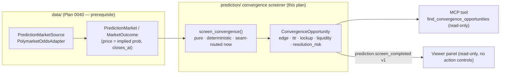

# 0078 — Polymarket convergence screener

> **Status:** done (closed 2026-07-12) — all three code phases on `main`, no branch, migration-free, no new dep. `dev` ph1 `763f113` (pure deterministic `screen_convergence` + `ConvergenceOpportunity`/`ResolutionRisk` models — both-filters, gross `implied_return_if_right`, labeled resolution-risk heuristic, no direction/size/action field) → `dev` ph2 `fc3a467` (`find_convergence_opportunities` MCP tool over the ADR-0031 registry + `prediction.screen_completed v1` event, publish-once/bus-untouched discipline across every failure class, ADR-0046 bounded pages, typed error taxonomy, `EXPECTED_FULL_TOOLSET` membership, `apiref` regenerated) → `ui-builder` ph3 `7ef711e` (reactive read-only Convergence panel: colour-coded risk badge + spelled-out reasons + visible liquidity caution + capital-lockup note, gross return labeled never-EV, `formatDuration` for the ISO-8601 wire duration, `.strict()` Zod loud-drop, TS↔pydantic parity guard, en/ru keys, **zero action controls asserted**, no auto-switch). Clean Mode 4 — **no blockers/majors/minors**, one harmless nit (the error-path `queried_at` reads wall-clock even when `now` is injected — provenance-only, outside the deterministic ranking path). Every done-when read at the assertion level: ph1 pins the both-filters set + hand-computed edge math + the low/medium/high resolution-risk table with reasons + byte-identical re-run + a word-boundary advice grep over the JSON dump AND the model field set; ph2 pins exactly-one-envelope-on-success and zero on empty/all-filtered/upstream-error/input-validation (the last driven through the real registered tool), typed reasons, `too_large` paging, filter-knob passthrough; ph3 drives a real dispatch→Zod→render, asserts zero interactive elements + the `.strict()` drop on an extra `direction` field + no auto-switch, and the parity guard subprocess-dumps the three new pydantic models. Gates re-verified on `main` at close: **37 Python** + **54 renderer jest** green, `apiref --check` exit 0. No paired ADR (consumes ADR-0041/0029/0072/0046/0031). **Phase 4 (`human` live smoke against live Polymarket — near-resolution high-confidence markets surface with plausible edge, resolution-risk/liquidity flags fire on the by-eye-flaggable markets, nothing reads as a buy call) was verified in the 2026-07-12 consolidated live smoke (see [`consolidated-smoke.md`](../../consolidated-smoke.md)).** Followups: feed opportunities to the `advisor` as a basis input (weigh the tail); Polymarket execution (the deferred ADR-0072 venue).
> **Status (prior):** approved (2026-07-11)
> **Created:** 2026-07-11
> **Owner skill(s):** dev, ui-builder, human
> **Prerequisite:** [Plan 0040](0040-polymarket-odds-adapter.md) (the read-only Polymarket odds adapter + tools) **must land first** — this plan reads its `PredictionMarketSource`.
> **Related ADRs:** [ADR-0041](../adrs/0041-polymarket-odds-read-source.md) (Polymarket as a read-only odds source — Plan 0040's), [ADR-0029](../adrs/0029-advisory-recommendation-boundary.md) (conditions are facts; this plan reports opportunities, never a buy call), [ADR-0072](../adrs/0072-bounded-autonomy-and-prediction-market-execution.md) (the *future* execution of these opportunities — out of scope here), [ADR-0046](../adrs/0046-mcp-large-result-delivery.md) (bounded result pages), [ADR-0031](../adrs/0031-data-source-adapter-contract.md) (the source contract this consumes)

## TL;DR

A **read-only convergence screener** over the Plan 0040 Polymarket odds adapter. It finds markets nearing resolution whose price implies a near-certain outcome, and for each computes the **implied return if right**, **time-to-resolution**, **capital-lockup window**, a **liquidity/thin-book caution**, and — the part that earns its keep — a **resolution-risk flag** for ambiguous / disputable outcomes (the fat tail behind the few-percent edge). Surfaced via a read-only MCP tool and a read-only viewer panel. It reports opportunities **as facts with their risks attached** — it never recommends buying (that is the advisor's line, [ADR-0029](../adrs/0029-advisory-recommendation-boundary.md); and *acting* is the execution pillar, [ADR-0072](../adrs/0072-bounded-autonomy-and-prediction-market-execution.md)). This is the analysis layer of the user's "pick up the last few percent on a near-decided market" idea; the buying is deliberately deferred.

## Context & problem

The user wants the app to surface Polymarket opportunities where "the time of the bet is nearly over and there is a clear winner," to capture a small percentage as the price converges to 1.00. This is a real, known strategy — and it is efficient for a reason: the few percent is compensation for a **fat tail** (UMA optimistic-oracle disputes, ambiguous resolution wording, multi-day capital lockup, thin books that can move on one order). A screener that surfaces the edge **without surfacing the tail** would be actively misleading.

Plan 0040 already designs the data layer — a `PolymarketOddsAdapter` over the auth-free Gamma + CLOB endpoints where **price is the implied probability**, plus `closes_at` metadata — but it explicitly does **not** do "market resolution/settlement tracking" and has no screener logic. So the convergence screener is genuinely new work that **sits on top of** Plan 0040. Per the user's decision (2026-07-11), Plan 0040 lands first as the reusable read layer; this plan is the screener above it.

The honest framing (from the 2026-07-11 design session): the computed "return if right" is **gross of the resolution tail**. The screener's job is to attach time, lockup, liquidity, and resolution-ambiguity context so a downstream consumer (the user, or later the advisor/execution) can weigh the tail — never to present the gross number as expected value.

## Decision

Add a pure, deterministic **convergence-screener** module that consumes `list[PredictionMarket]` from the Plan 0040 source and returns ranked `ConvergenceOpportunity` records, each carrying the edge math **and** its risk context (time-to-resolution, capital lockup, liquidity caution, resolution-risk flag). Expose it via one read-only MCP tool and a read-only viewer panel with **zero action controls**. We reject computing any "expected value" that blends the gross edge with a guessed tail probability (dishonest precision — the tail is not reliably quantifiable from odds + metadata); we surface the components and label the residual risk instead. We reject folding this into Plan 0040 (keeps the odds adapter a clean reusable signal). We reject any buy/size/act output (ADR-0029 boundary; ADR-0072 execution).

## Architecture diagram



## Implementation phases

### Phase 1 — Convergence-screener core + model
- **Owner skill:** `dev`
- **What:** A pure `screen_convergence(markets, *, params, now)` over the Plan 0040 `PredictionMarket` list, returning ranked `ConvergenceOpportunity` records. Filters: time-to-close ≤ a configurable window **and** the top outcome's implied probability ≥ a configurable confidence floor. Per opportunity, compute: `implied_return_if_right = (1 − price) / price`; `time_to_resolution` (from `closes_at`, seam-routed `now`); a `capital_lockup` note (close is not settlement — UMA resolution can lag/dispute); a `liquidity_caution` derived from the Plan 0040 volume/liquidity hint (a thin book is not ground truth); and a **`resolution_risk`** flag from labeled heuristics (multi-outcome vs binary, low volume, dispute-prone category/wording keywords) — an **honest, labeled heuristic, never a guarantee**. Deterministic: no wall-clock in the ranking math (the only time input is the injected `now`), no set iteration, stable sort.
- **Files touched:** `src/market_analyser/prediction/__init__.py`, `src/market_analyser/prediction/convergence.py`, `src/market_analyser/prediction/models.py`, `tests/prediction/test_convergence.py`.
- **Done when:** Against a fixture of markets (a near-certain binary near close, a thin-book near-certain, a multi-outcome ambiguous, and a far-from-close control), the screener returns exactly the opportunities passing both filters, ranked stably; the edge math matches hand-computed values; `time_to_resolution` and `capital_lockup` are populated from `closes_at`; the thin-book market carries `liquidity_caution`; the multi-outcome/ambiguous market carries an elevated `resolution_risk` with its reason; a re-run with the same `now` is byte-identical; and a word-boundary grep asserts **no output field or string carries a buy/sell/act recommendation** (the ADR-0029 pattern used by Plan 0041).

### Phase 2 — `find_convergence_opportunities` MCP tool + SSE event
- **Owner skill:** `dev`
- **What:** A read-only MCP tool that runs the screener through the registry-selected `PredictionMarketSource` and returns ranked opportunities with provenance (`queried_at`, source identity) and each opportunity's full risk context. Results are bounded per [ADR-0046](../adrs/0046-mcp-large-result-delivery.md) (top-N + typed `too_large`, never an unbounded dump). Publish a `prediction.screen_completed v1` event (payload in the events core, small + ephemeral like `signal.evaluated`) for the viewer. Charter-safe: reports opportunities + risks as facts, never advice.
- **Files touched:** `src/market_analyser/api/mcp_tools/prediction_screener.py`, `src/market_analyser/api/mcp_app.py` (the `register_*` seam), `src/market_analyser/events/payloads.py` (+ the envelope registry), `tests/api/test_prediction_screener_tool.py`, the full-toolset registration test, `docs/reference/` (regen).
- **Done when:** The tool returns ranked opportunities for a query through the swappable source, each with provenance + risk context and no advice; oversized result sets return the typed `too_large` page, not a dump; the tool appears in the full-toolset assertion; the event publishes **exactly once per successful run, strictly after the result is built** (every raise above the publish leaves the bus untouched — pinned in both the input-validation and empty-fetch failure classes); `docs/reference/` regenerates clean (`apiref --check` green).

### Phase 3 — Read-only viewer panel *(may trail phases 1–2)*
- **Owner skill:** `ui-builder`
- **What:** A read-only Prediction/Convergence panel listing opportunities — question, outcome, implied probability, return-if-right, time-to-resolution, capital-lockup note, liquidity caution, and a prominent **resolution-risk badge**. Honest-uncertainty states are specs, not polish: a thin-book or high-resolution-risk opportunity renders its caution visibly, never as a clean number. **Zero action controls** — no buy button, no size input (the ADR-0029/ADR-0072 no-action posture; mirrors the Recommendation/Forecast panels). Payload Zod-validated in the dispatcher (`safeParse`, loud drop), the schema `satisfies`-pinned to the TS mirror.
- **Files touched:** `desktop/renderer/` — a new view/tab + its spec, the `useEventStream` wiring for `prediction.screen_completed`, the Zod payload schema, `t()` catalog keys (en/ru, per [ADR-0063](../adrs/0063-in-house-i18n-and-reason-codes.md)).
- **Done when:** The panel renders one row per opportunity from a `prediction.screen_completed` event with the edge + all risk fields; a high-`resolution_risk` row renders its badge + reason and a thin-book row renders its caution (asserted); the panel contains **zero** interactive action elements (asserted, matching the Recommendation-panel no-action spec); an invalid payload is dropped loudly with no render; deliberately **no auto-switch** to the tab (an opportunity must not grab the screen — the 0037/0060 pattern).

### Phase 4 — Live smoke
- **Owner skill:** `human`
- **What:** Run the screener through the running sidecar against live Polymarket data: confirm it surfaces genuinely near-resolution high-confidence markets with plausible edge, and that the resolution-risk/liquidity flags fire on the markets a human would flag by eye. Confirm no advice appears anywhere in the output.
- **Done when:** The user confirms a live run returns sensible convergence opportunities with honest risk context, and nothing reads as a buy recommendation.

## Data shapes

```python
# illustrative — not the final interface
class ConvergenceOpportunity(BaseModel):
    market_id: str
    question: str
    outcome_label: str                 # the near-certain outcome
    implied_probability: float         # its Plan 0040 price, in [0, 1]
    implied_return_if_right: float     # (1 - price) / price — GROSS of the resolution tail
    time_to_resolution: timedelta      # from closes_at and the injected now
    capital_lockup_note: str           # close ≠ settlement; UMA resolution can lag/dispute
    liquidity_caution: str | None      # thin-book warning from the Plan 0040 volume hint
    resolution_risk: ResolutionRisk    # {level, reasons[]} — a LABELED HEURISTIC, not a guarantee
    queried_at: datetime               # provenance (seam-routed now)
    source: str                        # "polymarket"
```

## Risks & open questions

- **The resolution-risk flag is a heuristic, not a guarantee.** The fat tail (UMA disputes, wording ambiguity) cannot be fully detected from odds + metadata. It must be labeled as a heuristic everywhere it appears; the plan must not let it read as a settled probability. This is the single most important honesty constraint.
- **The edge is gross of the tail.** `implied_return_if_right` is never expected value. The plan deliberately does not compute a blended EV (that would fake precision the data can't support) — it surfaces the components and the residual risk.
- **Depends on Plan 0040**, which itself carries open questions (public-endpoint rate limits, API-shape stability). This plan inherits the resilient client and typed error taxonomy; a Plan 0040 shape change surfaces as a clean typed failure, not a bad opportunity.
- **Legal/access.** Polymarket restricts certain jurisdictions (notably US persons) in its ToS. This plan is **read-only** and does not act, so it does not itself cross that line — but the future execution (ADR-0072) does, and the user must confirm usability where they are before any execution work.
- **Open question:** how far back does `closes_at` reliably distinguish "close" from "resolution"? If the public data conflates them, the `capital_lockup` note is best-effort — flag it at build time.

## What this plan does NOT do

- **No buying, sizing, signing, or execution** — that is the execution pillar ([ADR-0072](../adrs/0072-bounded-autonomy-and-prediction-market-execution.md), Polymarket-as-venue), a deferred and separately-gated decision.
- **No recommendation** — it reports opportunities + risks as facts; turning that into "you should buy this" is the advisor's line ([ADR-0029](../adrs/0029-advisory-recommendation-boundary.md)), and even the advisor never acts.
- **No historical-odds backfill / no convergence backtest** — current markets only; a historical-odds series is a Plan 0040 open question, and backtesting convergence is a later concern.
- **No blended expected-value number** — components + labeled residual risk only.

## Followups (after this lands)

- Feed convergence opportunities to the `advisor` as a new basis input (so `recommend` can weigh a Polymarket opportunity against its resolution tail) — a separate advisor plan, still no execution.
- Polymarket *execution* (buy the near-certain outcome) — the deferred venue under [ADR-0072](../adrs/0072-bounded-autonomy-and-prediction-market-execution.md), targeting `py-sdk`, on the assisted-confirm state machine.
