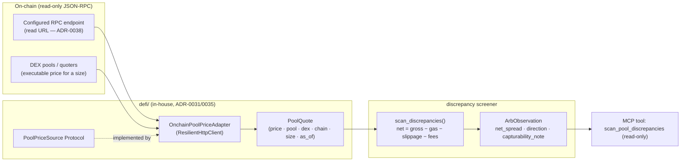

# 0079 — Cross-pool discrepancy scanner (DeFi arbitrage evidence layer)

> **Status:** done (closed 2026-07-11) — code phases 1–3 landed on `main`, no branch, migration-free, no new dependency: ph1 `41c2922` (`PoolPriceSource` Protocol + `OnchainPoolPriceAdapter` + `PoolQuote` model + registry entry), ph2 `7f8e884` (pure `scan_discrepancies` net-of-cost screener), ph3 `20f55a9` (`scan_pool_discrepancies` read-only MCP tool). Clean Mode 4 — no blockers/majors; one minor doc-nuance + one nit, both folded into the close (no new ADR). The Phase-1 open design call was resolved correctly by **riding ADR-0031 + ADR-0038 without a new read-source ADR** — the adapter is a thin `ResilientHttpClient.post` extension issuing only sequential `eth_call`s, not the batched/multi-chain shape that would have justified an ADR-0052/0053-style record. **The net-of-cost decomposition is mathematically exact** (verified `gross_spread − est_slippage == quote_out − quote_in`, the true round-trip proceeds); slippage provably ≥0 both legs; `net_spread` is the only number ever called an opportunity and may go negative (informative). **Read-only proven, not just asserted** — `test_adapter_source_is_read_only` runs a regex source-scan for key/signing/state-changing tokens **plus** an AST walk pinning `method_values == {"eth_call"}`. Determinism held: `queried_at` = newest quote `as_of` (no wall-clock), stable sort, byte-identical re-run pinned; boundary validation rejects NaN/Inf/non-positive at `PoolQuote` construction, never silently zeroed. Clean layering through the `pool_price_sources` registry seam (Protocol in `data/sources.py`, adapter in `data/adapters/`, pure screener in `defi/`, tool in `api/mcp_tools/`). Gates: 53 tests green (`test_pool_price_adapter` + `test_discrepancy` + `test_pool_discrepancy_tool` + `test_mcp_tools`), `apiref --check` exit 0, `ruff` clean, `mypy --strict` clean, `EXPECTED_FULL_TOOLSET` carries `scan_pool_discrepancies`. **Live plumbing smoke passed** — called `scan_pool_discrepancies` on the running sidecar: well-formed bounded response, `source: "onchain"`, `capturability_note` present, empty observations (by design — `DEFAULT_POOLS` is empty until Phase 4 supplies verified addresses). **Phase 4 (`human`, the BA-7 live evidence smoke on Base → `runs/defi/`) is the user's outstanding step, not a code gate** — it needs a live RPC URL + verified real pool addresses and human judgment; a null result (discrepancies vanish net-of-cost) is a documented, legitimate success. ADR-0072 correctly stays `proposed` — this close does not flip it; Phase 4's evidence is what would eventually justify scoping an arb-execution build.
> **Created:** 2026-07-11
> **Owner skill(s):** dev, human
> **Related ADRs:** [ADR-0072](../adrs/0072-bounded-autonomy-and-prediction-market-execution.md) (the *future* atomic-arb execution this scanner is the evidence gate for — **out of scope here**; BA-7 unlocks execution only if this scanner shows a real net-of-cost edge), [ADR-0031](../adrs/0031-data-source-adapter-contract.md) (per-capability source contract — the new pool-price source follows it), [ADR-0038](../adrs/0038-third-party-api-key-storage.md) (the RPC endpoint config lives here — a read URL, not a trade key), [ADR-0019](../adrs/0019-external-http-adapter-resilience.md) (resilient client), [ADR-0035](../adrs/0035-defi-domain-placement.md) (DeFi domain placement), [ADR-0046](../adrs/0046-mcp-large-result-delivery.md) (bounded result pages), [ADR-0009](../adrs/0009-rewrite-data-layer-in-house.md) (in-house read adapter)

## TL;DR

A **read-only** cross-DEX pool-price source plus a discrepancy scanner that surfaces price differences for the same asset pair across pools/DEXs, **net of gas + slippage + fees**, together with how large and how persistent each discrepancy is. It signs nothing, holds no private key, moves no funds — the only credential is a read-only JSON-RPC endpoint URL. Its purpose is **evidence**: it answers, with real data, whether cross-pool arbitrage discrepancies ever survive net-of-cost at retail observability — the [ADR-0072](../adrs/0072-bounded-autonomy-and-prediction-market-execution.md) BA-7 gate that must pass **before** any autonomous arb-execution build is written. A null result (discrepancies vanish net-of-cost, as the honest prior expects) is a legitimate and valuable outcome: it saves an expensive, adversarial execution build.

## Context & problem

The user wants a high-speed bot that trades discrepancies between DeFi pools. The 2026-07-11 design session established two things. **First, viability is the real question, not language speed.** On-chain arbitrage is atomic (single-block, flashloan-funded) and won in a block-builder auction by professional searchers colocated next to builders; retail latency from a desktop app is structurally last in line, and Rust helps at the margin but does not manufacture the edge. **Second, the honest way to find out is to measure first.** Before committing to the hardest, most adversarial execution domain in crypto, build the read-only scanner that quantifies the opportunity net-of-cost and reports whether it is ever capturable — then decide.

The data layer has no cross-DEX **pool-price** source today (adapters are Yahoo / Binance / CoinGecko / CoinMetrics / Zerion / TradingView; the `defi/` package is wallet discovery, tx history, PnL, and position risk — not pool pricing). So this plan adds a new read capability and the screener on top.

**Crucial honesty note carried into the plan:** a scanner reading pool prices via JSON-RPC is *already slower* than a colocated searcher. So the persistence it measures is an **upper bound** on capturability — a discrepancy that looks persistent to an RPC poller may still be uncapturable in practice. The plan states this everywhere it reports persistence; the scanner measures *observability*, not guaranteed capture.

## Decision

Add a read-only `PoolPriceSource` per-capability Protocol ([ADR-0031](../adrs/0031-data-source-adapter-contract.md)) and an on-chain adapter that reads the **executable price for a given trade size** from configured pools/DEXs via JSON-RPC quoter/pool reads over a configured RPC endpoint (the endpoint URL stored per [ADR-0038](../adrs/0038-third-party-api-key-storage.md) — a read credential, categorically not a trade key). On top of it, a pure discrepancy screener computes **net-of-cost** spreads (gross spread minus gas estimate, per-pool slippage for the sized trade, and pool fees) and flags which clear a configurable threshold. Surfaced via a read-only MCP tool. This lives under `defi/` ([ADR-0035](../adrs/0035-defi-domain-placement.md)), signs nothing, and is the BA-7 evidence gate for [ADR-0072](../adrs/0072-bounded-autonomy-and-prediction-market-execution.md).

We reject a DEX-aggregator quote API (0x/1inch) as the price source — it returns a routed net quote across venues, which hides the *per-pool* discrepancy the scanner needs (and adds a key + ToS). We reject a subgraph/indexed source as primary — indexer lag makes its persistence numbers meaningless for a latency question (fine only as a slow historical cross-check). We reject presenting any gross spread as the opportunity (gas + slippage + fees are subtracted before a number is called a discrepancy). We reject any execution/signing here (ADR-0072, and only after this scanner's evidence).

> **Open design decision (resolve at Phase 1, architect call):** if the JSON-RPC pool-read adapter diverges materially from the REST-GET `ResilientHttpClient` pattern (batched `eth_call`, per-DEX ABI/quoter specifics, multi-chain), it warrants a short paired **read-source ADR** in the lineage of [ADR-0052](../adrs/0052-binance-exchange-data-source.md)/[ADR-0053](../adrs/0053-onchain-valuation-source.md) before implementation. The default is: ride ADR-0031 + ADR-0038 without a new ADR if the adapter is a thin resilient-client extension; escalate to a paired ADR if it isn't. Decide before writing Phase 1 code, not during.

## Architecture diagram



## Implementation phases

### Phase 1 — `PoolPriceSource` Protocol + on-chain pool-price adapter
- **Owner skill:** `dev`
- **What:** A `@runtime_checkable` `PoolPriceSource` Protocol ([ADR-0031](../adrs/0031-data-source-adapter-contract.md)) and an `OnchainPoolPriceAdapter` that reads the **executable price for a (pair, trade size)** from configured pools across one or more DEXs via JSON-RPC over the configured RPC endpoint (URL from the [ADR-0038](../adrs/0038-third-party-api-key-storage.md) store), on the resilient client. Boundary-validated `PoolQuote` (price, pool id/address, dex, chain, trade size, `as_of`), typed error taxonomy (never silently zeros a price), one selector-registry entry. **Read-only, provably:** no signing, no private key, no HTTP write verb, no state-changing RPC method — only reads (`eth_call`/view reads). *(Resolve the read-source-ADR question from the Decision block before starting.)*
- **Files touched:** `src/market_analyser/data/sources.py` (the Protocol), `src/market_analyser/defi/pool_prices.py` (or `data/adapters/onchain_pools.py`), the models module, the selector registry, config wiring for the RPC endpoint, `tests/defi/test_pool_price_adapter.py`.
- **Done when:** Against a recorded JSON-RPC fixture, the adapter returns a `PoolQuote` per configured pool for a pair + size, each price validated positive and finite; a malformed/missing-field RPC response raises the typed error (never a zero/NaN price); the adapter satisfies `isinstance(adapter, PoolPriceSource)` and is reachable through one registry entry; an AST/grep scan asserts **no private key, no signing, no state-changing RPC method, no write verb** anywhere in the adapter (the ADR-0041/Plan 0041 read-only proof pattern).

### Phase 2 — Cross-pool discrepancy screener core
- **Owner skill:** `dev`
- **What:** A pure `scan_discrepancies(quotes, *, params)` over the per-pool quotes for a pair → ranked `ArbObservation` records: gross spread between the cheapest and dearest pool, **net spread after subtracting an estimated gas cost, the per-pool slippage implied by the sized trade, and pool fees**, the implied direction (buy pool A / sell pool B), and a **`capturability_note`** stating plainly that RPC-observed persistence is an upper bound, not a capture guarantee. Sub-threshold nets are flagged not-capturable, not dropped silently (a `log()`-style disclosure that they existed but didn't clear cost). Deterministic: no wall-clock, no set iteration, stable sort.
- **Files touched:** `src/market_analyser/defi/discrepancy.py`, `tests/defi/test_discrepancy.py`.
- **Done when:** A fixture with a known cross-pool discrepancy yields the correct **net** spread (gas + slippage + fees demonstrably subtracted — a gross number is never returned as the opportunity), the correct buy/sell direction, and the `capturability_note`; a discrepancy smaller than gas+slippage is flagged not-capturable rather than surfaced as an opportunity; a re-run is byte-identical.

### Phase 3 — `scan_pool_discrepancies` MCP tool
- **Owner skill:** `dev`
- **What:** A read-only MCP tool running the screener through the registry-selected `PoolPriceSource` for a configured pair set, returning ranked net-of-cost observations with provenance (`queried_at`, per-pool `as_of`, source identity) and each observation's capturability note. Bounded per [ADR-0046](../adrs/0046-mcp-large-result-delivery.md). Charter-safe: reports discrepancies as facts, never advice, never an execution instruction.
- **Files touched:** `src/market_analyser/api/mcp_tools/pool_discrepancies.py`, `src/market_analyser/api/mcp_app.py` (register seam), `tests/api/test_pool_discrepancy_tool.py`, the full-toolset registration test, `docs/reference/` (regen).
- **Done when:** The tool returns ranked net-of-cost observations through the swappable source with full provenance and no advice/execution output; oversized sets return the typed `too_large` page; the tool appears in the full-toolset assertion; `docs/reference/` regenerates clean (`apiref --check` green).

### Phase 4 — Live evidence smoke (the BA-7 gate)
- **Owner skill:** `human`
- **What:** Run the scanner through the running sidecar against real pools on a live chain (candidate: Base, cheap gas) over a session, and record the finding: **do cross-pool discrepancies ever survive net-of-cost at RPC observability, and for how long?** This is the evidence that [ADR-0072](../adrs/0072-bounded-autonomy-and-prediction-market-execution.md) BA-7 requires before any arb-execution plan is written. Capture the result as a run artifact under `runs/defi/`.
- **Done when:** The user has a recorded live read on whether net-of-cost discrepancies appear and persist — a clear go (persistent net edge exists → an arb-execution plan under ADR-0072 becomes worth scoping) or, equally valid, a no-go (they vanish net-of-cost → the execution build is not pursued, and the honest prior is confirmed).

## Data shapes

```python
# illustrative — not the final interface
class PoolQuote(BaseModel):
    pool_id: str                       # pool address / identifier
    dex: str                           # "uniswap-v3", "aerodrome", ...
    chain: str                         # "base", "ethereum", ...
    pair: str                          # canonical pair label
    trade_size: float                  # the size the executable price is quoted for
    price: float                       # executable price for that size (validated > 0, finite)
    as_of: datetime                    # block time / read time (provenance)

class ArbObservation(BaseModel):
    pair: str
    buy_pool: str                      # cheapest executable
    sell_pool: str                     # dearest executable
    gross_spread: float
    est_gas_cost: float                # subtracted
    est_slippage: float                # per-pool, for trade_size — subtracted
    est_fees: float                    # subtracted
    net_spread: float                  # gross − gas − slippage − fees — THE honest number
    capturable_at_threshold: bool
    capturability_note: str            # RPC-observed persistence is an UPPER BOUND, not capture
    queried_at: datetime
```

## Risks & open questions

- **The viability prior is negative — and that's fine.** Retail-latency arb competes with colocated searchers; the scanner may confirm no net-of-cost edge is retail-capturable. That is a legitimate, valuable outcome (it stops an expensive adversarial build), not a plan failure. The plan is framed so a null result is a success.
- **RPC observability ≠ execution latency.** Persistence measured by an RPC poller is an upper bound on capturability; a colocated searcher sees and captures faster. Stated in the `capturability_note` and the Phase 4 artifact — the scanner measures observability, never guaranteed capture.
- **Gas/slippage estimation accuracy.** Net spread is only as honest as its cost model. The estimate must be conservative and its assumptions surfaced; an optimistic cost model would fabricate opportunities. Pin the cost assumptions in the output.
- **RPC rate limits / cost.** Batched reads on the resilient client; confirm the endpoint's limits at build and back off. A public RPC may be too rate-limited for tight polling — the config allows a paid endpoint URL (still a read credential).
- **Persistence-over-time needs repeated sampling.** A point-in-time tool answers "is there a discrepancy now"; measuring *how long* one lasts needs repeated sampling. Phase 4 does this manually over a session; an automated persistence study using the [ADR-0055](../adrs/0055-in-sidecar-watch-scheduler.md) scheduler pattern is a **followup**, not in scope here.
- **Open question (Phase 1):** whether the JSON-RPC adapter warrants its own paired read-source ADR (see the Decision block) — resolve before Phase 1 code.

## What this plan does NOT do

- **No execution, signing, bundles, flashloans, or MEV submission** — that is [ADR-0072](../adrs/0072-bounded-autonomy-and-prediction-market-execution.md)'s bounded-autonomy path, gated on **this** scanner's evidence (BA-7) and separately planned.
- **No private key, no wallet, no state-changing RPC** — read-only, proven by an AST/grep scan.
- **No automated persistence study / no scheduler wiring** — Phase 4 samples persistence manually; the scheduled study is a followup.
- **No aggregator-routed pricing** — per-pool executable prices only (the discrepancy is the point).
- **No UI** — the value here is evidence; a viewer panel is a followup if the edge proves real.

## Followups (after this lands)

- If Phase 4 shows a real edge: an automated persistence study via the [ADR-0055](../adrs/0055-in-sidecar-watch-scheduler.md) scheduler (sample discrepancies on a clock, accrue duration stats).
- If Phase 4 shows a real edge: scope the atomic-arb execution plan under [ADR-0072](../adrs/0072-bounded-autonomy-and-prediction-market-execution.md) (BA-1…BA-7 as acceptance criteria; headless service; testnet-first).
- Optional viewer panel for live discrepancies (`ui-builder`), read-only, no action controls.
