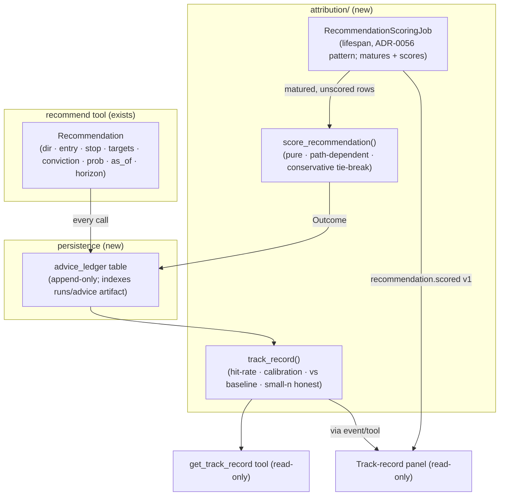

# 0080 — Advisor recommendation track record (live outcome attribution)

> **Status:** done (closed 2026-07-11) — [ADR-0075](../adrs/0075-recommendation-outcome-attribution.md) accepted at close. All five code phases on `main`, no branch, one migration (`0008_advice_ledger`). `dev` ×4 (ph1 ledger + write-on-recommend + one-shot `runs/advice` back-fill `1d8a5c9`; ph2 pure path-dependent scoring `74aa67a`; ph3 scheduled scorer + `recommendation.scored v1` `ec5050b`; ph4 aggregation + `get_track_record` tool `3560b29`) → `ui-builder` ×1 (ph5 read-only Track-record view + `GET /track_record` prereq route `04337ee`→`890f176`). Clean Mode 4 — no blockers/majors/minors/nits; every named done-when read at the assertion level. The honesty core is genuinely defended, not stubbed: the anecdote-killer (`test_stopped_intraday_but_ending_higher_is_a_loss` asserts `stopped` + `directional_correct=True`, the two axes provably independent), the conservative stop-first tie-break, a lookahead-trap bar (day-4 range that would force a target if read → still `timeout`), byte-identical re-scoring; the baseline-mimic (all-long uptrend → `hit_rate_vs_baseline ≈ 0.0`), an overconfidence flag (0.80 stated / 0.55 realized), and small-n withholding (n=3 → `sufficient=False`, all conclusion fields `None`, no bare % leaked to the renderer); the scorer publishes exactly one event per newly-scored row strictly after persistence, contains a bad row in the heartbeat while the others score, re-scores nothing on a second tick, never scores a flat; the tool description passes a word-boundary no-advice assert and `get_track_record` is in `EXPECTED_FULL_TOOLSET` (set membership). Structural honesty holds: append-only first-write-wins repository (no update/delete of the recorded ticket, so cherry-picking a loser out is impossible), every call recorded directional + flat, `create_app` defaults `recommendation_scoring_enabled=False` (a wired test app never reaches the network) while `AppConfig` ships it on. Determinism preserved — `now` is seam-routed for the maturity check only and never enters the return/R math. Close gates: 128 Python (attribution + persistence + migrations + recommend/track-record tool + route + full-toolset + healthz) + 70 renderer jest green; `docs/reference/` regenerates byte-clean (no drift). Open: **Phase 6 (human live smoke) is the user's outstanding step, not a code gate** — it accrues real recommendations and waits for their horizons to mature, so it runs on the user's own cadence; a null track record is a documented success, not a reopen.
> **Created:** 2026-07-11
> **Owner skill(s):** dev, ui-builder, human
> **Related ADRs:** [ADR-0075](../adrs/0075-recommendation-outcome-attribution.md) (scoring methodology + anti-cherry-pick invariant — **accepts at this plan's close**), [ADR-0074](../adrs/0074-edge-selection-criteria-for-execution.md) (this is the live instrument for ES-3/ES-5), [ADR-0029](../adrs/0029-advisory-recommendation-boundary.md) (the `Recommendation`), [ADR-0058](../adrs/0058-forecast-recommendation-explainability.md) (recommendations already persisted as `runs/advice` artifacts), [ADR-0018](../adrs/0018-backtest-result-schema.md) (disk + SQLite-index pattern + determinism), [ADR-0056](../adrs/0056-self-warming-metric-store.md) (lifespan-job pattern for the scorer), [ADR-0030](../adrs/0030-forecasting-subsystem.md)/[ADR-0057](../adrs/0057-forecast-feature-set-tiers.md) (beats-baseline), [ADR-0046](../adrs/0046-mcp-large-result-delivery.md) (bounded results)
> **Migration:** adds one Alembic migration (the ledger table) → **serialize against the migration chain** (Plan 0044 is next in line); confirm the chain head is free before implementing, do not parallelize with another migration-bearing plan.

## TL;DR

A **live track record for the advisor's own recommendations**: every `recommend` call is written to an append-only, queryable ledger; a scheduled background job scores each call once its horizon matures — **path-dependently** (did the stop or a target hit first, honoring the actual ticket) — and the system reports **hit-rate, calibration, and a beats-a-naive-baseline comparison** over the whole history. It closes the loop the user asked for ("we called DOGE long, price rose — note it") but does so honestly: it records losers as faithfully as winners, scores a stopped-out call as a loss even if price later rose, and refuses to present a conclusion on a handful of samples. This is the live counterpart to walk-forward validation and the concrete instrument for [ADR-0074](../adrs/0074-edge-selection-criteria-for-execution.md)'s honest-validation (ES-3) and decay-monitoring (ES-5) gates.

## Context & problem

The `recommend` tool produces a full `Recommendation` (direction, entry zone, stop, targets, conviction, forecast basis), emits `recommendation.completed`, and persists the verdict as a `runs/advice` artifact ([ADR-0058](../adrs/0058-forecast-recommendation-explainability.md)) — but nothing ever scores that call against subsequent price. So there is no way to answer "is the advisor actually any good," only anecdotes.

The trap the user's framing exposes: "we called long and price is up, so it was right" is a single sample, and it ignores the stop the advice carried. A feature that only surfaces remembered wins would be a confirmation-bias machine — the exact self-deception [ADR-0074](../adrs/0074-edge-selection-criteria-for-execution.md) names as the dominant retail failure. The honest feature records **every** call, scores it against the ticket it actually gave, and reports the result relative to a trivial baseline with its sample size stated. [ADR-0075](../adrs/0075-recommendation-outcome-attribution.md) fixes that methodology; this plan builds it.

## Decision

Add a durable, queryable recommendation **ledger** (SQLite table indexing the existing `runs/advice` artifacts, the [ADR-0018](../adrs/0018-backtest-result-schema.md) pattern), a pure **path-dependent scoring engine**, a **lifespan-managed scheduled scorer** ([ADR-0056](../adrs/0056-self-warming-metric-store.md) pattern) that matures-and-scores automatically and emits `recommendation.scored`, an **aggregation** layer (hit-rate + calibration + baseline), a read-only `get_track_record` MCP tool, and a read-only viewer panel. Every design choice follows [ADR-0075](../adrs/0075-recommendation-outcome-attribution.md): append-only every-call, path-dependent with a conservative intrabar tie-break, no-lookahead maturity gate, baseline-relative, calibrated, deterministic, honest small-n. Scope is advisor recommendations; scoring standalone `forecast`-tool calls is a followup on the same machinery.

## Architecture diagram



## Implementation phases

### Phase 1 — Ledger table + write-on-recommend (append-only, every call)
- **Owner skill:** `dev`
- **What:** An Alembic migration adding an `advice_ledger` table keyed to each recommendation (symbol, timeframe, `as_of_bar_ts`, `horizon_bars`, direction, entry, stop, targets JSON, conviction, forecast probability, artifact path, `created_at`, plus nullable outcome columns filled in Phase 3). A repository under `persistence/`. Wire the `recommend` tool to write **one ledger row per call** — directional and flat alike — beside its existing `runs/advice` artifact (index-not-replace, [ADR-0018](../adrs/0018-backtest-result-schema.md) pattern). Append-only: no update/delete of the recorded call.
- **Files touched:** `persistence/migrations/versions/00NN_advice_ledger.py`, `persistence/models.py` (or the table module), `persistence/advice_ledger_repository.py`, `api/mcp_tools/recommend.py` (write the row after the artifact), `tests/persistence/test_advice_ledger_repository.py`, `tests/api/test_recommend.py` (the write assertion).
- **Done when:** A `recommend` call (directional) writes exactly one ledger row capturing direction/entry/stop/targets/conviction/prob/as_of/horizon + artifact path; a flat call writes a row marked non-directional; the repository round-trips rows and lists by symbol/maturity; the migration applies and reverts cleanly; a re-run of the same recommendation does not duplicate or mutate the prior row (append-only, one row per call). No cherry-pick path exists (there is no code to skip recording a call — asserted by the tool always writing).

### Phase 2 — Pure path-dependent scoring engine
- **Owner skill:** `dev`
- **What:** A pure `score_recommendation(row, realized_bars, *, now) -> Outcome` in a new `attribution/` package. For a directional call: notional entry at the as-of close, then walk the realized bars over the horizon and determine whether the **stop or a target hit first** (bar high/low), with the **conservative stop-first tie-break** when one bar spans both ([ADR-0075](../adrs/0075-recommendation-outcome-attribution.md)). Emit `Outcome` = {outcome_class ∈ target_hit/stopped/timeout, realized_return, realized_R, directional_correct, prob_for_calibration}. Enforce the **maturity gate**: if fewer than `horizon_bars` bars exist strictly after `as_of`, return `pending` and score nothing (no lookahead). Deterministic: no wall-clock in the scoring math (seam-routed `now` used only for the maturity check); stable.
- **Files touched:** `attribution/__init__.py`, `attribution/scoring.py`, `attribution/models.py`, `tests/attribution/test_scoring.py`.
- **Done when:** Fixtures pin each branch — a call whose target is hit before its stop scores `target_hit` with the right R; a call **stopped out intraday but ending higher scores `stopped` (a loss)** — the anecdote-killer, asserted explicitly; a bar spanning both stop and target scores `stopped` (conservative tie-break); a horizon with no touch scores `timeout` with the realized return; an immature row returns `pending` and reads **no** bar beyond `as_of + horizon` (a lookahead guard spy); re-scoring a matured row is byte-identical.

### Phase 3 — Scheduled scorer + `recommendation.scored` event
- **Owner skill:** `dev`
- **What:** A `RecommendationScoringJob` riding the sidecar lifespan ([ADR-0056](../adrs/0056-self-warming-metric-store.md) pattern — constructed only when persistence is wired and `recommendation_scoring_enabled` is on; tick-first boot; cancelled on shutdown). On tick: find matured, unscored ledger rows, fetch their realized bars through the provider, score via Phase 2, persist the `Outcome` onto the row, and publish a `recommendation.scored v1` event (payload in the events core). Per-row containment (one row raising does not stall the batch; the error is surfaced on `/healthz` like the accrual heartbeat). `create_app`'s own default disabled (a wired test app must not reach the network), config passes it through.
- **Files touched:** `attribution/scoring_job.py`, `events/payloads.py` (+ envelope registry), `api/app.py` (lifespan wiring), `config.py` (`recommendation_scoring_enabled` default true + interval), `/healthz` heartbeat, `tests/attribution/test_scoring_job.py`, `tests/api/test_healthz.py`, `docs/reference/` (regen).
- **Done when:** The job scores exactly the matured-unscored rows and leaves `pending` rows untouched; a scored row persists its outcome and the job publishes **exactly one** `recommendation.scored` per newly-scored row, strictly after persistence; one row raising leaves the others scored and names the error in the heartbeat; the job is absent when persistence is unwired / flag off; `docs/reference/` regenerates clean.

### Phase 4 — Aggregation + `get_track_record` tool (baseline + calibration + honest small-n)
- **Owner skill:** `dev`
- **What:** A pure `track_record(rows, *, baseline)` computing, over scored rows: overall + per-(symbol, horizon, conviction-bucket) **hit-rate** and mean R; a **calibration** read (Brier score + reliability buckets: stated prob vs realized frequency); and a **baseline comparison** (advisor hit-rate/return vs a naive buy-and-hold / always-in-trend directional expectation over the same symbols+horizons). Every aggregate carries its `n` and a `sufficient: bool` flag gated on a stated `MIN_TRACK_RECORD_N` — below it, the surface reports "insufficient sample," never a hit-rate as if conclusive. A read-only `get_track_record` MCP tool returns the aggregates + recent scored calls, bounded ([ADR-0046](../adrs/0046-mcp-large-result-delivery.md)), with provenance; charter-safe (reports the record as fact, no advice, no "so you should trust it").
- **Files touched:** `attribution/track_record.py`, `api/mcp_tools/track_record.py`, `api/mcp_app.py` (register seam), `tests/attribution/test_track_record.py`, `tests/api/test_track_record_tool.py`, full-toolset test, `docs/reference/` (regen).
- **Done when:** Over a fixture of scored calls, hit-rate/mean-R/calibration match hand-computed values; the **baseline comparison is always present** and a call-set that merely mimics an uptrend shows hit-rate ≈ baseline (asserted — "right" ≠ "beats trivial"); calibration flags an overconfident set (80% stated, 55% realized) as miscalibrated; a 3-row set returns `sufficient: false` and no conclusive hit-rate; the tool carries no advice (word-boundary assert) and appears in the full-toolset assertion; oversized result → typed `too_large` page.

### Phase 5 — Read-only track-record view
- **Owner skill:** `ui-builder`
- **What:** A read-only Track-record panel: overall hit-rate + mean R **with sample size**, a calibration/reliability read, the **baseline delta shown prominently** (the number that matters), and a table of recent scored calls (symbol, direction, outcome_class, realized R). Honest states are specs: a below-`MIN` sample renders "not enough calls to conclude," never a bare percentage; a set that only matches baseline renders the delta at/near zero without spin. Zero action controls. Reactive from `recommendation.scored` via `useEventStream`; payload Zod-validated (`safeParse`, loud drop), `satisfies`-pinned to the TS mirror; `t()` catalog keys (en/ru).
- **Files touched:** `desktop/renderer/` — a Track-record view/tab + spec, `useEventStream` wiring, the Zod schema, `t()` catalogs.
- **Done when:** The panel renders hit-rate + mean R + sample size + calibration + baseline delta from a `recommendation.scored`/track-record payload; a below-`MIN` sample renders the insufficient-sample state and **no** conclusive percentage (asserted); a baseline-mimicking set renders a ~zero delta (asserted); recent scored calls list with their outcome_class; zero interactive action elements (asserted); invalid payload dropped loudly; no auto-switch to the tab.

### Phase 6 — Live smoke
- **Owner skill:** `human`
- **What:** Over the running sidecar, let real recommendations accrue and mature, confirm the scorer scores them, the DOGE-style example is scored path-dependently (a stopped call reads as a loss even if price later rose), and the track record shows hit-rate + calibration + baseline delta with an honest sample-size caveat.
- **Done when:** The user confirms live calls are scored correctly against realized price, the record reports baseline-relative + calibrated numbers, and small-n is stated honestly rather than oversold.

## Data shapes

```python
# illustrative — not the final interface
class Outcome(BaseModel):
    outcome_class: Literal["target_hit", "stopped", "timeout", "pending"]
    realized_return: float | None      # over the horizon (None while pending)
    realized_r: float | None           # return / initial risk-to-stop
    directional_correct: bool | None   # sign(realized) == direction
    prob_for_calibration: float | None # the forecast prob attached to the call
    scored_at: datetime | None

class TrackRecord(BaseModel):
    n: int
    sufficient: bool                   # gated on MIN_TRACK_RECORD_N — below it, no conclusion
    hit_rate: float | None
    mean_r: float | None
    brier: float | None                # calibration
    baseline_hit_rate: float           # the trivial alternative, ALWAYS present
    hit_rate_vs_baseline: float | None # the number that actually matters
    by_bucket: list[BucketStat]        # (symbol, horizon, conviction) breakdowns, each with its own n
```

## Risks & open questions

- **The honest record may show no edge.** Hit-rate ≈ baseline, poor calibration — a real, valuable outcome ([ADR-0074](../adrs/0074-edge-selection-criteria-for-execution.md) ES-3), but one the user must be willing to see. The plan is framed so a null track record is a success, not a failure.
- **Intrabar path ambiguity.** When a bar spans both stop and target, true order is unknown; the conservative stop-first tie-break understates rather than flatters (the right way to err) but is an approximation — stated in the output, not hidden.
- **Baseline choice is a judgment call.** "Always-in-trend" vs "buy-and-hold" over the horizon give different baselines; the plan pins one explicit, documented baseline and states it, rather than implying a single true number.
- **Small-n for a long time.** Recommendations accrue slowly; the record will be `insufficient` for a while. That is correct behaviour, not a bug — the surface says so.
- **Migration serialization** against Plan 0044 (open question: confirm the chain head is free at implementation time).
- **Open question:** back-fill scoring for the recommendations already sitting in `runs/advice`? Possible (they carry as_of + horizon) — a one-shot ingestion into the ledger at Phase 1, or left as a followup. Decide at build.

## What this plan does NOT do

- **No advice, no execution.** It reports the advisor's historical accuracy as fact; it never says "therefore trust/act." Acting is the execution pillar (ADR-0025/0072/0073), gated by ADR-0074.
- **No scoring of standalone `forecast`-tool calls** — same machinery, a followup.
- **No strategy backtest** — this scores *live recommendations against realized price*, not a strategy over historical bars (that is `backtester`).
- **No auto-tuning of the advisor** from the record — surfacing decay is in scope; acting on it (retiring/retuning) is a separate decision.

## Followups (after this lands)

- Score standalone `forecast`-tool probability calls with the same engine (calibration for the forecaster's own outputs).
- A decay alert: when a symbol's rolling hit-rate-vs-baseline turns negative over a window, raise an [ADR-0055](../adrs/0055-in-sidecar-watch-scheduler.md) alert (ES-5's retirement trigger made active).
- Back-fill the pre-existing `runs/advice` artifacts into the ledger if not done at Phase 1.
