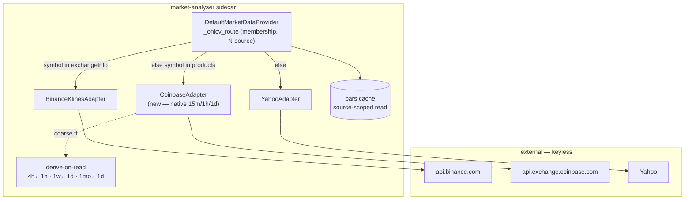

# Plan 0081 — Coinbase as the USD-native crypto OHLCV source

> **Status:** done (closed 2026-07-11, clean Mode 4 — no blockers/majors/minors; one reconciliation nit, folded in below)
> **Owner (this plan):** architect (design) → dev (phases 1–2) → human (phase 3) → ui-builder (phase 4)
> **Paired ADR:** [ADR-0076](../adrs/0076-coinbase-usd-native-crypto-source.md) (accepted at this close)

## Close notes (2026-07-11)

Four phases on `main`, no branch, one migration (`0009`). Commits: ph1 adapter `6d47f64`, ph2 N-source routing + provenance-scoped cache + purge migration `f34e0a2`, emergent search-relabel fix `2e4537a`, ph4 picker source badges + deep-USD hint `cba63f9`. Gates at close: **111 Python** (adapter + routing + resample + timeframes + migration + bar-repo) and **9 SymbolPicker jest** green.

Every done-when read at the assertion level: routing spies on all three sources (BTC-USD/ETH-USD→Coinbase, BTCUSDT→Binance, AAPL/SPY/DOGE-USD→Yahoo) + a both-sets precedence guard; the provenance switch defended by proving a pre-seeded Yahoo `BTC-USD` row is *physically present* (unscoped read sees it) yet *never returned* once Coinbase routes it (source-scoped read, not a delete); `4h/1w/1mo` derived from the Coinbase base only (Yahoo spy empty) with golden calendar-week/month buckets **and** weekly/monthly anti-lookahead prefix-invariance (the new resample surface the risk section flagged); migration `0009` scoped `source='yahoo' AND symbol LIKE '%-USD'` (network-free, cannot touch a non-crypto symbol), a space-reclaim since the source filter already makes the rows inert, downgrade an honest no-op; the phase-1 adapter test is thorough (paging/dedup, field order, empty-page termination, inclusive filter, typed `CoinbaseError`s, 451→`GeoRestrictedError` with no retry, 429/5xx mapping, quote→USD, membership never aliases to Binance, search ranking determinism).

**Phase-3 human smoke: GO** — user-confirmed `api.exchange.coinbase.com` reachable and US-clean, deep 15m history well past Yahoo's 60-day wall for ≥2 pairs, derived timeframes render. No `GeoRestrictedError`; Coinbase independently hedges ADR-0052's geo-fragility negative, as ADR-0076 predicted.

**Reconciliation (the one nit):** phase 4's plan text below says *"No backend change"*. That proved wrong and is corrected here. Phase 2's search merge kept Yahoo's `CCC` label on a dual-listed `BTC-USD` even though it now routes to Coinbase — an ADR-0026 searchable==fetchable violation (the picker would read "Yahoo" while bars/quote come from Coinbase). Commit `2e4537a` (`dev`, self-flagged for this close) fixes `default_provider.search_symbols` to relabel a Yahoo row to the exchange that lists it (precedence Binance > Coinbase, mirroring `_ohlcv_route`), keeping Yahoo's nicer display name + relevance order; exchange-only symbols still append. Tested by routing case (e), which asserts the relabel matches `_ohlcv_route` per symbol. No new ADR — an in-vocabulary `dev` backend fix that phase-2's search extension should have carried; the phase-4 note is the only plan-text casualty.

## TL;DR

Add Coinbase Exchange (keyless public market data) as a third OHLCV source so crypto `-USD` pairs — `BTC-USD`, `ETH-USD`, and every pair Coinbase lists — serve **deep, USD-native** history instead of Yahoo's shallow intraday caps (15m ≤ 60d). Generalise ADR-0052's membership routing from two sources to N (**Binance → Coinbase → Yahoo**), preserve single-provenance-per-symbol by deriving Coinbase's non-native timeframes (`4h←1h`, `1w←1d`, `1mo←1d`) on read, and enforce provenance at the cache read (source-scoped) with a one-way purge of now-orphaned Yahoo crypto `-USD` rows. Ends with picker source-labelling so the three venues are legible.

## Context & problem

Charting `BTC-USD` at 15m hits Yahoo's ~60-day horizon (a renderer clamp — commit `b020fa8` — already degrades gracefully instead of erroring, but the data is still shallow). Binance already has full depth, but only under `BTCUSDT`; the familiar USD-quoted `BTC-USD` form is stuck on Yahoo. Coinbase serves crypto in **USD** natively (`BTC-USD` maps 1:1, no USDT basis), is deep by pagination, and is US-geo-clean where `api.binance.com` can 451. The user wants this for crypto broadly, not just BTC. Full rationale, alternatives (alias-to-Binance, UI-only, TradingView), and the provenance-switch tradeoff are in [ADR-0076](../adrs/0076-coinbase-usd-native-crypto-source.md).

## Decision

Build the Coinbase source per ADR-0076: keyless ResilientHttpClient subclass ([ADR-0019](../adrs/0019-external-http-adapter-resilience.md)); membership routing over the cached `GET /products` set with precedence **Binance → Coinbase → Yahoo**; native `15m/1h/1d`, derived `4h/1w/1mo` from a Coinbase base (never another venue); source-scoped cache reads + purge of orphaned Yahoo crypto `-USD` rows; quote + search for Coinbase symbols to hold the ADR-0026 chartable invariant; an early `human` geo/live smoke; and picker source labels.

## Implementation phases

Each phase ships as its own conventional commit. Done-when checks are the acceptance bar — open the named tests and read the assertion bodies, don't trust a green CI line ([feedback: tests are acceptance criteria]).

### Phase 1 — Coinbase klines adapter (native fetch, paging, quote, search, membership)

**Owner skill:** dev

Build the adapter in isolation, offline-tested, before any routing is wired — so a broken adapter can't misroute live traffic.

- New `src/market_analyser/data/adapters/coinbase.py`: a ResilientHttpClient subclass ([ADR-0019](../adrs/0019-external-http-adapter-resilience.md)) against `https://api.exchange.coinbase.com`.
  - `fetch_ohlcv(symbol, timeframe, start, end, now)` for the **native** granularities only (`15m→900`, `1h→3600`, `1d→86400`). Backward-paginate the `GET /products/{id}/candles` endpoint in ≤300-candle windows; treat an empty page as end-of-history (not an error); filter to `[start, end]`; return ascending `Bar`s with `source="coinbase"`. Raise a typed `CoinbaseError` (subclass of the ADR-0031 taxonomy) on a broken 2xx shape, and reuse/mirror ADR-0052's `GeoRestrictedError` for a 451.
  - `get_quote(symbol)` over `GET /products/{id}/ticker` → the project `QuoteResponse` (currency `USD`).
  - `search(query)` and `is_known_symbol` / `known_symbols` over the cached product set from `GET /products` (mirror `binance_klines.py`'s `ExchangeSymbolSet`/`refresh_symbols` design: an explicit `refresh_symbols()` or a missing cache reaches the network; a present cache is used as-is; `fetched_at` from the payload, never wall-clock). Search results carry `exchange="Coinbase"`.
- **Do NOT** add `4h/1w/1mo` fetch here — those are derived in phase 2 via the resample seam. The adapter only ever fetches native granularities.

**Done-when:**
- `tests/data/test_coinbase_adapter.py`: paged backfill assembles a contiguous ascending series across a >300-bar window; empty-page terminates cleanly; `[start,end]` filter is inclusive; a malformed candle row raises `CoinbaseError`; a 451 raises `GeoRestrictedError`; `get_quote` maps to `QuoteResponse(currency="USD")`; `search`/`is_known_symbol` resolve against a fixture product set with no set-iteration order leak (deterministic). All offline (mocked HTTP — no live `api.exchange.coinbase.com`).
- `uv run pytest tests/data/test_coinbase_adapter.py` green.

### Phase 2 — N-source routing, per-source timeframe seam, provenance-scoped cache

**Owner skill:** dev

Wire Coinbase into the provider with precedence, derive its coarse timeframes from its own base, and make the cache read source-honest.

- **Timeframe registry** (`src/market_analyser/data/timeframes.py`):
  - Add `"coinbase"` to `OhlcvSourceName`.
  - `source_max_history(tf, "coinbase")` → `None` (deep to listing, uncapped like Binance).
  - `source_resampled_from(tf, "coinbase")` → Coinbase derivation map: `4h→"1h"`, `1w→"1d"`, `1mo→"1d"`; `None` for native `15m/1h/1d`. (This is a Coinbase-specific branch beside the existing Yahoo/Binance branches at `timeframes.py:112`.)
- **Resample support** (`src/market_analyser/data/` resample path used by `default_provider.get_ohlcv`'s derive-on-read branch): ensure `resample_ohlcv` (or the derive path) supports `1w`-from-`1d` and `1mo`-from-`1d` targets in addition to the existing `4h`-from-`1h`. Trailing, deterministic, calendar-bucketed (ISO week; calendar month). Crypto is 24/7 so daily bars are gap-free — no market-closure special-casing (contrast [ADR-0047](../adrs/0047-variable-duration-monthly-timeframe.md), which this revisits for a gap-free series).
- **Routing** (`src/market_analyser/data/default_provider.py`):
  - Constructor takes a `coinbase: CoinbaseAdapter | None` (default `None`, unwired-in-tests posture identical to `binance`).
  - `_ohlcv_route`: Binance-if-member → **Coinbase-if-member** → Yahoo. Apply the same precedence to `get_quote` (line ~362) and extend `search` (line ~387) to include Coinbase hits (deduped by symbol, after Binance, before/with Yahoo).
- **Provenance-scoped cache read** (bars repository + provider): the bars read for a routed symbol must return only bars whose `source` matches the routed source (the `bars.source` column exists — migration `0001`). Add a source filter to the repository read path the provider uses, and pass the routed source. This makes single-provenance a read-time invariant, not a routing coincidence (ADR-0076).
- **Purge migration** (`src/market_analyser/persistence/migrations/versions/NNNN_purge_orphaned_yahoo_crypto_bars.py`): one-way delete of `bars` rows that are now Coinbase-routed but were recorded with `source="yahoo"` (the crypto `-USD` pairs Coinbase lists). Scope precisely to avoid touching equity/index `-USD`-free symbols. If the source-filtered read (above) already makes those rows inert, the migration is still worth landing to reclaim space and prevent confusion — document which it is.
- **Composition root** (`src/market_analyser/api/app.py`): construct and inject `CoinbaseAdapter` beside the Binance one (with its product-set cache path), mirroring `app.py:200`.

**Done-when:**
- `tests/data/test_coinbase_routing.py`: `BTC-USD`/`ETH-USD` route to Coinbase; `BTCUSDT` still routes to Binance; `AAPL`/`SPY` still route to Yahoo; a Coinbase symbol not in the product set falls to Yahoo. Precedence Binance→Coinbase→Yahoo is asserted with a symbol placed in two fixture sets.
- Derived-timeframe test: `4h`, `1w`, `1mo` for a Coinbase symbol are computed from the Coinbase `1h`/`1d` base (never Yahoo), trailing and deterministic (byte-stable re-run); a golden weekly + monthly resample is pinned.
- Provenance test: with a Yahoo-`BTC-USD` row pre-seeded in the cache and Coinbase routed, `get_ohlcv("BTC-USD", …)` returns **no** Yahoo-sourced bars (source-scoped read) — the canonical guard against the provenance switch leaking mixed bars.
- Migration test (`tests/persistence/test_migrations.py` or a dedicated file): upgrade purges the orphaned Yahoo crypto `-USD` rows and leaves equity/Yahoo-legit rows intact; downgrade is a documented no-op or restore-shape.
- `source_max_history`/`source_resampled_from` unit tests extended for `"coinbase"`.
- `uv run pytest` green (full suite — the golden backtest determinism test must still pass).

### Phase 3 — Geo / live smoke (confirm reachability + depth)

**Owner skill:** human

Coinbase is expected US-clean, but ADR-0052's geo lesson says confirm in hour one, not in production.

- Live-hit `api.exchange.coinbase.com`: fetch `GET /products` (product set populates), a **deep 15m** backfill for `BTC-USD` (well past Yahoo's 60-day wall — confirm bars older than ~60 days arrive), the same for one alt (`ETH-USD` or `SOL-USD`), and confirm `4h/1w/1mo` derive correctly on read. Fetch a `get_quote` for `BTC-USD`.
- Record the outcome (reachable / 451 / shape drift) in the plan's close notes. If 451 or blocked, that's a surfaced `GeoRestrictedError` and a follow-up decision (as ADR-0052 handled Binance) — not an adapter hack.

**Done-when:** a short written smoke record (in the close ceremony) confirming deep 15m history arrives for at least two Coinbase pairs and the derived timeframes render; or a documented geo failure that gates the rest.

### Phase 4 — Picker source labels + crypto steering

**Owner skill:** ui-builder

Make the three venues legible and steer crypto users toward the deep USD form. This is ADR-0076's "Alternative B" folded in as a complement.

- In the symbol picker / `SymbolPicker`, surface the `exchange` source label already carried on `SymbolInfo` for every suggestion (Yahoo / Binance / Coinbase), so a user can tell `BTC-USD` (Coinbase, deep USD) from `BTCUSDT` (Binance, USDT) from a Yahoo composite.
- When search returns a Coinbase `-USD` match for a crypto query, present it as the preferred crypto suggestion (deep + USD-native). Keep it a hint/label, not a forced rewrite of what the user typed.
- Consumes phase 2's extended `search` output through the typed fetch client. *(Close reconciliation: this "no backend change" assumption did not hold — the routed-source relabel of dual-listed symbols required a `default_provider.search_symbols` fix, commit `2e4537a`; see Close notes.)*

**Done-when:**
- `SymbolPicker` test(s): a mixed Yahoo/Binance/Coinbase result set renders a distinct source label per suggestion; a crypto query surfaces the Coinbase `-USD` suggestion. Locale strings added to both `en.ts` and `ru.ts` ([ADR-0063](../adrs/0063-in-house-i18n-and-reason-codes.md) parity) for any new label text.
- `pnpm --filter desktop typecheck && lint && test` green.

## Architecture diagram

## Risks & open questions

- **Weekly/monthly resample from daily is new surface.** The existing derive path only does `4h←1h`. `1w←1d` and `1mo←1d` need calendar bucketing. *Mitigation:* crypto is 24/7 so daily bars are gap-free (the ADR-0047 variable-month concern is milder here); pin a golden weekly + monthly resample in phase 2. *Fallback if it proves costly:* none that preserves single-provenance — do **not** silently let coarse timeframes fall to Yahoo (ADR-0076 Alternative C, rejected). If blocked, stop and escalate to architect rather than mixing sources per symbol.
- **The purge migration is one-way.** Re-running an old `BTC-USD` backtest will pull Coinbase data and produce a different (valid) result. This is documented in ADR-0076's negatives; confirm the migration scope doesn't catch any non-crypto `-USD` symbol.
- **Product-set freshness.** A stale Coinbase product cache misroutes a newly-listed pair to Yahoo (loud/shallow, not silent-wrong). Same explicit-refresh posture as Binance; not auto-TTL'd.
- **Precedence collision (theoretical).** No current symbol string is in both Binance and Coinbase sets (`BTCUSDT` vs `BTC-USD`); the Binance→Coinbase order is a guard, tested, not a live conflict.
- **Open:** does the bars repository read path already thread a `source` filter anywhere, or is this the first consumer? Dev confirms during phase 2 and adjusts the repository signature minimally.

## What this plan does NOT do

- **No derivatives from Coinbase.** Funding/OI stay Binance-only (Coinbase is spot; ADR-0052 already decided this). This plan is spot OHLCV + quote + search only.
- **No alias/merge of `BTC-USD` and `BTCUSDT`.** They remain distinct series (ADR-0052; ADR-0076 Alternative A rejected).
- **No change to Binance or Yahoo behaviour** beyond inserting Coinbase ahead of Yahoo in the membership check and making the cache read source-scoped.
- **No TradFi impact.** Equities/indices/FX still route to Yahoo unchanged (ADR-0069: crypto-first, TradFi supported-secondary).
- **No new PyPI dependency** and no forced default-symbol change in the UI — phase 4 labels and steers, it does not rewrite the user's typed symbol.

## Related ADRs

- [ADR-0076](../adrs/0076-coinbase-usd-native-crypto-source.md) — this plan's decision (Coinbase source + N-source routing).
- [ADR-0052](../adrs/0052-binance-exchange-data-source.md) — refined here (two-source → N-source membership routing).
- [ADR-0069](../adrs/0069-crypto-first-asset-class-positioning.md) — the positioning this serves.
- [ADR-0028](../adrs/0028-timeframe-resampling-and-expansion.md) — derive-on-read for non-native timeframes.
- [ADR-0047](../adrs/0047-variable-duration-monthly-timeframe.md) — the monthly-resample concern revisited for a 24/7 series.
- [ADR-0031](../adrs/0031-data-source-adapter-contract.md) / [ADR-0019](../adrs/0019-external-http-adapter-resilience.md) / [ADR-0026](../adrs/0026-symbol-search-bound-to-ohlcv-provider.md) / [ADR-0007](../adrs/0007-market-data-provider.md) — the adapter/provider contracts it slots into.
