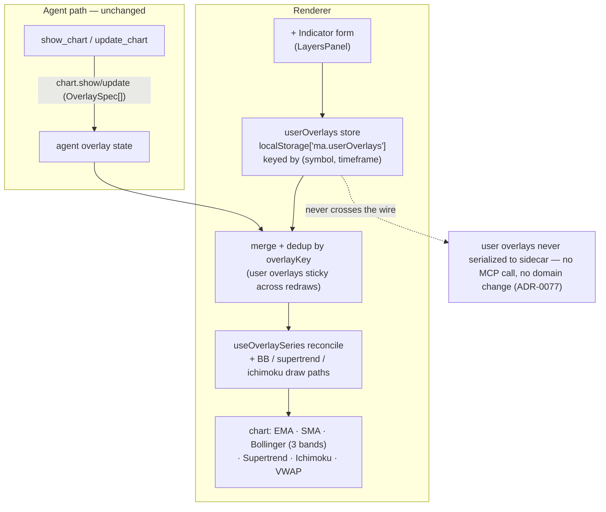

# 0082 — Bollinger Bands + user-originated chart overlay controls

> **Status:** done — closed 2026-07-12. Phases 1–4 landed on `main`, no branch, migration-free, no new dep: `dev` ph1 `5681c30` (`bbands` reuses `multiplier` as std-dev `k`, defaults 20/2.0 — additive docstring+test, no version bump), `ui-builder` ph2 `1df1c1b` (client `computeBbands` mirroring `analysis/indicators.py::bollinger` **population** stdev, 3-band `useBbandsSeries` draw), ph3 `67baa8a` (`lib/userOverlays.ts` `(symbol,timeframe)`-keyed `localStorage['ma.userOverlays']` store + pure `mergeOverlays`, bounded/degrading/sticky), ph4 `299e71a` (`AddOverlayForm` + `overlayForm.ts` validator + provenance-scoped remove-vs-hide legend, `CandlestickChart` merges user∪agent into `effectiveOverlays` for every draw hook + the legend). Clean Mode 4 — **no blockers/majors/minors**. Done-whens read at the assertion level: ph1's 3 pydantic specs pin the `{kind,period,multiplier:2.0}` round-trip + `ema` byte-unchanged + `price/label/role` rejection (ran: 3 passed); ph2 pins `computeBbands` against a Python-generated fixture within 1e-6 incl. a population-vs-sample denominator discriminator **and** truncation-invariance for no-lookahead (also verified structurally — trailing window `bars[i-period+1..i]`, defined from `period-1`); ph3's 18 assertions cover add/reload/isolation/remove/dedup/scope-guard(`price_line`/unknown dropped)/bounds(50 keys×12)/blocked+malformed-storage degradation/stickiness/provenance; ph4 validator + accessible form (`role="alert"`, labelled inputs) + removable-only-for-user legend. Gates re-verified at close: **795 renderer jest** (81 suites) + typecheck + lint green, phase-1 pytest green, `mypy --strict` clean, `apiref --check` exit 0; en+ru locale keys symmetric, glossary `bbands` present. **ADR-0077 accepted at close.** **Phase 5 (OBV in picker) deferred to a followup** — Plan 0076 shipped OBV as an *always-on toggleable strip* (its own documented deviation), not the on-demand `obv` overlay-path kind ph5 assumed, so a picker entry is redundant and needs a fresh design call; the implementer correctly excluded OBV/VWAP from the form for this reason. **Phase 6 (`human` live smoke) is the user's outstanding step, not a code gate.** Followups: whether/how to expose the always-on OBV + client-side VWAP through the picker; a `vwap` (and richer parameterized `bbands`) `OverlayKind` for the agent path; full Ichimoku parameterization in the form; BB band fill (shipped lines-only, the requirement); a "clear my overlays on this chart" affordance.
> **Created:** 2026-07-11
> **Owner skill(s):** dev, ui-builder, human
> **Related ADRs:** [0077](../adrs/0077-user-originated-display-overlays.md) (user-originated display overlays — **paired, accepts at close**), [0015](../adrs/0015-claude-code-primary-control-surface.md) (agent-primary control surface — refined by 0077), [0039](../adrs/0039-renderer-theming-localstorage.md) (`ma.*` renderer-owned prefs), [0062](../adrs/0062-user-chart-style-overrides.md) (user chart-style overrides — the closest precedent), [0023](../adrs/0023-technical-analysis-surface.md) (client-side indicator duplication accepted for display), [0017](../adrs/0017-live-ui-updates-via-sse.md) (agent overlay events, unchanged)
> **Coordinates with:** [Plan 0076](0076-obv-chart-overlay.md) (OBV overlay render — the OBV picker entry sequences after it)

## TL;DR

Two coupled asks from the user: **make Bollinger Bands visible on a chart**, and **give the chart a better form of controls for overlays**. Today overlays are agent-only — the agent emits an `OverlaySpec`, the renderer draws it, and `LayersPanel` only toggles visibility of what the agent drew (`bbands` is a reserved `OverlayKind` with no renderer entry, so the chart logs-and-skips it). This plan (a) renders Bollinger Bands (the flagship new indicator, drawn client-side), and (b) adds a **renderer-owned user-overlay layer** — an "add indicator" form in `LayersPanel` that lets the user add and parameterize overlays from the UI, persisted per `(symbol, timeframe)` and merged with agent overlays. The control-model shift is sanctioned by paired **[ADR-0077](../adrs/0077-user-originated-display-overlays.md)**: a user-added indicator is a *display preference* (client-computed, no sidecar call, no domain change), owned by the renderer like theme and chart-style — not a control action, so ADR-0015 stays intact.

## Context & problem

The overlay pipeline is one-directional and agent-driven (ADR-0015 / ADR-0017): `show_chart`/`update_chart` → `chart.show`/`chart.update` SSE → renderer reconcile. Concretely (verified against the code):

- **Bollinger Bands don't render.** `bbands` is already in the `OverlaySpec` `kind` literal (`src/market_analyser/events/chart_types.py`) and the mirrored `desktop/renderer/types/events.ts`, so the wire *accepts* `{"kind":"bbands","period":20}` today — but there is no `OVERLAY_REGISTRY` entry in `desktop/renderer/lib/overlays.ts` and no `computeBbands` in `desktop/renderer/lib/indicators.ts`. `isSupportedOverlay('bbands')` is `false`, so `useOverlaySeries` warns-and-skips it. BB is a **three-line (upper/mid/lower) + optional fill** draw — the multi-series pattern of `ichimoku`/`supertrend`, not the single-line `ema`/`sma` path.
- **There is no UI to add or configure an overlay.** `LayersPanel` (`desktop/renderer/components/LayersPanel.tsx`) is a passive legend — per-layer show/hide, hover-highlight, draggable width. `ChartToolbar` has only the pattern-scan buttons + agent-mode range select. Overlays appear *only* when the agent draws them.

The user wants both fixed, and the two are coupled: the controls decision determines *how the user gets Bollinger Bands* (ask the agent vs. pick from a panel). The chosen shape (decided with the user 2026-07-11):

- **Control model:** an **add-indicator form panel** extending `LayersPanel` (`+ Indicator` → kind dropdown + period + BB's `k`).
- **Indicator set the panel offers:** the **client-computable set** (EMA, SMA, Bollinger, VWAP, OBV, Supertrend, Ichimoku).
- **Persistence:** **per `(symbol, timeframe)`**, persisted, **surviving agent redraws** (the `ma.*` localStorage convention).

## Decision

Implement in four core phases plus a coordinated follow-on, per **[ADR-0077](../adrs/0077-user-originated-display-overlays.md)**:

1. A tiny **`dev`** descriptor clarification so `bbands` cleanly carries its band width (reuse the existing `multiplier` field as the standard-deviation `k`; default period 20, `k` 2.0). Additive, no payload-version bump, migration-free.
2. A **`ui-builder`** Bollinger Bands render — client-side `computeBbands` mirroring `analysis/indicators.py::bollinger` exactly (SMA middle ± `k`×**population** stdev over `period`), drawn as three bands (+ optional fill). This alone makes BB visible via the **agent** path, satisfying ask (a).
3. A **`ui-builder`** renderer-owned **user-overlay store + merge** — a `(symbol, timeframe)`-keyed layer in `localStorage['ma.userOverlays']`, merged/deduped with agent overlays, sticky across agent redraws (ADR-0077).
4. A **`ui-builder`** **add-indicator form** in `LayersPanel` + provenance-scoped legend controls (remove for user overlays, hide-only for agent overlays). The form offers the client-computable kinds whose render exists after phase 2 (EMA, SMA, **Bollinger**, Supertrend, Ichimoku, VWAP).
5. **OBV** in the picker is a **coordinated follow-on** gated on [Plan 0076](0076-obv-chart-overlay.md) (which owns the `obv` kind + separate-pane render). This plan does not duplicate that render.

The `bbands` render (phase 2) touches the same overlay-drawing code as Plan 0076's render phase; both should be **serialized, not run in parallel worktrees** (the same contention reason Plans 0073/0076 noted). The dev descriptor phase (phase 1) touches no contended file and ships immediately.

### Why this is renderer-owned and not a control-surface violation

Full argument in [ADR-0077](../adrs/0077-user-originated-display-overlays.md). In one line: a user-added indicator overlay is **client-computed, issues no sidecar call, and changes no domain state** — the same species as theme (ADR-0039) and chart-style (ADR-0062), which the renderer already owns. User overlays never touch the wire; the `OverlaySpec` shape is reused only for code economy (one registry, one reconcile path). ADR-0015's rule — the agent is the sole surface for data, analysis, backtests, and any sidecar/domain command — is untouched.

## Architecture diagram

## Implementation phases

### Phase 1 — `bbands` overlay descriptor semantics
- **Owner skill:** dev
- **What:** Clarify that `bbands` carries `period` (default 20) and reuses the existing `OverlaySpec.multiplier` field as the standard-deviation multiplier `k` (default 2.0), like `supertrend` reuses it for the ATR multiplier. No new field, no new kind (both already exist), no payload-version bump. Update the `OverlaySpec` docstring and any tool descriptions; regenerate `docs/reference/` via `pnpm gen:api-docs`.
- **Files touched:** `src/market_analyser/events/chart_types.py` (`OverlaySpec` docstring; confirm `_validate_kind_fields` accepts `bbands` with `period`+`multiplier` and still rejects `price`/`label`/`role`), `tests/events/…` (a `bbands` validation case), generated `docs/reference/`.
- **Design notes:** `multiplier` is already an optional field accepted on any indicator kind; this phase is a semantics/doc clarification plus a test pinning it, not a schema change. `exclude_none` keeps every existing overlay byte-identical on the wire.
- **Done when:** `OverlaySpec.model_validate({"kind":"bbands","period":20,"multiplier":2})` succeeds and dumps to exactly `{"kind":"bbands","period":20,"multiplier":2.0}`; `{"kind":"bbands","price":1}` raises; existing `ema`/`sma`/`supertrend` overlays are byte-identical on the wire; `apiref --check` passes.

### Phase 2 — Bollinger Bands render *(SERIALIZE vs Plan 0076's render phase — same overlay-drawing code)*
- **Owner skill:** ui-builder
- **What:** Render Bollinger Bands client-side. Add `computeBbands(bars, period, k)` to `desktop/renderer/lib/indicators.ts`, a `bbands` entry to `OVERLAY_REGISTRY`, and a dedicated multi-series draw path (upper/mid/lower as three line series on the price pane; an **optional** shaded fill between upper and lower). Add the Zod overlay-schema `bbands` variant, a glossary key for `bbands` (Plan 0065 glossary), and a single grouped legend row for the three lines.
- **Files touched:** `desktop/renderer/lib/indicators.ts` (+`computeBbands`) + `indicators.test.ts`; `desktop/renderer/lib/overlays.ts` (registry entry + any BB helper) + `overlays.test.ts`; the overlay reconcile / draw modules under `desktop/renderer/hooks/` + `components/CandlestickChart.tsx` (BB draw path, mirroring the `supertrend`/`ichimoku` multi-series handling); the overlay Zod schema; the glossary catalog(s); legend wiring in `LayersPanel`/`useLayersLegend`.
- **Design notes:** `computeBbands` **must mirror `analysis/indicators.py::bollinger` exactly** — SMA middle band ± `k` × **population** standard deviation (denominator = `period`, not `period−1`), value defined from index `period−1` onward, defaults `period=20`, `k=2.0`. No lookahead: value at bar `i` uses `bars[i−period+1 .. i]` only. The fill, if built, can reuse the Ichimoku cloud-fill approach (`IchimokuPrimitive`); **three lines is the requirement, the fill is a nice-to-have** — do not block the phase on the fill. This phase makes BB drawable from the **agent** path too (`show_chart` with a `bbands` overlay), which independently satisfies "make Bollinger Bands visible".
- **Done when:** an overlay of `{kind:"bbands", period, multiplier:k}` draws three bands on the price pane; toggling the legend row off removes all three (and the fill); a `lib` unit test pins `computeBbands` against a fixture matching the Python `bollinger` within 1e-6 (including the population-stdev denominator); the chart disposes the BB series on unmount; renderer jest + typecheck + lint green.

### Phase 3 — User-overlay store + merge
- **Owner skill:** ui-builder
- **What:** A renderer-owned store (`desktop/renderer/lib/userOverlays.ts`, shaped like `theme.ts`/`chartStyle.ts`) holding user-added `OverlaySpec`s keyed by `(symbol, timeframe)`, persisted in `localStorage['ma.userOverlays']`. API: load-for-key, add, remove, (optionally) update, and subscribe for re-render. Wire it into the chart so the **effective overlay set = agent overlays ∪ user overlays**, deduped by the existing `overlayKey`/`overlayLayerId`, with **user overlays sticky** — an agent `chart.show`/`chart.update` replacing the agent set does **not** clear the user layer. Track provenance (agent vs user) so phase 4's legend can branch removal vs hide.
- **Files touched:** `desktop/renderer/lib/userOverlays.ts` + `.test.ts`; the chart overlay wiring (`CandlestickChart.tsx` / the overlay hook) to source+merge the two layers on the current `(symbol, timeframe)`; a small merge/dedup helper + test.
- **Design notes:** never serialize user overlays to the sidecar — they live only in the renderer (ADR-0077). Reuse `OverlaySpec` for the stored shape and the same reconcile path (no parallel drawing code). Dedup is idempotent: an agent `ema:20` and a user `ema:20` collapse to one drawn series; on removal of the user copy, the agent copy (if any) remains. **Bound the store** (cap entries / drop empty `(symbol,timeframe)` buckets) and degrade gracefully on blocked/full storage (the ADR-0039 pattern). Persist only the display-only indicator kinds; never persist `price_line` (agent analysis semantics).
- **Done when:** adding a user overlay persists and reloads for the same `(symbol, timeframe)`; switching symbol/timeframe shows that key's set and hides the other's; an agent `chart.show` carrying its own overlays leaves the user layer intact (sticky); dedup collapses an identical agent+user spec to one series; removing the user copy keeps a still-present agent copy; malformed/blocked-storage degrades without throwing; unit tests pin load/add/remove/merge/dedup/stickiness/degradation.

### Phase 4 — Add-indicator form + provenance-scoped legend controls
- **Owner skill:** ui-builder
- **What:** Extend `LayersPanel` with a `+ Indicator` affordance that opens a compact form: a **kind dropdown** (the client-computable kinds whose render exists after phase 2 — EMA, SMA, **Bollinger**, Supertrend, Ichimoku, VWAP), a **period** input, and a **`k` (std-dev)** input shown only for Bollinger. Ichimoku's four periods stay at classic defaults in v1 (its full parameterization is out of scope — note it). "Add" writes to the phase-3 store. Legend rows for **user** overlays gain a **remove (×)** control alongside the visibility checkbox; **agent** overlays keep hide-only. Accessible (labelled inputs, `<button>`s, keyboard-operable, `aria-label`s), CSS-module-styled, i18n via `t()` (en + ru keys) per ADR-0063.
- **Files touched:** `desktop/renderer/components/LayersPanel.tsx` + `LayersPanel.module.css` + `LayersPanel.test.tsx`; a small `AddOverlayForm` subcomponent (+ test) if the form grows past a few controls; `useLayersLegend`/`layersLegend.ts` for the user-vs-agent provenance + remove wiring; the `en`/`ru` locale catalogs; a `lib` validator for period (int > 0) and `k` (> 0).
- **Design notes:** VWAP already has a client-side compute (`desktop/renderer/lib/volume.ts`) — expose it through the same user-overlay path (a renderer-internal `vwap` overlay descriptor reusing that compute; no wire change is required because user overlays never serialize, but if a `vwap` `OverlayKind` is wanted for the agent path too, that is an additive dev descriptor akin to Plan 0076's `obv` — out of scope here, note as a followup). Keep the dropdown limited to kinds that actually draw, so the form can never add an overlay the chart will warn-and-skip. Reuse the existing `LayersPanel` grouped-legend model (Plan 0067/0071) rather than a second legend.
- **Done when:** the form adds each offered kind with its parameters and the overlay appears with a legend row; the Bollinger form takes `period` + `k` and draws BB with those values; a user overlay's remove (×) deletes it from the store and the chart while an agent overlay shows hide-only; invalid `period`/`k` are rejected with an accessible message; added overlays persist across reload (via phase 3) and survive an agent redraw; renderer jest + typecheck + lint green.

### Phase 5 — OBV in the picker *(coordinated with Plan 0076)*
- **Owner skill:** ui-builder
- **What:** Once [Plan 0076](0076-obv-chart-overlay.md) has landed the `obv` overlay kind + its separate-pane render, add OBV to the phase-4 picker (offering it as a user overlay routed through the 0076 render path). If Plan 0076 has **not** landed when phases 1–4 complete, this phase waits — it does **not** re-implement OBV render.
- **Files touched:** the phase-4 form's kind list + the overlay draw wiring for the OBV pane (reusing Plan 0076's render); `LayersPanel` legend for the OBV row; locale keys.
- **Design notes:** OBV is unbounded/cumulative and draws in its own auto-scaled pane (per Plan 0076) — a different draw target than the price-pane bands. Confirm the user-overlay merge handles a separate-pane kind. Do not duplicate `computeObv`/the pane logic; consume 0076's.
- **Done when:** with Plan 0076 render present, the picker offers OBV, adding it draws the OBV pane as a user overlay, removing it clears the pane, and it persists per `(symbol, timeframe)`; jest + typecheck + lint green. **Blocked-until:** Plan 0076 phase 2 merged.

### Phase 6 — Live smoke
- **Owner skill:** human
- **What:** Confirm end-to-end in the running app.
- **Done when:** adding **Bollinger Bands** from the `+ Indicator` form draws three bands (period + `k` respected) on the price pane; the bands persist across a reload and survive the agent issuing a fresh `chart.show`; an agent-requested `bbands` overlay also draws; removing a user overlay clears it while an agent overlay only hides; recorded for close.

## Risks & open questions

- **Overlay-drawing contention with Plan 0076.** Phase 2 and Plan 0076's render phase edit the same overlay/draw code. Mitigation: serialize them (implement one then rebase the other), as Plans 0073/0076 already agreed; the dev descriptor phase (phase 1) is independent and ships now.
- **VWAP exposure path.** VWAP renders client-side today as a built-in styleable series (ADR-0062), not as an `OverlaySpec` kind. Phase 4 exposes it through the renderer-internal user-overlay path (no wire change needed since user overlays never serialize). **Open:** whether to also add a `vwap` `OverlayKind` so the **agent** can request VWAP as an overlay — additive, akin to Plan 0076's `obv`; deferred to a followup unless wanted.
- **Sticky-overlay surprise.** A user overlay surviving an agent `chart.show` is intentional (ADR-0077) but may confuse ("why is my BB still here"). Mitigation: the legend distinguishes user (removable) from agent (hide-only) rows; document the behaviour in the glossary/onboarding if it reads as surprising in smoke.
- **BB fill rendering.** lightweight-charts has no native fill-between-two-lines; the fill would reuse the Ichimoku primitive approach. If it proves fiddly, ship three lines without fill (the requirement) and track the fill as a followup — do not block phase 2.
- **Store growth.** Per-`(symbol,timeframe)` persistence accumulates entries; phase 3 must bound/prune and degrade on storage errors.
- **Ichimoku in the form.** Ichimoku has four period parameters; v1 offers it at classic defaults only. Full parameterization is a followup, not this plan.

## What this plan does NOT do

- **No OBV or VWAP render is written here.** OBV render is Plan 0076 (this plan's phase 5 consumes it); VWAP render already exists (this plan only exposes it via the picker). No new separate-pane drawing code is authored.
- **No `rsi`/`macd` overlay render.** They remain reserved `OverlayKind`s with no draw path; not offered in the picker.
- **No wire/serialization of user overlays, no new MCP tool, no new SSE event, no migration.** User overlays are renderer-only (ADR-0077); the sole sidecar-adjacent change is phase 1's `bbands` docstring/test clarification.
- **No change to agent overlay behaviour.** The agent path (`show_chart`/`update_chart` → SSE → draw) is untouched except that `bbands` now draws.
- **No full Ichimoku parameterization** in the form (classic defaults only), and **no relaxation of ADR-0015** for anything that would call the sidecar or change domain state.

## Followups (after this lands)

- Add a `vwap` (and, if wanted, expose `bbands`' `k` more richly) `OverlayKind` so the **agent** can request VWAP/parameterized BB as overlays — additive descriptor, à la Plan 0076's `obv`.
- Full Ichimoku parameterization in the add-indicator form.
- BB band **fill** if phase 2 shipped lines-only.
- Consider a "clear all my overlays on this chart" affordance if per-key accumulation gets noisy.
