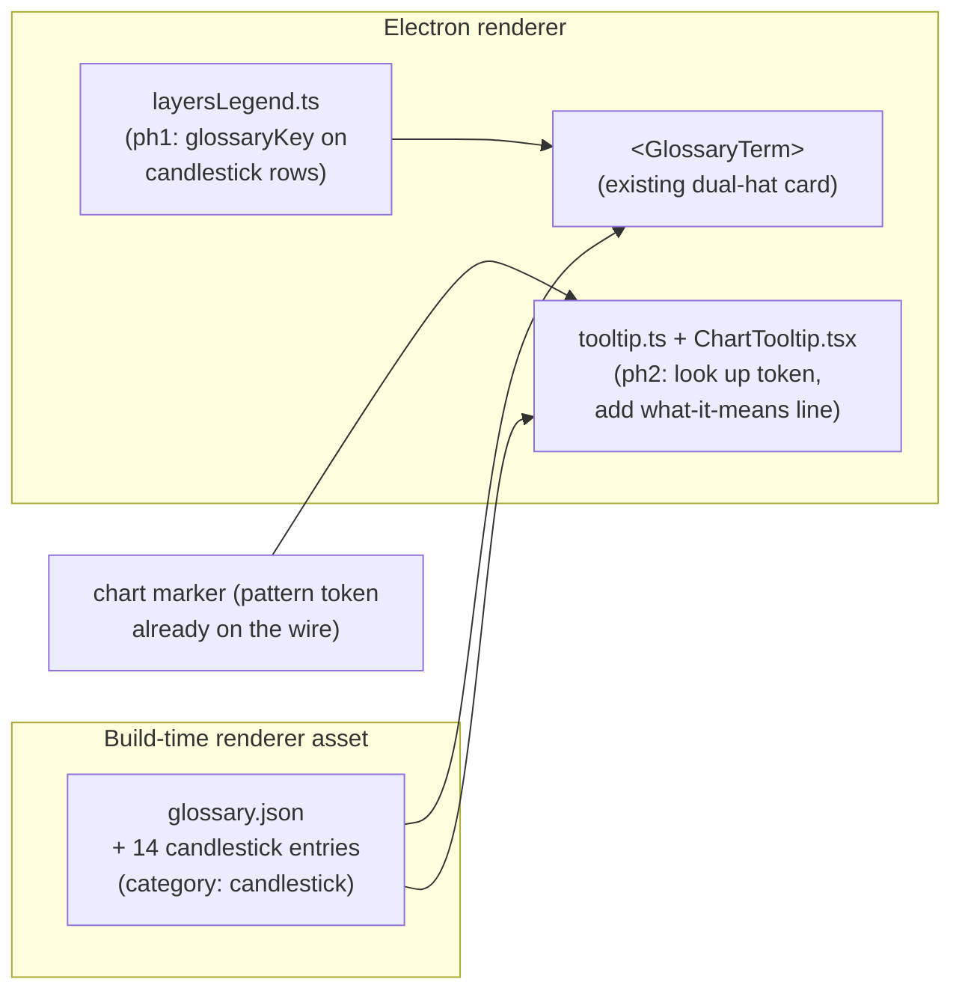

# 0085 — Candlestick pattern explanations

> **Status:** done — closed 2026-07-11. Implemented on branch `plan-0085-candlestick-pattern-explanations` (ui-builder ph1 `d9a20fe`, ph2 `280864d`), merged to `main` no-ff. Clean Mode 4 (no blockers/majors/minors): both code phases scoped exactly, no wire/schema change (realizes ADR-0060, honours ADR-0046 glossary-never-on-wire), all owner tags in-vocabulary. Every done-when read at the assertion level — the `candlestick` glossary keys `==` `PATTERN_DISPLAY_NAMES` (bidirectional completeness pin, no extras), both-hats validated with a synthetic-reject proof, single-marker meaning line + names-only-when-stacked + unknown-token-degrades-to-name-only each with a matching `expect`, locale threaded through `tooltipAtTime`. Gates: 45/45 renderer jest green across 6 suites (glossary, tooltip, layersLegend, CandlestickChart.tooltip, useChartTooltip, trendline-tooltip), re-verified on `main` post-merge; merge conflict-free (branch's 14 renderer files disjoint from main's post-fork changes). Phase 3 (human visual smoke) confirmed fine by the user. No paired ADR. Followups (unchanged): RU pass over the 14 strings; same glossary treatment for the Plan 0083 trendline legend rows if parity is wanted.
> **Created:** 2026-07-11
> **Owner skill(s):** ui-builder, human
> **Related ADRs:** extends [0060](../adrs/0060-glossary-tooltip-interaction-posture.md) (glossary hover-explanations) and honours [0046](../adrs/0046-mcp-large-result-delivery.md) (glossary is a build-time asset, never on the wire); no new ADR (this realizes ADR-0060 for a new content category, no new decision).

## TL;DR

Candlestick markers render fine and show the pattern **name** on hover (Plan 0071), but nothing tells the user **what each pattern means**. This plan adds a per-pattern explanation by **reusing the Plan 0065 glossary** (`glossary.json` + `<GlossaryTerm>`, the dual-hat *how it's computed / what it means* card, ADR-0060) — a new `"candlestick"` category with 14 entries keyed by the wire token. The explanation surfaces in **two places**: the LayersPanel candlestick legend rows (free, via the existing `glossaryKey` slot) and the floating chart hover tooltip on the marker itself. English-authored now; Russian is optional per-field and deferred. First user-visible behavior: hovering a "Bullish engulfing" legend row or its chart marker discloses a two-line card — how our detector defines it, and what it signals.

## Context & problem

The candlestick family (14 detectors in `analysis/patterns.py`) renders as markers/spans on `chart.highlight`. Since Plan 0071 the marker hover tooltip (`lib/tooltip.ts` → `ChartTooltip.tsx`) and the LayersPanel legend (`lib/layersLegend.ts`) both show a human-readable **name** from the renderer-side `PATTERN_DISPLAY_NAMES` map (`lib/candleGroups.ts`). But:

- The `PatternHit` model (`analysis/types.py`) and the wire `Marker` (`events/chart_types.py`) carry no description — name + direction + strength + span only.
- The glossary (`desktop/renderer/glossary/glossary.json`, 57 entries across `forecast`/`recommendation`/`condition`/`indicator`/`overlay`) has **zero** candlestick entries.
- The LayersPanel already renders any layer row with a `glossaryKey` through `<GlossaryTerm>` (`LayersPanel.tsx`), but the candlestick rows are pushed **without** one (`layersLegend.ts`).

So the infrastructure to explain a candlestick already exists and is simply not wired to it. The `pattern` token already crosses the wire, so it is a sufficient join key to a renderer-side glossary entry — **no schema change** is needed (consistent with ADR-0046: the glossary is never on the wire).

## Decision

Add a `"candlestick"` glossary category with one entry per detector token, and surface it (a) on the LayersPanel candlestick legend rows via the existing `glossaryKey` slot and (b) in the chart marker hover tooltip by looking the token up in the glossary. Author English now; Russian is optional (`LocalizedString` falls back to `en` per field). No wire/schema change, no Python-side display names, no new ADR. We rejected adding a description field to `Marker`/`PatternHit` (needless wire growth — the token already joins to the glossary) and rejected a bespoke explanation component (the ADR-0060 `<GlossaryTerm>` is the sanctioned surface).

## Architecture diagram



## Implementation phases

### Phase 1 — Glossary candlestick entries + legend wiring
- **Owner skill:** ui-builder
- **What:** Add a `"candlestick"` category and 14 entries (keyed by the exact wire token: `doji`, `hammer`, `hanging_man`, `marubozu`, `bullish_engulfing`, `bearish_engulfing`, `dark_cloud_cover`, `piercing_line`, `bullish_harami`, `bearish_harami`, `morning_star`, `evening_star`, `three_white_soldiers`, `three_black_crows`) to `glossary.json`, each with `howComputed` (**our** detector's geometric rule, read from `analysis/patterns.py` — not a generic textbook line) and `whatItMeans` (trader meaning). Register `"candlestick"` in `GlossaryCategory` and the glossary test's category pin. Set `glossaryKey` on the candlestick detail rows in `layersLegend.ts` so LayersPanel renders them through the existing `<GlossaryTerm>`.
- **Files touched:** `desktop/renderer/glossary/glossary.json`, `desktop/renderer/glossary/types.ts` (`GlossaryCategory` += `'candlestick'`), `desktop/renderer/lib/layersLegend.ts` (`glossaryKey: group.pattern`), `desktop/renderer/glossary/glossary.test.ts` (category pin + a candlestick-completeness pin), `tests/glossary/test_glossary_accuracy.py` is already satisfied (its both-hats check applies; no feature-name pin for this category).
- **Done when:** hovering (and keyboard-focusing) a candlestick legend row in LayersPanel discloses a card with the pattern heading, a `howComputed` line matching the detector's actual rule, and a `whatItMeans` line; all 14 tokens have an entry (asserted by a completeness test against `PATTERN_DISPLAY_NAMES`' key set); `glossary.test.ts` category union includes `candlestick`; the Python accuracy test (both hats present on every record) stays green; unknown/absent key still degrades to plain text.

### Phase 2 — Chart marker tooltip explanation
- **Owner skill:** ui-builder
- **What:** In the floating chart hover tooltip, surface the `whatItMeans` line for a hovered candlestick marker by looking up its `pattern` token in the glossary. Keep it concise: when a **single** marker is hovered, show `name` + one-line meaning; when **multiple** markers stack on one bar, show names only (meaning would overflow the tooltip). This tooltip is `ChartTooltip`, a plain floating component that does not use `<GlossaryTerm>`, so the lookup + render is added directly.
- **Files touched:** `desktop/renderer/lib/tooltip.ts` (token → glossary lookup, single-vs-multi rule), `desktop/renderer/components/ChartTooltip.tsx` (render the meaning line), `desktop/renderer/lib/tooltip.test.ts`, `desktop/renderer/components/CandlestickChart.tooltip.test.tsx` (extend the existing `bullish_engulfing` hover assertion from name-only to name + meaning).
- **Done when:** hovering a single candlestick marker shows its name and its `whatItMeans` line; hovering a bar where two+ markers coincide shows the names only (no meaning lines); a marker whose token has no glossary entry shows the name only (no crash); the existing name-only and toggled-off-group tooltip tests still hold with the meaning added.

### Phase 3 — Human visual smoke: candlestick explanations
- **Owner skill:** human
- **What:** Launch the app on a symbol/window with detected candlesticks; hover both a legend row and a chart marker and read the explanations.
- **Files touched:** none (manual).
- **Done when:** the user confirms the legend-row card and the marker tooltip both explain the pattern readably and the `howComputed` line matches how the detector actually fires — GO — or files copy deltas to fold back into phase 1.

## Data shapes

No wire/schema change. The only new data is renderer-side glossary content:

```jsonc
// desktop/renderer/glossary/glossary.json — two illustrative entries (en required, ru optional)
"bullish_engulfing": {
  "term": { "en": "Bullish engulfing" },
  "category": "candlestick",
  "howComputed": { "en": "A down candle followed by an up candle whose real body fully engulfs the prior body (our detector: prior close < open, current open <= prior close and current close >= prior open)." },
  "whatItMeans": { "en": "A potential bullish reversal after a downtrend — buyers overwhelmed the prior session's sellers." }
},
"doji": {
  "term": { "en": "Doji" },
  "category": "candlestick",
  "howComputed": { "en": "A candle whose real body is a tiny fraction of its high-low range (our detector's body/range threshold), so open and close are near-equal." },
  "whatItMeans": { "en": "Indecision — neither side controlled the session; often a caution flag at the end of a run, not a signal on its own." }
}
```

The remaining 12 keys follow the same shape. `howComputed` is authored from each detector's real thresholds in `analysis/patterns.py` (the constants are named there), so the developer hat is accurate to our implementation, not a generic definition.

## Risks & open questions

- Risk: the chart tooltip overflows when several markers coincide on one bar. Mitigation: the phase-2 single-vs-multi rule (meaning only for a lone marker; names-only when stacked).
- Risk: `howComputed` drifts into textbook prose that doesn't match our detector. Mitigation: the phase-1 done-when requires it to be read from `analysis/patterns.py`; the human smoke re-checks it.
- Open question: the `PATTERN_DISPLAY_NAMES` map and legend/tooltip *names* remain plain-English (Plan 0069 left them un-localised by precedent). The glossary *explanations* are localizable (`LocalizedString`), but the names above them are not — an acceptable asymmetry (the same one the indicator glossary already has). Revisit only if a full-RU pass is requested.

## What this plan does NOT do

- Does not add a description to the wire `Marker` or to `PatternHit` — the `pattern` token already joins to the glossary (ADR-0046).
- Does not add Russian translations now — `ru` is optional and falls back to `en`; a RU pass is a followup.
- Does not localize or change the candlestick display **names** (still `PATTERN_DISPLAY_NAMES`, plain English).
- Does not touch the classical chart-pattern trendlines (that is Plan 0083) or add on-marker glyph text (markers stay text-free; explanation lives in hover only).
- Does not add a new ADR — it realizes ADR-0060 for a new category.

## Followups (after this lands)

- Russian pass over the 14 `whatItMeans` / `howComputed` strings.
- Consider the same glossary treatment for the classical chart-pattern legend rows (Plan 0083's trendline groups) if the user wants parity.
