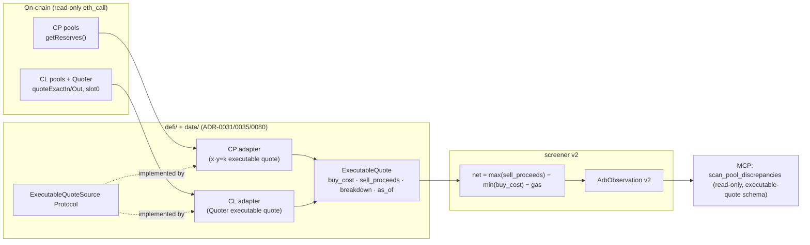

# 0086 — Concentrated-liquidity pricing via executable quotes (cross-pool scanner v2)

> **Status:** done (2026-07-12) — dev phases 1-3 landed on `main` (`2fd385d` executable-quote model + CP adapter + screener v2; `77efe15` Quoter-based CL adapter + fee-tier discovery + read-only AST proof; `dc601fa` CP+CL wiring + MCP v2-schema cutover, v1 retired). Clean Mode 4 (no blockers/majors; one doc-staleness minor fixed forward in the close commit). Every done-when read at the assertion level: `x·y=k`/Quoter buy_cost·sell_proceeds against hand-computed round trips; `net = max(sell_proceeds) − min(buy_cost) − gas`; reconstructed breakdown decomposes exactly against the marginal reference; sub-threshold flagged-not-dropped; `queried_at`=newest `as_of` (byte-identical re-run); the **read-only proof is a real AST walk** asserting the JSON-RPC method set `== {"eth_call"}` on both adapters + a dependency-free keccak selector self-check; typed error taxonomy (revert/zero-output/malformed/config/throttle) on both families; charter-safe no-advice payload. Gates: 61 Python (discrepancy + CP + CL + tool) + 13 full-toolset green, `apiref --check` exit 0, `mypy --strict` + ruff clean. ADR-0080 accepted at close. **Phases 4-5 (`human` live evidence — completeness on deep majors, then neglected-niche ES-4) remain OUTSTANDING**: they need a permissive/paid Base RPC + verified venue addresses the operator supplies; a null on either is a documented success (same posture as Plan 0079's phase 4).
> **Created:** 2026-07-11
> **Owner skill(s):** dev, human
> **Related ADRs:** [ADR-0080](../adrs/0080-executable-quote-pricing-concentrated-liquidity.md) (the executable-quote / Quoter decision — **paired; accepts at close**), [ADR-0072](../adrs/0072-bounded-autonomy-and-prediction-market-execution.md) (this makes the BA-7 evidence real), [ADR-0074](../adrs/0074-edge-selection-criteria-for-execution.md) (completeness then neglected niches — never major-pair arb), [ADR-0031](../adrs/0031-data-source-adapter-contract.md), [ADR-0038](../adrs/0038-third-party-api-key-storage.md), [ADR-0019](../adrs/0019-external-http-adapter-resilience.md), [ADR-0046](../adrs/0046-mcp-large-result-delivery.md), [ADR-0035](../adrs/0035-defi-domain-placement.md), [ADR-0073](../adrs/0073-execution-engine-topology-control-plane-data-plane.md) (capture, if any, is the colocated engine — not this scanner)

## TL;DR

Teach the cross-pool discrepancy scanner to price **concentrated-liquidity** pools (Uniswap-v3, Aerodrome Slipstream), because Plan 0079's Phase-4 null run proved the constant-product-only v1 measures only the shallow dust tail — the deep liquidity that decides arb viability lives in CL venues it cannot read. We do it by moving to an **executable-quote** model ([ADR-0080](../adrs/0080-executable-quote-pricing-concentrated-liquidity.md)): per pool and size, `buy_cost` (exact-output) and `sell_proceeds` (exact-input), both net of that pool's fee + slippage. Constant-product pools compute these from `x·y=k`; CL pools compute them from the DEX **Quoter** via `eth_call` (staticcall — **still read-only, still `eth_call`-only, AST-provable**). The screener becomes exact: `net = max(sell_proceeds) − min(buy_cost) − gas`, slippage **measured** not estimated. Then two evidence runs: **completeness** (majors on the real deep venues — expected to *prove* the no-go, now honestly), then **neglected niches** (ES-4). Read-only throughout; no execution.

## Context & problem

[Plan 0079](done/0079-cross-pool-discrepancy-scanner.md) Phase 4 (2026-07-11, Base WETH/USDC) returned an honest null — no discrepancy survived net-of-cost — but exposed *why the evidence was incomplete*. The v1 adapter prices only constant-product pools (`getReserves()` → `x·y=k`). On Base the only deep constant-product WETH/USDC venue is Aerodrome's vAMM (~$8.25M TVL); every other CP pool is dust ($539–$18.6k). A cross-pool arb needs two deep venues; in CP scope there is only one. The liquidity that matters lives in **concentrated-liquidity** venues (Uniswap-v3, Aerodrome Slipstream) the v1 adapter cannot price — so the scanner measured the tail, not the market, and the [ADR-0072](../adrs/0072-bounded-autonomy-and-prediction-market-execution.md) BA-7 gate cannot be evaluated against real liquidity.

The blocker is the v1 cost model (marginal price + *estimated* CP slippage): a CL pool has no single depth number, so that estimate is impossible and inaccurate. [ADR-0080](../adrs/0080-executable-quote-pricing-concentrated-liquidity.md) resolves this by pricing every pool as an executable quote, with CL priced through the DEX Quoter (an `eth_call` swap simulation) — measured slippage, one abstraction for both families, read-only preserved.

## Decision

Adopt the [ADR-0080](../adrs/0080-executable-quote-pricing-concentrated-liquidity.md) executable-quote model and **unify** constant-product and concentrated liquidity behind one `ExecutableQuoteSource` contract (the user's chosen design over bolting a separate CL path on). First cut is **Base**, venues **Aerodrome vAMM + Uniswap-v3 + Aerodrome Slipstream**, pairs **WETH/USDC, cbBTC/USDC, AERO/USDC, WETH/AAVE**. Intent is **both, in sequence** (the user's choice): build the pricing, run a **completeness** evidence pass on majors first (honest expectation: still no-go, now against real venues), then redirect at **neglected niches** ([ADR-0074](../adrs/0074-edge-selection-criteria-for-execution.md) ES-4).

We keep the same honesty rails as Plan 0079: `net_of_cost` is the only number ever called an opportunity; RPC-observed persistence is an **upper bound** on capturability, never capture; the scanner is **evidence**, capture (if any niche edge is found) is the [ADR-0073](../adrs/0073-execution-engine-topology-control-plane-data-plane.md) colocated engine, separately planned. Quoter/factory addresses are sourced fabrication-proof (official docs / BaseScan verified labels, then on-chain-validated) exactly as the Plan 0079 factory set was.

## Architecture diagram



## Implementation phases

### Phase 1 — Unified `ExecutableQuoteSource` + CP adapter on the new model + screener v2
- **Owner skill:** `dev`
- **What:** Add the `ExecutableQuoteSource` Protocol ([ADR-0031](../adrs/0031-data-source-adapter-contract.md)) and the boundary-validated `ExecutableQuote` model (`buy_cost`, `sell_proceeds`, both `>0` finite, net of fee+slippage, plus a reconstructed `marginal_price`/`slippage`/`fee` breakdown against the zero-size reference, `as_of`). Refactor the existing `OnchainPoolPriceAdapter` to implement it from `x·y=k` (moving the buy-leg `R_q·Δ/(R_b−Δ)` / sell-leg `R_q·Δ/(R_b+Δ)` math out of the screener). Rework `scan_discrepancies` to `net = max(sell_proceeds) − min(buy_cost) − gas`. No CL yet — the CP path is fully green on the new model before Phase 2.
- **Files touched:** `src/market_analyser/data/sources.py`, `src/market_analyser/data/adapters/onchain_pools.py`, `src/market_analyser/defi/models.py`, `src/market_analyser/defi/discrepancy.py`, `tests/defi/test_pool_price_adapter.py`, `tests/defi/test_discrepancy.py`.
- **Done when:** For a fixture with a known cross-pool discrepancy, the CP adapter yields `buy_cost`/`sell_proceeds` matching a hand-computed `x·y=k` round-trip; the screener returns the correct buy/sell venue and `net = max_proceeds − min_cost − gas`; the reconstructed slippage/fee breakdown sums back to the executable numbers (auditability); a sub-threshold net is flagged not-capturable, not dropped; determinism holds (no wall-clock, stable sort, byte-identical re-run). The equivalence to the Plan 0079 result on the same fixture is shown (same verdict, new schema).

### Phase 2 — Quoter-based concentrated-liquidity source
- **Owner skill:** `dev`
- **What:** A CL adapter implementing `ExecutableQuoteSource` via the DEX **Quoter** — Uniswap-v3 `QuoterV2.quoteExactInputSingle`/`quoteExactOutputSingle` and the Aerodrome Slipstream CL quoter — one `eth_call` per leg, plus `slot0()` for the marginal reference. **Fee-tier-aware discovery:** `v3Factory.getPool(tokenA, tokenB, fee)` enumerated over the standard tiers (500/3000/10000) and the Slipstream tick-spacing equivalents; a pool per (pair, tier). Typed error taxonomy (a Quoter revert / shape-broken result → typed error, never a zeroed quote). **Read-only, provably:** the only JSON-RPC method is `eth_call`; the ADR-0041/0072 AST + source scan is extended to the CL adapter (method-set `== {"eth_call"}`, no key/signing/state-changing method). Quoter/factory addresses sourced fabrication-proof and on-chain-validated.
- **Files touched:** `src/market_analyser/data/adapters/concentrated_pools.py` (new), `src/market_analyser/defi/models.py` (fee-tier fields if needed), the selector registry / composition root, `tests/defi/test_concentrated_pool_adapter.py`.
- **Done when:** Against recorded Quoter/`slot0` fixtures, the CL adapter returns `ExecutableQuote`s whose `buy_cost`/`sell_proceeds` equal the fixture Quoter outputs, validated positive/finite; a Quoter revert / malformed result raises the typed error (never a zero/NaN); fee-tier enumeration yields one quote per configured tier that has a pool; `isinstance(adapter, ExecutableQuoteSource)` and one registry entry; the AST/grep read-only scan passes for the CL adapter (only `eth_call`).

### Phase 3 — Multi-pair / multi-venue wiring + MCP tool on the v2 schema
- **Owner skill:** `dev`
- **What:** Wire the CP + CL sources for the first-cut set — **WETH/USDC, cbBTC/USDC, AERO/USDC, WETH/AAVE** across Aerodrome vAMM + Uniswap-v3 + Slipstream. Update `scan_pool_discrepancies` to the executable-quote observation schema (`buy_cost`, `sell_proceeds`, reconstructed breakdown, `net`, `capturable_at_threshold`, `capturability_note`, provenance), grouping across CP and CL venues for the same pair. Bounded per [ADR-0046](../adrs/0046-mcp-large-result-delivery.md); charter-safe (facts only, no advice/execution). Regenerate `docs/reference/`.
- **Files touched:** `src/market_analyser/api/mcp_tools/pool_discrepancies.py`, `src/market_analyser/api/app.py` (registry wiring), `src/market_analyser/api/mcp_app.py`, `tests/api/test_pool_discrepancy_tool.py`, the full-toolset test (name unchanged — schema change, not a new tool), `docs/reference/` (regen).
- **Done when:** The tool returns ranked net-of-cost observations combining CP and CL venues for each configured pair, each with the reconstructed breakdown and the capturability note, no advice/execution output; oversized sets return the typed `too_large` page; `docs/reference/` regenerates clean (`apiref --check` green); `mypy --strict` + ruff clean.

### Phase 4 — Completeness evidence run (majors on the real deep venues)
- **Owner skill:** `human`
- **What:** Run the v2 scanner against the deep venues (Uni-v3 + Slipstream + Aerodrome vAMM) for the major pairs over a live session on Base, and record whether any net-of-cost discrepancy appears and persists. This is the BA-7 evidence, now against real liquidity rather than dust. Capture as a `runs/defi/` artifact. **Honest expectation: still a no-go on majors** — a *proven* no-go against the real market is the success here, not a failure.
- **Done when:** A recorded live read exists on whether net-of-cost discrepancies survive on the deep major-pair venues, with the persistence caveat stated; the verdict (expected no-go) is written to `runs/defi/`.

### Phase 5 — Neglected-niche evidence run
- **Owner skill:** `human`
- **What:** Point the v2 scanner at operator-supplied **long-tail / new / thin** pairs (the ES-4 target where the "you lose to a colocated searcher" prior is not already decisive), and record findings. The candidate pair/token list is supplied manually for this first pass; automated niche-pool discovery (by TVL/age) is a followup. If a persistent net-of-cost edge appears, that — and only that — is what would justify scoping an [ADR-0072](../adrs/0072-bounded-autonomy-and-prediction-market-execution.md)/[ADR-0073](../adrs/0073-execution-engine-topology-control-plane-data-plane.md) execution build.
- **Done when:** A recorded live read exists on whether net-of-cost discrepancies survive on the supplied niche set; either a documented no-edge (honest-null, still valuable) or a candidate edge flagged for a separate execution-scoping decision.

## Data shapes

```python
# illustrative — not the final interface
class ExecutableQuote(BaseModel):
    pool_id: str
    dex: str                # "uniswap-v3", "aerodrome-slipstream", "aerodrome", ...
    chain: str
    pair: str
    fee_tier: int | None    # bps for CL (500/3000/10000); pool-fee for CP
    trade_size: float
    buy_cost: float         # quote in to ACQUIRE trade_size base (exact-output), net of fee+slippage
    sell_proceeds: float    # quote out from SELLING trade_size base (exact-input), net of fee+slippage
    marginal_price: float   # zero-size reference (slot0 / reserves) — for the reconstructed breakdown
    as_of: datetime

class ArbObservation(BaseModel):   # v2 — supersedes the Plan 0079 shape
    pair: str
    trade_size: float
    buy_pool: str; buy_dex: str; buy_cost: float       # executably cheapest acquisition
    sell_pool: str; sell_dex: str; sell_proceeds: float # executably dearest disposal
    est_gas_cost: float
    net_spread: float                                   # sell_proceeds − buy_cost − gas — THE honest number
    reconstructed_slippage: float                       # vs marginal reference (auditability)
    reconstructed_fees: float
    capturable_at_threshold: bool
    capturability_note: str
    queried_at: datetime
```

## Risks & open questions

- **The honest prior is unchanged for majors.** Phase 4 is expected to re-confirm no-go — against real venues this time. That is a success (proven, not assumed), not a reason to rush to Phase 5 without the completeness evidence. The plan is framed so a null is a valid outcome, as Plan 0079 was.
- **RPC load, rate-limits, and UA-blocking.** ~2 Quoter `eth_call`s per pool per size, times pairs × venues × tiers, multiplies calls. The Plan 0079 run already hit 429s and a User-Agent 403 on a public RPC. This plan needs a permissive/paid endpoint and a **configurable adapter User-Agent** (the default `market-analyser/…` is blocked) — fold the UA config into Phase 2/3.
- **Quoter/factory address correctness.** Sourced fabrication-proof (official docs / BaseScan verified labels) and on-chain-validated before use, exactly as the Plan 0079 factory set — no address from memory.
- **Breaking schema change.** The v2 `ArbObservation` supersedes Plan 0079's; the closed plan's tool tests are rewritten in Phase 1/3. Documented in [ADR-0080](../adrs/0080-executable-quote-pricing-concentrated-liquidity.md) as an accepted cost.
- **Slippage reconstruction fidelity.** The Quoter gives the true executable number; the reconstructed marginal-vs-executable breakdown is for auditability only and must be labeled as derived, not a second source of truth.
- **Gas in quote-token units** still needs a gas-price × native-price step; kept caller-supplied and conservative (the Quoter's `gasEstimate` can inform it — a refinement, not a gate).

## What this plan does NOT do

- **No execution, signing, bundles, flashloans, or MEV submission** — [ADR-0072](../adrs/0072-bounded-autonomy-and-prediction-market-execution.md)/[ADR-0073](../adrs/0073-execution-engine-topology-control-plane-data-plane.md), gated on Phase 5 evidence and separately planned.
- **No private key, no wallet, no state-changing RPC** — read-only, AST/grep-proven; the Quoter is an `eth_call` simulation.
- **No in-house tick-walk** — the DEX Quoter is authoritative ([ADR-0080](../adrs/0080-executable-quote-pricing-concentrated-liquidity.md)).
- **No aggregator-routed pricing** — per-pool executable quotes only.
- **No automated niche-pool discovery** — Phase 5 uses an operator-supplied list; discovery-by-TVL/age is a followup.
- **No multi-chain** — Base only for the first cut.
- **No UI** — a viewer panel is a followup if a niche edge proves real.

## Followups (after this lands)

- Automated neglected-niche discovery: enumerate new/thin pools by TVL + age and feed the scanner (the Phase-5 manual list, automated).
- Multi-chain (Ethereum / Arbitrum) — more RPC config + verified venue addresses.
- Automated persistence study via the [ADR-0055](../adrs/0055-in-sidecar-watch-scheduler.md) scheduler (sample discrepancies on a clock, accrue duration stats).
- If a niche edge proves real: scope the execution build under [ADR-0072](../adrs/0072-bounded-autonomy-and-prediction-market-execution.md)/[ADR-0073](../adrs/0073-execution-engine-topology-control-plane-data-plane.md).
- Optional read-only viewer panel for live discrepancies (`ui-builder`), zero action controls.
