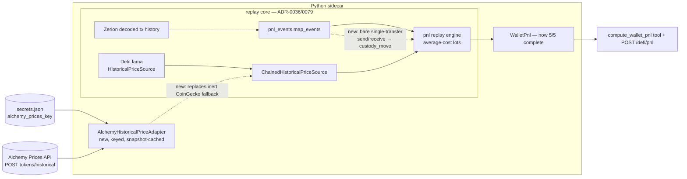

# 0087 — DeFi P&L: close the wallet-total gap (Alchemy historical-price fallback + bare-transfer custody classification)

> **Status:** done — closed 2026-07-12. Both code phases on `main` (no branch, migration-free, no new dep): `dev` ph1 `4ce70b6` (`AlchemyHistoricalPriceAdapter` — keyed Alchemy Prices `tokens/historical`, 2d-half-width/1h-interval window-bracket + nearest-point, over the in-house `ResilientHttpClient`; snapshots into the SAME `PriceSnapshotRepository` keyed by the SAME `token_key` as DefiLlama; wired as the DefiLlama-primary fallback in `api/app.py`, replacing the inert keyless CoinGecko adapter; `alchemy_prices_key` registered in `persistence/secrets.py`), `dev` ph2 `ebcf366` (bare single-leg outbound `send` of a position token, no lifecycle hint → `custody_move` via the existing no-op booking). Clean Mode 4 — **no blockers/majors/minors**. Every done-when read at the assertion level: ph1 pins nearest-point selection, key-in-`Authorization`-header-never-URL-path, key-never-in-a-401-failure-log, unkeyed-adapter-inert + chain-degrades-to-no-coverage, native-vs-contract request body, shared-snapshot determinism (chain re-run reads the snapshot with zero network from either source), empty/garbage(`0`/`-1`/`nan`/non-numeric)→`None`-never-`0.0`-never-snapshotted, typed 429; ph2 pins both real tx hashes (`0x303f8366`/`0x1cbbb89c`)→`custody_move` joined to the LP position, bare inbound `receive` keeps its Plan-0035 `fee_claim` (send-only narrowing), two-transfer send stays `unclassified`, a `send`+`unstake` hint is not custody. Two documented deviations, both benign and folded into the close (no ADR change): (a) **secret hygiene** — the adapter sends the key as `Authorization: Bearer` against a keyless URL path rather than ADR-0081's path-embedded `{apiKey}`, because the resilient client logs the URL path; strictly better hygiene, Alchemy supports Bearer-header auth, phase-3 smoke confirms the live endpoint; (b) **send-only narrowing** — ph2 classifies outbound `send` only, not the plan-literal `send`/`receive`, because a bare inbound single-leg `receive` already has an established Plan-0035 `fee_claim`/`reward_claim` classification and the two real residual events are outbound sends (an inbound receive is never `unclassified`); this is exactly the resolution the plan's Risks/open-question pre-authorized ("the fixture will expose it"), and it avoids reversing Plan 0035. The `custody_move` classification is correctly scoped to the position's own token by the join (`moved <= held`), not by `_classify` directly. Gates re-verified at close on `main`: **59 Python** (`test_alchemy_historical_price` + `test_pnl_events` + `test_secrets`) green + 2 known-correct Windows POSIX-mode skips; `mypy --strict` + `ruff` clean on all touched source. Implemented directly in this working tree — no branch/worktree to merge or prune. **Phase 3 (`human` live smoke — provision an Alchemy key, add `alchemy_prices_key` + point `base_rpc_url`/`eth_rpc_url` at Alchemy, restart the sidecar, `POST /defi/pnl refresh=true` on `0xae5b…9790`: 5/5 complete, non-null wallet realized/unrealized totals, the `0xef0fd52e…` leg prices via Alchemy, the two custody transfers book as no-ops, unclaimed reads come back real) was verified in the 2026-07-12 consolidated live smoke (see [`consolidated-smoke.md`](../../consolidated-smoke.md))** — a null on the specific long-tail token's Alchemy coverage is a documented finding (re-open the price-source decision), not a phase failure. ADR-0081 accepted at this close. Followups: known-own-address registry (removes the custody-move-can-misstate-external-send limitation); surface `unclaimed_rewards` in `portfolio_summary`.
> **Created:** 2026-07-12
> **Owner skill(s):** dev, human
> **Related ADRs:** [ADR-0081](../adrs/0081-defi-pnl-wallet-total-gap.md) (paired — refines [ADR-0079](../adrs/0079-defi-pnl-gauge-swaps-unclaimed.md) / [ADR-0036](../adrs/0036-defi-pnl-transaction-replay.md))

## TL;DR

Plan 0084 delivered the DeFi P&L *capability* (gauge attribution, swap booking, unclaimed rewards) but its wallet total stays `null` because two residuals leave positions `incomplete`: one long-tail token has no working historical price (the phase-4 CoinGecko fallback is inert — keyless historical is HTTP 401), and two bare position-token `send`/`receive` transfers fall through to `unclassified`. This plan closes both per ADR-0081: a **keyed Alchemy historical-price fallback** (a new adapter + secret over the existing resilient client — no new package) and a **bare-transfer → `custody_move`** classification (reusing the existing no-op booking primitive). First user-visible behavior: `POST /defi/pnl` on `0xae5b…9790` returns **5/5 complete** positions with **non-null** wallet realized/unrealized totals.

## Context & problem

The Plan 0084 phase-6 live smoke (and a post-fix confirming run, 2026-07-12) reduced the test wallet to exactly two blockers, both filed as follow-ups at that plan's close:

1. **One unpriced leg.** Position `16945c…` holds the token `base:0xef0fd52e…`, which has no DefiLlama block-time price. ADR-0079's fallback chained a **keyless** CoinGecko adapter, but its `market_chart/range` historical endpoint returns **HTTP 401** (confirmed; `simple/price` is keyless-200). So the fallback is inert and the leg nulls the wallet total (ADR-0036: any incomplete position ⇒ null total).
2. **Two bare transfers.** Events `0x1cbbb89c…` (position `87f522…`) and `0x303f8366…` (position `37023f…`) each carry a **single** transfer of a position token to/from the wallet with no paired value leg — a `send`/`receive` shape the taxonomy never modeled — and surface as `unclassified` (a loud failure). The wallet owner confirms these are **custody moves between their own wallets**.

Both are new scope, not defects in Plan 0084. The decisions (per ADR-0081): use **Alchemy** for the keyed price source, and classify a bare own-wallet transfer as `custody_move`. Two facts make the work small: Alchemy's Prices API serves block-time historical prices by contract address on Base over a plain REST endpoint (so a new adapter over the in-house `ResilientHttpClient`, **no vendor SDK, no pinned dependency**), and the `custody_move` no-op booking primitive already exists from ADR-0079 (so this is a classification change, not new arithmetic).

## Decision

Implement the two ADR-0081 decisions, preserving every ADR-0036/0079 invariant (block-time pricing, average-cost lots, determinism-by-snapshot, loud-failure-never-zero, read-only):

1. An `AlchemyHistoricalPriceAdapter` (`HistoricalPriceSource`) that brackets a block-time with a bounded window and returns the nearest point, snapshot-cached identically, wired as the fallback behind DefiLlama in place of the inert CoinGecko adapter; keyed by a new secret, key-absent ⇒ inert (honest incomplete).
2. A `custody_move` classification for a bare single-transfer position-token `send`/`receive` in `map_events`, booked by the existing no-op path.

We rejected the CoinGecko demo key (user chose Alchemy), the `alchemy-sdk` package (needless dependency under the cooldown), booking a bare transfer as a disposal (fabricates a loss), and building a known-own-address registry now (documented followup). Full rationale in ADR-0081.

## Architecture diagram

## Implementation phases

### Phase 1 — Alchemy historical-price fallback
- **Owner skill:** dev
- **What:** An `AlchemyHistoricalPriceAdapter` implementing `HistoricalPriceSource` over the in-house `ResilientHttpClient` (ADR-0019) — `POST /prices/v1/{apiKey}/tokens/historical` with `network` (map `Chain` → `base-mainnet`/`eth-mainnet`), `address`, and a **short window bracketing the requested block-time** (e.g. `[ts-6h, ts+6h]` at `interval="1h"`, inside the 30d span cap), returning the point **nearest** `ts`. Snapshot-cache into the **same** `PriceSnapshotRepository` keyed by the **same** `token_key`. Wire it as the `fallback` in `ChainedHistoricalPriceSource` (primary DefiLlama) in the composition root, **replacing** the inert `CoinGeckoHistoricalPriceAdapter`; the chain's asymmetric error posture is unchanged. Read the `alchemy_prices_key` secret from the secrets store; **key absent ⇒ construct no fallback (or an inert one) so the chain degrades to no-coverage**, never a crash, never a log of the key. Optionally delete the now-dead keyless CoinGecko module if nothing else consumes it.
- **Files touched:** `src/market_analyser/data/adapters/alchemy_historical_price.py` (new), `src/market_analyser/persistence/secrets.py` (**register `alchemy_prices_key` in the `SecretKey` Literal + `SecretsFile` field** — the store is `extra="forbid"`, so the key must exist in code before a `secrets.json` carrying it will load), `src/market_analyser/data/sources.py` (if a factory/signature touch is needed), the composition root that builds `ChainedHistoricalPriceSource` (where the price source is assembled — `api/app.py` / the defi job wiring), `tests/defi/test_*price*` / `tests/data/`, `tests/persistence/test_secrets*` (the new key in the status enum).
- **Done when:** a unit test asserts the adapter brackets `ts` and selects the nearest point against a recorded Alchemy response fixture; a `(token, ts)` the primary misses now resolves via Alchemy; a missing key and a transport error (401/throttle/outage) both degrade to `None` (no coverage) via the chain, never raise; the determinism test re-runs byte-identical from the shared snapshot; no Alchemy key value appears in any log or serialized artifact. **No live network in unit tests** (recorded fixtures only).

### Phase 2 — Bare-transfer custody-move classification
- **Owner skill:** dev
- **What:** In `map_events`, classify a **non-gauge** transaction that joins a position by a **single** transfer of that position's token, with a `send`/`receive` operation shape and **no** add/remove/swap/reward method hint, as `custody_move` (booked by the existing no-op path — no realized P&L, basis-neutral). Leave the loud-fail set intact: an ambiguous multi-transfer shape, or any tx that fits nothing, stays `unclassified`.
- **Files touched:** `src/market_analyser/defi/pnl_events.py` (classification), `tests/defi/test_pnl_events.py`; possibly `src/market_analyser/defi/pnl.py` only if a note/branch needs adjusting (the `custody_move` booking already exists — prefer touching nothing there).
- **Done when:** a fixture built from the two real events (`0x1cbbb89c…` → position `87f522…`, `0x303f8366…` → position `37023f…`) classifies each as `custody_move` joined to the correct position; the engine reconstructs those positions with `incomplete=False` and **unchanged basis** (the no-op); a test asserts a bare *outbound* send and a bare *inbound* receive both map to `custody_move`; a genuinely ambiguous shape (multi-transfer, or a non-position token) still yields `unclassified`; the mapping stays pure and deterministic.

### Phase 3 — Human live smoke (wallet total goes non-null)
- **Owner skill:** human
- **What:** Provision an Alchemy API key, add it as `alchemy_prices_key` to the secrets store, **restart the standalone sidecar** (to load phases 1–2), and run `POST /defi/pnl` with `refresh=true` on `0xae5b…9790`. Confirm the total closes. **Also point RPC at Alchemy** (user's choice, no code): set `base_rpc_url` / `eth_rpc_url` to `https://base-mainnet.g.alchemy.com/v2/<KEY>` / `…eth-mainnet…` — the same underlying Alchemy key, full-URL shape (a separate secret from `alchemy_prices_key`). This also resolves the public-RPC rate-limit that degraded `unclaimed_rewards` to `null` in the Plan 0084 phase-6 smoke, so the unclaimed reads should come back real in the same run.
- **Files touched:** none (verification + secret provisioning).
- **Done when:** all 5 positions report `incomplete=false`; wallet `realized_usd`/`unrealized_usd` are **non-null**; the `0xef0fd52e…` leg (position `16945c…`) prices via the Alchemy fallback (Alchemy actually returns coverage for that token — verify, don't assume); the two events `0x1cbbb89c…`/`0x303f8366…` book as `custody_move` (positions `87f522…`/`37023f…` complete with unchanged basis); the Zerion FIFO cross-check shows no gross-divergence warning. Record the verdict in the plan close notes. (If Alchemy has no coverage for that specific token, that is a documented finding, not a phase failure — the fallback still degrades honestly; re-open the price-source decision.)

## Data shapes

No new response/schema fields. `AlchemyHistoricalPriceAdapter.fetch_price(chain, address, ts) -> float | None` matches the existing `HistoricalPriceSource` contract; `custody_move` is an existing `EventKind`. The tool/route/docs are unchanged (no apiref regen needed).

## Risks & open questions

- Risk: **Alchemy per-request span caps** (5m→7d, 1h→30d, 1d→1yr) mean the adapter must bracket `ts` with a bounded window, not a single-point query. Mitigation: a tight bracket at a fine interval; the human smoke validates real coverage before the leg is claimed closed.
- Risk: **`custody_move` as the default misstates a genuine external send** — booking a real third-party disposal as a no-op carries basis on units no longer held. Accepted per ADR-0081 (the wallet's two events are confirmed own-wallet moves; the alternative fabricates a loss). Future refinement: a known-own-address registry (followup below).
- Risk: **Alchemy free-tier coverage/granularity for the specific long-tail token** may be thin. Mitigation: the phase-3 smoke is the gate; a null there is a documented finding, not a silent pass (the CoinGecko-401 lesson).
- Risk: **secret handling.** The key must never be logged or serialized; key-absent must degrade, not crash. Mitigation: read at composition, construct an inert fallback when absent, and assert no-key-in-logs in phase 1.
- Open question: does the two-transfer set generalize, or are there other bare-transfer shapes (e.g. a token *received* that opens a new lot) that should **not** be a no-op? Phase 2's fixture must confirm inbound-receive-as-custody is correct for the real events; if an inbound bare receive should instead open a lot at receipt value, that is a narrower classification the fixture will expose.

## What this plan does NOT do

- **A known-own-address registry** to distinguish custody moves from external disposals — documented followup, not built here (ADR-0081 accepted limitation).
- **A vendor SDK / new pinned dependency** — the Alchemy adapter is REST over the existing resilient client (ADR-0081).
- **Any new tool, route, or schema field** — the fix is internal to pricing + classification.
- **Whole-wallet cross-address netting** — the engine stays per-position / per-address (ADR-0036).
- **Any execution / rebalance action** — read-only, per ADR-0025/0029.
- **Re-opening the gauge/swap/unclaimed work** — that shipped and is validated (Plan 0084).

## Followups (after this lands)

- **Known-own-address registry** so a bare transfer to a non-owned address books as a disposal rather than a custody move (removes the ADR-0081 accepted limitation).
- Surface `unclaimed_rewards` in `portfolio_summary` (carried from Plan 0084 / ADR-0041).
