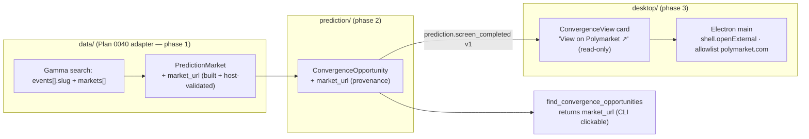

# 0089 — Polymarket market links (open in browser) + explicit sort

> **Status:** done (2026-07-12) — all three code phases implemented in the parallel worktree/branch `plan-0089-polymarket-market-links` (`155adf2` `dev` ph1 adapter event-slug→`PredictionMarket.market_url`, host-validated; `4d03c75` `dev` ph2 `ConvergenceOpportunity.market_url` passthrough + tool description + apiref; `e83a651` `ui-builder` ph3 read-only card link + renderer host-allowlist + Zod/mirror/parity + pinned edge-descending sort), status-flip `68e0315`, **merged to `main` `--no-ff` at `4a22df6`** (verified conflict-free against `main`'s post-`6707bdd` parallel Plan 0088 work; the only file overlaps — `en.ts`/`ru.ts`/`docs/reference/mcp-tools.md` — are additive at non-colliding ranges). Clean Mode 4 — **no blockers/majors/minors**; one benign, plan-sanctioned deviation (below). Every done-when read at the assertion level: ph1 builds `https://polymarket.com/event/<event-slug>` and pins host+`https`-scheme validation + a parametrized path-injection slug set (empty/whitespace/non-string/`has/slash`/`has space`/`%2F`/`?query`/`#frag` → `None`, never a raise), `None` when the event slug is absent, and the by-id `fetch_market` path (no event wrapper) → `market_url is None`; ph2 threads it onto the opportunity, pins present-as-`null` (no `exclude_none`, so the renderer mirror sees the key), asserts a real `polymarket.com` URL survives the ADR-0029 word-boundary advice grep, and that the tool description advertises the field; ph3 drives dispatch→Zod→render for the "View on Polymarket ↗" link (opens via `shell.openExternal`, `rel="noreferrer"`, `preventDefault` — never a renderer navigation), asserts **zero trade controls** (`button/input/select/textarea/[role=button]`) while permitting exactly one host-validated external link per card, renders no link for an off-allowlist `market_url` (look-alike host / `http` / port / garbage), and pins edge-descending order from a deliberately shuffled payload. Gates re-verified on `main` at close: **78 Python** (`test_polymarket_adapter` + `test_convergence` + `test_prediction_screener_tool` + `test_prediction_market_tools`) + **64 renderer jest** (`ConvergenceView` + `events.test` parity + `locales` parity) green; `apiref --check` exit 0. **Deviation (plan-sanctioned):** phase 3's done-when named "a non-`polymarket.com` URL rejected by the allowlist, asserted in the main-process spec" *if no external-open path exists* — one did (`shell.openExternal`, built for `NewsView`), so per the plan's explicit "reuse the app's existing external-open path if one exists" the polymarket-host allowlist lives renderer-side in `safePolymarketUrl` (asserted in `ConvergenceView.test.tsx`) layered over the existing IPC-boundary `http(s)`-scheme allowlist (`shellOpen.ts`, asserted in `shellOpen.test.ts`) — defense in depth across three layers (sidecar build-time host-validation → renderer host allowlist → IPC scheme allowlist), no `desktop/main/` change needed. **Phase 4 (`human` live smoke — click a returned `market_url` from both the CLI and the panel, confirm it opens the correct Polymarket market page in the system browser, the list is largest→smallest by `implied_return_if_right`, and nothing reads as a buy call) is the user's outstanding step, not a code gate.** No paired ADR (realizes ADR-0041, records a provenance-link boundary call inside ADR-0029, honours ADR-0008 external-nav). Followups: extend `market_url` to the `search_prediction_markets`/`prediction_market_odds` tool outputs (the field already lives on `PredictionMarket`); a short ADR if the provenance-link boundary call warrants durable capture.
> **Created:** 2026-07-12
> **Owner skill(s):** dev, ui-builder, human
> **Follows:** [Plan 0078](done/0078-polymarket-convergence-screener.md) (convergence screener — closed 2026-07-12) and [Plan 0040](0040-polymarket-odds-adapter.md) (the read-only Polymarket odds adapter this extends).
> **Related ADRs:** [ADR-0041](../adrs/0041-polymarket-odds-read-source.md) (Polymarket as a read-only odds source), [ADR-0029](../adrs/0029-advisory-recommendation-boundary.md) (conditions are facts — the boundary a provenance link sits *inside*, not across), [ADR-0031](../adrs/0031-data-source-adapter-contract.md) (the source contract), [ADR-0008](../adrs/0008-electron-shell-conventions.md) (Electron external-navigation + CSP discipline the browser-open must honour), [ADR-0072](../adrs/0072-bounded-autonomy-and-prediction-market-execution.md) (the *future* execution — this link is not it).

## TL;DR

Each convergence opportunity currently carries no way to reach the actual market. Add a **canonical Polymarket URL** to every opportunity — built at the data boundary from the Gamma **event slug**, host-validated to `polymarket.com`, `None` when the slug is absent (no fabricated link) — surfaced two ways: the `find_convergence_opportunities` tool returns `market_url` (so the agent prints a clickable link in the CLI), and the read-only Convergence panel renders one **"View on Polymarket ↗"** external link per card that opens in the system browser. The panel stays a no-**trade**-controls surface: a source/provenance link is a fact (like a citation), not a buy affordance — so phase 3 refines Plan 0078's "zero interactive elements" spec to "**zero trade controls**, plus exactly one read-only external market link." Also pin the already-guaranteed sort (largest→smallest by `implied_return_if_right`) explicitly in the view.

## Context & problem

Plan 0078's live smoke (2026-07-12) worked end-to-end, but every opportunity is a dead end: the user reads a compelling near-decided market (`BTC above $66k Jul 13`, 5.82% gross) and then has to go hunt for it on Polymarket by hand. The user asked for a link that opens the market in the browser, and for the list sorted largest-to-smallest.

Two facts shape the design:

- **The URL is not constructible from what we store today.** `PredictionMarket` (Plan 0040) carries only the numeric Gamma `market_id` (`polymarket.py:212`, the `id` field). Polymarket's public pages are `polymarket.com/event/<event-slug>` — the numeric id does **not** resolve to a page. The **event slug** *is* present in the search payload (`_parse_search` iterates `{"events": [{…, "slug"?, "markets": […]}]}` at `polymarket.py:191` and flattens the markets out, dropping the event) — so it is available to capture, but is currently discarded. This means the change starts in the Plan 0040 adapter, not in Plan 0078's code.
- **The sort is already largest→smallest.** `screen_convergence` ranks by `-implied_return_if_right` (`convergence.py:136`), so "largest to smallest" by gross edge is already the default and was visible in the smoke (5.82% → 3.73% → …). This plan does not change the sort — it pins it explicitly in the viewer so a future refactor can't silently reorder, and confirms edge-descending is the intended key.

## Decision

Add a source-agnostic `market_url: str | None` to `PredictionMarket`, **built and host-validated in each adapter** (the Polymarket adapter constructs `https://polymarket.com/event/<event-slug>` from the event slug captured during search flattening; `None` when absent — never a guessed or numeric-id URL). Copy it onto `ConvergenceOpportunity` as provenance (beside `source`/`queried_at`), so it flows through the tool response and the `prediction.screen_completed` payload for free. The viewer renders a single read-only external link per card, opened through the Electron system-browser path host-allowlisted to `polymarket.com` (never renderer navigation, per ADR-0008).

**Charter call (recorded here, no new ADR):** a market URL is **provenance/citation** — it reports *where the public fact lives*, exactly like a news source link. It does not recommend, size, or execute. It therefore sits **inside** the ADR-0029/0041 read-only boundary, not across it; the deferred *buying* (ADR-0072) is unaffected. Plan 0078's phase-3 "zero interactive elements" assertion was a proxy for "no **trade** controls" (no buy button, no size input); this plan refines it to say that precisely, permitting one read-only external market link while still asserting zero buy/size/submit affordances. We reject building the URL from the numeric `market_id` (does not resolve) and reject fabricating a slug when the upstream omits one (`None` is the honest value — ADR-0041). We reject a new ADR (this realizes existing ones); if the boundary call warrants durable capture, a two-paragraph ADR is a cheap follow-up.

## Architecture diagram



## Implementation phases

### Phase 1 — Capture the event slug and build the market URL in the adapter
- **Owner skill:** `dev`
- **What:** Add `market_url: str | None = None` to `PredictionMarket` (`data/types.py`). In the Polymarket adapter, capture each event's `slug` during search flattening (`_parse_search`) and pass it into `_parse_market`, which builds `https://polymarket.com/event/<slug>` — **host-validated** (scheme `https`, host exactly `polymarket.com`, slug non-empty and URL-safe) and `None` when the slug is absent or malformed (no fabricated link, ADR-0041). Verify against a **live Gamma search payload** that `events[].slug` is present and that `polymarket.com/event/<slug>` resolves to the market's page (the one shape risk — the event slug, not the market slug, is what the public URL uses); if live data shows otherwise, capture the field that does and record it in the plan.
- **Files touched:** `src/market_analyser/data/types.py`, `src/market_analyser/data/adapters/polymarket.py`, `tests/data/test_polymarket_adapter.py`.
- **Done when:** A search fixture whose event carries a `slug` yields markets with `market_url == "https://polymarket.com/event/<slug>"`; an event missing `slug` (or with a non-string/empty one) yields `market_url is None` (never a numeric-id URL, never a raise); the built URL is asserted to be `https`-scheme + `polymarket.com`-host; the existing search/flatten/odds tests still pass unchanged; and the live-shape check is recorded (event slug confirmed as the URL basis, or the correct field substituted).

### Phase 2 — Thread `market_url` onto the opportunity + tool output
- **Owner skill:** `dev`
- **What:** Add `market_url: str | None = None` to `ConvergenceOpportunity` (`prediction/models.py`), populated from `market.market_url` in `_screen_market` (`convergence.py`). It flows into the tool response and the `prediction.screen_completed v1` payload automatically (the payload carries `list[ConvergenceOpportunity]`). Update the tool's field-list in `FIND_CONVERGENCE_OPPORTUNITIES_DESCRIPTION` and regenerate `docs/reference/`. No new event, no version bump (additive optional field on an inline model — same posture as the other additive payload fields).
- **Files touched:** `src/market_analyser/prediction/models.py`, `src/market_analyser/prediction/convergence.py`, `src/market_analyser/api/mcp_tools/prediction_screener.py`, `tests/prediction/test_convergence.py`, `tests/api/test_prediction_screener_tool.py`, `docs/reference/` (regen).
- **Done when:** An opportunity built from a market with a `market_url` carries it through the tool response; a market with `market_url is None` yields `market_url: null` (not omitted-in-a-way-that-breaks-the-mirror — matches the `liquidity_caution`/`volume_usd` `exclude_none` posture already in the payload); the no-advice grep still passes (a `polymarket.com` URL contains none of the advice tokens); `apiref --check` is green; the field appears in the tool description's returned-shape list.

### Phase 3 — Render the read-only browser link + pin the sort
- **Owner skill:** `ui-builder`
- **What:** On each `ConvergenceView` card, render a **"View on Polymarket ↗"** external link when `market_url` is present (absent otherwise — no dead link). It opens in the **system browser**, not the renderer: reuse the app's existing external-open path if one exists, else add a `setWindowOpenHandler`/`shell.openExternal` in Electron main that **allowlists `https://polymarket.com`** and rejects anything else (ADR-0008 — the renderer never navigates, never gets Node). Add `market_url` to the Zod schema (`.nullish()`, matching the wire) + the TS mirror + the parity guard. **Refine the phase-3 no-action assertion** (inherited from Plan 0078): assert **zero trade controls** — no `button`/`input`/`select`/`textarea`/`[role="button"]`, no entry/stop/size field — while permitting exactly one external market link per card (asserted to point at `polymarket.com` and carry `rel="noreferrer"`, or to route through the safe IPC open channel). **Pin the sort** with a test that the rendered card order is `implied_return_if_right` descending (largest→smallest) given an out-of-order payload — documenting that the screener guarantees it and the view preserves it.
- **Files touched:** `desktop/renderer/views/ConvergenceView.tsx` + `.test.tsx`, `desktop/renderer/schemas/predictionScreenCompleted.ts`, `desktop/renderer/types/events.ts` + `events.test.ts`, `desktop/renderer/locales/en.ts` + `ru.ts` (the link label), and — if no external-open path exists — `desktop/main/` (window-open handler + allowlist) + its spec.
- **Done when:** A card whose opportunity has a `market_url` renders one external link to that URL; a card whose `market_url` is null renders none; clicking routes to the system-browser open (not a renderer navigation) and a non-`polymarket.com` URL is rejected by the allowlist (asserted in the main-process spec); the panel still asserts **zero trade controls**; the rendered order is edge-descending given a deliberately shuffled payload; a malformed payload (e.g. `market_url` a number) is still Zod-dropped loudly; the parity guard carries the new field.

### Phase 4 — Live smoke
- **Owner skill:** `human`
- **What:** Run `find_convergence_opportunities` against live Polymarket, click a returned `market_url` (from the CLI and from the panel), and confirm it opens **the correct market's page** in the system browser; confirm the list is largest→smallest by return-if-right; confirm nothing reads as a buy prompt.
- **Done when:** The user confirms a live link opens the right Polymarket market page in the browser from both surfaces, the order is correct, and the link reads as "go look at the market", never "buy this".

## Data shapes

```python
# additions only — existing fields unchanged
class PredictionMarket(BaseModel):
    ...
    market_url: str | None = None   # canonical polymarket.com/event/<slug>, host-validated; None if no slug

class ConvergenceOpportunity(BaseModel):
    ...
    market_url: str | None = None   # copied from the market — provenance, never an action
```

## Risks & open questions

- **Which slug builds the public URL.** Polymarket URLs are `polymarket.com/event/<event-slug>`; a market can also carry its own `slug`. The event slug (available in the search `events[]` wrapper) is the expected basis, but this is the one thing to confirm against a live payload in phase 1 — if the market resolves under a different path, capture that field instead. Degrading to `None` on any uncertainty keeps a wrong link from ever rendering.
- **The link is the on-ramp to acting — and that is fine.** Opening Polymarket is where the *user* may choose to buy, on their own judgment and their own account. That is the charter's "the user decides and acts" line, not the app crossing into advice or execution. The link must be labeled as viewing the market, never "trade"/"buy", so it never *reads* as an app-issued call.
- **Electron external-navigation safety.** The URL comes from external data, so it must be host-allowlisted before opening; a bare `<a href>` that navigates the renderer would violate ADR-0008. Route through `shell.openExternal` with a `polymarket.com` allowlist; never let the renderer follow the link itself.
- **Jurisdiction.** Unchanged from Plan 0078: reading is fine everywhere; whether the user may *transact* on Polymarket where they are is their responsibility and outside this read-only surface.

## What this plan does NOT do

- **No buying, sizing, or execution** — a view link is not a trade control (ADR-0072 execution stays deferred).
- **No change to the ranking key** — edge-descending is already the sort; this plan only pins it.
- **No in-app embedded market view / no iframe** — the market opens in the user's own browser, not inside the app.
- **No back-links for the other prediction-market surfaces** (odds tools) — scoped to the convergence opportunity here; trivial to extend later since `market_url` lives on `PredictionMarket`.

## Followups (after this lands)

- If the provenance-link boundary call warrants durable capture, a short ADR ("external source links in read-only analysis surfaces are provenance, not action controls") refining how ADR-0029 applies.
- Extend `market_url` to the `search_prediction_markets` / `prediction_market_odds` tool outputs (the field already lives on `PredictionMarket`).
