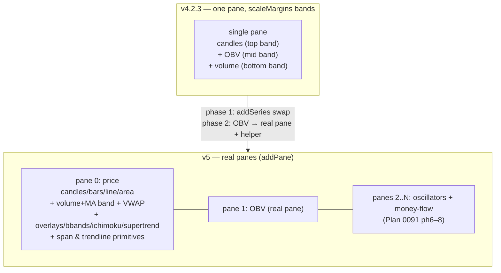

# 0095 — lightweight-charts v4 → v5 migration (real panes substrate)

> **Status:** done — closed 2026-07-13. Two `ui-builder` phases on `main`, no branch, no new runtime concept: `cee1be3` ph1 (v4.2.3→v5.2.0 exact pin + lockfile in one commit; every series-creation site migrated to v5's unified `addSeries(<Type>Series, opts, paneIndex?)`; `lib/spans.ts` + `lib/trendlines.ts` primitives migrated to the v5 `IPrimitivePaneView`/`IPrimitivePaneRenderer`/`PrimitivePaneViewZOrder` names verified against the installed typings; ESM-only v5 handled with shared jest mocks) → `9a10ad7` ph2 (`lib/panes.ts` `PaneRegistry` — stable-id create/reuse/reindex-on-remove over `chart.addPane()`/`removePane()`/`panes()`; OBV relocated from its `scaleMargins` band onto a real pane; volume/volume-MA/VWAP stay price-pane bands as specified). Paired **ADR-0088 accepted** at close. Clean Mode 4 — no blockers/majors/minors/nits. Every named test read at the assertion level: `panes.test.ts` proves create/reuse/consecutive-index/remove-with-reindex/sizing against a v5-modeling stub; `CandlestickChart.layers.test.tsx` pins the OBV row + `priceScaleId:'obv'` series + layer-toggle `applyOptions({visible})`. Gates re-verified at close: typecheck (5 tsconfigs) + lint + **851 jest / 87 suites** + **58 test:main** + `gen-types:check` no-drift all green; no `desktop/renderer/index.html`/main CSP change (ADR-0008 verbatim); no wire/event/schema change. Implemented directly in this working tree — no branch/worktree to merge or prune. **Phase 3 (`human` visual smoke) reported PASS by the user** (v5 renders with no visual regression across every existing chart feature; OBV now in its own pane). **Unblocks Plan 0091 ph6–8** (oscillator/money-flow panes consume `lib/panes.ts`) and benefits Plan 0092's overlay/annotation phases.
> **Created:** 2026-07-13
> **Owner skill(s):** ui-builder, human
> **Related ADRs:** [0088-lightweight-charts-v5-panes](../adrs/0088-lightweight-charts-v5-panes.md) (paired — accepts at this plan's close), [0008-electron-shell-conventions](../adrs/0008-electron-shell-conventions.md) (CSP posture reaffirmed, unchanged), [0012-dependency-cooldown](../adrs/0012-dependency-cooldown.md) + [0013-pin-direct-dependencies](../adrs/0013-pin-direct-dependencies.md) (exact pin, cooldown gate), [0049](../adrs/0049-chart-trendline-overlay-primitive.md)/[0061](../adrs/0061-trendline-pattern-identity-and-colour.md)/[0062](../adrs/0062-user-chart-style-overrides.md)/[0077](../adrs/0077-user-originated-display-overlays.md)/[0045](../adrs/0045-candlestick-pattern-span-delivery.md) (call-site/primitive substrate updated, no decision reversed)
> **Blocks:** [Plan 0091](0091-momentum-divergence-moneyflow-layer.md) phases 6–8 (oscillator/money-flow/divergence panes); benefits [Plan 0092](0092-price-structure-and-levels.md) overlay/annotation phases.

## TL;DR

The renderer pins `lightweight-charts@4.2.3`, which has **no panes API** — it fakes sub-panes with `scaleMargins` bands on one pane (`lib/chartSeries.ts:26-34`), fine for the current three (candles/volume/OBV) but unusable for the eight-plus oscillator + money-flow panes [Plan 0091](0091-momentum-divergence-moneyflow-layer.md) needs. This plan upgrades to **v5** (real `chart.addPane()`), as a **behavior-preserving precursor**: migrate every series-creation site to v5's unified `addSeries(SeriesDef, opts, paneIndex?)`, migrate the two `ISeriesPrimitive` files to v5's type names, land the exact pin + lockfile in one cooldown-gated commit, and prove the existing chart renders identically. Then adopt the real panes API by moving the existing OBV strip onto its own pane behind a small reusable pane helper — the proof that `addPane()` works end-to-end and the helper Plan 0091 ph6 consumes. **No new indicator, no wire change, no CSP change** (ADR-0088). First user-visible behavior: the chart looks and behaves exactly as before, except OBV now sits in its own real pane instead of a squeezed overlapping band.

## Context & problem

`ui-builder` began [Plan 0091](0091-momentum-divergence-moneyflow-layer.md) phase 6 (render five oscillator sub-panes) and hit the wall the plan's own Risk section (line 145) predicted: on v4.2.3, the only way to stack panes is overlay price scales with `scaleMargins` bands, and eight-plus bands on a single shared pane collapse into unreadable slivers that share one price axis and crosshair and fight each other's autoscale. lightweight-charts **v5** adds a first-class panes API (`chart.addPane()`, `IPaneApi`, a `paneIndex` argument on `addSeries`) that is exactly the missing framework. The upgrade is a **major version bump with a breaking series-creation API** — see [ADR-0088](../adrs/0088-lightweight-charts-v5-panes.md) for the full decision and alternatives.

This plan is the precursor swap. It does **not** add any Plan 0091 content — it lands v5 with the existing chart unchanged (bar OBV's pane), so 0091 ph6–8 and 0092's overlay phases build on a proven engine and 0091's review judges new-indicator correctness, not an engine change.

## Decision

Per [ADR-0088](../adrs/0088-lightweight-charts-v5-panes.md): pin `lightweight-charts` at an exact `5.x` (target `5.2.0`, the current npm `latest`; the cooldown gate picks the newest eligible 5.x at install), migrate all series creation to `addSeries`, migrate the span + trendline primitives to v5's type names, keep every existing feature visually identical (volume/VWAP stay price-pane bands), and adopt real panes by relocating OBV onto pane 1 behind a reusable helper. Behavior-preserving; renderer-internal; no sidecar/wire/CSP change.

## Architecture diagram

## Implementation phases

### Phase 1 — v5 bump + behavior-preserving series/primitive migration
- **Owner skill:** ui-builder
- **What:** Bump `lightweight-charts` `4.2.3` → exact `5.x` (target `5.2.0`) in `desktop/package.json`, run `pnpm install`, and land the lockfile in the **same commit** naming the version (ADR-0013). Migrate **every** series-creation site from `chart.add<Type>Series(opts)` to `chart.addSeries(<Type>Series, opts)` (importing the series-definition objects), and migrate `lib/spans.ts` + `lib/trendlines.ts` to v5's primitive type names (the `Series`-prefix-dropped `IPrimitivePaneView`/`IPrimitivePaneRenderer`/`PrimitivePaneViewZOrder` family — **verify against the installed `5.2.0` typings, not memory**). This migration is **atomic** — a partial swap does not compile, so bump + all series sites + primitive types are one commit. Keep the existing layout byte-for-byte: volume + volume-MA + VWAP + OBV stay on their current `scaleMargins` bands (still supported in v5); no `addPane()` yet. Audit the typecheck output for any other v5 removed/renamed option (watermark is a plugin in v5 — the codebase uses none) and fix each at its call site.
- **Files touched:** `desktop/package.json`, `pnpm-lock.yaml`, `renderer/lib/chartSeries.ts` (`createMainSeries` — 4 modes), `renderer/hooks/useOverlaySeries.ts`, `renderer/hooks/useBbandsSeries.ts`, `renderer/hooks/useIchimokuSeries.ts`, `renderer/hooks/useSupertrendSeries.ts`, `renderer/hooks/useFormingBar.ts`, `renderer/hooks/useChartScans.ts`, `renderer/components/CandlestickChart.tsx` (volume/volume-MA/VWAP/OBV creation + chart creation), `renderer/lib/spans.ts`, `renderer/lib/trendlines.ts`, and the jest suites that assert the old series-creation calls or drive `__test_chart_render__` (the `CandlestickChart.*.test.tsx` family + `use*Series.test.tsx` + `lib` primitive tests).
- **Done when:** `pnpm install` accepts the pinned 5.x under the cooldown (if it refuses `5.2.0` as too-new, pin the newest eligible 5.x and record it in the commit message); the manifest pin is exact (no `^`/`~`) and manifest+lockfile are one commit; `typecheck` (all five tsconfigs) + `lint` + `test` + `test:main` are green; every existing chart feature still renders — candles/bars/line/area render modes, volume + volume-MA + VWAP, OBV band, agent overlays (ema/sma), Bollinger, Ichimoku, Supertrend, pattern spans, and trendlines (with `hitTest` tooltip + grouped legend) — asserted by the updated suites driving the same rendered outcomes (same series kinds, same layers, same primitives) as on v4; `gen-types:check` clean; **no `desktop/renderer/index.html` or `desktop/main` CSP change** (ADR-0008 verbatim).

### Phase 2 — Adopt real panes: reusable pane helper + OBV on its own pane
- **Owner skill:** ui-builder
- **What:** Introduce a small reusable pane helper (`renderer/lib/panes.ts`) that creates/relocates a real bottom pane via `chart.addPane()` / the `addSeries(..., paneIndex)` argument, exposing what Plan 0091 ph6–8 will consume (create-or-reuse a pane by stable id, set its height/stretch, tear it down on toggle-off). Migrate the **existing OBV strip** from its `scaleMargins` band (`OBV_SCALE_ID`/`OBV_SCALE_MARGINS`) onto a **real pane (pane 1)** as the first real consumer and the end-to-end proof of `addPane()`. Volume + volume-MA + VWAP **stay** on the price pane (pane 0) as bands — deliberately unchanged (ADR-0088; volume-under-price is the standard idiom). Preserve the OBV `LayersPanel` toggle (`OBV_LAYER_ID = 'series:obv'`): toggling it hides/shows the OBV pane in place.
- **Files touched:** `renderer/lib/panes.ts` (new), `renderer/lib/chartSeries.ts` (retire `OBV_SCALE_ID`/`OBV_SCALE_MARGINS`; keep volume constants), `renderer/components/CandlestickChart.tsx` (OBV creation → pane helper), `renderer/hooks/*` if OBV creation lives in a hook, the OBV/layers jest suites (`CandlestickChart.layers.test.tsx` + any OBV pane test), and a new `lib/panes.test.ts`.
- **Done when:** a `lib/panes.test.ts` unit test proves the helper creates a pane at the requested index, reuses it by id, and removes it cleanly (against a stubbed `IChartApi` mirroring the existing chart-stub test pattern); OBV renders in its own real pane below the price pane with its price scale autoscaling independently of price; the OBV `LayersPanel` toggle shows/hides the OBV pane; volume + VWAP are unchanged on the price pane; `typecheck` + `lint` + `test` + `test:main` green; the helper's public shape is documented (a short doc-comment) for Plan 0091 ph6 to consume.

### Phase 3 — Live visual smoke (human)
- **Owner skill:** human
- **Done when (user-run):** launch the desktop app against a populated symbol (e.g. `BTC-USD 1d`) and confirm **no visual regression** across every existing chart feature on v5: candles render and pan/zoom smoothly; switching the candle series-type to bars/line/area still rebuilds correctly (ADR-0062) and re-attaches primitives; volume + volume-MA + VWAP sit at the price-pane bottom as before; **OBV now shows in its own pane** below price and its layers toggle hides/shows it; agent overlays (ema/sma), Bollinger Bands, Ichimoku cloud, and Supertrend all draw; a pattern-span band and a trendline both render, and the trendline hover-tooltip + grouped legend still work; the crosshair reads across the price pane and the OBV pane on one time axis; nothing in the console warns or errors. A single confirmed regression is a phase failure to fix-forward before Plan 0091 ph6 begins.

## Risks & open questions

- **Risk: the primitive type names in v5 differ from what this plan guesses.** ADR-0088 names the likely renames but flags them as verify-against-typings. Mitigation: phase 1 confirms every primitive import against the installed `5.2.0` `.d.ts`, and `typecheck` is the exhaustive gate — a wrong name fails the build, it can't ship silently.
- **Risk: a v5 runtime behavior differs subtly** (autoscale defaults, `scaleMargins` interaction with real panes, crosshair over multiple panes) in a way typecheck/jest don't catch. Mitigation: phase 3 is a dedicated human visual smoke across every feature before any 0091 work builds on v5.
- **Risk: the cooldown refuses `5.2.0`** if it is <14 days old at install. Mitigation (ADR-0012): pin the newest eligible 5.x instead; the pin is decided at `pnpm install`, recorded in the commit message, never taken from memory. No per-package allowlist.
- **Open question: does volume eventually move to its own pane too?** Out of scope here (volume-under-price is the idiom); revisit if a future plan wants an independently-scaled volume pane. The `panes.ts` helper makes it a small later change.
- **Risk: OBV-on-a-real-pane is the one intentional visual delta.** If the user prefers OBV to stay a band, phase 2's OBV migration can be dropped and the helper proven with a throwaway pane instead — but a real consumer is the stronger proof. Flagged for the phase-3 smoke to confirm the OBV pane reads well.

## What this plan does NOT do

- **No new indicator, oscillator, money-flow, or divergence rendering** — that is [Plan 0091](0091-momentum-divergence-moneyflow-layer.md) ph6–8, which this plan unblocks.
- **No wire, event, `OverlaySpec`/`TrendlineSpec`, or payload-version change** — v5 is renderer-internal; the sidecar and agent are untouched.
- **No CSP or Electron-security change** (ADR-0008 verbatim) — lightweight-charts is a bundled canvas dependency with no network surface.
- **No volume-pane migration, no new user-facing pane controls, no chart-style setting for pane heights** — behavior-preserving swap only (OBV's pane aside).
- **No decomposition of `CandlestickChart.tsx`** beyond what the migration touches — the god-component follow-up is its own concern.

## Followups (after this lands)
- Plan 0091 ph6–8 consume `lib/panes.ts` for the oscillator + money-flow + divergence panes.
- Plan 0092's Fibonacci/pivot/anchored-VWAP overlays and structural annotations ride the v5 series/overlay path.
- Optionally move volume to its own pane; add pane-height persistence to the chart-style store (ADR-0062) if users want it.
