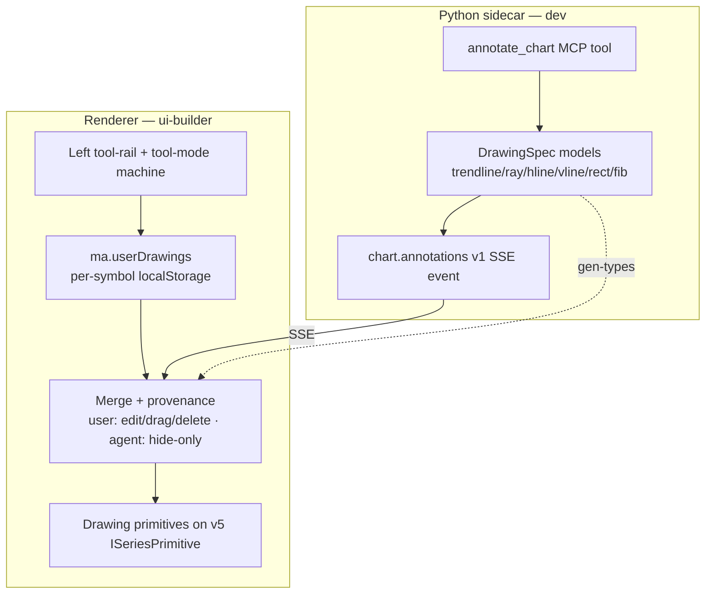

# 0097 — Chart drawing dock

> **Status:** done — closed 2026-07-14. Four code phases on `main`: [`c83e0bf`](../../adrs/0091-chart-annotation-layer.md) `dev` ph1 (DrawingSpec wire contract + `chart.annotations v1` + `annotate_chart` tool), `8b47f20` `ui-builder` ph2 (rail + trendline/ray + per-symbol persistence + full edit engine — walking skeleton), `56dc92a` `ui-builder` ph3 (hline/vline/rect/fib), `81fcd0d` `ui-builder` ph4 (agent-source render + provenance merge). Mode 4 verdict: **clean, no blockers/majors** — two well-judged deviations that *improve* on the plan (a dedicated `lib/drawings.ts` `DrawingPrimitive` reusing the ADR-0059 helpers from `trendlines.ts` rather than coupling into it; a single segment-distance hit-test path — every kind decomposes to segments, so no per-kind distance functions needed). Verified at assertion level: phase-1 tests defend one valid + one malformed spec **per kind**, provenance-rejection, dup-id rejection, empty-clear, and a live-server round-trip; `annotate_chart` is in `EXPECTED_FULL_TOOLSET`; the merge collapses identical agent+user pairs and gives id-collisions to the user; edit-gating is provenance-scoped (user edit/drag/delete, agent hide-only); i18n parity holds (10 `chart.draw.*` keys in both en + ru). ADR-0091 accepted at this close. **Phase 5 (human live smoke) PASS 2026-07-15** (user-attested) — the six-kinds-end-to-end, agent-hide-only-vs-user-editable, en/ru render, and green renderer-jest + `test:main` + `gen-types:check` + `apiref --check` + no-CSP-change checks were confirmed in the running app. **Plan fully complete — no residual phases.**
> **Created:** 2026-07-13
> **Owner skill(s):** dev, ui-builder, human
> **Related ADRs:** [0091-chart-annotation-layer](../adrs/0091-chart-annotation-layer.md) (paired — accepts at close), [0077-user-originated-display-overlays](../adrs/0077-user-originated-display-overlays.md) (two-source merge + renderer-owned user side), [0015-claude-code-primary-control-surface](../adrs/0015-claude-code-primary-control-surface.md) (agent annotation = analysis on the wire), [0017-live-ui-updates-via-sse](../adrs/0017-live-ui-updates-via-sse.md) (new `chart.annotations v1` event), [0049-chart-trendline-overlay-primitive](../adrs/0049-chart-trendline-overlay-primitive.md) / [0061-trendline-pattern-identity-and-colour](../adrs/0061-trendline-pattern-identity-and-colour.md) (trendline primitive reused as substrate), [0059-trendline-event-channel-and-recompute](../adrs/0059-trendline-event-channel-and-recompute.md) (logical-coordinate + recompute-on-load handling), [0088-lightweight-charts-v5-panes](../adrs/0088-lightweight-charts-v5-panes.md) (v5 primitive substrate), [0039-renderer-theming-localstorage](../adrs/0039-renderer-theming-localstorage.md) (`ma.*` persistence), [0063-in-house-i18n-and-reason-codes](../adrs/0063-in-house-i18n-and-reason-codes.md) (en/ru parity), [0008-electron-shell-conventions](../adrs/0008-electron-shell-conventions.md) (CSP unchanged), [0096-chart-and-app-declutter](0096-chart-and-app-declutter.md) (reserves the left-edge rail space; shares `CandlestickChart.tsx`)

## TL;DR

Build the left-edge **drawing dock** deferred out of [Plan 0096](0096-chart-and-app-declutter.md): a vertical tool-rail from which the user draws **trendlines/rays, horizontal & vertical lines, rectangles/zones, and Fibonacci retracements** directly on the chart, with **per-symbol persistence** (anchored to `(time, price)`, shown across every timeframe) and **full editing** — select, drag endpoints, delete, snap to OHLC. Per [ADR-0091](../adrs/0091-chart-annotation-layer.md), the **agent can also place and read** annotations: a single `DrawingSpec` shape (defined in the sidecar, TS generated) serves both a new `annotate_chart` MCP tool + `chart.annotations v1` SSE event (agent source, over the wire) and the renderer-local `ma.userDrawings` store (user source), through **one render/merge path** with provenance-scoped editing (you edit/delete your own; agent-placed are hide-only). First user-visible behavior: pick the trendline tool, click two points, and a line appears that survives reload and timeframe switches and can be dragged.

## Context & problem

[Plan 0096](0096-chart-and-app-declutter.md) reserved left-edge layout space but deferred the drawing tools as a distinct capability. The chart today can only be annotated *by the agent indirectly* (pattern trendlines from a scan) — there is **no user drawing capability at all**, and **no way for the agent to place a freeform mark** ("resistance here", "accumulation zone").

The substrate exists: `TrendlinePrimitive` (`lib/trendlines.ts`), `PatternSpanPrimitive` (`lib/spans.ts`), and `IchimokuPrimitive` already render shapes as v5 `ISeriesPrimitive`s ([ADR-0088](../adrs/0088-lightweight-charts-v5-panes.md)), and `useChartGestures` is a working pointer state machine (agent-mode range-select). What is missing is (a) a **tool-rail + active-tool mode**, (b) a **user-authored, persisted, editable** drawing layer, (c) **hit-testing** for select/drag/delete, and (d) the **agent wire path** the user asked for. [ADR-0091](../adrs/0091-chart-annotation-layer.md) records the durable decision (two-source annotation layer, one `DrawingSpec`, agent-on-the-wire / user-local); this plan implements it.

## Decision

Implement as one plan across `dev` (the shared wire contract + agent tool) and `ui-builder` (the whole dock, contiguously), then a `human` smoke. The wire type originates in the sidecar because the repo generates TS from Python; defining `DrawingSpec` once there avoids a double definition. The user drawing dock (phases 2–3) is a complete, shippable capability on its own; the agent-source render (phase 4) is an independently valuable add-on — a **natural cut line sits after phase 3** if scope must be trimmed, at the cost of `annotate_chart` sitting unused until phase 4 lands.

Per [ADR-0091](../adrs/0091-chart-annotation-layer.md) we rejected a renderer-only drawing layer (the user wants the agent to place marks — analysis communication belongs on the wire per [ADR-0015](../adrs/0015-claude-code-primary-control-surface.md)), rejected separate agent/user specs (one shape + provenance is simpler — the ADR-0077 lesson), and rejected per-`(symbol, timeframe)` scoping (a drawing is a claim about price over time, anchored to `(time, price)` and shown across timeframes).

## Architecture diagram



## Implementation phases

Each phase ships as its own commit. `dev` runs phase 1 and hands off to `ui-builder` for phases 2–4 (one contiguous session); phase 5 hands off to `human`.

### Phase 1 — Annotation wire contract + agent tool

- **Owner skill:** dev
- **What:** Define the shared `DrawingSpec` in the sidecar (the six kinds, `(time, price)` geometry, a provenance discriminator), a new `chart.annotations v1` SSE event carrying a symbol's agent-annotation set, and an `annotate_chart` MCP tool that validates input and emits the event (declarative replace of the agent set, mirroring `update_chart`). Regenerate TS types and the API reference.
- **Files touched:** `src/market_analyser/events/chart_types.py` (or a sibling `drawing`/`annotation` model module), the SSE event registry, the MCP tool registration + `EXPECTED_FULL_TOOLSET` count, `docs/reference/` (regenerated), generated TS type outputs.
- **Done when:** `annotate_chart(symbol, drawings=[…])` validates each of the six kinds and emits a `chart.annotations v1` event whose payload round-trips through the pydantic model; malformed geometry is rejected with a typed error (never a silent drop); a unit test asserts one valid spec per kind serializes and one malformed spec per kind raises; `EXPECTED_FULL_TOOLSET` is bumped by one and `apiref --check` exits 0; `gen-types:check` reports no drift. No renderer change yet (the event has no consumer until phase 4).

### Phase 2 — Tool-rail + flagship tool + persistence + full edit (walking skeleton)

- **Owner skill:** ui-builder
- **What:** The left vertical tool-rail (filling the [Plan 0096](0096-chart-and-app-declutter.md) reserved space), a tool-mode state machine (active tool suppresses pan/zoom, clicks place anchors, Esc cancels, returns to select mode after placing), the **trendline + ray** primitive rendered from a `DrawingSpec`, the per-symbol persistence store, and the **full edit engine** (select via hit-test, drag endpoints, delete key, snap endpoints to nearest OHLC) — proven end-to-end on the flagship tool.
- **Files touched:** new `desktop/renderer/components/DrawingRail.tsx` (+ `.module.css`), new `desktop/renderer/hooks/useDrawingTools.ts` (tool-mode machine; coordinate with / extend `useChartGestures.ts` so drawing mode and agent-range-select are mutually exclusive), new `desktop/renderer/hooks/useDrawingHitTest.ts` (point-to-shape distance + drag), new `desktop/renderer/lib/userDrawings.ts` (`ma.userDrawings`, per-symbol, bounded/pruned — the `lib/userOverlays.ts` shape), `desktop/renderer/lib/trendlines.ts` (extend to render a user `DrawingSpec` trendline/ray; reuse the [ADR-0059](../adrs/0059-trendline-event-channel-and-recompute.md) logical-coordinate handling), `desktop/renderer/components/CandlestickChart.tsx` (mount the rail + drawing layer), i18n keys for the tool labels + edit affordances (en + ru).
- **Done when:** Selecting the trendline (or ray) tool and clicking two points draws it; the drawing **persists across a reload and across a timeframe switch** for the same symbol (anchored to `(time, price)`); clicking it selects it, dragging an endpoint re-anchors it (snapping to the nearest bar's OHLC), and Delete removes it; switching symbols shows only that symbol's drawings. Jest tests assert: place → persist → reload restores; hit-test selects the segment and misses empty space; drag updates the stored anchor; snap resolves to an OHLC value; the ray extends to the visible edge without the off-grid-time mis-render.

### Phase 3 — Remaining user tools

- **Owner skill:** ui-builder
- **What:** Add the horizontal line, vertical line, rectangle/zone, and Fibonacci-retracement tools, each reusing the phase-2 tool-mode machine, hit-test/edit engine, and persistence.
- **Files touched:** `desktop/renderer/lib/userDrawings.ts` (per-kind geometry/validation), a rectangle/zone renderer (reuse the `lib/spans.ts` fill approach) and a fib renderer (multi-line grid: 0 / 23.6 / 38.2 / 50 / 61.8 / 100), `desktop/renderer/hooks/useDrawingHitTest.ts` (axis-line, rect-edge, and fib-line distance), `desktop/renderer/components/DrawingRail.tsx` (the added tool buttons), i18n keys (en + ru).
- **Done when:** Each of hline / vline / rectangle / fib can be placed, persists per-symbol across reload + timeframe switch, and is selectable / draggable / deletable via the same engine; the fib grid renders its standard levels anchored to two points and its lines extend correctly; hline/vline extend across the full axis without logical-coordinate mis-render. Jest tests assert placement, persistence, and hit-test/drag for each new kind.

### Phase 4 — Agent-source render + merge

- **Owner skill:** ui-builder
- **What:** Consume the `chart.annotations v1` event from the existing event stream, render agent-placed drawings through the same primitives, and merge them with the user layer by provenance — user drawings stay editable/removable; agent drawings are **hide-only** (per [ADR-0077](../adrs/0077-user-originated-display-overlays.md)/[ADR-0091](../adrs/0091-chart-annotation-layer.md)) and are **not persisted** (re-pushed by the agent). Dedup by drawing identity.
- **Files touched:** `desktop/renderer/hooks/useEventStream.ts` (subscribe to `chart.annotations`), a merge helper in `desktop/renderer/lib/userDrawings.ts` (union agent + user, deduped, provenance-tagged — the `mergeOverlays` pattern), `desktop/renderer/components/CandlestickChart.tsx` (feed the merged set to the render layer), the legend/rail affordance distinguishing agent (hide-only) from user (editable) drawings, i18n keys (en + ru).
- **Done when:** An `annotate_chart` call renders the agent's drawings on the chart; they merge with any user drawings for the symbol; the user can **hide** an agent drawing but not drag/delete it, while user drawings stay fully editable; on reload the agent drawings disappear until re-pushed while user drawings restore; identical agent+user drawings collapse to one. A jest test drives an injected `chart.annotations` payload → render, asserts hide-only on agent rows and edit on user rows, and asserts agent drawings are absent from `ma.userDrawings`.

### Phase 5 — Human smoke

- **Owner skill:** human
- **Status:** PASS 2026-07-15 (user-attested — done-when criteria a–f confirmed in the running app).
- **What:** Exercise the dock end-to-end in the running app.
- **Done when:** (a) Each of the six drawing kinds can be drawn, and each persists across a reload and a timeframe switch for its symbol; (b) select / drag-endpoint / delete / OHLC-snap all work; (c) switching symbols isolates each symbol's drawings; (d) asking the agent to mark a level (`annotate_chart`) renders it, and it is hide-only (not draggable/deletable) while the user's own drawings remain editable; (e) en **and** ru render every new string; (f) the renderer jest suite + `test:main` + `gen-types:check` + `apiref --check` are green and a diff confirms **no CSP change** ([ADR-0008](../adrs/0008-electron-shell-conventions.md)) and that the only wire addition is the additive `chart.annotations v1` event + `annotate_chart` tool.

## Data shapes

`DrawingSpec` originates in the sidecar (pydantic) and is generated to TS; the same shape is the renderer-local persistence record (illustrative — not final):

```python
# sidecar — the wire type (agent source) AND the generated renderer type
class DrawingSpec(BaseModel):
    kind: Literal["trendline", "ray", "hline", "vline", "rect", "fib"]
    points: list[TimePricePoint]     # 1 for hline/vline, 2 for the rest; (time, price)
    provenance: Literal["agent", "user"]  # gates merge + edit affordance
    style: DrawingStyle | None = None     # colour/width; renderer defaults if absent
    id: str                                # stable identity for dedup + edit
```

```ts
// ma.userDrawings — renderer-only, per SYMBOL (not per timeframe), reuses DrawingSpec
type UserDrawingsStore = Record<string, DrawingSpec[]>;  // "SYMBOL" -> drawings (provenance:"user")
```

`chart.annotations v1` payload = `{ symbol: string, drawings: DrawingSpec[] }` (provenance `"agent"`), declarative-replace of the agent set for that symbol.

## Risks & open questions

- **Risk: logical-coordinate mis-render on extend/off-grid time.** Rays, h/v-lines, and fib lines extend beyond the data and can hit the off-grid-time→x failure class [ADR-0059](../adrs/0059-trendline-event-channel-and-recompute.md)/Plan 0064 already fixed for pattern trendlines. Mitigation: route all extend geometry through the same logical-coordinate fallback and recompute-on-load path; phase 2 pins the ray case in a test before phase 3 multiplies the kinds.
- **Risk: tool-mode vs agent-range-select gesture conflict.** Two pointer state machines on one chart. Mitigation: make drawing mode and agent-mode range-select mutually exclusive in `useDrawingTools` / `useChartGestures`; a mode indicator makes the active one legible.
- **Risk: hit-testing is the bulk of the engineering and the main regression surface.** Mitigation: prove the full engine on one tool (phase 2) with unit-tested distance/drag/snap before adding kinds (phase 3).
- **Risk: i18n parity breaks CI.** New strings land in phases 1–4. Mitigation: en + ru keys in the same commit that introduces each string ([ADR-0063](../adrs/0063-in-house-i18n-and-reason-codes.md)); phase 5 verifies no raw keys.
- **Risk: chart-file contention with Plan 0096.** Both rewrite `CandlestickChart.tsx`; 0097 also depends on 0096 ph4's reserved left-edge space. Mitigation: **serialize 0097 after 0096** (recorded in the plans index execution order) — do not run them as parallel worktrees.
- **Open question: scope size.** Six geometry kinds + a full edit engine + a wire path is large. The phase-3/4 boundary is the cut line: phases 1–3 deliver the complete *user* dock; phase 4 (agent render) can be deferred without rework, leaving `annotate_chart` emitting to no consumer until it lands.

## What this plan does NOT do

- **Curves, channels, pitchforks, Elliott tools, text/emoji stamps** — only the four chosen tool families (six geometry kinds). Further tools are a follow-up.
- **Agent *reading back* user drawings** — the agent can place annotations (write) but does not receive the user's local drawings (they never cross the wire, per [ADR-0091](../adrs/0091-chart-annotation-layer.md)). A renderer→agent read channel, if ever wanted, is a separate decision.
- **Alerts or strategy hooks off a drawn line** (e.g. "notify when price crosses this trendline") — a separate plan; drawings here are display only.
- **Multi-select / grouping / drawing templates** — single-drawing edit only in v1.
- **Any CSP or determinism change** — renderer display + one additive event; the wire is otherwise byte-identical (asserted in phase 5).

## Followups (after this lands)

- Cross-line alerts (price crosses a user trendline → `create_watch`), as a distinct plan.
- Additional tools (channel, pitchfork, text stamp) if the four families prove insufficient.
- Optional: fold a drawing set into an [ADR-0089](../adrs/0089-chart-display-presets.md) preset, if users want saved annotation layouts alongside indicator layouts.
- Optional renderer→agent read of user drawings, if a use case emerges (new decision — currently out by ADR-0091).
