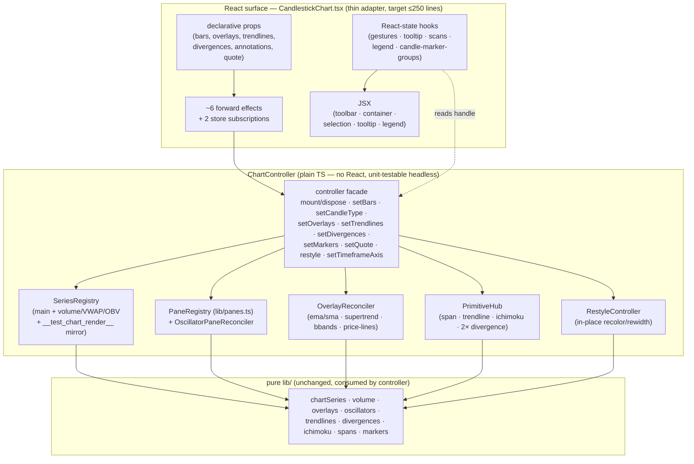

# 0098 — CandlestickChart controller refactor (imperative chart core)

> **Status:** done — closed 2026-07-15 (architect Mode 4, clean; ADR-0092 accepted at close). Extracted over the settled surface exactly once as designed. Phase commits `df47417` (ph1 controller scaffold + lifecycle) → `cfa4d3c` (ph2 overlay + oscillator-pane reconcile) → `39281f5` (ph3 primitives/restyle/axis/forming-bar) → `732d996` (ph4 thin surface + legend-routing) → `a18ec1d` (ph5 headless controller suite) → `f06b95d` (thin-A: fold the 4 residual reconcilers — OBV/structure-levels/anchored-VWAP/market-structure — into the controller) → `abb4f6a` (thin-B: extract `useLayersControl`) → `af59d9c` (thin-C: extract `useChartSync`). **Verified at close:** `CandlestickChart.tsx` imports **no** lightweight-charts types (single `controllerRef` + `useLayersControl` + `useChartSync`); `ChartController` is a pure-delegating facade over `lib/chart/` sub-units; 15 orchestration hooks deleted with no dangling refs; controller unit suite (`controller.test.ts`) asserts series/primitive counts, prepend-anchor math, StrictMode-safe mount→dispose→mount, reconcile add/reuse/remove, restyle-in-place, dispose-nulls — genuine, not stubs; gates green (1100 renderer jest / 106 suites, typecheck across 5 tsconfigs, lint). Renderer-internal — no wire/event/schema/CSP change (the `divergences.ts` addition is a pure `requiredOscillatorKindsFor` helper, not a wire change). Implemented directly on `main` — no branch/worktree to merge or prune. **Two non-blocking minors** (see close notes): component 457 lines and facade 413 lines both exceed the plan's ~250 target but are inflated by docstrings/prop-interface comments/JSX/read-getters, not accumulated logic — the coordination-surface goal is met. **Scope expanded beyond the 6 named phases (ratified, improves on plan):** thin-A/B/C folded 4 additional residual reconcilers into the controller and extracted two orchestration hooks, completing the plan's spirit more fully than the literal phase list. **Phase 6 (`human` visual smoke) PASS 2026-07-15** (user-attested) — the refactor is pixel-equivalent on a live chart; plan fully complete.
> **Created:** 2026-07-13
> **Owner skill(s):** ui-builder, human
> **Related ADRs:** [0092-chart-controller-imperative-core](../adrs/0092-chart-controller-imperative-core.md) (proposed; accepts at this plan's close), refines the Plan 0072 phase-8 decomposition, builds on [0088](../adrs/0088-lightweight-charts-v5-panes.md) (v5 `PaneRegistry`)
> **Baseline note (2026-07-15, architect):** the headline figures below — 905 lines, 22 refs, the 158-line creation effect, and every specific `CandlestickChart.tsx` line-number citation — are the 2026-07-13 draft-time snapshot. Plans 0096 / 0097 / 0104 / 0105 have since landed on the same file, which is now **1192 lines / 27 `useRef`s** — the god-component grew, strengthening the case. The strangler phase structure still holds, but the concrete line numbers are pre-0104; the `ui-builder` implementer re-derives the live anchors against the current file at Step 2 rather than trusting the citations (the plan already anticipates this — "inherit their structure").

## TL;DR

`CandlestickChart.tsx` has grown back into a god component — 905 lines whose real problem is **coordination surface**, not raw size: it is the single hub that wires 18 hooks, 5 primitives, ~10 series and a `PaneRegistry` together through **22 shared refs** and a 158-line creation effect, and it regrows linearly because every new indicator family since the 0072 decomposition (bbands, ichimoku, oscillator panes, divergences) added its own refs + creation-effect lines + hook call. We extract a plain-TS **`ChartController`** that owns the imperative lightweight-charts wiring (chart instance, series, panes, primitives, reconcilers) behind a declarative API (`setBars`/`setOverlays`/`setDivergences`/`restyle`/…), enforcing attach-ordering internally. The React component becomes a thin adapter: build the controller in one effect, forward declarative props through ~6 effects, keep only the hooks that produce React state (gestures, tooltip, scans, legend), render JSX. First user-visible behavior: **none** — this is a behavior-preserving refactor gated on the existing renderer suite + the `__test_chart_render__` observability hook (same discipline as Plans 0072 and 0095). The durable payoff: chart wiring becomes unit-testable headless, and adding a future indicator family is a controller method + one forward effect, not an edit to a god component.

## Context & problem

Plan 0072 phase 8 already decomposed this file once (1455 → 706 lines, into 10 hooks + 4 lib modules + a `ChartToolbar`). The extraction moved *logic* out but left the component as the **orchestrator that owns every ref and wires every feature** — so it regrew to 905 lines. The god-ness is concrete and measurable:

- **22 `useRef`s** (`CandlestickChart.tsx:185-262`), most created here and passed *by reference into hooks that read/write them*. `chartRef` alone is threaded into 9 hooks; `seriesRef` into 5; the mount effect's cleanup nulls 17 refs by hand (`547-570`).
- **A 158-line creation effect** (`416-574`) doing ~8 distinct jobs: resolve style, `createChart`, main series, 4 always-on series (volume/volume-MA/VWAP/OBV), bootstrap `PaneRegistry` + OBV pane, apply scale margins, attach **5 primitives** (span/trendline/ichimoku/price-divergence/OBV-divergence, `494-529`), assign 8 refs, and mirror the test hook. Its cleanup individually tears all of it down.
- **Regrowth by construction.** Adding an indicator family means editing this component: a new ref, new creation-effect lines, a new hook call in the render body, new effect deps. Five hooks are called explicitly by kind — `useSupertrendSeries`, `useBbandsSeries`, `useIchimokuSeries`, `useOscillatorPanes`, `usePriceLines` (`639-788`).
- **Cross-hook ordering encoded as comments, not structure.** `useDivergences` "MUST be called after the chart-creation effect and after `useOscillatorPanes`"; `requiredOscillatorKinds` (`675-678`) exists in the component solely to bridge `useDivergences` → `useOscillatorPanes`.
- **Special-casing leaks.** OBV, volume, VWAP each get bespoke series refs + a hard-coded data push (`597-600`) + an OBV-only visibility effect (`630-632`); the two legend systems are joined by inline `if`-chains on element kind (`onLayerToggle` `359-366`, `onLayerHighlight` `369-380`).
- **The file's own header docstring** ("Three effects, three responsibilities", `1-23`) is now stale — the body runs 6 inline effects plus 18 coordinated hooks. Documented drift.

The user flagged this directly ("it has become a god component, we need to do something about it"). Three chart-file plans (0092 ph5–6, 0096, 0097) also rewrite this exact file, so this refactor is in **hard contention** with them — see Risks and the execution-order note in the plans index.

## Decision

We invert control. A new plain-TypeScript **`ChartController`** (no React) owns the imperative lightweight-charts surface — the `IChartApi` instance, the main + always-on series, the `PaneRegistry`, the overlay/oscillator reconcilers, and the primitives — and exposes a small **declarative API** the component calls. Attach-ordering constraints (divergence panes must exist before divergence primitives are fed; primitives attach at mount and ride the live series) move *inside* the controller, where they are structural, not comments in a render body. The controller is composed of focused sub-units (a series registry, an overlay reconciler, an oscillator-pane reconciler, a primitive hub, a restyle controller) so the facade doesn't become a new god *class*. The React component keeps only what genuinely produces React state and JSX — gestures, tooltip, scans, legend, candle-marker groups, user-overlay handlers — and consumes the controller through a single handle instead of a fistful of refs. The existing pure `lib/` math/geometry modules (`chartSeries`, `volume`, `overlays`, `oscillators`, `trendlines`, `divergences`, `ichimoku`, `spans`, `markers`, `panes`) are unchanged and consumed by the controller.

We rejected **Option 2 (targeted relief only)** — extract the creation effect into a `useChartInstance` hook + bundle refs, keeping the hooks-orchestration model — because it patches the fragile core but leaves regrowth intact (adding an indicator still edits the component); it is the 0072 approach again, and 0072 is why we are here. We rejected **Option 3 (a declarative feature-registry / plugin table)** because overlays, panes, primitives and markers have genuinely different lifecycles and coordinate systems, so a single uniform `ChartFeature` interface would force a lowest-common-denominator abstraction that leaks — over-engineering for a solo app unless many more indicator families are coming.

## Architecture diagram



## Implementation phases

Behavior-preserving strangler: introduce the controller, migrate one cohesive group of concerns per phase, keep the renderer suite + `__test_chart_render__` green at every step. Phase 1 is a walking skeleton (the fragile creation-effect core disappears on its own). All impl phases are `ui-builder`; the final smoke is `human`. New controller code lives under a new `desktop/renderer/lib/chart/` folder; the existing pure `lib/*` modules stay put.

### Phase 1 — ChartController scaffold + lifecycle (walking skeleton)
- **Owner skill:** ui-builder
- **What:** Create `ChartController` owning chart creation, the main series, the four always-on series, the `PaneRegistry` + OBV pane, scale margins, the 5 primitive attaches, `setBars`/`setCandleType`, dispose/teardown, and the `__test_chart_render__` mirror. The component's 158-line creation effect (`416-574`) and the bars/data effect (`576-624`) + OBV-visibility effect (`630-632`) become `controller.mount(...)` / `controller.setBars(...)` / `controller.dispose()`; the ~17 series/primitive refs collapse into **one** `controllerRef`.
- **Files touched:** new `desktop/renderer/lib/chart/controller.ts`, new `desktop/renderer/lib/chart/seriesRegistry.ts`, new `desktop/renderer/lib/chart/primitiveHub.ts` (scaffold), `desktop/renderer/components/CandlestickChart.tsx`; new `desktop/renderer/lib/chart/controller.test.ts`.
- **Done when:** the renderer jest suite is green and `window.__test_chart_render__` reports the same `seriesCount`/`seriesKinds`/`barCount` (candlestick + volume + volume_ma + vwap + obv + overlays) as before the phase, including after a `candleType` rebuild and a lazy left-edge prepend (viewport stays anchored); the component no longer declares the chart/series/primitive/pane refs (they live in the controller); mounting then unmounting disposes the chart exactly once (no leaked WebGL context — the ADR-0008 / best-practices rule), asserted by a controller unit test.

### Phase 2 — Overlay + oscillator-pane reconciliation into the controller
- **Owner skill:** ui-builder
- **What:** Fold `useOverlaySeries`, `useSupertrendSeries`, `useBbandsSeries`, `usePriceLines`, and `useOscillatorPanes` into controller reconciler methods (`setOverlays(overlays, hidden, theme)`, `setOscillators(...)`). The overlay/supertrend/bbands/price-line/oscillator-pane Maps move inside the controller. The divergence→oscillator coupling (`requiredOscillatorKindsFor`, currently computed in the component) moves inside the controller so a divergence's oscillator pane is guaranteed by structure, not by call-ordering + a bridging memo.
- **Files touched:** `desktop/renderer/lib/chart/overlayReconciler.ts` (new), `desktop/renderer/lib/chart/oscillatorPanes.ts` (moved from `hooks/useOscillatorPanes.ts`), `controller.ts`, `CandlestickChart.tsx`; delete `hooks/useOverlaySeries.ts`, `hooks/useSupertrendSeries.ts`, `hooks/useBbandsSeries.ts`, `hooks/usePriceLines.ts`, `hooks/useOscillatorPanes.ts` (and their specs migrate to controller specs); `desktop/renderer/lib/chart/overlayReconciler.test.ts`, `oscillatorPanes.test.ts`.
- **Done when:** suite green; adding an ema overlay, a supertrend overlay, a bbands overlay, a price line, and an oscillator (each toggled on then off via the legend `hidden` set) reconciles series/panes add-then-remove exactly as before, asserted headless against the controller (not only through a full component render); a divergence referencing an oscillator that the user has toggled off still gets its oscillator pane (the `requiredKinds` guarantee), asserted in `oscillatorPanes.test.ts`.

### Phase 3 — Primitives, restyle, axis, forming-bar into the controller
- **Owner skill:** ui-builder
- **What:** Fold the remaining pure-feed hooks into controller methods: `useTrendlines` → `setTrendlines(specs, highlightKey, theme)`, `useIchimokuSeries` → `setIchimoku(...)`, `useDivergences` → `setDivergences(...)`, `useChartMarkers` (marker + span-band feed) → `setMarkers(...)`, `useChartRestyle` → `restyle(theme, styleVersion)`, the monthly-axis effect (`712-721`) → `setTimeframeAxis(tf)`, `useFormingBar` → `setQuote(quote, bars, timeframe)`.
- **Files touched:** `desktop/renderer/lib/chart/primitiveHub.ts`, `desktop/renderer/lib/chart/restyle.ts` (new), `controller.ts`, `CandlestickChart.tsx`; delete `hooks/useTrendlines.ts`, `hooks/useIchimokuSeries.ts`, `hooks/useDivergences.ts`, `hooks/useChartMarkers.ts`, `hooks/useChartRestyle.ts`, `hooks/useFormingBar.ts` (specs migrate); controller specs for each.
- **Done when:** suite green; on a theme flip and a chart-style store mutation the existing chart recolours/rewidths **in place** (no remount — `chartRef` identity stable across the change), asserted headless; trendline highlight-on-legend-hover, ichimoku cloud feed, both divergence segments, candlestick markers + pattern span band, and the live forming-bar `/quote` update all reproduce their prior behavior; the `1mo` timeframe still gets `monthlyTickMarkFormatter` and every other timeframe the library default.

### Phase 4 — Thin the React surface + latent-smell fixes
- **Owner skill:** ui-builder
- **What:** Retarget the remaining React-state hooks (`useChartGestures`, `useChartTooltip`, `useChartScans`, `useLazyHistoryTrigger`, `useChartPatternRecompute`, `useLayersLegend`, `useCandleMarkerGroups`) to consume the single `controller` handle rather than individual refs. Apply the "small fixes OK" items: rewrite the stale header docstring to describe the controller architecture; extract the two-legend routing glue (`onLayerToggle`/`onLayerHighlight`) into a small pure helper (or the legend hook) instead of inline `if`-chains in the component; ensure volume/VWAP/OBV special-casing now lives cleanly inside the controller's series registry, not the component.
- **Files touched:** `CandlestickChart.tsx`, `hooks/useChartGestures.ts`, `hooks/useChartTooltip.ts`, `hooks/useChartScans.ts`, `hooks/useLazyHistoryTrigger.ts`, `hooks/useChartPatternRecompute.ts`, `hooks/useLayersLegend.ts`, `desktop/renderer/lib/chart/legendRouting.ts` (new, pure), specs.
- **Done when:** `CandlestickChart.tsx` is ≤ ~250 lines and imports **no** `IChartApi`/`ISeriesApi`/`lightweight-charts` types directly (they live in the controller); the legend-routing helper is covered by a pure unit spec (candlestick-group id → group toggle, any other id → hide toggle; candle key → marker highlight, else trendline highlight); gestures/tooltip/scans behave exactly as before (range-select overlay + label, crosshair read-out, scan-button statuses), suite green.

### Phase 5 — Headless controller test suite (the testability payoff)
- **Owner skill:** ui-builder
- **What:** Add the dedicated controller-level unit suite that exercises the imperative wiring **without rendering the React component**, using the existing lightweight-charts jest mocks (`lightweightChartsMock.ts` / `chartMockShared.ts` from Plan 0095). Prove: series creation for all four candle render modes; overlay reconcile add/reuse/remove; oscillator pane create/reuse/teardown + reindex; primitive attach-at-mount + feed; restyle-in-place; dispose teardown nulling all internal state. Demonstrate the "adding a feature" property the ADR claims by exercising one reconciler in isolation.
- **Files touched:** `desktop/renderer/lib/chart/controller.test.ts` (expanded), plus any per-reconciler specs not already added in phases 2–3.
- **Done when:** the controller behaviors above are asserted headless (no `render(<CandlestickChart/>)`), and the suite fails if a series/pane/primitive is dropped or a dispose leaks — i.e. the safety net that previously existed only through the full component render now also exists at the controller level.

### Phase 6 — Human visual smoke
- **Owner skill:** human
- **What:** Launch the app and visually confirm the refactor is pixel-equivalent on a live chart (the `__test_chart_render__` hook proves series *presence*, not the rendered geometry of primitives/panes).
- **Done when:** on a real symbol/timeframe, the candles + volume/VWAP/OBV pane, agent overlays (ema/sma/supertrend/bbands), oscillator panes, trendlines, ichimoku cloud, both divergence segments, candlestick markers + pattern spans, the layers legend (toggle + hover-highlight + add/remove overlay), the crosshair tooltip, range-select, lazy left-edge paging, theme flip, and chart-style changes all look and behave exactly as on `main` before the refactor; no console errors, no leaked chart on navigation.

## Data shapes

Illustrative controller surface — not the final signature (the implementer pins exact types against the current hook option bags):

```ts
// desktop/renderer/lib/chart/controller.ts — illustrative
export class ChartController {
  mount(container: HTMLDivElement, opts: { candleType: CandleType; theme: EffectiveTheme }): void
  dispose(): void

  setBars(bars: Bar[], opts: { anchorPrepend: boolean }): void   // data push + scroll-anchored prepend math
  setCandleType(type: CandleType): void                          // internal rebuild (series type is fixed at creation)

  setOverlays(overlays: readonly OverlaySpec[], hidden: ReadonlySet<string>, theme: EffectiveTheme): void
  setOscillators(overlays: readonly OverlaySpec[], hidden: ReadonlySet<string>, requiredKinds: ReadonlySet<string>): void
  setTrendlines(specs: readonly TrendlineSpec[], opts: { highlightKey: string | null; theme: EffectiveTheme }): void
  setIchimoku(overlays: readonly OverlaySpec[], hidden: ReadonlySet<string>, theme: EffectiveTheme): void
  setDivergences(divs: readonly Divergence[], theme: EffectiveTheme): void
  setMarkers(markers: readonly ChartMarker[], opts: { clickedBarTs: number | null; highlightGroup: string | null; theme: EffectiveTheme }): void
  setQuote(quote: QuoteResponse | null, bars: Bar[], timeframe?: string): void
  setTimeframeAxis(timeframe?: string): void
  restyle(theme: EffectiveTheme, styleVersion: number): void

  // read handles for the React-state hooks that stay in the component
  get chart(): IChartApi | null
  get mainSeries(): MainSeries | null
  // ...typed accessors the gesture / tooltip / scan hooks need, replacing raw ref-passing
}
```

## Risks & open questions

- **Hard file contention with Plans 0092 / 0096 / 0097.** All three rewrite `CandlestickChart.tsx`; 0096 (declutter) and 0097 (drawing dock) are `approved` and not yet started. **Recommended sequencing: run this refactor _after_ 0092 ph5–6, 0096, and 0097 land**, so the controller is extracted over the *settled* surface once, rather than fighting a moving target and forcing those detailed plans to be re-authored against a new structure. Doing it first is viable but means re-planning 0096/0097's file-touch lists. This is the top open question for the user; it is captured in the plans-index execution-order note. **Do not run any of these as parallel git worktrees** — every merge collides.
- **Behavior drift hiding behind a green suite.** The `__test_chart_render__` hook asserts series *presence/count*, not rendered geometry (primitive strokes, pane heights, cloud fills). Mitigation: keep every existing spec green at each phase, add headless controller specs (phase 5), and gate the close on the phase-6 human visual smoke — the same three-layer net that carried Plans 0072 and 0095.
- **StrictMode double-invoke / primitive stranding.** The current mount effect attaches primitives at creation specifically so they ride the live series and aren't stranded on a discarded StrictMode chart (the Plan 0064 fix, documented at `504-509`). The controller must preserve this: `mount`/`dispose` must be idempotent and symmetric, and a StrictMode remount must not leave a stranded primitive or a leaked chart. Asserted by a mount→dispose→mount controller unit test.
- **Controller-as-new-god-class.** A single facade owning everything risks recreating the problem one layer down. Mitigation: the facade only delegates; the real work lives in the small sub-units (series registry, overlay reconciler, oscillator panes, primitive hub, restyle), each independently testable. If the facade file grows past ~250 lines it is a signal a concern belongs in a sub-unit.
- **Scope.** This is a five-phase refactor of the hottest renderer file. **Cut line: phases 1–3 deliver most of the structural win** (the fragile core and the ref web are gone, the component is a thin adapter); phase 4 is polish and the smell-fixes; phase 5 is the testability payoff. If appetite shrinks, ship 1–3 and defer 4–5 — but the ADR's "unit-testable headless" claim is only fully realized with phase 5.

## What this plan does NOT do

- **No behavior change, no new features.** No new indicators, overlays, panes, or UI affordances. Pixel-equivalent output is a hard constraint (with the sanctioned "small fixes" limited to the stale docstring, the legend-routing extraction, and de-special-casing that is internal to the controller).
- **No wire / event / schema / CSP change.** Renderer-internal only. `OverlaySpec`, `TrendlineSpec`, `Divergence`, the SSE events, the sidecar, and the double-CSP are untouched (asserted at close).
- **No feature-registry / plugin abstraction** (rejected Option 3) — the controller exposes typed per-family methods, not a uniform `ChartFeature` table.
- **Does not absorb Plans 0096 / 0097's work.** This refactor restructures the *current* surface; the declutter (0096) and drawing dock (0097) remain their own plans. If they land first (recommended), this plan's file-touch lists inherit their structure.

## Followups (after this lands)

- (empty at draft time)
