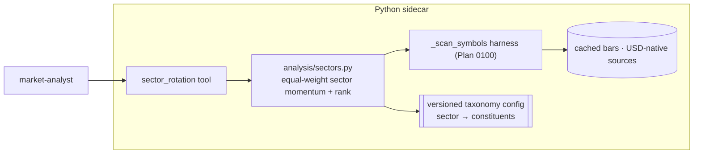

# 0102 — Crypto sector rotation

> **Status:** done — closed 2026-07-16. Implemented directly on `main` (no branch), three `dev` commits: `7990789` ph1 (`analysis/sector_taxonomy.py` — frozen `Sector`/`SectorTaxonomy` pydantic models + `load_taxonomy` seam + the shipped v1 taxonomy `2026-07-16`: 6 sectors L1/L2/DeFi/Memecoins/AI/DePIN, USD-native baskets, RENDER-USD intentionally in both AI+DePIN, `MIN_PRICED_TO_RANK=2` floor, all invariants validated at import), `2de59b3` ph2 (`analysis/sectors.py` — pure trailing `score_trailing_return` (zero-base guarded) → equal-weight `rank_sectors` over one `_scan_symbols` fan-out per sector, complete-before-incomplete + momentum-desc + name tie-break ranking, disjoint leaders/laggards via `k=min(top_n, n//2)`, `ConstituentReturn`/`SectorMomentum` on `analysis/types.py`), `9ba7e8b` ph3 (`sector_rotation` MCP tool over the shipped taxonomy, boundary-validated timeframe+lookback, `EXPECTED_FULL_TOOLSET` 51 → 52, apiref regenerated). **Clean Mode 4 — no blockers/majors.** Verified at assertion level (all three plan test files read, not trusted): equal-weight mean math (Big +30 = mean(50,40,30,20,10), Cold −15, Empty → honest `None`), skip-and-incomplete floor, ranking order, disjoint leader/laggard identity, fetch-error-skipped-not-fatal, and **no-lookahead via truncation-invariance** (`as_of=T` read == read over bars truncated to `T`, +15% not contaminated by future bars); conditions-only guarded at model + serialized wire (`\b`-anchored no-call-shaped-token scan, ADR-0029). 29 targeted tests green at close (3 plan files + `test_full_toolset_registration_is_exhaustive`); `apiref --check` exit 0 re-run at close. Version 0.19.0 → 0.20.0 (three `feat` commits → minor). **Phase 4 (`human` live smoke on real bars) outstanding — deferrable, does not gate close** (read-only, like the other deferred smokes). Nit (non-blocking, not in 0102's scope): a pre-existing `mypy --strict` red in `src` tests (3 `get_sentiment` `Literal` / defillama test-fake drifts from closed Plans 0103/0107) surfaced during this work — tracked as a separate fix-forward, see close-ceremony note.
> **Created:** 2026-07-13
> **Owner skill(s):** dev, human
> **Related ADRs:** [0097](../adrs/0097-crypto-sector-taxonomy-and-baskets.md) (paired, accepts at close), [0095](../adrs/0095-watchlist-scan-fanout-harness.md), [0069](../adrs/0069-crypto-first-asset-class-positioning.md), [0023](../adrs/0023-technical-analysis-surface.md)
> **Depends on:** [Plan 0100](0100-watchlist-condition-scanners.md) (the `_scan_symbols` harness)

## TL;DR

A crypto **sector rotation** read — rank a self-defined set of crypto sectors (L1 / L2 / DeFi / memes / AI / …) by equal-weighted constituent momentum over cached bars, surfacing which sectors are hot vs cold and the leaders/laggards within each. The taxonomy lives in versioned config ([ADR-0097](../adrs/0097-crypto-sector-taxonomy-and-baskets.md)); momentum reuses the Plan 0100 harness. Conditions only ([ADR-0029](../adrs/0029-advisory-recommendation-boundary.md)). First user-visible behaviour: `sector_rotation("1d", lookback=30)` returns the sectors ranked by mean constituent 30-bar return, hottest first, each with its leader and laggard constituents.

## Context & problem

"Where is capital rotating" is a read the app can't currently answer for crypto. Unlike equities — where SPDR sector ETFs give a canonical, single-price-per-sector index — crypto has no canonical taxonomy and no fetchable sector index. We have the constituent OHLCV (USD-native, via Coinbase/Binance/Yahoo) but no notion of "sectors" or a tool that ranks them.

[ADR-0097](../adrs/0097-crypto-sector-taxonomy-and-baskets.md) settles the hard part: define the taxonomy ourselves as versioned config, synthesize sector momentum as the equal-weighted mean of constituent trailing returns, and treat the taxonomy as a maintained artifact.

## Decision

Ship a config-defined crypto sector taxonomy plus a momentum engine and a `sector_rotation` tool. Per-constituent trailing returns come through the Plan 0100 harness (our cached bars, anti-lookahead honoured); sector momentum is their equal-weighted mean; sectors rank by that momentum; each reports its leaders/laggards and any skipped constituents. We rejected an external taxonomy (ADR-0097 alt A), cap-weighting (alt B), and the US-ETF variant (alt C).

## Architecture diagram



## Implementation phases

### Phase 1 — Taxonomy config + loader
- **Owner skill:** dev
- **What:** Define the crypto sector taxonomy (sector → constituent symbols) as versioned config data, with a typed loader + validation.
- **Files touched:** a taxonomy data/config module under `src/market_analyser/` (e.g. `analysis/sector_taxonomy.py` or a config asset + loader), tests.
- **Done when:** the loader parses the shipped taxonomy into typed sectors, rejects a malformed/empty basket, and a unit test pins the ≥N-priced-constituents-to-report rule. The shipped taxonomy is the pinned initial set (final sector list decided here), documented as a maintained artifact.

### Phase 2 — Sector momentum engine
- **Owner skill:** dev
- **What:** `analysis/sectors.py` — per-constituent trailing return via the harness → equal-weighted sector momentum, skip+flag missing constituents, rank sectors, identify per-sector leaders/laggards. Pure, deterministic, trailing.
- **Files touched:** `src/market_analyser/analysis/sectors.py` (new), `analysis/types.py` (result model), tests.
- **Done when:** a unit test over a fixture taxonomy pins (a) the equal-weight mean math, (b) missing-constituent skip + the incomplete-sector rule, (c) the sector ranking order, (d) leader/laggard identification, and (e) no-lookahead via truncation-invariance.

### Phase 3 — `sector_rotation` MCP tool
- **Owner skill:** dev
- **What:** Expose `sector_rotation` — rank the taxonomy's sectors by momentum over a caller `timeframe` + `lookback`.
- **Files touched:** `api/mcp_tools/sector_rotation.py` (new), register in `mcp_app.py`, `EXPECTED_FULL_TOOLSET` +1, regenerate `docs/reference/`.
- **Done when:** the tool ranks fixture sectors by momentum descending, reports leaders + skipped constituents + `scanned_at`, honours `as_of`, and the response is asserted to carry **no** `action` / `signal` / `recommendation` / `buy` / `sell` key. The description states: rotation is a condition read, not a call.

### Phase 4 — Live smoke
- **Owner skill:** human
- **What:** Run `sector_rotation` over the shipped taxonomy on real bars via MCP.
- **Done when:** the ranking matches an eyeball of recent sector performance, incomplete sectors are honestly flagged (not silently ranked), and nothing reads as a buy call.

## Data shapes

```python
# illustrative — not the final interface
class SectorMomentum(BaseModel):
    model_config = ConfigDict(frozen=True, extra="forbid")
    sector: str
    momentum: float                       # equal-weighted mean of constituent returns
    n_priced: int
    complete: bool                        # n_priced >= configured floor
    leaders: list[dict]                   # [{"symbol":.., "return":..}, ...]
    laggards: list[dict]
    skipped: list[str]                    # constituents with no cached bars

# response: {sectors_sorted: list[SectorMomentum], scanned_at: datetime}
```

## Risks & open questions

- Risk: the taxonomy ages. Mitigation: documented operational handle — revisit the sector/constituent lists periodically; each revision is a config edit.
- Risk: an illiquid/delisted constituent distorts a sector. Mitigation: skip-and-flag + the ≥N-priced floor before a sector is ranked.
- Risk: overlapping membership (a token in two sectors). Mitigation: allowed and documented; the momentum is per-basket, so overlap is intentional.
- Risk: cross-source price alignment. Mitigation: constituents are USD-native (ADR-0076) — the same alignment the existing scanners already rely on.

## What this plan does NOT do

- **No cap-weighted baskets** (ADR-0097 alt B) — equal-weight only; cap-weight is a future refinement.
- **No external sector taxonomy** (ADR-0097 alt A) — the taxonomy is ours, in config.
- **No US sector ETFs** (ADR-0097 alt C) — a possible sibling plan if wanted later.
- **No UI rotation heatmap** — a `ui-builder` followup.
- **No rotation-based alerts or advice** — an advisor/watch followup.

## Followups (after this lands)

- A renderer rotation heatmap (ui-builder).
- Feed sector-momentum context into the advisor / a rotation `create_watch` alert.
- A cap-weighted variant if the equal-weight read proves useful.
