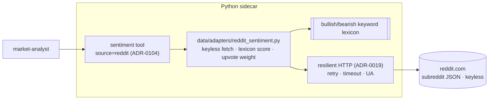

# 0103 — Reddit crowd sentiment source

> **Status:** done — closed 2026-07-15. Phase 1 `55b9565` (dev — `data/adapters/reddit_sentiment.py` + provider seam: fixed multi-subreddit keyless fetch, upvote-weighted lexicon score, honest-empty degrade, pure `reddit_label` ladder; `_sentiment_sources["reddit"]` + `get_sentiment` `Literal` widening; 15 adapter tests incl. provider routing) → phase 2 `fee1bfb` (dev — `sentiment(source="reddit")` as one registry entry per ADR-0104, `label`/`sample_size` derived at the tool layer, stale `test_rejects_unknown_source` re-pointed, apiref regen; no toolset bump, `EXPECTED_FULL_TOOLSET` still 50). Clean Mode 4 against the amended (conformant-`SentimentSample`) design — no blockers/majors; gates re-verified independently at close (31 targeted tests green, toolset guard, `apiref --check` clean). ADR-0098 accepted. Phase 3 (human live smoke) deferred — does not gate close.
> **Created:** 2026-07-13
> **Owner skill(s):** dev, human
> **Related ADRs:** [0098](../adrs/0098-reddit-keyless-crowd-sentiment.md) (paired, accepts at close), [0031](../adrs/0031-data-source-adapter-contract.md), [0019](../adrs/0019-external-http-adapter-resilience.md), [0029](../adrs/0029-advisory-recommendation-boundary.md), [0069](../adrs/0069-crypto-first-asset-class-positioning.md)

> **Amended 2026-07-15 (conformant `SentimentSample` shape):** Reddit now conforms to the same `SentimentSource.fetch_sentiment(symbol, window) -> SentimentSample` seam as the other four sentiment sources and reaches the tool via `provider.get_sentiment(source="reddit")`. The earlier rich shape — a `top_posts` payload and a `category` input — is **dropped**; it could not ride the blessed ADR-0007 provider path without a `MarketDataProvider` Protocol change (46+ `mypy --strict` stubs) or a tool-module adapter import. Subreddit routing is a **single fixed multi-subreddit group** (no `category`). This aligns Reddit with [Plan 0108](0108-social-sentiment-source.md)'s direction; ADR-0098 is amended to match. See Phase 2 and the routing decision below.

## TL;DR

Add Reddit as a keyless crowd-sentiment source — a `SentimentSource` adapter over the public subreddit search JSON, keyword-lexicon scored (bullish/bearish → a −1..+1 aggregate, upvote-weighted), surfaced as a **`reddit` source mode of the unified `sentiment` tool** ([ADR-0104](../adrs/0104-mcp-tool-surface-granularity.md); Plan 0109 shipped the tool + injectable source registry). Conforms to `SentimentSample` like the other sources — `label` and `sample_size` are derived at the tool layer. Crowd condition, never advice ([ADR-0029](../adrs/0029-advisory-recommendation-boundary.md)); honest-empty on rate-limit ([ADR-0019](../adrs/0019-external-http-adapter-resilience.md)). First user-visible behaviour: `sentiment(source="reddit", symbol="BTC")` returns an aggregate bullish/bearish score + derived label + sample size, over a single fixed multi-subreddit crowd group.

## Context & problem

We have three sentiment surfaces (news+VADER, StockTwits, Fear & Greed) but nothing from Reddit — the retail-crowd venue (WSB, r/CryptoCurrency) whose discussion tone neither headlines nor StockTwits captures. The inspiration project pulls Reddit keyless via the public subreddit JSON and scores it with a keyword lexicon; that is a clean fit for our existing `SentimentSource` seam and keyless-first posture, and [ADR-0098](../adrs/0098-reddit-keyless-crowd-sentiment.md) settles the shape (keyless JSON, keyword lexicon for v1, honest-degrade, condition-only).

## Decision

Add a keyless Reddit `SentimentSource` adapter mirroring `stocktwits.py`, scored by an in-house keyword lexicon and upvote-weighted, exposed as the `reddit` source mode of the unified `sentiment` tool ([ADR-0104](../adrs/0104-mcp-tool-surface-granularity.md)). It rides the ADR-0019 resilient HTTP path with a descriptive User-Agent and degrades to an honest empty result on rate-limit/failure. We rejected the authenticated Reddit API (ADR-0098 alt A), rejected skipping Reddit (alt B), and deferred VADER/ML scoring (alt C).

## Architecture diagram



## Implementation phases

### Phase 1 — Reddit `SentimentSource` adapter + provider seam
- **Owner skill:** dev
- **What:** `data/adapters/reddit_sentiment.py` mirroring `stocktwits.py` — a **single fixed multi-subreddit crowd group** (see the routing decision below) queried by symbol over the public search JSON, resilient keyless fetch (ADR-0019, descriptive User-Agent), keyword-lexicon scoring, upvote weighting, honest-empty degrade. Conforms to the existing `SentimentSource.fetch_sentiment(symbol, window) -> SentimentSample` seam (`score` in [-1, 1], upvote-weighted; `breakdown` = `{positive, negative, neutral}` post counts; `source="reddit"`) — **no new Protocol variant**. Register it in `default_provider._sentiment_sources["reddit"]` and add `"reddit"` to the `get_sentiment` source `Literal` on both the `MarketDataProvider` Protocol and the concrete provider (the 46+ test stubs type `source: str`, so the `Literal` widening does not touch them). Also expose a pure `reddit_label(score) -> str` helper (the 5-bucket threshold ladder) **in the adapter module**, so the phase-2 tool handler derives the label from one shared ladder without `data/` importing `api/`.
- **Files touched:** `src/market_analyser/data/adapters/reddit_sentiment.py` (new), `data/provider.py` + `data/default_provider.py` (widen the `get_sentiment` source `Literal`, register `_sentiment_sources["reddit"]`), tests with fixture JSON.
- **Done when:** adapter unit tests over fixture JSON pin (a) the score sign for a bullish vs a bearish post set, (b) upvote weighting (a high-upvote post moves the aggregate more), (c) empty-on-error / empty-on-rate-limit degrade (no exception, no fabrication — an honest `SentimentSample` with `score` 0.0 and an all-zero `breakdown`), and (d) the `reddit_label` threshold boundaries. A provider-level test confirms `get_sentiment(source="reddit")` routes to the adapter. No secret required to run.

> **Routing decision (2026-07-15):** with the `category` input dropped, the adapter queries **one fixed multi-subreddit group** in a single keyless request (e.g. `https://www.reddit.com/r/CryptoCurrency+Bitcoin+wallstreetbets+stocks+investing/search.json?q={symbol}&restrict_sr=1&sort=new`) rather than inferring an asset class from the symbol. Rationale: one combined request is the lightest possible footprint on Reddit's public rate-limit (ADR-0098's headline risk), avoids a fragile symbol→asset-class classifier, and lets Reddit's own search relevance surface on-topic posts for a crypto *or* an equity ticker. The subreddit list is a maintained module constant, exactly like the RSS feed catalog; the `window` maps best-effort onto Reddit's `t` time filter. This supersedes ADR-0098's per-category (crypto/stocks/all) framing — ADR-0098 is amended to match (still `proposed`, accepting at close).

### Phase 2 — Reddit as a `sentiment(source="reddit")` mode
- **Owner skill:** dev
> **Amended 2026-07-15 (conformant `SentimentSample` shape):** Reddit reaches the tool via `provider.get_sentiment(source="reddit")` — the same blessed ADR-0007 path as `news` / `stocktwits` — so it is genuinely "one registry entry": one `_reddit_source` handler in the sentiment tool's `DEFAULT_SENTIMENT_SOURCES`, no new module, no `register_*` call, no `EXPECTED_FULL_TOOLSET` bump. The earlier rich shape (a `top_posts` payload + a `category` input) is **dropped** — it could not ride `get_sentiment` without a new `MarketDataProvider` method / a `category` param (both ripple through 46+ `mypy --strict` stubs) or a tool-module adapter import (ADR-0007 tension). `label` and `sample_size` are derived **at the tool layer**: `label` via the pure `reddit_label(score)` helper from phase 1, `sample_size` = sum of the `breakdown` counts — exactly as [Plan 0108](0108-social-sentiment-source.md) does for `source="x"`. The pre-0109 fallback (a standalone `reddit_sentiment` tool) is moot: 0109 is closed and live on `main` (`api/mcp_tools/sentiment.py`, `source ∈ {news, stocktwits}`).
- **What:** Expose Reddit sentiment via `sentiment(source="reddit", symbol, window)` returning the aggregate score + derived label + sample size, mirroring the `stocktwits` source payload.
- **Files touched:** `api/mcp_tools/sentiment.py` (add `"reddit"` to the `SentimentSource` `Literal` + a `_reddit_source` handler in `DEFAULT_SENTIMENT_SOURCES`); `tests/api/test_sentiment_tool.py` — the now-stale `test_rejects_unknown_source` currently asserts `source="reddit"` is **rejected**, so re-point it at a still-unknown source (e.g. `"myspace"`); regenerate `docs/reference/`.
- **Done when:** `sentiment(source="reddit", …)` returns `{symbol, score, label, sample_size, breakdown, source, window, queried_at}` for a fixture (`label` from `reddit_label`, `sample_size` = summed `breakdown`); the response is conditions-only (**no** `action` / `signal` / `recommendation` key asserted); `docs/reference/` regenerates clean (apiref `--check`).

### Phase 3 — Live smoke
- **Owner skill:** human
- **What:** Run `sentiment(source="reddit", …)` on a couple of live tickers via MCP.
- **Done when:** the score + label + sample size are plausible for the ticker, and a rate-limited call degrades to an honest empty result (not an error, not fabricated data).

## Data shapes

Reddit reuses the existing `SentimentSample` (in `data/types.py`) — the same model the other sentiment sources return, so no new domain model is added:

```python
# existing model — reused, not new
class SentimentSample(BaseModel):
    symbol: str
    score: float                     # -1..+1 aggregate, upvote-weighted
    window: str
    as_of: datetime
    source: str                      # "reddit"
    breakdown: dict[str, int]        # {"positive": n, "negative": n, "neutral": n}

# derived at the tool layer (phase 2), not stored on the model:
#   label       = reddit_label(score)           # 5-bucket ladder, pure helper in the adapter module
#   sample_size = sum(breakdown.values())
# lexicon + the label ladder live as module constants in reddit_sentiment.py
```

The `sentiment` tool payload for `source="reddit"` mirrors the `stocktwits` source:
`{symbol, score, label, sample_size, breakdown, source, window, queried_at}`.

## Risks & open questions

- Risk: Reddit's public rate-limit. Mitigation: honest-empty degrade (ADR-0019), documented so the caller knows an empty result may be a limit, not silence.
- Risk: keyword scoring is gameable/noisy (memes, sarcasm). Mitigation: read as one input among several (ADR-0098); v1 keeps the transparent lexicon rather than pretending ML fixes noise.
- Risk: User-Agent / ToS. Mitigation: a descriptive UA and low request volume; keyless read-only endpoint only.
- Resolved (was "exact subreddit list per category"): the `category` input is dropped — the adapter queries **one fixed multi-subreddit group** (module constant, maintained like the RSS feed list). See the Phase 1 routing decision.
- Risk (crowd-group noise): a fixed group spanning crypto + equity subs can surface off-topic posts for a niche ticker. Mitigation: `restrict_sr` + Reddit's query relevance filter most of it, and the honest-empty / low-`sample_size` degrade covers the thin tail — read as one input among several (ADR-0098).

## What this plan does NOT do

- **No authenticated Reddit API / OAuth** (ADR-0098 alt A) — keyless JSON only, no new secret.
- **No `top_posts` payload and no `category` input** (amended 2026-07-15) — Reddit conforms to `SentimentSample` like the other sources; a per-post list and asset-class routing are dropped to keep it on the blessed provider path. A richer per-post surface is a possible `ui-builder` followup.
- **No VADER/ML scoring** (ADR-0098 alt C) — keyword lexicon for v1; ML is a possible refinement.
- **No Reddit UI panel** — the app has news/sentiment surfaces already; a Reddit-specific view is a `ui-builder` followup.
- **No historical Reddit archive** — current-window read only.

## Followups (after this lands)

- Fold Reddit into the composite/aggregated sentiment view alongside StockTwits + news (ui-builder).
- Evaluate VADER-over-Reddit if the raw feed proves useful.
