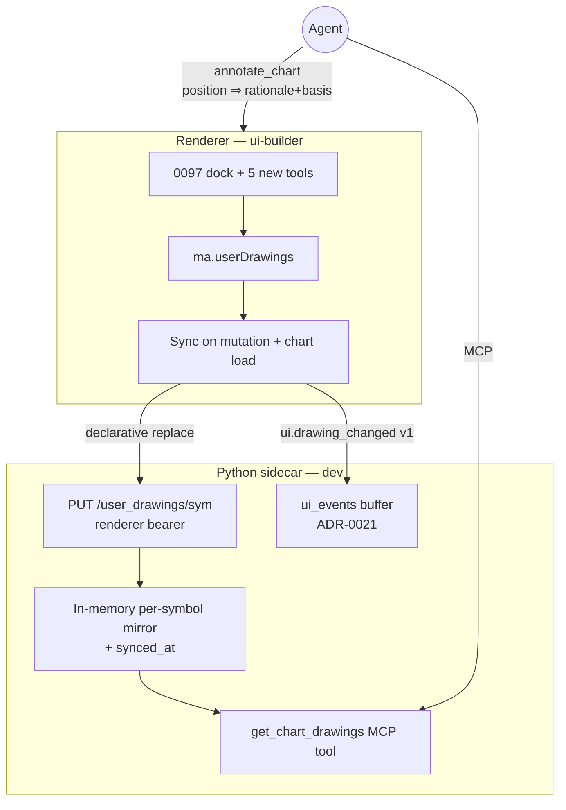

# 0104 — Drawing read-back + position & range tools

> **Status:** done — closed 2026-07-15. Cross-skill on `main`, no branch: `7bad8ef` ph1 (`dev` — five `DrawingSpec` kinds `long_position`/`short_position`/`date_range`/`price_range`/`date_price_range`, position ordering invariant validated per kind, `rationale`/`basis` fields, `annotate_chart` structurally rejects an agent-placed position without non-empty rationale+basis, TS regenerated) → `c2419cd` ph2 (`dev` — in-memory per-symbol `UserDrawingsMirror`, renderer-bearer `PUT /user_drawings/{symbol}` with `provenance=="user"` 422 guard, `get_chart_drawings` MCP tool with honest `synced_at`, `ui.drawing_changed v1` ungated on the ADR-0021 buffer, `EXPECTED_FULL_TOOLSET` +1, apiref regenerated) → `79adbe0` ph3 (`ui-builder` — five dock tools with placement/render/full-edit reusing the 0097 engine, `lib/positions.ts` single-home ordering clamp + derived R:R, range readouts, en/ru) → `ca8588b` ph4 (`ui-builder` — `lib/drawingsSync.ts` PUT-on-mutation+load with one retry + one `ui.drawing_changed` POST per mutation through the typed client, agent advisory position render hide-only with advisory label + rationale tooltip, en/ru) → smoke fix-forwards `959983e` (free-price placement) + `2bc9e71` (future-extending anchors). Clean **Mode 4 — no blockers/majors/minors**; all owner tags in-vocabulary; ph1/ph2 tests exemplary (round-trips all eleven kinds, replace-not-append, dual-bearer split both directions, ungated event, advisory-guard both branches — 22 Python tests re-run green at close). Two deliberate phase-3 deviations from human smoke, recorded below (free-price placement; future-extending anchors) — both improve on the plan. Additive wire only (one route, one tool, one ui-event type, five kinds), mirror ephemeral, no CSP/determinism change. **Phase 5 (`human` live smoke) PASS 2026-07-15** (user-attested): all five kinds draw/edit/persist; drawn-line read-back grounded an agent answer via `get_chart_drawings`; draw fired an event with no setup; advisor call rendered a hide-only advisory position box with rationale on hover; a rationale-less agent position was rejected typed; sidecar restart honestly reported never-synced; en/ru render; gates green. ADR-0099 accepted at close. Implemented directly in this working tree — no branch/worktree to merge or prune. Version bumped 0.12.0→0.13.0.
>
> **Phase-3 deviations (deliberate, from human smoke, ratified at close):**
> 1. **Free-price placement, not OHLC-snapped.** Position and range anchors place at the raw cursor price (`isFreePriceKind`), not snapped to OHLC as phase 3's done-when worded (`959983e`). A trade idea's entry/stop/target and a price measure are arbitrary levels, not bar prices — snapping fought the user's intent. Time still snaps to a known bar over the loaded range.
> 2. **Anchors extrapolate into the future.** A drawing anchor can extend past the last loaded bar rather than being clamped to it (`2bc9e71`), so a position/range can project forward. Time within the loaded range still snaps to a known bar; only the beyond-last-bar case is unclamped.
> **Created:** 2026-07-14
> **Owner skill(s):** dev, ui-builder, human
> **Related ADRs:** [0099-user-drawing-readback-and-advisory-positions](../adrs/0099-user-drawing-readback-and-advisory-positions.md) (paired — accepts at close), [0091-chart-annotation-layer](../adrs/0091-chart-annotation-layer.md) (the two-source annotation layer this extends; its read-channel open question is decided by ADR-0099), [0021-renderer-to-agent-feedback](../adrs/0021-renderer-to-agent-feedback.md) (the `ui_events` buffer the draw event rides; its agent-mode gate is removed by [ADR-0101](../adrs/0101-remove-agent-mode-gate.md)/[Plan 0106](0106-remove-agent-mode.md)), [0029-advisory-recommendation-boundary](../adrs/0029-advisory-recommendation-boundary.md) (extended to the drawn form of a recommendation), [0077-user-originated-display-overlays](../adrs/0077-user-originated-display-overlays.md) (display-vs-control test), [0063-in-house-i18n-and-reason-codes](../adrs/0063-in-house-i18n-and-reason-codes.md) (en/ru parity), [0008-electron-shell-conventions](../adrs/0008-electron-shell-conventions.md) (CSP unchanged)
> **Hard prerequisite:** [Plan 0097](0097-chart-drawing-dock.md) in full — this plan extends its `DrawingSpec`, `annotate_chart`, dock, and edit engine. Do not start before 0097 closes.
> **Amended 2026-07-14 (pre-start, architect):** [ADR-0101](../adrs/0101-remove-agent-mode-gate.md) / [Plan 0106](0106-remove-agent-mode.md) remove agent mode entirely, which collapses ADR-0099's pull-ungated/push-gated consent split to "ungated". Every agent-mode conditional originally in this plan (phase 2 gate assertion, phase 4 emit condition, phase 5 smoke item c) is amended out below: `ui.drawing_changed` emits unconditionally, like every other ADR-0021 gesture event post-0105.

## TL;DR

Close the two gaps [Plan 0097](0097-chart-drawing-dock.md) left open. **(1) Read-back:** the agent can finally *see* the user's drawings — the renderer mirrors `ma.userDrawings` per symbol to a new sidecar route, a new `get_chart_drawings(symbol)` MCP tool serves the mirror (with an honest `synced_at`), and a `ui.drawing_changed v1` event (ungated — amended per [ADR-0101](../adrs/0101-remove-agent-mode-gate.md)) nudges an attentive agent when the user draws. So "I drew this resistance — what do you think?" works. **(2) Trading-idea tools:** five new `DrawingSpec` kinds — **long/short position** (entry/stop/target box with derived risk-reward) and **date / price / date-price range** measures — drawable by the user via the 0097 dock, and placeable by the agent, where a position kind is **advisory-only**: `annotate_chart` structurally rejects a position spec without non-empty `rationale` + `basis`, and the renderer labels agent positions as advisory with the rationale on hover (ADR-0029 extended to geometry).

## Context & problem

Plan 0097 ships user drawing and agent drawing, but the channel is one-way per direction: the user cannot show the agent a line (user drawings never leave the renderer, per ADR-0091 — which explicitly deferred the read channel as "a separate decision"), and neither side can express a *trade idea* as a drawing (no position or measure kinds exist). The user asked for exactly both: draw a resistance and ask the agent about it; have the agent draw a long/short setup back. [ADR-0099](../adrs/0099-user-drawing-readback-and-advisory-positions.md) records the durable decisions: renderer-owned mirror (ownership never moves), pull ungated / push agent-mode-gated, five new kinds, and the advisory rule for agent-placed positions.

## Decision

Implement as `dev` (wire: kinds + guard + mirror + tool + event) then `ui-builder` (dock tools + sync + advisory render) then `human` smoke — the same shape as 0097, reusing its tool-mode machine, hit-test/edit engine, persistence store, and merge path. A natural cut line sits after phase 3: phases 1–3 deliver the complete user-side capability (new tools drawn, persisted, edited) plus the sidecar read surface; phase 4 delivers the sync plumbing and agent-side advisory render.

## Architecture diagram



## Implementation phases

Each phase ships as its own commit. `dev` runs phases 1–2 in one session, hands off to `ui-builder` for phases 3–4 (one contiguous session), phase 5 is `human`.

### Phase 1 — Position & range kinds + the advisory guard

- **Owner skill:** dev
- **What:** Extend `DrawingSpec` with five kinds: `long_position`, `short_position` (exactly one anchor point at `(time, entry)`, required `stop: float` and `target: float`, ordering validated — long: `stop < entry < target`; short: `target < entry < stop`; risk-reward never stored, always derived), `date_range`, `price_range`, `date_price_range` (exactly two anchor points; readouts derived at render). Add optional `rationale: str | None` and `basis: str | None` to the spec. In `annotate_chart`, reject any **agent-placed position-kind** spec whose `rationale` or `basis` is missing/empty with a typed validation error (never a silent drop or accept). Regenerate TS types + API reference.
- **Files touched:** the Plan 0097 `DrawingSpec` model module (in `src/market_analyser/events/`), the `annotate_chart` tool module, generated TS types, `docs/reference/` (regenerated).
- **Done when:** each new kind round-trips through the pydantic model; malformed geometry (wrong point count, violated stop/entry/target ordering) raises a typed error per kind; `annotate_chart` accepts a position spec with rationale+basis, rejects one without (both asserted), and still accepts rationale-free line/zone/fib/range kinds; unit tests cover one valid + one invalid spec per new kind and both guard branches; `gen-types:check` and `apiref --check` exit 0.

### Phase 2 — Mirror + read tool + draw event

- **Owner skill:** dev
- **What:** An in-memory `UserDrawingsMirror` (per-symbol `{drawings, synced_at}`, declarative replace, cleared on boot — no persistence, no migration). A renderer-bearer route `PUT /user_drawings/{symbol}` that validates the body as a list of `DrawingSpec` with `provenance == "user"` (typed 422 otherwise) and replaces that symbol's mirror entry. A `get_chart_drawings(symbol)` MCP tool returning `{symbol, drawings, synced_at}` with `synced_at: null` + empty list when never synced (docstring spells out the staleness semantics). A `ui.drawing_changed v1` envelope type (`{symbol, change: created|modified|deleted, drawing_id, kind}`) accepted by the existing `POST /ui_events` route (renderer-bearer auth; no mode gate — Plan 0106 removed it). Bump `EXPECTED_FULL_TOOLSET` by one; regenerate the API reference.
- **Files touched:** a new mirror module (sidecar), `src/market_analyser/api/routes/` (new route), `src/market_analyser/api/mcp_tools/get_chart_drawings.py`, the ui-events envelope registry, `tests/api/test_mcp_tools.py` (`EXPECTED_FULL_TOOLSET`), `docs/reference/` (regenerated).
- **Done when:** PUT-then-tool round-trips a mixed set of all eleven kinds; a second PUT replaces (not appends); `provenance: "agent"` in the body is rejected 422; the tool returns `synced_at: null` before any sync and a real timestamp after; a `ui.drawing_changed` POST lands in the buffer with no mode precondition (asserted); the MCP-bearer cannot call the PUT route and the renderer bearer cannot call the tool (the ADR-0014 dual-bearer split, asserted); `apiref --check` exits 0.

### Phase 3 — The five user tools in the dock

- **Owner skill:** ui-builder
- **What:** Rail buttons + placement flows + rendering + full edit for the five kinds, reusing the 0097 tool-mode machine, hit-test/edit engine, and persistence. Position box: click places entry at the cursor with proportionate default stop/target, then the three price handles drag independently (snap to OHLC); render as a red entry→stop zone and green entry→target zone with a derived R:R label (`|target−entry| / |entry−stop|`). Range measures: two clicks; render the readouts (bars + Δt for `date_range`; Δprice + % for `price_range`; both for `date_price_range`) derived from current bars at render time. i18n keys en + ru for every new label/readout.
- **Files touched:** `desktop/renderer/components/DrawingRail.tsx`, `desktop/renderer/hooks/useDrawingTools.ts`, `desktop/renderer/hooks/useDrawingHitTest.ts`, `desktop/renderer/lib/userDrawings.ts` (per-kind validation), a position-box renderer + range renderer (new `lib/` modules or extensions of 0097's), i18n catalogs.
- **Done when:** each of the five kinds can be placed, persists per-symbol across reload + timeframe switch, and is selectable/draggable/deletable via the 0097 engine; dragging a position's stop through its entry is clamped or rejected (invariant preserved, asserted); the R:R label updates live while dragging; range readouts match hand-computed values on a fixture; jest tests cover placement, persistence, hit-test/drag, the ordering clamp, and one readout computation per range kind; no raw i18n keys render in en or ru.

### Phase 4 — Sync plumbing + agent advisory render

- **Owner skill:** ui-builder
- **What:** On every user-drawing mutation and on chart load, PUT the symbol's full user set to `/user_drawings/{symbol}` (fire-and-forget with one retry; failures logged, never blocking the draw), and POST one `ui.drawing_changed` envelope per mutation (unconditional — no mode check, per the 2026-07-14 amendment). Render agent-placed `long_position`/`short_position` through the same position renderer, hide-only (per ADR-0091), with an explicit advisory label and the spec's `rationale` in the hover tooltip; agent range/line kinds render as ordinary agent annotations. i18n en + ru.
- **Files touched:** a sync helper in `desktop/renderer/lib/userDrawings.ts` (or a sibling `drawingsSync.ts`), the typed fetch client (`desktop/renderer/api/client.ts` — the PUT goes through it so the bearer is injected once), the 0097 merge/render path (advisory label + tooltip), i18n catalogs.
- **Done when:** placing/editing/deleting a drawing triggers exactly one PUT with the full declarative set (asserted via a mocked client); chart load syncs the loaded symbol; each mutation also emits exactly one `ui.drawing_changed` POST (asserted); an injected `chart.annotations` payload with a rationale-bearing short position renders the box hide-only with the advisory label + rationale tooltip while user positions stay editable; sync failure leaves the local drawing intact and logs (asserted); no CSP change (diff-confirmed).

### Phase 5 — Human smoke

- **Owner skill:** human
- **What:** End-to-end in the running app, agent attached over MCP.
- **Done when:** (a) each of the five new kinds draws, edits, and persists like the 0097 six; (b) drawing a resistance line then asking the agent "what do you think about this level?" produces an answer grounded in the actual drawn price (agent visibly called `get_chart_drawings`); (c) drawing fires an event visible via `get_pending_ui_events`, with no setup step; (d) asking the advisor for a call yields an `annotate_chart` position box that is hide-only, labeled advisory, and shows the rationale on hover; (e) an agent attempt to place a position without rationale is rejected with a typed error; (f) sidecar restart → `get_chart_drawings` honestly reports never-synced until the viewer reloads; (g) en and ru render every new string; (h) full gates green (`pytest`, renderer jest, `test:main`, `gen-types:check`, `apiref --check`) and the only wire additions are the new kinds/fields, one route, one tool, one ui-event type.

## Data shapes

Illustrative, not final (extends the 0097 spec):

```python
class DrawingSpec(BaseModel):
    kind: Literal[
        "trendline", "ray", "hline", "vline", "rect", "fib",          # 0097
        "long_position", "short_position",                              # this plan
        "date_range", "price_range", "date_price_range",
    ]
    points: list[TimePricePoint]      # positions: 1 (time, entry); ranges: 2
    stop: float | None = None         # position kinds only, required there
    target: float | None = None       # position kinds only, required there
    rationale: str | None = None      # agent-placed position kinds: required non-empty
    basis: str | None = None          # ditto (ADR-0029 labeling)
    provenance: Literal["agent", "user"]
    id: str
```

`GET`-side tool result: `{symbol, drawings: DrawingSpec[], synced_at: datetime | None}`. `ui.drawing_changed v1` payload: `{symbol, change, drawing_id, kind}`.

## Risks & open questions

- **Risk: staleness misleads the agent.** The mirror is only as fresh as the last sync; a closed viewer serves stale state. Mitigation: `synced_at` in every tool response + docstring guidance; phase 5 (f) pins the never-synced case.
- **Risk: chart-file contention with Plan 0098.** This plan touches `CandlestickChart.tsx`-adjacent modules; Plan 0098 (ChartController refactor) rewrites that surface. Mitigation: sequence 0096 → 0105 → 0106 → 0097 → **0104** → 0098 (recorded in the plans index); never worktree-parallel.
- **Risk: position-box editing is the hardest edit surface yet** (three coupled handles + an ordering invariant). Mitigation: the invariant lives in one clamp function unit-tested independently of the pointer machinery; phase 3 asserts the drag-through-entry case.
- **Risk: sync chattiness.** A long drag emits many mutations. Mitigation: sync on mutation *commit* (pointer-up), not per pointer-move; one retry, never a queue.
- **Open question: multi-symbol read.** `get_chart_drawings` is per-symbol; "what symbols have drawings?" needs a follow-up (a `list` variant or a symbol-index field) if the need emerges.

## What this plan does NOT do

- **No sidecar persistence of drawings** — the mirror is ephemeral; ownership stays in the renderer (ADR-0099 Alternative A rejected).
- **No agent editing/deleting of user drawings** — read-only mirror; the write path from sidecar to `ma.userDrawings` does not exist.
- **No alerts off drawings** ("notify when price crosses my line") — separate plan, carried from 0097's followups.
- **No position sizing, quantity, or P&L simulation** on the position box — geometry + R:R only.
- **No multi-target positions, trailing stops, or auto-updating drawings.**
- **No CSP or determinism change** — display state only; nothing enters the financially-meaningful path.

## Followups (after this lands)

- Cross-line/level alerts wiring drawings into `create_watch` (shared with 0097's followup).
- Advisor auto-annotation: `recommend` optionally emitting its own position box in one call.
- A multi-symbol drawings index if per-symbol reads prove clumsy.
- Gate-the-mirror option (one route check) if the user's privacy posture changes.
- **select-range vs `date_range` role overlap (architect call — flagged from phase-5 smoke, roadmap not urgent).** The 0106 select-range button now overlaps this plan's `date_range` tool: both let the user point the agent at a time window, but they differ in mechanism — select-range is **ephemeral + push** (`ui.range_selected` into the drop-oldest ADR-0021 buffer, leaves no mark on the chart), while `date_range` is **persistent + pull** (`get_chart_drawings`, stays drawn + re-draggable). Decide whether to (i) retire select-range in favour of `date_range`, (ii) keep both but relabel/clarify so the roles read as distinct, or (iii) keep as-is. Touches the ADR-0021 `ui.range_selected` wire contract, so it is an architect decision — needs an ADR touch or amendment before any change, not an implementer pick.
