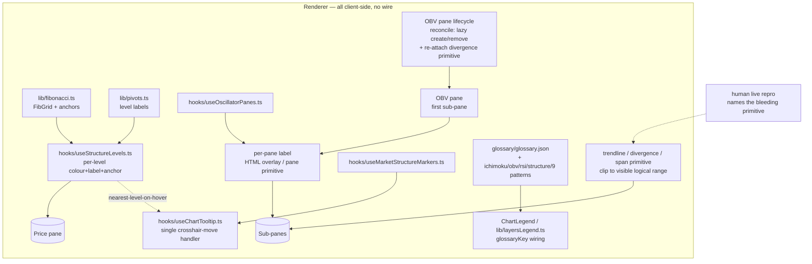

# 0105 — Chart legibility (per-pane labels, level colours/labels, primitive tooltips, glossary completeness, zoom-clip)

> **Status:** done — closed 2026-07-14. Impl `b925a44` ph1 (glossary prose, `market-analyst`) → `b73d026` ph2 (legend→glossary wiring + completeness gate) → `f2a798b` ph3 (OBV pane reconcile) → `253dbac` ph4 (per-pane labels) → `71e02af` ph5 (fib legibility + anchors) → `350a2cd` ph6 (pivot legibility + hover) → `d27ac56` ph7 (structure-marker tooltips), all on `main`, no branch, renderer-only/migration-free. Clean Mode 4 — no blockers/majors, two non-blocking minors (ph5 named a nonexistent `fibonacci.test.ts`; the fib coverage lives in `structureOverlays.test.ts` / ph3's OBV-reconcile *decision* has no direct hook test, only the registry-level `panes.test.ts` + a live-confirmed reclaim). 7 Python + 96 renderer jest re-verified green at close. Phase 8 (`human` live-repro, `a91c13d`) — the finding-6 zoom-clip bleed did NOT reproduce → phase 9 stays dormant; three out-of-scope behavioral findings recorded as followups. [ADR-0100](../adrs/0100-on-chart-legibility-labels-and-primitive-hover.md) accepted at close. Version 0.9.0→0.10.0.
> **Created:** 2026-07-14
> **Owner skill(s):** market-analyst, ui-builder, human
> **Related ADRs:** [ADR-0100](../adrs/0100-on-chart-legibility-labels-and-primitive-hover.md) (paired — accepts at close), [ADR-0060](../adrs/0060-glossary-tooltip-interaction-posture.md), [ADR-0023](../adrs/0023-technical-analysis-surface.md), [ADR-0062](../adrs/0062-user-chart-style-overrides.md), [ADR-0088](../adrs/0088-lightweight-charts-v5-panes.md), [ADR-0077](../adrs/0077-user-originated-display-overlays.md)

## TL;DR

Follow-up to Plan 0096 (declutter): the phase-6 human smoke on AAPL 1d surfaced seven chart-**legibility** gaps that are feature-shaped and share the chart-primitive + glossary surface. This plan makes the chart readable when many indicators are on — **name every sub-pane**, give **Fibonacci and pivot levels per-level colours + labels + a visible anchor**, add **hover tooltips to structure markers** (HH/HL/LH/LL, BOS/CHoCH), **close the glossary gaps** (Ichimoku, OBV, RSI, structure, the 9 classical chart-patterns), **reclaim the OBV pane when it's toggled off** (lazy-create/remove like the oscillator panes), and **fix indicators that draw outside the viewport when zoomed**. Renderer-only bar the glossary *prose* (authored by `market-analyst`), no wire/schema/CSP change. First visible win: each oscillator/money-flow/OBV pane shows its indicator name.

## Context & problem

Plan 0096 (renderer-only, ADR-0089) shipped its five `ui-builder` phases on `main` (close pending). During its phase-6 human smoke — AAPL 1d, Custom preset, most indicators on ([screenshot referenced in the design brief]) — the user surfaced a cluster of rendering/legibility gaps distinct from clutter. Crashes and quick UX items from that smoke are **already fixed and out of scope** (pane `preserveEmptyPane` crash `4fa1f81`; collapsible legend + save-as `577b45e`; market-structure toggle `50ce3d5`). The remaining seven findings share a surface (chart primitives + the analyst glossary), so they were deferred to this designed plan rather than ad-hoc patches:

1. **Sub-panes are unlabeled.** OBV / Williams %R / MFI / A/D line / oscillators stack below the price pane with no on-pane label — the user can't tell which pane is which. (`hooks/useOscillatorPanes.ts`, `lib/panes.ts`, the OBV pane in `CandlestickChart.tsx`.)
2. **Fibonacci is illegible.** All fib lines render one colour (`FIB_LINE_COLOR`); the 0/1 swing anchor isn't drawn; it's unclear what leg the retracement is anchored to. Want per-level colours, level labels, a visible anchor, and disclosure of the anchoring leg. (`lib/fibonacci.ts`, `hooks/useStructureLevels.ts`.)
3. **Pivot points are one colour.** All seven levels render `PIVOT_LINE_COLOR`. Want per-level colours and a hover tooltip identifying each level (R1/S1/PP/…). (`lib/pivots.ts`, `hooks/useStructureLevels.ts`.)
4. **Structure points have no hover.** Hovering HH/HL/LH/LL + BOS/CHoCH markers should show a tooltip like candlestick-marker hover does. (`hooks/useMarketStructureMarkers.ts`, `hooks/useChartTooltip.ts`, `MarketStructureBadge.tsx`.)
5. **Missing glossary tooltips.** Several overlays have no `GlossaryTerm` entry, so their legend label is inert. Audit result (precise): `ichimoku`, `obv`, `rsi` (only `rsi_14` exists), a `structure` summary term, and the **9 classical chart-pattern names** (visible as legend rows: "Descending triangle", "Inverse head & shoulders", etc.). (`glossary/`, `ChartLegend.tsx`/`lib/layersLegend.ts` glossaryKey wiring, ADR-0060.)
6. **Indicators draw outside the viewport when zoomed.** Zooming in still shows candlestick/pattern indicators outside the visible range. **Not diagnosable headlessly** (jsdom has no canvas/layout). The trendline (`lib/trendlines.ts`) and divergence (`lib/divergences.ts`) primitives deliberately extrapolate off-grid via `resolveTimeX` and rely on canvas clipping; the span band (`lib/spans.ts`) null-skips off-grid endpoints. Needs a live repro to name the bleeding primitive, then a targeted clip.
7. **OBV pane not reclaimed when disabled.** Toggling OBV off hides the series but leaves its empty pane — v5 has no pane-hide and enforces a ~30px pane minimum, so an off OBV still eats vertical space (and a Clean chart, where OBV is off by default, is born with an empty pane). Unlike the oscillator panes (`useOscillatorPanes` lazy-creates/removes them on toggle), OBV is created **once** in the `CandlestickChart.tsx` creation effect (`paneRegistry.ensure(OBV_PANE_ID)` at pane 1, divergence primitive attached) and only ever hidden via `applyOptions({ visible: false })`. Want OBV reconciled the same way: lazy-create when visible, remove when hidden, kept as the **first** sub-pane, divergence primitive re-attached on (re)create. (`CandlestickChart.tsx` OBV creation effect, `hooks/useOscillatorPanes.ts` reconcile pattern, `lib/panes.ts`, `obvDivergencePrimitiveRef`.)

Grounding confirmed by reading the renderer: **all seven are renderer-only.** Fibonacci and pivots are computed **client-side** (`fibonacci.ts`/`pivots.ts` mirror the Python) and already carry each level's identity (`ratio`/`label`) and a resolvable swing anchor; structure is computed client-side; the glossary is build-time JSON; v5.2.0 has **no pane-title API** (a label must be drawn by us) and no pane-hide (a disabled OBV pane must be removed, not hidden); the `PaneRegistry` (`lib/panes.ts`) already owns lazy create/remove/reindex, and `useOscillatorPanes` is the reconcile template OBV should follow. Nothing new needs to ride the wire.

## Decision

Implement the seven findings as a renderer legibility layer governed by [ADR-0100](../adrs/0100-on-chart-legibility-labels-and-primitive-hover.md): labels/level-identity derived client-side (never fetched), per-level colours as a static non-styleable palette (ADR-0062-conformant), on-primitive hover reusing the single `useChartTooltip` crosshair-move path, glossary coverage completeness-gated by a renderer test, and the OBV pane reconciled like the oscillator panes (no empty pane when off). The one boundary bend the user chose: the **glossary prose is authored by `market-analyst`** (owner of the analysis semantics) directly in `glossary.json`, front-loaded as phase 1 so the rest is one `ui-builder` block; finding 6 (zoom-clip) is an **independent tail** (a `human` live-repro phase, then a `ui-builder` clip fix) so the legibility wins in phases 1–7 can close even if the clip needs another live round.

We rejected native pane titles / wire-borne labels (v5 has no title API and the data is already client-side — ADR-0100 Alt A), converting pivot/fib price-lines into per-level hit-test primitives as the default (heavier than the crosshair-Y proximity reuse — Alt B, kept as fallback), and leaving legibility to the corner legend alone (it can't answer positional/per-primitive questions — Alt C).

## Architecture diagram



## Implementation phases

Each phase ships as its own commit. Owner tags are machine-readable (one value each). Handoffs: `market-analyst` (ph1) → `ui-builder` (ph2–7) → `human` (ph8) → `ui-builder` (ph9). The `ui-builder` block runs contiguously in one session; the `human`→`ui-builder` finding-6 tail (ph8–9) is deferrable — ph1–7 close on their own.

### Phase 1 — Glossary prose for the uncovered layers
- **Owner skill:** market-analyst
- **What:** Author dual-hat glossary entries for every legend row currently missing one: `ichimoku`, `obv`, `rsi` (so the RSI *overlay* key resolves — today only `rsi_14` exists), a `structure` summary term, and the **9 classical chart-pattern names** (`head_shoulders`, `inverse_head_shoulders`, `double_top`, `double_bottom`, `ascending_triangle`, `descending_triangle`, `symmetrical_triangle`, `rising_wedge`, `falling_wedge`).
- **Files touched:** `desktop/renderer/glossary/glossary.json` (new entries, each with `term`/`howComputed`/`whatItMeans`, `en` required; `ru` follows the existing per-field fallback convention), `desktop/renderer/glossary/types.ts` (add a `chart_pattern` value to the `GlossaryCategory` union — the single renderer-file line this phase touches, so the new entries typecheck and the accuracy tests pass within this commit), `tests/glossary/test_glossary_accuracy.py` (extend the pinned key/anchor set for the new keys).
- **Done when:** `term('ichimoku')`, `term('obv')`, `term('rsi')`, `term('structure')`, and each of the 9 chart-pattern keys return a populated record; `tests/glossary/test_glossary_accuracy.py` and `glossary.test.ts` are green (the latter updated in phase 2). The `whatItMeans` prose reads as a condition, never a buy/sell call (ADR-0029 posture), matching the existing structure/overlay entries.

### Phase 2 — Wire the uncovered legend rows to the glossary
- **Owner skill:** ui-builder
- **What:** Give the currently-inert legend rows a `glossaryKey` so hovering them shows the phase-1 tooltip, and gate coverage with a test.
- **Files touched:** `desktop/renderer/lib/layersLegend.ts` (`buildChartLayers`: set `glossaryKey` on the OBV row → `obv`, the market-structure row → `structure`, and the trendline chart-pattern group rows → the pattern-name key; resolve the RSI overlay row to `rsi`), `desktop/renderer/glossary/glossary.test.ts` (assert every `glossaryKey` the legend builder emits resolves via `term(...)` — the completeness gate).
- **Done when:** hovering the OBV row, the market-structure row, and each chart-pattern group row shows a glossary tooltip; `glossary.test.ts` fails if any legend-emitted `glossaryKey` has no entry (verified by temporarily removing one key). No inert glossary label remains for an emitted key.

### Phase 3 — OBV pane lifecycle (reclaim when disabled)
- **Owner skill:** ui-builder
- **What:** Reconcile the OBV pane like the oscillator panes instead of creating it once and hiding it: lazy-create when OBV is visible (or an OBV divergence needs the pane), remove it when hidden, keep it as the **first** sub-pane, and re-attach its divergence primitive on (re)create. This reclaims the empty ~30px pane a disabled OBV leaves behind (and a Clean chart starts with no OBV pane at all).
- **Files touched:** `desktop/renderer/components/CandlestickChart.tsx` (move OBV creation out of the one-shot creation effect into a reconcile effect — mirroring the `useMarketStructureMarkers`/`useOscillatorPanes` pattern; the visibility line `obvSeriesRef.current?.applyOptions({ visible: ... })` is replaced by create/remove), a new `desktop/renderer/hooks/useObvPane.ts` (or an extension of `useOscillatorPanes`), `desktop/renderer/lib/panes.ts` (reuse `ensure`/`remove`; OBV keeps the `basePane` slot so oscillators stay 2..N), the `obvDivergencePrimitiveRef` wiring + `useDivergences` feed, a jest spec.
- **Design note — divergence-needs-pane:** an OBV divergence must still have a pane even when the OBV *series* is toggled off, exactly as `useOscillatorPanes` handles via `requiredKinds`. OBV must be ensured when `!hidden.has(OBV_LAYER_ID)` **OR** an obv divergence is present; only removed when neither holds. (The current `useOscillatorPanes` comment "obv divergences use the always-on OBV base pane and are NOT in `requiredKinds`" stops being true — fold OBV into the same required-pane logic.)
- **Done when:** toggling OBV off removes its pane (the sub-pane stack collapses upward, no empty band); toggling on re-creates it as the first sub-pane below price with its divergence primitive re-attached and drawing; a Clean chart (OBV off by default) shows no OBV pane; an OBV divergence still renders when the OBV series is off (pane ensured for the divergence). A jest spec pins the ensure/remove reconcile (visible / hidden / hidden-but-divergence-present) against a v5-modeling chart stub, mirroring `lib/panes.test.ts`; the pane-order invariant (OBV before oscillators) is asserted.

### Phase 4 — Per-pane labels
- **Owner skill:** ui-builder
- **What:** Draw a persistent label naming each managed sub-pane (OBV + each oscillator/money-flow pane) — v5 has no pane-title API, so use a pane HTML overlay (`pane.getHTMLElement()`) or a pane-attached primitive (`pane.attachPrimitive`); the label text reuses the indicator's existing legend name. Runs over the phase-3-reconciled pane set, so every managed sub-pane (OBV included) is labelled uniformly.
- **Files touched:** `desktop/renderer/hooks/useOscillatorPanes.ts` / the phase-3 OBV pane hook and/or a new small `lib/paneLabel.ts` helper, `desktop/renderer/lib/panes.ts` (expose the pane's element/attach seam if needed), a jest spec for the label-text mapping.
- **Done when:** each sub-pane shows its indicator's short name (e.g. "Williams %R", "MFI", "A/D line", "OBV"); labels update when an oscillator/OBV is added/removed/toggled and survive a candle-type chart rebuild (verified in the phase-8 live smoke — headless test pins the pane-id→label mapping, which is the unit-testable part).

### Phase 5 — Fibonacci legibility
- **Owner skill:** ui-builder
- **What:** Per-level colours (a fixed `ratio→colour` map, static per ADR-0062), keep/clarify the per-level axis label, draw the two swing anchor points (the 0 and 1 endpoints), and disclose the anchoring leg (direction + which swing) in the legend-row detail and/or an anchor label.
- **Files touched:** `desktop/renderer/lib/fibonacci.ts` (extend `FibGrid` to expose the resolved anchors — `resolveAnchors` currently discards them; keep the level-price mirror pinned by `fibonacci.test.ts`), `desktop/renderer/lib/overlays.ts` (add the `ratio→colour` palette beside `FIB_LINE_COLOR`), `desktop/renderer/hooks/useStructureLevels.ts` (colour each price-line by ratio, draw the anchor endpoints, surface the anchoring-leg text), a jest spec.
- **Done when:** each fib level renders in its own colour with a readable level label; the two swing anchors are visibly marked; the anchoring leg (bullish/bearish + hi/lo swing) is stated; `fibonacci.test.ts` still pins level prices within tolerance (the compute path is unchanged — this is display only).

### Phase 6 — Pivot legibility
- **Owner skill:** ui-builder
- **What:** Per-level colours (a static `level→colour` map — R-levels warm, S-levels cool, the central pivot neutral) and a hover tooltip identifying each level, reusing the crosshair-move path (map `param.point.y`→price, find the nearest structure level within a pixel threshold, show its label) rather than converting the price-lines into primitives (ADR-0100 rule 3 / Alt B).
- **Files touched:** `desktop/renderer/lib/overlays.ts` (pivot `level→colour` palette beside `PIVOT_LINE_COLOR`), `desktop/renderer/hooks/useStructureLevels.ts` (colour per level; expose the drawn levels' prices+labels for hover lookup), `desktop/renderer/hooks/useChartTooltip.ts` + `desktop/renderer/lib/tooltip.ts` (nearest-level-by-Y content), a jest spec for the proximity lookup.
- **Done when:** each pivot level renders in its own colour; hovering near a level shows its identity (R1/S1/PP/…); the proximity lookup is unit-tested (nearest-within-threshold, none beyond it). Fib levels get the same hover treatment for free where the mechanism is shared.

### Phase 7 — Structure-point tooltips
- **Owner skill:** ui-builder
- **What:** Route the market-structure markers (HH/HL/LH/LL + BOS/CHoCH) through the existing hover tooltip so hovering one shows its meaning, reusing the phase-1/existing glossary content (`hh`/`hl`/`lh`/`ll`/`bos`/`choch`) — the same time-keyed lookup candlestick markers use.
- **Files touched:** `desktop/renderer/hooks/useMarketStructureMarkers.ts` (expose the drawn structure markers, time-keyed, for the tooltip), `desktop/renderer/hooks/useChartTooltip.ts` + `desktop/renderer/lib/tooltip.ts` (add a structure-marker lookup alongside `drawnMarkers`), a jest spec.
- **Done when:** hovering an HH/HL/LH/LL/BOS/CHoCH marker shows a glossary-backed tooltip (label + meaning) like candlestick markers do; a toggled-off structure layer shows no hover (mirrors the `drawnMarkers` gate); the time-keyed match is unit-tested.

### Phase 8 — Live-repro of the zoom-clip bleed (diagnostic)
- **Owner skill:** human
- **What:** In the running app, zoom in on a symbol with patterns / structure / divergences / trendlines active and identify **which primitive** draws outside the visible range. Candidates, in likely order: the trendline (`lib/trendlines.ts`) and divergence (`lib/divergences.ts`) primitives (they extrapolate off-grid via `resolveTimeX`), the span band (`lib/spans.ts`), or the series markers.
- **Files touched:** none (diagnostic) — record the culprit + repro steps in the plan's Followups or a `runs/` note.
- **Done when:** the offending primitive(s) are named with a reproducible case (symbol, timeframe, zoom action, which layer bleeds), enough for phase 9 to target the fix.

### Phase 9 — Clip the identified primitive to the visible range
- **Owner skill:** ui-builder
- **What:** Fix the primitive named in phase 8 to clip its draw to the visible logical/time range — e.g. bound `resolveTimeX` extrapolation to the visible range, or add a canvas clip rect in the primitive's `draw`.
- **Files touched:** the primitive named in phase 8 (`lib/trendlines.ts` / `lib/divergences.ts` / `lib/spans.ts`) + its jest spec.
- **Done when:** at max practical zoom, no indicator/marker paints outside its pane's visible range; the existing primitive tests stay green and a regression test pins the clip where it's unit-testable (the coordinate-mapping guard); confirmed in a follow-up live check.

## Data shapes

No new persisted/wire shapes. The only structural TS change is additive:

```ts
// lib/fibonacci.ts — expose the anchors the render needs (illustrative)
export interface FibGrid {
  kind: 'retracement' | 'extension'
  direction: 'bullish' | 'bearish'
  levels: FibLevel[]
  anchors: { highTs: string; highPrice: number; lowTs: string; lowPrice: number } // NEW — display-only
}

// glossary/types.ts — one new category value
export type GlossaryCategory =
  | 'forecast' | 'recommendation' | 'condition' | 'indicator'
  | 'overlay' | 'candlestick' | 'defi' | 'divergence'
  | 'chart_pattern' // NEW — classical H&S / triangles / wedges
```

## Risks & open questions

- **Per-pane label positioning across rebuild.** A candle-type change rebuilds the whole chart (`CandlestickChart` creation-effect dep); an HTML-overlay label must re-attach and re-position, and pane resize must not orphan it. Mitigation: prefer a pane-attached primitive (lives/dies with the pane) or re-run the label effect on the same `rebuildToken` the other pane hooks use; the phase-8 live smoke is the real check since positioning isn't headless-testable.
- **Pivot/fib hover proximity heuristic.** The nearest-level-by-Y test can mis-identify when levels pack tightly. Mitigation: tune the pixel threshold; ADR-0100 keeps per-level hit-test primitives as the documented fallback if proximity proves imprecise.
- **Glossary `chart_pattern` category coupling.** Phase 1 adds the category value + JSON entries; if `glossary.test.ts` (phase 2) asserted the category set, phase 1's commit could go red before phase 2. Mitigation: phase 1 owns the one-line union addition so its own commit is green; phase 2 only adds the completeness assertion.
- **Finding 6 is undiagnosed until phase 8.** The fix (phase 9) is scoped by a live repro we haven't run. Mitigation: the tail is independent — phases 1–7 close on their own; phase 9 is targeted once phase 8 names the primitive.
- **Colour discipline.** Multi-hue fib/pivot palettes can *reduce* legibility if noisy. Mitigation: keep the palettes small and semantically ordered (R warm / S cool / P neutral; fib graded), theme-resolved on both themes.

## What this plan does NOT do

- **No sidecar/wire/schema/CSP change.** All seven findings are renderer-only over already-computed data (grounding confirmed). If any later refinement genuinely needed level identity on the wire, that's a separate ADR — not this plan.
- **No change to level/anchor *math*.** Fib/pivot/structure semantics are owned by `market-analyst`; this plan only changes how the already-computed values are drawn/labelled. Glossary *prose* is the only analysis-semantics authoring here (phase 1).
- **Not the already-fixed smoke items** — pane crash `4fa1f81`, collapsible legend/save-as `577b45e`, market-structure toggle `50ce3d5` are done; not re-scoped.
- **No user-styleable fib/pivot colours.** Per-level colours stay static (ADR-0062); no `chartStyle` override entry is added for them.
- **No new hover mechanism.** Everything reuses the single `useChartTooltip` crosshair-move path + the glossary tooltip; no second tooltip system.

## Followups (after this lands)

- **Phase-8 live pass (2026-07-14) — the finding-6 zoom-clip bleed did NOT reproduce.** No primitive was observed painting outside the visible range, so phase 9 has no target and stays dormant unless a later live session names one (suspect list in ADR-0100 Notes stands). The OBV pane reclaim (ph3) was confirmed working live. The pass surfaced three *behavioral* findings instead, all outside this plan's scope (design/data-layer changes, not legibility fixes — route to `architect` if wanted):
  1. **Candlestick scans are sweep-scoped, trendlines are not — asymmetry.** Chart-pattern trendlines auto-recompute when the viewport settles (`useChartPatternRecompute`, Plan 0064/ADR-0059) but candlestick pattern markers only change on an explicit scan button press, and the legend group counts stay per-sweep rather than per-viewport. Candidate followup: extend the ADR-0059 settle-recompute pattern to `scan_patterns`, and/or scope legend counts to the visible range.
  2. **Zoom-out/scroll-left history paging dead-ends on Yahoo-sourced symbols.** The trigger chain is wired (`useLazyHistoryTrigger` → `loadOlder` → scroll-anchored prepend), but an older fetch returning no new bars latches `reachedStart` — and the Yahoo adapter fetches only now-relative `range=` windows (cannot retrieve past-ending history; the known Plan 0030 gap), so Yahoo symbols latch at the provider horizon. Absolute-window sources (Binance/Coinbase) page normally. Also: once latched there is no visible "start of available history" notice — the affordances just disappear.
  3. (Same pass, expectation note) zooming in does not re-scan candlestick patterns on the narrower window — covered by 1.
- If the pivot/fib proximity hover proves imprecise, promote those levels to hit-test primitives (ADR-0100 Alt B).
- Consider a `create_watch` alert when price touches a labelled fib/pivot level (analysis followup, not legibility).
