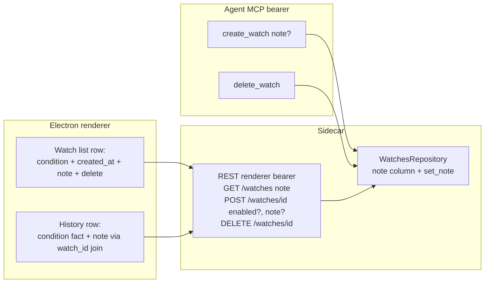

# 0110 — Watch management UX: condition display, delete, and notes

> **Status:** done — closed 2026-07-15. All three code phases shipped in the `plan-0110` worktree: `5d8f3b3` ph1 (`dev` — additive `note` migration `0010_watch_note`, `Watch.note`/`NOTE_MAX_LENGTH=500`, repo `create(note=)`+`set_note`, MCP `create_watch` optional `note`, `WatchOut.note`, `POST /watches/{id}` → partial `WatchUpdateRequest{enabled?, note?}` with `model_fields_set` clear-vs-untouched + null-enabled/empty-body 422, new `DELETE /watches/{id}` reusing the cascade), `5df002a` ph2 (`dev` — apiref + renderer-type regen), `615dee8` ph3 (`ui-builder` — `formatWatchCondition` pure helper, condition + `created_at` render, muted note with inline edit, delete-with-confirm, history note echo via render-time `watch_id` join, en+ru). **Mode 4 verdict: clean, no blockers/majors/minors** — every phase carries a single in-vocabulary owner tag; ADR-0029 fact/context line held (note never interpolated into the condition string, never in the `alert.triggered v1` payload). Verified at assertion level (73 watch Python + 25 renderer tests read, all genuine — partial-update-never-wipes-note, delete-cascade-by-row-count, over-length-rejected-before-write, condition/timestamp on rendered text, note-clear-to-null, declined-confirm no-op, deleted-watch fallback, ru spot-check). Merged to `main` via `--no-ff` (`e776049`); the branch predated Plan 0109's close so its ph2 apiref snapshot described the pre-fold tool surface — the two generated-doc conflicts were resolved by **regenerating** `docs/reference/` from the merged source (main's folded volume tools + the watch note), `apiref --check` green. Post-merge tree green: 2647 Python + 1117 renderer tests pass (one pre-existing ts-jest ambient-augmentation flake in Plan-0098 chart code, passes in isolation, orthogonal). No paired ADR — extends [ADR-0055](../../adrs/0055-watchlist-alerting.md)'s "agent creates, viewer manages" grain. **Phase 4 (`human` live smoke on the real ETH/AERO watches) outstanding — deferrable, does not gate the close.**
> **Created:** 2026-07-15
> **Owner skill(s):** dev, ui-builder, human
> **Related ADRs:** [0055](../adrs/0055-watchlist-alerting.md) (alerting design — "agent creates, viewer manages"), [0015](../adrs/0015-claude-code-primary-control-surface.md) (agent as primary control surface), [0029](../adrs/0029-advisory-recommendation-boundary.md) (alert rows are condition facts), [0063](../adrs/0063-russian-localization.md) (i18n parity), [0064](../adrs/0064-generated-api-reference.md) (apiref regen)

## TL;DR

The Alerts view's watch list is opaque: a row says `ETH-USD · 1d · Indicator threshold` but not *which* condition (`close ≤ 1831.62`), not when it was created, offers no delete, and there is nowhere to note *why* a watch exists ("ETH long scenario A — neckline retest"). This plan (a) renders the condition summary and `created_at` from data the sidecar already ships, (b) adds viewer-side delete (confirm dialog; same cascade semantics as MCP `delete_watch`), and (c) adds a nullable free-text `note` on watches — settable by the agent at `create_watch` time, editable from the viewer, shown in the watch list and echoed (client-side join) in alert-history rows. Creation stays MCP-only; the viewer's management verbs widen from {enable/disable} to {enable/disable, edit note, delete} — an extension inside ADR-0055's "agent creates, viewer manages" grain, not a reversal, so no new ADR.

## Context & problem

User request from live use (2026-07-15, managing 10 ETH watches + 4 AERO watches): the watch list cannot answer "which of these is the 1831.62 retest and which is the invalidation?", "when did I set this?", "how do I remove one?", and "what was the context — long scenario A or B?". Verified current state:

- `WatchOut` (`src/market_analyser/api/routes/watches.py`) already carries `params` and `created_at`; `AlertsView.tsx` renders neither.
- The only viewer-owned mutation is `POST /watches/{id}` `{enabled}`. No REST DELETE exists; MCP `delete_watch` does (cascade-deletes the watch's alert history — explicit loop, not FK cascade, see `persistence/repositories/watches.py::delete`).
- No `note` anywhere: not a `watches` column, not in `alerts/types.Watch`, not in MCP `create_watch`, not in the UI.

ADR-0029 constraint to preserve: alert rows render **condition facts**. A note is user/agent *context* attached to a watch definition — it must render visually distinct from the condition string and never be interpolated into the condition text.

## Decision

Add a nullable `note` column to `watches` (additive Alembic migration), thread it through `alerts/types.Watch`, the repository, MCP `create_watch` (new optional param), and `WatchOut`. Widen the viewer mutation surface: `POST /watches/{id}` body becomes a partial update `{enabled?, note?}` (at least one field required), and a new `DELETE /watches/{id}` passes through to the existing `WatchesRepository.delete` cascade. The renderer formats the condition summary client-side from `kind` + `params` (pure function; no new wire field), shows `created_at`, renders/edits the note, adds delete-with-confirm, and echoes the note into history rows by joining `watch_id` against the already-fetched watch list at render time. We rejected agent-only notes (editing context would require a chat round-trip for a management verb the viewer owns) and note-snapshotting into the `alert.triggered` payload (extends a persisted v1 event schema and blurs ADR-0029's fact/context line; render-time join costs zero schema).

## Architecture diagram



## Implementation phases

### Phase 1 — Sidecar: note column + widened viewer mutations
- **Owner skill:** dev
- **What:** Additive migration (`note TEXT NULL` on `watches`), `Watch.note` in `alerts/types.py`, repository support (`create(note=None)`, new `set_note(watch_id, note: str | None) -> bool`), MCP `create_watch` optional `note` param (length-capped, e.g. 500 chars, at the pydantic boundary), `WatchOut.note`, `POST /watches/{watch_id}` body → `WatchUpdateRequest {enabled?: bool, note?: str | null}` (422 when both absent; `note: null` clears), new `DELETE /watches/{watch_id}` → 404 unknown / `{deleted: true}` on success reusing `WatchesRepository.delete`.
- **Files touched:** `src/market_analyser/persistence/migrations/versions/*` (new), `persistence/models/watches.py`, `persistence/repositories/watches.py`, `alerts/types.py`, `api/mcp_tools/watches.py`, `api/routes/watches.py`, tests beside each.
- **Done when:** repository round-trips a note (create → list shows it; `set_note` updates it; `set_note(id, None)` clears it); REST partial update mutates exactly the supplied fields and rejects an empty body; `DELETE /watches/{id}` removes the watch *and* its alert history rows (asserted by row count, not by absence of error); MCP `create_watch` with `note` persists it and its schema rejects a >cap note; existing enable/disable behavior unchanged (regression specs still green as behavioral checks, not just compiling).

### Phase 2 — Generated surfaces refresh
- **Owner skill:** dev
- **What:** Regenerate `docs/reference/` (`pnpm gen:api-docs`, ADR-0064 CI gate) and the renderer's generated sidecar types (`WatchOut.note`, update-request shape) so phase 3 builds against real types.
- **Files touched:** `docs/reference/*` (generated), `desktop/renderer/types/sidecar/*` (generated).
- **Done when:** CI's apiref check passes; generated `WatchOut` type carries `note: string | null`; no hand-edits in generated files.

### Phase 3 — Alerts view: condition, created_at, note, delete
- **Owner skill:** ui-builder
- **What:** Watch rows render (1) a condition summary from a pure `formatWatchCondition(kind, params)` helper — `indicator_threshold` → `close ≤ 1831.62` (indicator + operator + level), `pattern` → the localized pattern label, `strategy_signal` → the strategy id; (2) `created_at` via the existing `formatDateTime`; (3) the note (muted/secondary style, visually distinct from the condition per ADR-0029) with inline edit (pencil → text input → save via partial `POST`); (4) a delete button with a confirm dialog (native `confirm()` or the project's existing dialog pattern) calling `DELETE`, removing the row and its history rows from local state on success. History rows echo the note by `watch_id` join against the fetched watch list (deleted watch → no note, existing `watch-id` fallback text unchanged). New i18n strings land in **both** `en.ts` and `ru.ts` (ADR-0063 parity).
- **Files touched:** `desktop/renderer/views/AlertsView.tsx` + `.module.css` + test, `desktop/renderer/api/client.ts` (setWatchNote/deleteWatch), `desktop/renderer/lib/` (condition formatter + test), `desktop/renderer/locales/en.ts`, `ru.ts`.
- **Done when:** a watch row for `{indicator: close, operator: <=, level: 1831.62}` visibly renders `close ≤ 1831.62` and its creation timestamp (asserted on rendered text); editing a note issues `POST {note}` and re-renders the updated value; delete asks for confirmation, issues `DELETE`, and removes the row; a history row whose watch has a note shows it, and one whose watch is gone still renders the watch-id fallback; RU locale renders translated labels (spot-check assertion, not a full-snapshot).

### Phase 4 — Live smoke
- **Owner skill:** human
- **What:** Against the running sidecar with the real ETH/AERO watches: confirm conditions and timestamps read correctly, add a note ("ETH long scenario A") from the UI, see it echoed on a fired alert row (trigger a throwaway watch on a condition that is already true after one bar), delete the throwaway watch and confirm its history vanished.
- **Done when:** all four observations hold in the real app; findings (if any) fixed forward or filed as followups here.

## Data shapes

```python
# watches table — one new nullable column (additive migration)
note: str | None  # ≤ 500 chars, agent-set at creation and/or viewer-edited later

# POST /watches/{watch_id} body (replaces SetWatchEnabledRequest)
class WatchUpdateRequest(BaseModel):
    enabled: bool | None = None
    note: str | None = None          # explicit null clears; absent = untouched
    # validator: at least one field present
```

`alert.triggered v1` payload is **unchanged** — the note never enters the event or the alert row's persisted fact.

## Risks & open questions

- **Partial-update null vs absent.** Pydantic must distinguish `note: null` (clear) from `note` absent (don't touch) — use `model_fields_set`. Phase 1's tests pin both cases; getting this wrong silently wipes notes on every enable/disable toggle.
- **Concurrent edit races** (agent recreates a watch while the viewer edits a note) are ignored — single-user desktop app, last write wins; noted here so nobody builds locking.
- **Condition formatter drift.** New watch kinds (future plans) will render as raw kind until the formatter learns them — acceptable; the formatter falls back to the kind slug rather than throwing.

## What this plan does NOT do

- No watch **creation** from the viewer — creation stays MCP-only (ADR-0055 grain; a creation form is a separate decision).
- No note snapshot into fired-alert payloads (rejected above; revisit only if history-accuracy-after-edit becomes a real complaint).
- No pause/snooze semantics, no per-watch notification routing — separate plans if wanted.
- No consolidation with Plan 0109's tool-surface work — `create_watch` gains a param; no new MCP tool, so no ADR-0104 budget change.

## Followups (after this lands)

- (empty)
